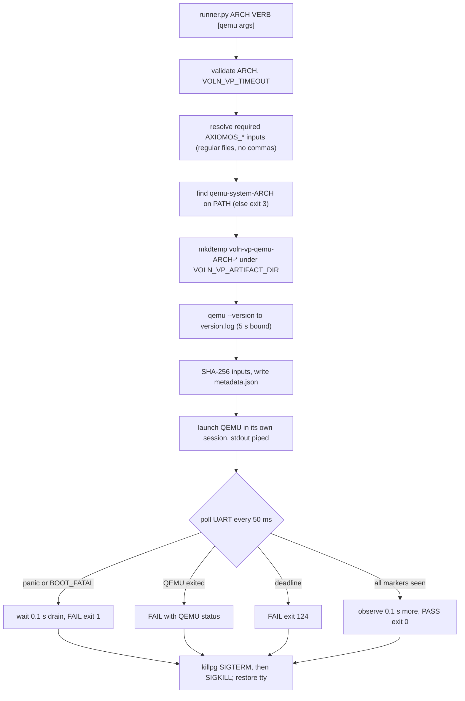

import { Callout } from 'nextra/components'

# QEMU Backend

**Relevant source files**

- [backends/qemu/manifest.toml](https://github.com/volnlabs/voln-vp/blob/main/backends/qemu/manifest.toml)
- [backends/qemu/runner.py](https://github.com/volnlabs/voln-vp/blob/main/backends/qemu/runner.py)
- [backends/qemu/adapters/run.sh](https://github.com/volnlabs/voln-vp/blob/main/backends/qemu/adapters/run.sh)
- [backends/qemu/adapters/test.sh](https://github.com/volnlabs/voln-vp/blob/main/backends/qemu/adapters/test.sh)
- [backends/qemu/adapters/doctor.sh](https://github.com/volnlabs/voln-vp/blob/main/backends/qemu/adapters/doctor.sh)
- [boards/virt/qemu/aarch64.sh](https://github.com/volnlabs/voln-vp/blob/main/boards/virt/qemu/aarch64.sh)
- [backends/tests/test_adapters.py](https://github.com/volnlabs/voln-vp/blob/main/backends/tests/test_adapters.py)

The QEMU backend serves board `virt` and is a multi-architecture boot smoke check. All logic lives in `runner.py`; the shell adapters only select architecture and verb.

## Adapters

| Script | Behavior |
|---|---|
| `doctor.sh` | Requires `python3`, `qemu-system-x86_64`, `qemu-system-aarch64`, `qemu-system-riscv64` |
| `run.sh` | Validates `VOLN_VP_ARCH` (default `aarch64`), then `exec boards/virt/qemu/<arch>.sh "$@"`, which runs `runner.py <arch> run` |
| `test.sh` | `exec python3 runner.py "${VOLN_VP_ARCH:-aarch64}" test "$@"` |

## Runner flow

### Inputs

| Arch | Required |
|---|---|
| `aarch64` | `AXIOMOS_KERNEL`, `AXIOMOS_DISK_IMAGE` |
| `x86_64` | `AXIOMOS_ISO`, `AXIOMOS_DISK_IMAGE`, `AXIOMOS_OVMF_CODE`, `AXIOMOS_OVMF_VARS` |
| `riscv64` | `AXIOMOS_KERNEL` |

Each input must be set and resolve (strictly) to a regular file. Paths containing a comma are rejected because commas delimit QEMU `-drive` options.

### Command

The base command is `qemu-system-<arch> -accel tcg -display none -monitor none -serial stdio -no-reboot`, followed by the per-architecture flags documented on the [virt board page](/axiomos-sim/boards/virt), followed by extra arguments (a leading `--` is dropped). The disk image and writable OVMF vars use `snapshot=on`, so supplied files are never modified. QEMU runs with `TMPDIR` set to the run directory and no debug or monitor listener.

### Markers and failure detection

- `test` markers: `=== axiomos eBPF init ===` for x86_64/AArch64; `axiomos RISC-V demo` and `Kernel booted via OpenSBI firmware` for RISC-V.
- `run` uses the same markers unless `VOLN_VP_BOOT_MARKER` is set; the override never applies to `test`.
- Panic detection matches `panic`/`panicked` (word boundary, case-insensitive), `V04_PANIC`, or `BOOT_FATAL` in a rolling tail buffer, so markers split across reads are still matched.
- After a panic match the runner waits 0.1 s to capture the reason, then fails with exit 1.
- After all markers are seen it observes another 0.1 s before declaring PASS and stopping the live guest. This is a boot smoke check, not a soak test.

### `run` vs `test`

| | `run` | `test` |
|---|---|---|
| stdin | Inherited (interactive) | `/dev/null` |
| UART | Mirrored live to stdout and `uart.log` | `uart.log` only |
| Marker | Overridable via `VOLN_VP_BOOT_MARKER` | Fixed |
| Terminal | Restored with `termios` on exit | n/a |

### Exit codes

| Code | Cause |
|---|---|
| 0 | Markers observed |
| 1 | Guest panic/boot fatal, or QEMU exit status 0 before completion |
| 2 | Bad usage, unsupported arch, missing/invalid input, `OSError`/`ValueError` |
| 3 | `qemu-system-<arch>` not on PATH |
| 4 | Invalid `VOLN_VP_TIMEOUT` |
| 124 | Timeout (guest or version query) |
| 128+N | Interrupted by signal N; QEMU killed by signal N |
| other | QEMU's own nonzero exit status |

## Run directory

`voln-vp-qemu-<arch>-XXXXXXXX/` contains:

| File | Content |
|---|---|
| `uart.log` | Raw serial output |
| `qemu.log` | QEMU stderr |
| `version.log` | `qemu-system-<arch> --version` |
| `metadata.json` | `architecture`, `verb`, `inputs` (path + sha256 per variable), `qemu_version`, `argv`, `cwd`, `timeout_seconds` |

On failure the runner prints the last 80 lines (from the last 16 KiB) of `uart.log`, `qemu.log`, and `version.log`.

<Callout type="info">
On the unmerged branch stack, AArch64 semihosting becomes opt-in (`VOLN_VP_SEMIHOSTING=on`, default off), `run.sh` calls `runner.py` directly, inputs are copied into the run directory, manifest mode is added, every run writes `inputs.json` and `result.json`, and `--mode runtime` returns `unsupported` for QEMU. See [Contracts](/axiomos-sim/contracts).
</Callout>
