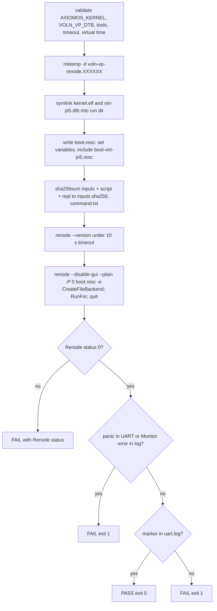

import { Callout } from 'nextra/components'

# Renode Backend

**Relevant source files**

- [backends/renode/manifest.toml](https://github.com/volnlabs/voln-vp/blob/main/backends/renode/manifest.toml)
- [backends/renode/adapters/run.sh](https://github.com/volnlabs/voln-vp/blob/main/backends/renode/adapters/run.sh)
- [backends/renode/adapters/test.sh](https://github.com/volnlabs/voln-vp/blob/main/backends/renode/adapters/test.sh)
- [backends/renode/adapters/doctor.sh](https://github.com/volnlabs/voln-vp/blob/main/backends/renode/adapters/doctor.sh)
- [backends/renode/scripts/boot-virt-pi5.resc](https://github.com/volnlabs/voln-vp/blob/main/backends/renode/scripts/boot-virt-pi5.resc)
- [backends/renode/peripherals/mailbox.py](https://github.com/volnlabs/voln-vp/blob/main/backends/renode/peripherals/mailbox.py)
- [backends/renode/tests/test_mailbox.py](https://github.com/volnlabs/voln-vp/blob/main/backends/renode/tests/test_mailbox.py)
- [backends/renode/tests/test_platform_contract.py](https://github.com/volnlabs/voln-vp/blob/main/backends/renode/tests/test_platform_contract.py)

The Renode backend serves board [`virt-pi5`](/axiomos-sim/boards/virt-pi5). In the spec it is the primary build: Pi 5 drivers, sensors, and deterministic execution. On `main` it implements a bounded boot check driven by virtual time.

## Adapters

| Script | Behavior |
|---|---|
| `doctor.sh` | Requires `renode`, `timeout`, `realpath`, `sha256sum`; prints `renode --version` |
| `test.sh` | Exports `VOLN_VP_BOOT_MARKER='=== axiomos eBPF init ==='` (tests always prove userspace entry), then `exec run.sh` |
| `run.sh` | Validates inputs, stages a run directory, runs Renode under `timeout`, checks UART and Renode log |

## `run.sh` flow



### Renode invocation

```text
renode --config RUN_DIR/renode.config --disable-gui --plain -P 0 [extra args] RUN_DIR/boot.resc \
  -e "sysbus.uart0 CreateFileBackend \"RUN_DIR/uart.log\" true; emulation RunFor \"VIRTUAL_TIME\"; quit"
```

The generated `boot.resc` sets `$axiomos_kernel` and `$virt_pi5_dtb` to the staged symlinks and then includes `backends/renode/scripts/boot-virt-pi5.resc`. Renode runs from the repository root. The UART file backend flushes immediately. The guest runs for exactly `VOLN_VP_VIRTUAL_TIME` virtual seconds (default `0.1`), bounded independently by the `VOLN_VP_TIMEOUT` wall clock (`timeout --kill-after=2s`).

### Monitor path quoting

Renode parses paths at two levels. The positional script path is re-parsed as Monitor syntax, so spaces are backslash-escaped; paths inside the script are quoted strings. The artifact directory must match `^[[:alnum:]_./ -]+$`, otherwise the adapter exits 4. Input images are staged as symlinks so their real paths never enter Monitor syntax. See the [Renode Monitor syntax documentation](https://renode.readthedocs.io/en/latest/basic/monitor-syntax.html).

### Pass and fail rules

Renode 1.16 can exit zero after Monitor errors, and a bounded run can finish without guest progress, so process status alone never passes.

| Check | Pattern | Result |
|---|---|---|
| UART panic | `kernel panicked`, `V04_PANIC`, `PANIC:`, `panicked at`, `BOOT_FATAL` (case-insensitive) | FAIL 1 |
| Renode log error | `[ERROR]`, `[FATAL]`, `There was an error`, `Error while`, `Unhandled exception`, `Could not execute`, `Could not tokenize`, `No such command` | FAIL 1 |
| Marker | fixed-string `VOLN_VP_BOOT_MARKER` in `uart.log` | PASS 0 |
| Renode nonzero | timeout gives 124 | FAIL with that status |

On failure the last 80 lines of `uart.log` and `renode.log` are printed.

### Exit codes

| Code | Cause |
|---|---|
| 2 | Boot script missing, kernel not a readable file, DTB not found |
| 3 | `renode`, `timeout`, `realpath`, or `sha256sum` missing |
| 4 | Invalid timeout, virtual time, or artifact-directory characters |
| 124 | Wall-clock timeout |
| 130 / 143 | Interrupted by SIGINT / SIGTERM (Renode process group stopped) |

### Process cleanup

Renode can spawn `dotnet`. The adapter runs it in a subshell under `timeout`, records the PID, and on exit or signal sends `SIGTERM` then `SIGKILL` to the whole process group before waiting.

## Run directory

`voln-vp-renode.XXXXXX/` contains `uart.log`, `renode.log`, `version.log`, `inputs.sha256` (kernel, DTB, boot script, `.repl`), `command.txt` (cwd, timeout, marker, quoted command), `boot.resc`, and symlinks `kernel.elf` and `virt-pi5.dtb`.

## Tests

- `test_mailbox.py` exercises `mailbox.py` behavior.
- `test_platform_contract.py` asserts EL1 entry precedes image load and that no high-address alias exists.

<Callout type="info">
On the unmerged branch stack, `run.sh` is extended with manifest staging (private copies instead of symlinks), atomic `result.json`, `--mode runtime` via `renode-test` and Robot suites, a `VOLN_VP_STRICT_MMIO` warning gate, and C# RP1 unit models. See [Runtime Scenarios](/axiomos-sim/contracts/runtime-scenarios) and [RP1 Models](/axiomos-sim/backends/rp1-models).
</Callout>
