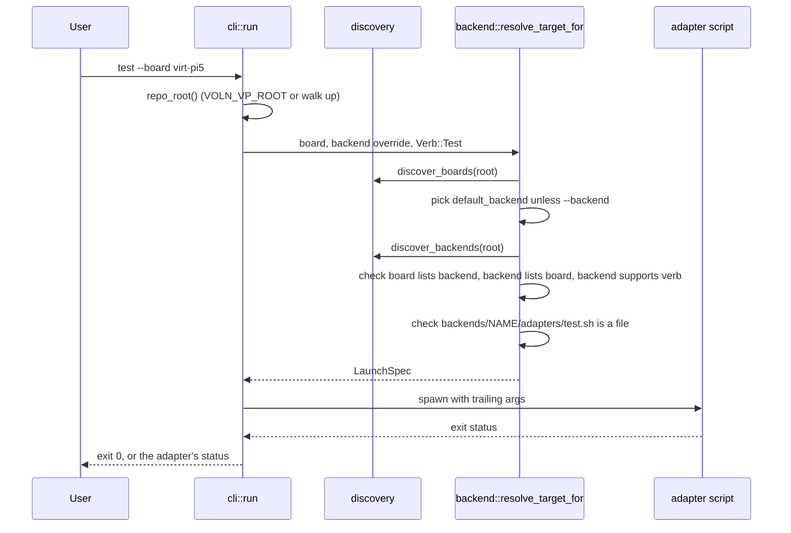

import { Callout } from 'nextra/components'

# CLI Reference

**Relevant source files**

- [cli/src/main.rs](https://github.com/volnlabs/voln-vp/blob/main/cli/src/main.rs)
- [cli/src/cli/mod.rs](https://github.com/volnlabs/voln-vp/blob/main/cli/src/cli/mod.rs)
- [cli/src/cli/doctor.rs](https://github.com/volnlabs/voln-vp/blob/main/cli/src/cli/doctor.rs)
- [cli/src/backend.rs](https://github.com/volnlabs/voln-vp/blob/main/cli/src/backend.rs)
- [cli/src/discovery.rs](https://github.com/volnlabs/voln-vp/blob/main/cli/src/discovery.rs)
- [cli/src/manifest.rs](https://github.com/volnlabs/voln-vp/blob/main/cli/src/manifest.rs)
- [cli/src/config.rs](https://github.com/volnlabs/voln-vp/blob/main/cli/src/config.rs)
- [cli/src/errors.rs](https://github.com/volnlabs/voln-vp/blob/main/cli/src/errors.rs)
- [cli/Cargo.toml](https://github.com/volnlabs/voln-vp/blob/main/cli/Cargo.toml)

The CLI is a single Rust crate, `voln-vp` (binary `voln-vp`, version `0.1.0`, `MIT OR Apache-2.0`), built with `clap` derive. Dependencies: `clap`, `serde`, `thiserror`, `toml`, `walkdir`, `which`.

```text
voln-vp <doctor|run|test> [--board NAME] [--backend NAME] [--dry-run] [-- EXTRA...]
```

## Commands

| Command | Description (clap help) | Behavior |
|---|---|---|
| `doctor` | Verify required simulators and toolchains are installed | Runs `backends/<name>/adapters/doctor.sh` for each discovered backend that lists `doctor` |
| `run` | Run a board under a backend | Executes the resolved backend's `adapters/run.sh` |
| `test` | Run test suites for a board under a backend | Executes the resolved backend's `adapters/test.sh` |

`--version` and `--help` are provided by clap.

## Options for `run` and `test`

| Option | Required | Meaning |
|---|---|---|
| `--board NAME` | yes | Board name matching `name` in some `boards/*/board.toml` |
| `--backend NAME` | no | Override the board's `default_backend` |
| `--dry-run` | no | Print the resolution and exit 0 without launching |
| trailing args | no | Passed to the adapter verbatim (`trailing_var_arg`, hyphen values allowed) |

Arguments after `--` reach the emulator. Example: `cargo run -- run --board virt -- -smp 2`.

`--dry-run` prints:

```text
backend: qemu
board:   virt
adapter: /path/to/backends/qemu/adapters/run.sh
args:    []
```

## Resolution



`resolve_target_for` enforces, in order:

1. The board exists, else `board not found`.
2. The selected backend is listed in the board's `backends`, else `board ... does not declare support for backend ...`.
3. The backend directory exists, else `backend not found`.
4. The backend's `boards` lists this board (same error as 2).
5. The backend's `verbs` contains the verb, and `adapters/<verb>.sh` is a file, else `verb ... is not supported by backend ...`.

Discovery scans only immediate subdirectories of `boards/` and `backends/`, sorted by path. A missing directory yields an empty list. Each manifest is parsed and validated; failures become `manifest invalid in <path>: <reason>`.

## `doctor` details

- If no backends are discovered, it prints a warning and exits 0.
- Backends whose manifest does not list `doctor` are skipped.
- A backend listing `doctor` without `adapters/doctor.sh` is an error.
- It prints `checking backend: <name>` and stops at the first failing backend.

## Exit codes

| Situation | Exit |
|---|---|
| Success | 0 |
| Adapter exited with positive status N | N (`simulator exited with code N for backend ...`) |
| Adapter killed by signal (no code) | 1 |
| Resolution, manifest, I/O, or TOML error | 1 |

Adapter-level codes used on `main` include 2 (missing/invalid input or unsupported architecture), 3 (emulator not on PATH), 4 (invalid timeout/virtual time/path), and 124 (timeout). See [QEMU](/axiomos-sim/backends/qemu) and [Renode](/axiomos-sim/backends/renode).

<Callout type="info">
On the unmerged branch stack, `run`/`test` gain `--artifact-manifest PATH`, `--mode boot|runtime`, and `--scenario PATH`, and the CLI exports `VOLN_VP_BOARD`, `VOLN_VP_VERB`, `VOLN_VP_TEST_MODE`, `VOLN_VP_SCENARIO`, and `VOLN_VP_ARTIFACT_MANIFEST` to the adapter. Conflicts between CLI flags and inherited environment values fail with `invalid arguments`. See [Contracts](/axiomos-sim/contracts).
</Callout>
