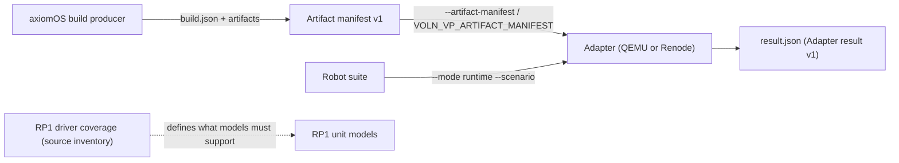

import { Callout } from 'nextra/components'

# Contracts Overview

**Relevant source files** (branch `fix/adapter-pid-readiness`; not on `main`)

- [docs/contracts/artifacts-v1.md](https://github.com/volnlabs/voln-vp/blob/fix/adapter-pid-readiness/docs/contracts/artifacts-v1.md)
- [docs/contracts/results-v1.md](https://github.com/volnlabs/voln-vp/blob/fix/adapter-pid-readiness/docs/contracts/results-v1.md)
- [docs/contracts/runtime-scenarios.md](https://github.com/volnlabs/voln-vp/blob/fix/adapter-pid-readiness/docs/contracts/runtime-scenarios.md)
- [docs/contracts/rp1-driver-coverage.md](https://github.com/volnlabs/voln-vp/blob/fix/adapter-pid-readiness/docs/contracts/rp1-driver-coverage.md)
- [backends/artifacts.py](https://github.com/volnlabs/voln-vp/blob/fix/adapter-pid-readiness/backends/artifacts.py)
- [backends/results.py](https://github.com/volnlabs/voln-vp/blob/fix/adapter-pid-readiness/backends/results.py)

<Callout type="warning">
`docs/contracts/` does not exist on `main`. These contracts were added on the stacked branches `feat/artifact-contract`, `feat/runtime-scenario-lifecycle`, `docs/rp1-driver-audit`, and the RP1 model branches, all contained in `fix/adapter-pid-readiness`. They describe the intended next state of the adapters.
</Callout>

The contracts formalize what a run consumes and what it reports, and separate **observation** from **qualification**: every contract states that a passing run makes no qualification claim.

| Contract | Scope |
|---|---|
| [Artifact Manifest v1](/axiomos-sim/contracts/artifacts-v1) | JSON manifest a producer emits beside immutable kernel/rootfs/DTB artifacts; validation and staging rules |
| [Adapter Result v1](/axiomos-sim/contracts/results-v1) | Atomic `result.json` written for every invocation; outcomes and exit codes |
| [Runtime Scenarios](/axiomos-sim/contracts/runtime-scenarios) | `test --mode runtime` with native Robot suites on Renode |
| [RP1 Driver Coverage](/axiomos-sim/contracts/rp1-driver-coverage) | Source-only inventory of axiomOS RP1/PCIe/GPIO/PWM register operations |

Model-level contracts (`rp1-gpio-model.md`, `rp1-pwm-model.md`) are summarized on [RP1 Models](/axiomos-sim/backends/rp1-models).

## CI on the branch

The branch adds `.github/workflows/test.yml` ("Adapter and CLI checks") on pull requests and pushes to `main`: `cargo fmt --all --check`, `cargo test --workspace --locked`, the stand-in adapter tests, and the Renode model/platform unit tests, uploading adapter evidence on failure. Native Renode model suites are not part of hosted CI.
