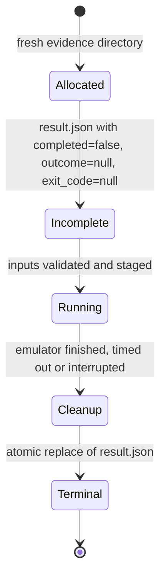

import { Callout } from 'nextra/components'

# Adapter Result v1

**Relevant source files** (branch `fix/adapter-pid-readiness`; not on `main`)

- [docs/contracts/results-v1.md](https://github.com/volnlabs/voln-vp/blob/fix/adapter-pid-readiness/docs/contracts/results-v1.md)
- [backends/results.py](https://github.com/volnlabs/voln-vp/blob/fix/adapter-pid-readiness/backends/results.py)
- [backends/tests/test_adapters.py](https://github.com/volnlabs/voln-vp/blob/fix/adapter-pid-readiness/backends/tests/test_adapters.py)

<Callout type="info">
Not on `main`. On `main`, QEMU writes `metadata.json` and Renode writes `inputs.sha256` and `command.txt`; there is no `result.json`.
</Callout>

## Lifecycle

Each invocation allocates its evidence directory **before** validating inputs. A missing or unfinished result is incomplete, never success. Failure to allocate or write evidence returns nonzero.

## Fields

| Field | Meaning |
|---|---|
| `schema_version`, `run_id` | Version `1` and the unique run directory name |
| `backend`, `board`, `architecture`, `verb`, `mode` | Selected adapter and lifecycle (`boot` or `runtime`) |
| `completed`, `exit_code`, `outcome`, `reason` | Terminal status; `outcome` is `pass`, `fail`, or `unsupported` |
| `identity` | `manual`, `manifest_matched`, or `unvalidated` |
| `qualification_claims` | Always `[]` in this tranche |
| `boot_contract`, `observed_milestones` | Intended contract and observed UART markers (markers may appear in failing runs) |
| `inputs` | Staged artifacts and hashes; source/build/rootfs fields and manifest hash when supplied |
| `execution` | Executable path/hash, version, argv, working directory, environment controls, adapter settings |
| `implementation` | voln-vp Git commit/dirty state when available; hashes of relevant adapter/model/platform files |
| `evidence` | Paths relative to the run directory |
| `scenario`, `scenario_result` | Runtime suite source/staged path and hash; passing Robot test count/output |
| `strict_mmio` | Validated Renode warning-gate selection |

## Exit codes

| Condition | Exit | Outcome |
|---|---|---|
| Required observation made | 0 | `pass` |
| Manifest validation failure | 2 | `fail` |
| Unsupported manifest version, profile, or architecture | 2 | `unsupported` |
| Wall-clock timeout | 124 | `fail` |
| SIGINT / SIGTERM | 130 / 143 | `fail` |
| Other nonzero emulator status | propagated | `fail` |
| Emulator exit 0 without required observation | nonzero | `fail` |

Renode artifact preparation has a separate 300-second wall-clock bound and retains `preflight.log`; the guest watchdog starts at guest launch.

## Interpretation limits

- Reported machine/CPU/RAM settings describe the adapter's base command. With diagnostic raw arguments, `argv` is authoritative.
- Current QEMU `virt`/default machine aliases are not versioned qualification profiles; generated QEMU DTBs and default firmware are not supplied artifacts.
- Renode's fixed platform is Cortex-A78, one core, 8 GiB RAM, EL1 entry.
- Results do not attest producer claims or certify any guest revision.
