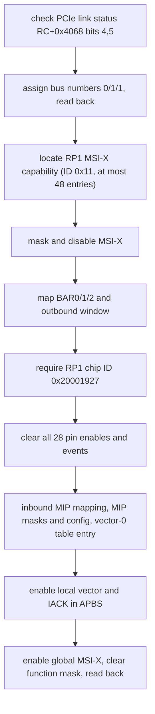

import { Callout } from 'nextra/components'

# RP1 Driver Coverage

**Relevant source files** (branch `fix/adapter-pid-readiness`; not on `main`)

- [docs/contracts/rp1-driver-coverage.md](https://github.com/volnlabs/voln-vp/blob/fix/adapter-pid-readiness/docs/contracts/rp1-driver-coverage.md)
- [docs/probes/2026-10-01-renode-model-audit.md](https://github.com/volnlabs/voln-vp/blob/fix/adapter-pid-readiness/docs/probes/2026-10-01-renode-model-audit.md)

<Callout type="info">
Not on `main`. This is a **source-only** inventory of the axiomOS RP1 driver at commit [`a6f48d1`](https://github.com/pro-utkarshM/axiomOS/tree/a6f48d167437f94807899c53e2f2b1c92abd8b24). It records register operations a simulator scenario may need to observe; it does not assert any hardware effect has been qualified. The pinned source is associated with a `virt,cloud-profile` build; no Pi-target producer manifest or Pi qualification evidence exists.
</Callout>

## Address map assumed by the driver

The driver assumes firmware has pre-mapped RP1 peripherals; `phys_to_virt` converts physical addresses, and register helpers use volatile 32-bit accesses (PCIe helpers add `dsb osh`).

| Block | Physical base / RP1 offset |
|---|---:|
| RP1 BAR1 peripheral aperture | `0x1f_0000_0000` |
| BCM2712 PCIe2 root complex | `0x10_0012_0000` |
| BCM2712 MIP0 | `0x10_0013_0000` |
| RP1 IO_BANK0 (GPIO) | `0x000d_0000` |
| RP1 PADS_BANK0 | `0x000f_0000` |
| RP1 PWM0 / PWM1 | `0x0009_8000` / `0x0009_c000` |
| RP1 PCIe APBS | `0x0010_8000` |

## GPIO IRQ route sequence

`initialize_gpio_route()` performs:

The link status is checked once with no retry. The GIC uses IRQ 160, edge-triggered, priority `0x80`. At this commit the only caller is the Pi5-gated `bench::init()` path; general platform `init()` does not call it. The interrupt handler snapshots PCIe pending pins, reads event bits, clears each via IRQRESET before dispatch to BPF, then IACKs RP1 vector 0.

Selected PCIe/config operations:

| Operation | Offset | Check |
|---|---:|---|
| PCIe link status | RC `+0x4068` | Bits 4 and 5 set, else `PcieLinkDown` |
| RC bus numbers | RC `+0x18` | Write `0x0001_0100`, read back |
| RP1 vendor/device | config `+0x00` | Must equal `0x0001_1de4` |
| BAR0 / BAR1 / BAR2 | config `+0x10/+0x14/+0x18` | BAR0 8 MiB, BAR1 0, BAR2 4 MiB in PCIe window |
| MSI-X table | BAR0 + table offset, 16-byte stride | Mask all, program vector 0 to `0xff_ffff_f000`, unmask, read back |
| MIP host config / mask, VPU mask | MIP0 `+0x20/+0x30`, `+0x40/+0x50`, `+0x60/+0x70` | All read back |
| MSI-X local config 0 | APBS `+0x008` via `+0xc00`/`+0x800` aliases | Enable bit 0, IACK-enable bit 3 |

Outbound-window writes and RP1 command bits have no dedicated readback. PCI status write-one-to-clear effects are unresolved.

## GPIO registers used

28 GPIOs, 8-byte per-pin stride, 32-bit accesses. Atomic aliases `+0x2000` set and `+0x3000` clear.

| Register | Offset / fields | Driver behavior |
|---|---|---|
| STATUS | pin `+0x00` | Read-only; input bit 17; events bits 20-23 |
| CTRL | pin `+0x04` | FUNCSEL 4:0; OUTOVER 13:12; OEOVER 15:14; IRQ enables 20-23; IRQRESET bit 28 |
| Raw interrupt status | `+0x100` | Masked to 28 bits |
| PCIe interrupt enable / status | `+0x11c` / `+0x124` | Enable via aliases; pending bitmap |
| PADS_BANK0 pad | `+0x04 + 4*pin` | Schmitt bit 1, pull 3:2, IE bit 6, OD bit 7 |

Output setup forces OUTOVER low/high (2/3), OEOVER enabled (3), enables pad input and clears OD. Input setup disables OEOVER and enables pad input plus Schmitt. Only rising/falling edge interrupts are exposed; no drive-strength, debounce, or level-event API.

## PWM registers used

| Register | RP1 offset | Writes |
|---|---:|---|
| CLOCKS PWM0 CTRL | `0x18000 + 0x74` | AUXSRC = 2 (xosc), SRC = 1 (AUX), enable bit 11 |
| CLOCKS PWM0 DIV_INT / DIV_FRAC | `0x18000 + 0x78/0x7c` | 1 / 0 |
| GLOBAL_CTRL | controller `+0x00` | Channel enables 0-3; SET_UPDATE bit 31 |
| Channel CTRL | `0x14 + 0x10*n` | `0x101` default |
| Channel RANGE | `0x18 + 0x10*n` | `50_000_000 / Hz` (50 MHz is an assumption) |
| Channel DUTY | `0x20 + 0x10*n` | `range * percent / 100`, percent clamped to 100 |

API channels 1-4 map to hardware channels 0-3. Init writes GLOBAL_CTRL `0x8000_0000`. No range, duty, or enable value is read back. `enable_pwm0_clock()` is called only in the bench PWM path; PWM1 clock setup is absent.

## Remaining gates

A simulator needs BCM2712 PCIe2 root complex and MIP0 behavior plus RP1 BAR/config, GPIO, pads, PWM, and APBS/MSI-X behavior. The Renode audit found no stock BCM2712 root-complex or RP1 endpoint model. Remaining gates: a Pi-target identified producer manifest, confirmed datasheet semantics for ambiguous registers, modeled side effects and interrupt delivery, then independent Pi hardware observations. Source-derived simulator tests validate driver expectations only.
