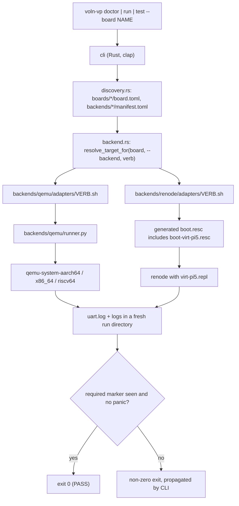

import { Callout } from 'nextra/components'

# axiomos-sim (voln-vp) Overview

**Relevant source files**

- [README.md](https://github.com/volnlabs/voln-vp/blob/main/README.md)
- [TODO_NOW.md](https://github.com/volnlabs/voln-vp/blob/main/TODO_NOW.md)
- [docs/superpowers/specs/2026-07-14-voln-vp-design.md](https://github.com/volnlabs/voln-vp/blob/main/docs/superpowers/specs/2026-07-14-voln-vp-design.md)
- [cli/src/cli/mod.rs](https://github.com/volnlabs/voln-vp/blob/main/cli/src/cli/mod.rs)
- [cli/src/backend.rs](https://github.com/volnlabs/voln-vp/blob/main/cli/src/backend.rs)
- [Cargo.toml](https://github.com/volnlabs/voln-vp/blob/main/Cargo.toml)

**voln-vp** ("Virtual Platform for axiomOS Development", repository `volnlabs/voln-vp`, local checkout `axiomos-sim`) boots and tests **prebuilt** axiomOS images under QEMU or Renode. It is a thin developer platform that composes existing emulators behind one CLI. It never reimplements a simulator, never builds axiomOS, and never writes into the axiomOS source tree.

<Callout type="info">
This documentation describes the `main` branch (head `8457aa1`, "fix(backends): verify prebuilt guest boots without source writes"). Pages covering work that exists only on the unmerged branch stack ending at `fix/adapter-pid-readiness` (artifact manifests, result records, runtime scenarios, RP1 models) say so explicitly and link to that branch.
</Callout>

## Purpose

The design spec frames two questions the platform should answer before touching hardware:

1. **Will it work?** Peripheral drivers (RP1 GPIO/PWM/I2C/SPI/UART/ADC), the post-firmware boot path, and application logic against sensors.
2. **How fast is it?** Deterministic reproduction of timing-dependent bugs now; calibrated latency through a reserved gem5 backend later.

On `main` the implemented scope is narrower: a bounded **boot smoke check** that launches explicit prebuilt inputs and requires specific UART markers.

| Backend | Question (per spec) | Status on `main` |
|---|---|---|
| `qemu` | Does it boot? Multi-arch smoke (x86_64, AArch64, RISC-V) | Implemented for board `virt` |
| `renode` | Will it work on Pi 5? Drivers, sensors, determinism | Implemented for board `virt-pi5` (boot only) |
| `gem5` | How fast? Calibrated latency | Reserved, no code |

## Architecture: CLI, adapters, backends

The core knows no backend by name. It discovers `boards/*/board.toml` and `backends/*/manifest.toml`, resolves a board to a backend, and executes that backend's adapter script for the requested verb. Exit codes propagate so CI cannot false-green.

Per the spec, the CLI's entire job is **discover, validate, launch, collect exit code**. It is explicitly not a scheduler, workflow engine, configuration language, or plugin loader.

| Layer | Location | Role |
|---|---|---|
| CLI | `cli/` (crate and binary `voln-vp`) | Parse `doctor`/`run`/`test`, discover manifests, dispatch, propagate exit code |
| Boards | `boards/<name>/board.toml` | Simulator-neutral description: memory, default backend, supported backends; per-backend renders in subdirectories |
| Backends | `backends/<name>/manifest.toml` + `adapters/*.sh` | Self-describing directory implementing the adapter contract |
| Probes | `tools/`, `renode/probes/`, `docs/probes/` | Phase 1 risk-gate harness and dated evidence logs |

See [Adapter Contract](/axiomos-sim/backends) and [CLI Reference](/axiomos-sim/cli).

## Relation to axiomOS

axiomOS is an external, read-only artifact source. The same unmodified kernel image is meant to run everywhere; the machine is made to fit the kernel, not the reverse ("no sim-specific kernel code paths").

- No kernel path is guessed from an axiomOS checkout. Inputs come from environment variables such as `AXIOMOS_KERNEL` and `AXIOMOS_DISK_IMAGE`.
- Input hashes identify the files used, not their source commit or build features.
- `test` requires the userspace banner `=== axiomos eBPF init ===` (QEMU x86_64/AArch64 and Renode `virt-pi5`). RISC-V requires its demo and OpenSBI messages, which proves demo boot only.
- `AXIOMOS_ROOT` and old xtask runner options such as `--headless` are no longer used.
- The README states that the newer axiomOS v0.5 runtime worktree is not qualified by these boot checks.

<Callout type="warning">
No target is declared boot-ready on `main`. Recorded live runs fail inside the guest (Pi 5 embedded-rootfs allocation panic; x86_64 `BOOT_FATAL code=root-filesystem-invalid`), and compatible AArch64/RISC-V `virt` images were not validated. See [Probes and Evidence](/axiomos-sim/probes).
</Callout>

## Project phases

`TODO_NOW.md` tracks the spec's phase order:

| Phase | Content | State on `main` |
|---|---|---|
| 0 | Precondition: spec read, axiomOS buildable | Done |
| 1 | Risk gate: boot axiomOS to UART on stock Renode ARMv8-A | PASS (2026-07-30) |
| 2 | CLI, adapter contract, board manifests, `virt-pi5` boot | Done except 2.13 boot-to-userspace, blocked by the axiomOS rootfs allocation panic |
| 3 | RP2040 reuse audit, PCIe RC, RP1 models, driver suite | Unchecked on `main` (audit and unit models exist on branches) |
| 4 | Sensors, injection, trace replay | Blocked |
| 5 | CI hardening, nightly | Blocked for scenario wiring |

## Non-goals (from the design spec)

- The Pi 5 firmware stage (bootrom, EEPROM, VideoCore) is not simulated; simulation enters at the kernel with a DTB.
- The GPU is not simulated.
- Jetson is deferred; only a future board slot is reserved.
- Physics is never built in-house; a future Gazebo/Webots bridge backend may feed sensor values.
- No custom GUI; Perfetto export and a VS Code extension are future slots.
- No distributed simulation or message-bus abstraction.

## Reserved verbs

`bench` is declared in the manifest `Verb` enum but rejected during manifest validation ("verb `bench` is reserved; no implementation exists"). The spec also reserves `replay`, `trace`, and `flash`, which have no code.
