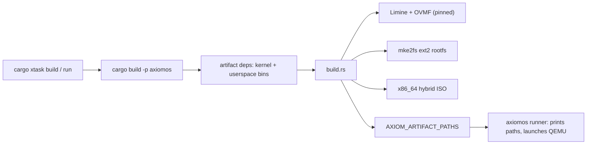

# Build Ownership

**Relevant source files**

- [docs/architecture/build-ownership.md](https://github.com/pro-utkarshM/axiomOS/blob/feat/fpga-bringup/docs/architecture/build-ownership.md)
- [Cargo.toml](https://github.com/pro-utkarshM/axiomOS/blob/feat/fpga-bringup/Cargo.toml)
- [build.rs](https://github.com/pro-utkarshM/axiomOS/blob/feat/fpga-bringup/build.rs)
- [src/main.rs](https://github.com/pro-utkarshM/axiomOS/blob/feat/fpga-bringup/src/main.rs)
- [kernel/build.rs](https://github.com/pro-utkarshM/axiomOS/blob/feat/fpga-bringup/kernel/build.rs)
- [tools/xtask/src](https://github.com/pro-utkarshM/axiomOS/tree/feat/fpga-bringup/tools/xtask/src)
- [scripts/README.md](https://github.com/pro-utkarshM/axiomOS/blob/feat/fpga-bringup/scripts/README.md)
- [ci/manifests/build-inputs.env](https://github.com/pro-utkarshM/axiomOS/blob/feat/fpga-bringup/ci/manifests/build-inputs.env)
- [docs/reference/generated/artifacts.md](https://github.com/pro-utkarshM/axiomOS/blob/feat/fpga-bringup/docs/reference/generated/artifacts.md)

There is exactly one authoritative image-assembly path. The repository splits responsibility three ways:

| Owner | Responsibility |
|---|---|
| Root `axiomos` package (`Cargo.toml`, `build.rs`, `src/main.rs`) | Host-side image assembly and QEMU runner. Cargo **artifact dependencies** build the kernel and every userspace binary for `x86_64-unknown-none` or `aarch64-unknown-none` and expose them through `CARGO_BIN_FILE_*`. `build.rs` owns the pinned OVMF/Limine inputs, the ext2 rootfs population step, and (x86_64) the bootable ISO. |
| `tools/xtask` | Repository validation, inventory/boundary checks, documentation generation (`cargo xtask docs`), and the typed `build` / `run` / `deploy` / `check` / `bench` front-end. It does **not** duplicate image assembly. |
| `scripts/` | Process adapters for QEMU launch, Pi 5 deployment, debugging, verification, HIL and benchmark reduction. |

## Key points

- **The root binary is a host runner, not the kernel.** `kernel/src/main.rs` is the privileged target binary; `src/main.rs` prints artifact paths for tooling (`--no-run`) and launches QEMU using compile-time paths from `build.rs`.
- **Features select the target set.** The default feature `x86_64_deps` pulls x86_64 artifacts; an `aarch64_deps` set pulls AArch64 ones. Development and diagnostic features are forwarded to the kernel and init: `bpf-unsigned-development` (and `-aarch64`), `audit-diagnostics`, `audit-fault-injection`, `bringup-diagnostics`. `host-runner-tests` compiles only the host runner and is rejected outside the debug profile or alongside target artifact features.
- **Host prerequisites.** Because `build.rs` assembles a rootfs and ISO, a clean machine needs `mke2fs` (e2fsprogs), `xorriso`, `git` and `make` on `PATH`, plus QEMU to run.
- **Pinned inputs.** `ci/manifests/build-inputs.env` pins Limine (`v9.6.7-binary`, revision `ee5d29cd...`) and OVMF (`edk2-stable202511-r2` with a SHA-256). The runner treats the OVMF VARS file as an immutable template and attaches it with `snapshot=on`.
- **Deterministic rootfs.** Both `build.rs` and `kernel/build.rs` pin the ext2 UUID, `hash_seed` and `SOURCE_DATE_EPOCH`, which makes Pi 5 `kernel8.img` bit-reproducible on the same host and toolchain.
- **Trust roots are build inputs.** `AXIOM_BPF_TRUSTED_KEY_PATH` (embedded production Ed25519 key) and `AXIOM_SIGNED_BPF_STARTUP_PATH` (signed startup program) are listed as immutable inputs for the shipped artifacts.
- **Generated outputs are not source.** Disk images and debug sessions live under Cargo's `target/` or the ignored `artifacts/` tree.

## Shipped artifacts

| Artifact | Producer | Status |
|---|---|---|
| x86_64 boot ISO, kernel ELF, ext2 rootfs | `cargo build --locked --release -p axiomos` | shipped |
| Raspberry Pi 5 kernel ELF, `kernel8.img`, embedded ext2 rootfs | `cargo xtask build rpi5 -- release embedded-rpi5` | supported after HIL |
| AArch64 `virt` rootfs | `cargo xtask run virt` | experimental |
| Shrike RP2040 ELF and UF2 | standalone `firmware/shrike/rp2040` build, `build-uf2.sh` | supported after HIL |

See [Getting Started](/axiomos/fpga-bringup/getting-started) for the commands in practice.
