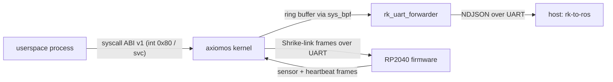

import { Callout } from 'nextra/components'

# Protocols & ABI

**Relevant source files**

- [docs/reference/generated/abi.md](https://github.com/pro-utkarshM/axiomOS/blob/feat/fpga-bringup/docs/reference/generated/abi.md)
- [kernel/crates/kernel_abi/src](https://github.com/pro-utkarshM/axiomOS/tree/feat/fpga-bringup/kernel/crates/kernel_abi/src)
- [kernel/src/syscall/mod.rs](https://github.com/pro-utkarshM/axiomOS/blob/feat/fpga-bringup/kernel/src/syscall/mod.rs)
- [kernel/src/arch/idt.rs](https://github.com/pro-utkarshM/axiomOS/blob/feat/fpga-bringup/kernel/src/arch/idt.rs)
- [kernel/src/arch/aarch64/exceptions.rs](https://github.com/pro-utkarshM/axiomOS/blob/feat/fpga-bringup/kernel/src/arch/aarch64/exceptions.rs)
- [docs/architecture/protocols/rk-bridge.md](https://github.com/pro-utkarshM/axiomOS/blob/feat/fpga-bringup/docs/architecture/protocols/rk-bridge.md)
- [userspace/tools/rk_bridge/src/input.rs](https://github.com/pro-utkarshM/axiomOS/blob/feat/fpga-bringup/userspace/tools/rk_bridge/src/input.rs)
- [kernel/crates/shrike_link/src/lib.rs](https://github.com/pro-utkarshM/axiomOS/blob/feat/fpga-bringup/kernel/crates/shrike_link/src/lib.rs)
- [kernel/crates/shrike_link/src/watchdog.rs](https://github.com/pro-utkarshM/axiomOS/blob/feat/fpga-bringup/kernel/crates/shrike_link/src/watchdog.rs)
- [kernel/crates/shrike_link/src/session.rs](https://github.com/pro-utkarshM/axiomOS/blob/feat/fpga-bringup/kernel/crates/shrike_link/src/session.rs)

axiomos exposes three wire-level contracts: the userspace syscall ABI, a newline-delimited JSON stream for bridging BPF events to a host (rk-bridge), and a binary UART control link between the Pi 5 and the Shrike RP2040 board.



## Syscall ABI v1

The generated [ABI catalog](https://github.com/pro-utkarshM/axiomOS/blob/feat/fpga-bringup/docs/reference/generated/abi.md) contains only interfaces dispatched by shipped kernels; reserved numbers, verifier-known but undispatched helpers, and `verifier-cost` instrumentation are not supported ABI. Numbers are defined in `kernel_abi` and dispatched by `dispatch_syscall` in [kernel/src/syscall/mod.rs](https://github.com/pro-utkarshM/axiomOS/blob/feat/fpga-bringup/kernel/src/syscall/mod.rs). On x86_64 the entry is interrupt vector `0x80`; on AArch64 it is the `svc` synchronous exception.

| ID | Name | Availability |
|---:|---|---|
| 1 | `SYS_EXIT` | all |
| 3 | `SYS_OPEN` | all |
| 5 | `SYS_FSTAT` | all |
| 27 | `SYS_MALLOC` | all |
| 28 | `SYS_FREE` | all |
| 32 | `SYS_ABORT` | all |
| 35 | `SYS_GETCWD` | all |
| 36 | `SYS_READ` | all |
| 37 | `SYS_WRITE` | all |
| 38 | `SYS_WRITEV` | all |
| 39 | `SYS_LSEEK` | all |
| 40 | `SYS_CLOSE` | all |
| 41 | `SYS_MMAP` | all |
| 42 | `SYS_DUP` | all |
| 43 | `SYS_DUP2` | all |
| 44 | `SYS_PIPE` | all |
| 50 | `SYS_BPF` | all |
| 51 | `SYS_PWM_CONFIG` | Raspberry Pi 5 |
| 52 | `SYS_PWM_WRITE` | Raspberry Pi 5 |
| 53 | `SYS_PWM_ENABLE` | Raspberry Pi 5 |
| 54 | `SYS_CLOCK_GETTIME` | all |
| 55 | `SYS_NANOSLEEP` | all |
| 56 | `SYS_SPAWN` | all |
| 57 | `SYS_FORK` | all |
| 58 | `SYS_EXECVE` | all |
| 59 | `SYS_WAITPID` | all |
| 60 | `SYS_DEBUG` | all |
| 61 | `SYS_ESTOP` | all |
| 62 | `SYS_SPAWN_RESTRICTED` | all |
| 63 | `SYS_RESTRICT_BPF_CAPABILITIES` | all |
| 64 | `SYS_INTERRUPT_SLEEP` | all |

Errors follow [ADR-0002](/axiomos/fpga-bringup/decisions/adr-0002-error-policy): subsystem errors stay typed and are mapped to `Errno` once, in the syscall adapter. Unknown syscalls return `ENOSYS` (checked by the `UNKNOWN_SYSCALL_ENOSYS_OK` gate marker) and bad user pointers return `EFAULT`.

### `sys_bpf` surface

`SYS_BPF` multiplexes BPF commands: map create/lookup/update/delete (0 to 3), `BPF_PROG_LOAD` (5), pin/get (6, 7), attach/detach (8, 9), `BPF_OBJ_GET_INFO_BY_FD` (15), `BPF_PROG_LOAD_ELF` (36), `BPF_RINGBUF_POLL` (37), and axiomos extensions `BPF_PROG_UNLOAD` (101), `BPF_MAP_DESTROY` (102), `BPF_OBJ_UNPIN` (103). Map types, helpers and attach types are documented in the [eBPF Subsystem](/axiomos/fpga-bringup/bpf) section. Attach type numbers from `kernel_abi`:

| ID | Attach type | Availability |
|---:|---|---|
| 1 | `TIMER` | cloud and embedded |
| 2 | `GPIO` | Raspberry Pi 5 |
| 3 | `PWM` | defined in `kernel_abi`; not listed as supported in the generated catalog |
| 4 | `IIO` | Raspberry Pi 5 |
| 5 | `SYS_ENTER` (alias `SYSCALL`) | cloud and embedded |
| 6 | `SYS_EXIT` | cloud and embedded |
| 7 | `SCHED_SWITCH` | cloud and embedded |

## rk-bridge NDJSON stream

`rk_bridge` resolves pinned BPF objects through `sys_bpf`, which only exists on a running axiomos kernel. To get the same events into a ROS 2 graph on a developer host, `rk_uart_forwarder` (running on axiomos, launched from `init`) writes newline-delimited JSON to stdout, which is the UART, and the host runs `rk-to-ros --input stdin`.

```bash
socat /dev/ttyUSB0,raw,echo=0,b1500000 STDOUT \
  | rk-to-ros --input stdin --topic /rk/sched_switch
```

| Record | Kind | Fields |
|---|---|---|
| `meta` | control, first record | `protocol` (currently `1`), `source` (attach point name) |
| `ready` | control, optional | `map_fd` returned by `BPF_OBJ_GET` |
| `sched_switch` | event | `seq`, `cpu`, `prev_pid`, `prev_tid`, `next_pid`, `next_tid` (all `u64`) |

```json
{"type":"meta","protocol":1,"source":"sched_switch"}
{"type":"ready","map_fd":3}
{"type":"sched_switch","seq":1,"cpu":0,"prev_pid":1,"prev_tid":1,"next_pid":2,"next_tid":2}
```

Consumer rules: skip lines not starting with `{` (tolerates kernel log noise), reject an unknown `protocol` version, ignore unknown record types and fields, treat a malformed line as recoverable, and stop cleanly at end of stream. There is no reliability layer: at 1.5 Mbit/s and about 120 bytes per event the ceiling is roughly 1500 events/s, and `seq` only detects gaps. Records for `sys_enter`, `sys_exit`, `gpio`, `pwm` and `iio` are anticipated but must be added to `WireRecord` before a host can decode them. The protocol is explicitly a stop-gap; the long-term target is Ethernet (#67) with a DDS-shaped transport.

## Shrike-link UART control link

`shrike_link` is a `no_std`, zero-dependency, host-tested codec shared by the kernel (Pi 5 side) and the RP2040 firmware.

```text
SYNC(0x7E) VER(0x01) TYPE LEN PAYLOAD[LEN] CRC_LO CRC_HI
CRC16-CCITT/FALSE over VER, TYPE, LEN, PAYLOAD; MAX_PAYLOAD = 16
```

The decoder is a byte-fed state machine: only the `Idle` state treats `0x7E` as SYNC; once `LEN` is accepted, payload and CRC are consumed by count, so no byte stuffing is needed. `LEN` must match each type's fixed payload length.

| TYPE | Direction | Message |
|---|---|---|
| `0x01` | Pi 5 to Shrike | `MotorSetpoint { seq, left, right }`, signed per-mille duty (-1000 to 1000), not clamped by the codec |
| `0x02` | Pi 5 to Shrike | `Estop { assert }`, advisory soft e-stop |
| `0x03` | Pi 5 to Shrike | `HeartbeatToShrike { seq }` |
| `0x81` | Shrike to Pi 5 | `Sensor { ultrasonic_echo_us, estop_line, flags }` |
| `0x82` | Shrike to Pi 5 | `HeartbeatToPi { seq }` |

Safety behavior lives in pure, host-tested state machines rather than in drivers:

- **Shrike-side watchdog** (`watchdog.rs`): output is `SafeStop` on cold start, after command silence beyond a timeout (heartbeats cannot extend motor authority), and while a soft e-stop is latched. A `MotorSetpoint` whose `seq` is not newer than the last accepted one is rejected (anti-replay).
- **Pi-side session** (`session.rs`): heartbeats the RP2040 while inbound traffic is alive; when inbound goes silent it stops heartbeating (so the RP2040 watchdog trips) and retries a one-shot e-stop every tick until the transport confirms it was sent.

<Callout type="info">
The codec deliberately does not clamp duty. The kernel actuation monitor and the FPGA safety gate are the single clamp source of truth; the hard e-stop is an independent FPGA line.
</Callout>
