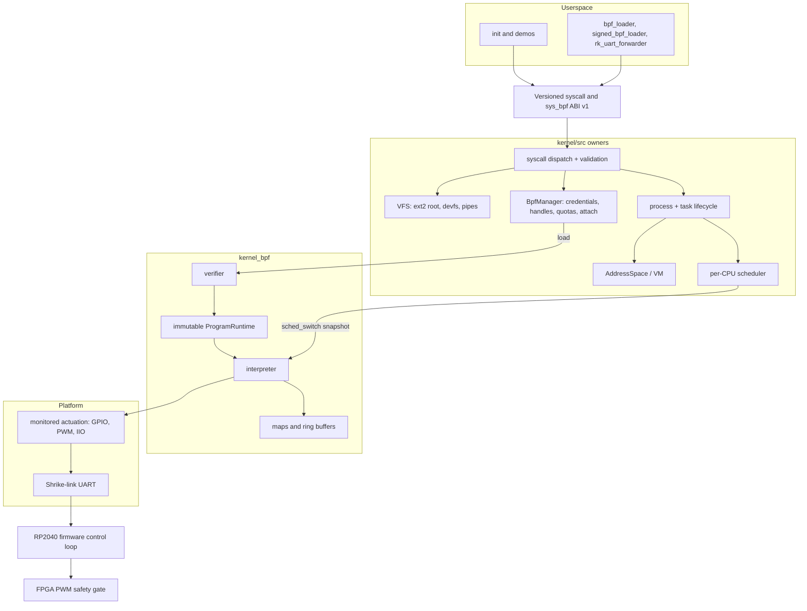

import { Callout } from 'nextra/components'

# System Overview

**Relevant source files**

- [docs/architecture/system-overview.md](https://github.com/pro-utkarshM/axiomOS/blob/feat/fpga-bringup/docs/architecture/system-overview.md)
- [kernel/src/lib.rs](https://github.com/pro-utkarshM/axiomOS/blob/feat/fpga-bringup/kernel/src/lib.rs)
- [kernel/src/bpf/mod.rs](https://github.com/pro-utkarshM/axiomOS/blob/feat/fpga-bringup/kernel/src/bpf/mod.rs)
- [kernel/src/mcore/mtask/scheduler/mod.rs](https://github.com/pro-utkarshM/axiomOS/blob/feat/fpga-bringup/kernel/src/mcore/mtask/scheduler/mod.rs)
- [kernel/src/mem/address_space/mod.rs](https://github.com/pro-utkarshM/axiomOS/blob/feat/fpga-bringup/kernel/src/mem/address_space/mod.rs)
- [kernel/crates/shrike_link/src/lib.rs](https://github.com/pro-utkarshM/axiomOS/blob/feat/fpga-bringup/kernel/crates/shrike_link/src/lib.rs)
- [firmware/shrike](https://github.com/pro-utkarshM/axiomOS/tree/feat/fpga-bringup/firmware/shrike)
- [ci/manifests/components.toml](https://github.com/pro-utkarshM/axiomOS/blob/feat/fpga-bringup/ci/manifests/components.toml)

axiomos is a monolithic kernel. Modularity comes from Rust crate and trait boundaries rather than microkernel IPC: reusable, host-testable contracts live in `kernel/crates/`, and `kernel/src/` composes them with architecture, process, scheduler, memory and device integration.

## Layered shape

## Runtime ownership

| Concern | Owner | Notes |
|---|---|---|
| Scheduling | `kernel/src/mcore/mtask/scheduler` + `kernel_run_queue` | One run queue per CPU; enqueue uses the task's `last_cpu`; dequeue does a bounded rotating steal on a local miss. Reschedule IPI is a documented gap. See [Scheduling & Locking](/axiomos/fpga-bringup/architecture/scheduling-and-locking). |
| Processes | `kernel/src/mcore/mtask/process/` | `Process` owns credentials, file descriptors, memory-region metadata and its address-space handle. Construction, fork, exec, lifecycle and userspace entry are split into separate modules (`construction.rs`, `fork.rs`, `execve.rs`, `lifecycle.rs`, `trampoline.rs`). |
| Virtual memory | `kernel/src/mem/address_space` | `AddressSpace` owns the top-level page table, the mapper lock and a resident-CPU mask. See [Memory](/axiomos/fpga-bringup/architecture/memory). |
| VFS and syscalls | `kernel/src/syscall`, `kernel/src/file`, `kernel_vfs` | Only interfaces in the generated [ABI v1 catalog](/axiomos/fpga-bringup/architecture/protocols) are supported. Typed error policy follows [ADR-0002](/axiomos/fpga-bringup/decisions/adr-0002-error-policy). |
| BPF | Kernel binary (`kernel/src/bpf`) vs. `kernel_bpf` | The kernel owns credentials, handles, quotas, attachment publication and object reclamation. `kernel_bpf` owns parsing, authentication primitives, verification, maps and interpretation. See [eBPF Subsystem](/axiomos/fpga-bringup/bpf). |
| Firmware | `firmware/shrike` | `shrike_control` holds the platform-independent `no_std` control loop; RP2040 adapters stay in `shrike_rp2040`. Host simulation proves sampled-state behavior, not GPIO IRQ-edge behavior. |
| FPGA safety envelope | `firmware/shrike/fpga/shrike_safety_gate.sv` | Synthesizable final PWM gate that forces both motor outputs low on the physical e-stop line or an out-of-range signed command, independently of axiomos and the RP2040. Simulated with Icarus Verilog in the full gates; bitstream, pin constraints and physical timing remain HIL work. |

The global BPF manager is created during `kernel::init` as `BPF_MANAGER: OnceCell<Mutex<BpfManager>>` ([kernel/src/lib.rs](https://github.com/pro-utkarshM/axiomOS/blob/feat/fpga-bringup/kernel/src/lib.rs)). Attached programs are published per hook as `Arc<ProgramRuntime>` slots, and the scheduler builds a `SchedSwitchContext` on every switch and calls `BpfManager::run_hook_programs(ATTACH_TYPE_SCHED_SWITCH, ...)` ([scheduler/mod.rs](https://github.com/pro-utkarshM/axiomOS/blob/feat/fpga-bringup/kernel/src/mcore/mtask/scheduler/mod.rs)).

## Release policy

- Shipped profiles (`cloud-profile`, `embedded-profile`) use the BPF **interpreter**; neither profile allows JIT (`JIT_ALLOWED = false` in [profile/mod.rs](https://github.com/pro-utkarshM/axiomOS/blob/feat/fpga-bringup/kernel/crates/kernel_bpf/src/profile/mod.rs)). See [ADR-0004](/axiomos/fpga-bringup/decisions/adr-0004-bpf-jit-policy).
- Production images are signed-only; unsigned BPF requires the `bpf-unsigned-development` feature ([ADR-0003](/axiomos/fpga-bringup/decisions/adr-0003-supported-targets)).
- The required local evidence command is `cargo xtask check all --profile full`; `--profile quick` is an iteration mode and not release evidence. See [Audit Gate & Findings](/axiomos/fpga-bringup/security/audit-findings).

## Known assurance limits

<Callout type="warning">
These are stated by the repository as open, not as resolved.
</Callout>

- Hosted CI evidence (H-06) is blocked until GitHub Actions billing/quota is restored; the local gate is used instead.
- Physical Raspberry Pi 5 / RP2040 HIL and GPIO IRQ stress require hardware and a retained UART/control-link evidence contract.
- Device completion has no production `WaitChannel` consumer; pipe and child-exit integration still need a host-runnable production fixture.
- A historical ring-3 page fault is currently non-reproducing with no pinned reproducer; it is **not** classified as fixed.
- The unsafe ledger, Miri, Loom, coverage and mutation gates are not a substitute for an independent safety/concurrency review.
