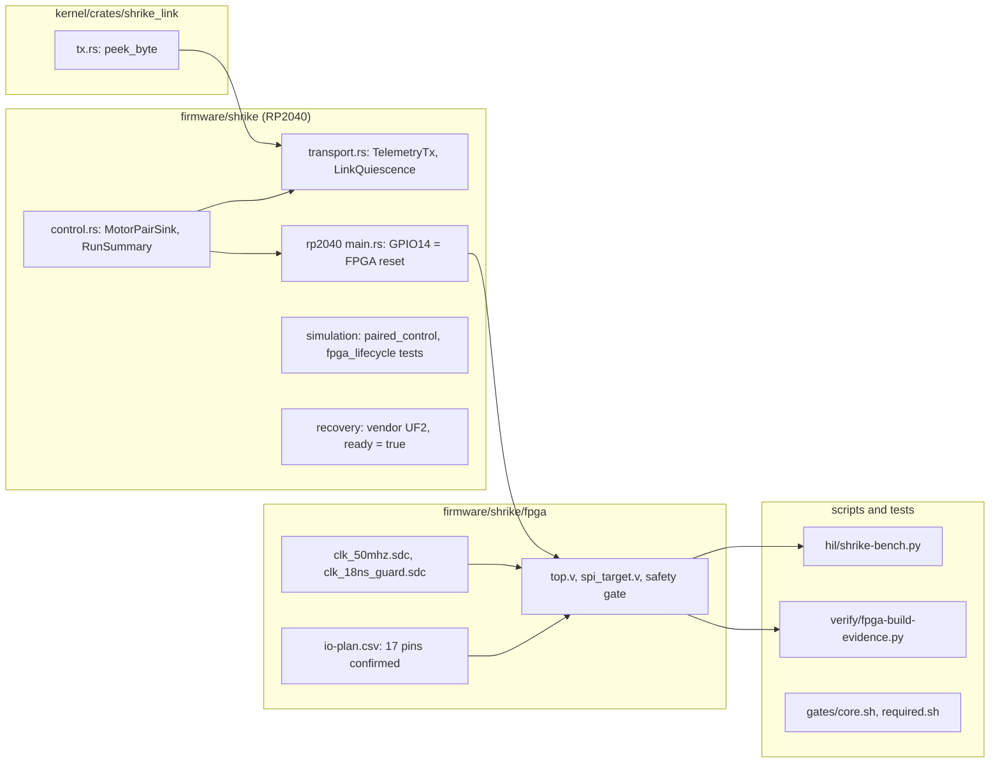

import { Callout } from 'nextra/components'

# Changes from main

**Relevant source files**

- [docs/plans/active/shrike-fpga-bench.md](https://github.com/pro-utkarshM/axiomOS/blob/feat/fpga-bringup/docs/plans/active/shrike-fpga-bench.md)
- [docs/plans/active/v04-hardware-first.md](https://github.com/pro-utkarshM/axiomOS/blob/feat/fpga-bringup/docs/plans/active/v04-hardware-first.md)
- [firmware/shrike/fpga/README.md](https://github.com/pro-utkarshM/axiomOS/blob/feat/fpga-bringup/firmware/shrike/fpga/README.md)
- [firmware/shrike/README.md](https://github.com/pro-utkarshM/axiomOS/blob/feat/fpga-bringup/firmware/shrike/README.md)
- [firmware/shrike/control/src/control.rs](https://github.com/pro-utkarshM/axiomOS/blob/feat/fpga-bringup/firmware/shrike/control/src/control.rs)
- [firmware/shrike/control/src/transport.rs](https://github.com/pro-utkarshM/axiomOS/blob/feat/fpga-bringup/firmware/shrike/control/src/transport.rs)
- [scripts/hil/shrike-bench.py](https://github.com/pro-utkarshM/axiomOS/blob/feat/fpga-bringup/scripts/hil/shrike-bench.py)
- [scripts/verify/fpga-build-evidence.py](https://github.com/pro-utkarshM/axiomOS/blob/feat/fpga-bringup/scripts/verify/fpga-build-evidence.py)

`feat/fpga-bringup` is **unmerged**. It is 22 commits ahead of `main` (2026-09-12 to 2026-09-15, including two merges of `main`) and changes 45 files with 5,201 insertions and 669 deletions. Its subject is bringing up the Shrike-lite V1.0/R0.4 ForgeFPGA as the final motor-PWM authority between the Pi 5 kernel and the motor driver.

<Callout type="warning">
The branch produces build and host-test evidence, not hardware acceptance. No FPGA image or custom RP2040 runtime was flashed; the `fpga-runtime` feature still fails to compile by design. Post-route hold/pulse timing, continuity, oscillator calibration, the concrete adapter and all physical FPGA campaigns are open, and on 2026-09-15 were moved to the final v0.5 phase.
</Callout>

## Summary

- **FPGA RTL and timing.** The ForgeFPGA project now registers a 50 MHz SDC and has a separate 18 ns guard build. The RTL was restructured for timing (predicted PWM wrap, segmented watchdog carry, constant-ratio duty scaling instead of a 64-bit divider, SPI next-word prediction). Forge 6.55.001 builds pass setup at nominal (+9.710 ns) and all five guard corners (worst +0.300 ns) using 114 of 140 CLBs, and generate a bitstream.
- **Pins.** All 17 active FPGA assignments are bound and confirmed by a fresh I/O Planner export and post-PnR report. RP2040 GPIO14 now drives FPGA `rst_n` instead of a PWM channel; the FPGA owns both direction outputs.
- **RP2040 control loop.** Independent per-wheel writes are replaced by an ordered `MotorPairSink` carrying the accepted Pi sequence. Runs end with a typed `RunSummary`; stops and faults inhibit, reset the transport and require explicit requalification.
- **Reverse transport.** New `transport` module: bounded `TelemetryTx` (one active, one pending frame) that advances only on accepted bytes, and a `LinkQuiescence` 200 ms drain model. `shrike_link::tx` gains `peek_byte`.
- **Recovery.** The vendor v1.0.0 MicroPython UF2 is checked in and `factory_uf2.ready = true` after an observed BOOT + RST restoration with matching 4 MiB flash readback.
- **Tooling.** `shrike-bench.py` (bounded sigrok capture, replay, self-test) and `fpga-build-evidence.py` (portable verifier for retained Forge evidence), each with test suites wired into the core gate.
- **Plans and docs.** New `shrike-fpga-bench.md` execution plan; `v04-hardware-first.md` points to the September 12 baseline; absolute local-machine links in architecture review documents were replaced with relative links or unpublished-source markers; naming checks treat those review documents as historical.

## Changed areas

| Area | Main paths | What changed | Updated page |
|---|---|---|---|
| FPGA RTL | `firmware/shrike/fpga/forgefpga/ffpga/src/*.v`, `shrike_safety_gate.sv`, testbenches | Timing restructuring, combined async safety reset, bit-pattern envelope check; testbenches extended | [Shrike FPGA Safety Gate](/axiomos/fpga-bringup/platform/fpga) (new) |
| FPGA constraints and pins | `ffpga/timing-constraints/`, `io-plan.csv`, `origin.csv`, `axiomos_r04.ffpga` | 50 MHz and 18 ns SDC; all pins bound with fabric coordinates and board connections | [Shrike FPGA Safety Gate](/axiomos/fpga-bringup/platform/fpga) |
| RP2040 control | `firmware/shrike/control/src/{control,transport,lib}.rs` | `MotorPairSink`, `StopReason`/`FaultReason`/`RunTermination`, fallible `ByteIo`, telemetry and drain model | [Drivers and Control Link](/axiomos/fpga-bringup/platform/drivers) |
| RP2040 target | `firmware/shrike/rp2040/src/main.rs`, `Cargo.toml`, board profile | GPIO14 to FPGA reset; standalone `[workspace]` for nested worktrees | [Drivers and Control Link](/axiomos/fpga-bringup/platform/drivers), [Shrike RP2040 and FPGA](/axiomos/fpga-bringup/getting-started/shrike-fpga) (new) |
| Simulation | `firmware/shrike/simulation/` | `MockMotorPair`; new `paired_control.rs`, `fpga_lifecycle.rs` | [Drivers and Control Link](/axiomos/fpga-bringup/platform/drivers#paired-motor-sink) |
| Recovery | `firmware/shrike/recovery/vicharak-763d0a7/` | Vendor UF2 added; observed restore recorded; flash-contract tests updated | [Shrike RP2040 and FPGA](/axiomos/fpga-bringup/getting-started/shrike-fpga) |
| Kernel link crate | `kernel/crates/shrike_link/src/{tx,session}.rs` | `TxState::peek_byte` plus test; clippy-style assertion fix | [Drivers and Control Link](/axiomos/fpga-bringup/platform/drivers#reverse-telemetry-transport) |
| Bench observer | `scripts/hil/shrike-bench.py`, `tests/scripts/test_shrike_bench.py` | New bounded capture/replay tool | [Hardware-in-the-Loop](/axiomos/fpga-bringup/testing/hardware-in-the-loop#shrike-bench-observer) |
| Build evidence | `scripts/verify/fpga-build-evidence.py`, `fpga-*-preflight.ys`, tests | New verifier and Yosys preflights | [Shrike FPGA Safety Gate](/axiomos/fpga-bringup/platform/fpga#verification-tools) |
| Gates and CI | `scripts/verify/gates/`, `product-naming.py`, `.github/workflows/build.yml` | New core-gate steps; naming exemptions; Miri timeout 40 min | [CI and Gates](/axiomos/fpga-bringup/testing/ci) |
| Plans | `docs/plans/active/shrike-fpga-bench.md`, `v04-hardware-first.md` | New bench execution record; baseline pointer and next steps | [Hardware-in-the-Loop](/axiomos/fpga-bringup/testing/hardware-in-the-loop#bench-status-on-this-branch) |

Pages not listed (kernel architecture, eBPF, userspace, security, performance, ADRs) describe code the branch does not change; only their source links were retargeted to the branch.

## Notable commits

| Commit | Subject |
|---|---|
| `053c0a7` | docs: record FPGA bench execution plan |
| `6dfb8ce` | feat: add bounded Shrike bench capture and replay |
| `0f7d79e` | fix: reject incomplete Shrike observer evidence |
| `598236e` | fix(fpga): lower safety resets without replay feedback loops |
| `e0da976` | fix(fpga): close 50 MHz timing and bind board safety pins |
| `5fba4fe` | test(fpga): carry naming and zero-output prerequisites |
| `c6e05b5` | fix(shrike): apply ordered pairs with bounded UART ownership |
| `05b078d` | test(fpga): verify retained build evidence and gate host prerequisites |
| `41a5a01` | fix(shrike): measure quiescence around completed IO observations |
| `4558e52` | test(shrike): retain verified vendor restoration evidence |
| `65f2de4` | fix(shrike): qualify BOOT and reset factory recovery |
| `8f6380c` | ci: allow bounded headroom for cloud BPF Miri |
| `e70e3f0` | docs(fpga): move remaining bench checks to final v0.5 phase |

The bench plan records a full engineering audit on `05b078d` (149 checks passed, zero failures, two gate skips) and a quick audit on `4558e52` (85 passed, one optional skip). These are local software gates; they do not supersede any physical gate.
