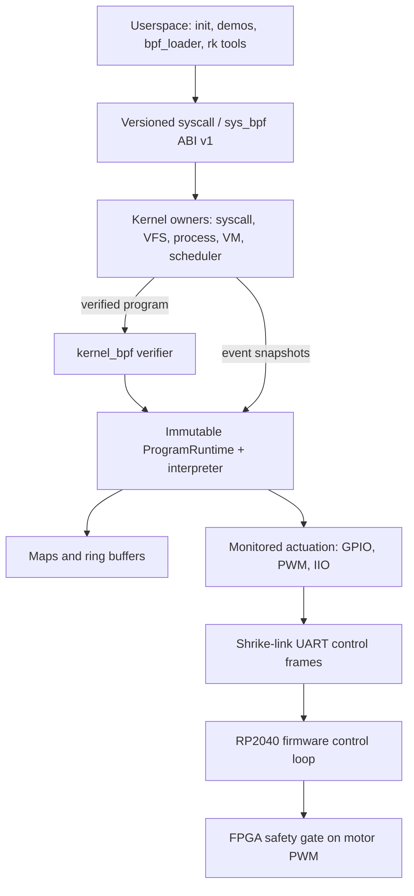

import { Callout, Cards } from 'nextra/components'

# axiomOS Overview

**Relevant source files**

- [README.md](https://github.com/pro-utkarshM/axiomOS/blob/feat/fpga-bringup/README.md)
- [docs/architecture/system-overview.md](https://github.com/pro-utkarshM/axiomOS/blob/feat/fpga-bringup/docs/architecture/system-overview.md)
- [docs/decisions/0003-supported-targets.md](https://github.com/pro-utkarshM/axiomOS/blob/feat/fpga-bringup/docs/decisions/0003-supported-targets.md)
- [docs/reference/generated/components.md](https://github.com/pro-utkarshM/axiomOS/blob/feat/fpga-bringup/docs/reference/generated/components.md)
- [kernel/src/main.rs](https://github.com/pro-utkarshM/axiomOS/blob/feat/fpga-bringup/kernel/src/main.rs)
- [kernel/src/lib.rs](https://github.com/pro-utkarshM/axiomOS/blob/feat/fpga-bringup/kernel/src/lib.rs)
- [Cargo.toml](https://github.com/pro-utkarshM/axiomOS/blob/feat/fpga-bringup/Cargo.toml)
- [docs/plans/active/shrike-fpga-bench.md](https://github.com/pro-utkarshM/axiomOS/blob/feat/fpga-bringup/docs/plans/active/shrike-fpga-bench.md)
- [firmware/shrike/fpga/README.md](https://github.com/pro-utkarshM/axiomOS/blob/feat/fpga-bringup/firmware/shrike/fpga/README.md)

axiomos is a bare-metal, `no_std` Rust kernel whose behavior can be changed at runtime by loading **verified eBPF programs** onto kernel hooks (scheduler switch, syscalls, timers, GPIO, PWM, IIO). It targets robotics and embedded control, where reflashing firmware to change a control policy is slow and risky. This copy of the wiki documents the **`feat/fpga-bringup`** branch.

<Callout type="info">
**Branch: `feat/fpga-bringup` (unmerged).** 22 commits ahead of `main` (2026-09-12 to 2026-09-15), about 45 files and +5.2k/-0.7k lines. The branch brings up the Shrike-lite ForgeFPGA safety gate as the final motor-PWM authority: setup-timing-closed RTL with Forge-confirmed pins, a paired-motor RP2040 control loop, bounded UART telemetry, an observed factory-recovery procedure, a bench waveform observer and a build-evidence verifier. Nothing has been programmed into the FPGA and no physical FPGA acceptance is recorded. See [Changes from main](/axiomos/fpga-bringup/changes-from-main).
</Callout>

<Callout type="warning">
**Status: research kernel under active hardware bring-up on Raspberry Pi 5.** It is not production-ready. The only benchmark campaign that meets the repository's evidence contract is a host-side verifier benchmark; all Pi 5, QEMU and Linux comparison numbers are either provisional or historical. See [Performance](/axiomos/fpga-bringup/performance).
</Callout>

## Why it exists

Field-deployed robots need behavioral updates (new sensor fusion, modified control loops, updated safety policy). Linux has the eBPF mechanism but not hard real-time latency or a small footprint; an RTOS has the footprint but no safe runtime extension. axiomos combines a small monolithic Rust kernel with a load-time verifier so that untrusted, hot-swappable logic is a first-class kernel object with static safety and timing admission ([README](https://github.com/pro-utkarshM/axiomOS/blob/feat/fpga-bringup/README.md), [threat model](https://github.com/pro-utkarshM/axiomOS/blob/feat/fpga-bringup/docs/security/threat-model.md)).

The three defining design choices:

1. **Bare metal, monolithic.** No host OS or RTOS. Limine boots x86_64; AArch64 boots from firmware with a device tree.
2. **Rust core, `no_std`, `panic=abort`.** Assembly is limited to boot stubs and exception vectors; every `unsafe` site is inventoried in an [unsafe ledger](/axiomos/fpga-bringup/security/unsafe-code).
3. **eBPF for runtime extension.** Programs are authenticated (Ed25519), verified (CFG, bounds, tnum, pruning, liveness, static WCET), admitted against a utilization budget, then executed by an interpreter when a hook fires.

## System at a glance

See [System Overview](/axiomos/fpga-bringup/architecture/system-overview) for the full ownership model.

## Supported targets

| Target | Status (ADR-0003) | Notes |
|---|---|---|
| x86_64 QEMU/OVMF | Supported, primary release-gate target | Limine (UEFI and BIOS ISO), APIC, HPET, VirtIO, SMP QEMU tests |
| Raspberry Pi 5 (AArch64) | Supported after HIL | Primary hardware target; GIC, RP1 GPIO/UART/PWM, embedded ext2 rootfs in `kernel8.img` |
| AArch64 `virt` | Experimental | Compile check only; no production claim |
| RISC-V | Experimental standalone demo | Lives in `kernel/demos/riscv`, outside the main kernel, which rejects other architectures with `compile_error!` |
| Shrike RP2040 firmware | Supported after HIL | `thumbv6m-none-eabi` control-loop firmware |
| Shrike ForgeFPGA (SLG47910) gate | Not a kernel target; branch work | Synthesized and setup-timing-closed on this branch; not programmed. See [Shrike FPGA Safety Gate](/axiomos/fpga-bringup/platform/fpga) |

## What's new on this branch

| Area | Change | Page |
|---|---|---|
| FPGA RTL | 50 MHz SDC registered, 18 ns guard build, timing-driven RTL restructuring; setup passes at nominal and all five guard corners (worst +0.300 ns); 114 of 140 CLBs | [Shrike FPGA Safety Gate](/axiomos/fpga-bringup/platform/fpga) |
| Board pins | All 17 active assignments confirmed by Forge export; RP2040 GPIO14 becomes FPGA runtime reset; FPGA owns direction outputs | [Shrike FPGA Safety Gate](/axiomos/fpga-bringup/platform/fpga), [Drivers](/axiomos/fpga-bringup/platform/drivers) |
| RP2040 firmware | `MotorPairSink` paired commands, terminal `RunSummary`, bounded `TelemetryTx`, `LinkQuiescence` drain model | [Drivers and Control Link](/axiomos/fpga-bringup/platform/drivers#paired-motor-sink) |
| Recovery | Vendor v1.0.0 UF2 checked in; `factory_uf2.ready = true` after observed BOOT + RST restoration | [Shrike RP2040 and FPGA](/axiomos/fpga-bringup/getting-started/shrike-fpga) |
| Bench tooling | `scripts/hil/shrike-bench.py` capture/replay/self-test; `scripts/verify/fpga-build-evidence.py` | [Hardware-in-the-Loop](/axiomos/fpga-bringup/testing/hardware-in-the-loop) |
| Gates and CI | New core-gate steps; BPF Miri timeout 30 to 40 min | [CI and Gates](/axiomos/fpga-bringup/testing/ci) |

## What works and what does not

The implemented surface (per the README and confirmed in code): boot on x86_64 and AArch64, paging and per-process address spaces, APIC and GIC interrupts, preemptive scheduling with per-CPU run queues, a syscall ABI (31 dispatched syscalls), kernel heap, VFS with ext2 root and devfs, pipes, fork/exec/waitpid, the BPF verifier gating the load path, WCET admission, Ed25519 BPF signing, RP1 GPIO/UART/PWM on Pi 5, and VirtIO on x86_64/`virt`.

### Honest limitations

<Callout type="info">
Some items in the README's limitations list are older than the code. Where they disagree, this wiki follows the normative architecture docs and the code on this branch; the discrepancies are called out below.
</Callout>

| Area | Limitation | Source |
|---|---|---|
| Memory | No demand paging or file-backed faults; user pages are populated eagerly | [memory.md](https://github.com/pro-utkarshM/axiomOS/blob/feat/fpga-bringup/docs/architecture/memory.md) |
| Memory | Per-frame ownership leak on `AddressSpace` drop and task-stack isolation FIXME tracked (#69, #70) | README |
| Process | No POSIX signals (`kill`, `sigaction`); user faults terminate the task with an exit status instead of delivering a signal | [kernel/src/arch/idt.rs](https://github.com/pro-utkarshM/axiomOS/blob/feat/fpga-bringup/kernel/src/arch/idt.rs) |
| Scheduler | No reschedule IPI: a remote wakeup runs when the target CPU next reschedules | [ADR-0001](/axiomos/fpga-bringup/decisions/adr-0001-scheduling-locking) |
| Scheduler | No priority inheritance; EDF/WCET admission applies to BPF programs, not native tasks | README (#60, #61) |
| BPF | Manager is behind one global `Mutex`; no Spectre mitigations; no BTF; cross-section subprogram linking unsupported | README (#58, #87, #89, #90) |
| BPF | Admission assumes one nominal 1 kHz fire rate for every hook | [verifier-assurance.md](https://github.com/pro-utkarshM/axiomOS/blob/feat/fpga-bringup/docs/security/verifier-assurance.md) |
| BPF | Shipped profiles are interpreter-only; the AArch64 JIT is not enabled | [ADR-0004](/axiomos/fpga-bringup/decisions/adr-0004-bpf-jit-policy) |
| Drivers | No I2C, SPI, CAN, Ethernet, USB, or hardware watchdog integration | README |
| Operations | No persistent crash dump, no A/B kernel slots, no hardware-in-the-loop CI (Pi 5 testing is manual) | README |
| Assurance | No machine-checked proofs beyond a Lean tnum proof-of-concept; no secure/measured boot | [threat-model.md](https://github.com/pro-utkarshM/axiomOS/blob/feat/fpga-bringup/docs/security/threat-model.md) |

Discrepancies between README limitations and current code:

- **Signed BPF loading.** The README says unsigned loads are accepted by default. In code, a build without the `bpf-unsigned-development` feature embeds a production Ed25519 key and sets `allow_unsigned = false` ([kernel/src/bpf/trust.rs](https://github.com/pro-utkarshM/axiomOS/blob/feat/fpga-bringup/kernel/src/bpf/trust.rs)); unsigned loading is an explicit development feature.
- **Run queues.** The README mentions a single global run queue; the code uses per-CPU queues with bounded stealing ([kernel/crates/kernel_run_queue](https://github.com/pro-utkarshM/axiomOS/blob/feat/fpga-bringup/kernel/crates/kernel_run_queue)).
- **`sys_nanosleep`.** The README says it busy-spins; the code parks the task with a deadline and reschedules ([kernel/src/syscall/mod.rs](https://github.com/pro-utkarshM/axiomOS/blob/feat/fpga-bringup/kernel/src/syscall/mod.rs)).
- **User page faults.** The README says they panic the kernel; the x86_64 handler calls `terminate_current_task_on_user_exception` first and only panics for kernel-mode faults.
- **Missing `/bin/init`.** Boot does not panic; it prints `BOOT_FATAL code=init-executable-missing` and halts ([kernel/src/main.rs](https://github.com/pro-utkarshM/axiomOS/blob/feat/fpga-bringup/kernel/src/main.rs)).

## Repository map

| Path | Contents |
|---|---|
| `kernel/src/` | Privileged kernel binary: arch (x86_64, aarch64), `mcore` (tasks, processes, scheduler), `mem`, `syscall`, `file` (VFS glue, ext2, devfs, pipes), `driver`, `bpf` (manager, helpers, trust), `actuation`, `watchdog` |
| `kernel/crates/` | Host-testable kernel crates: `kernel_bpf`, `kernel_abi`, `kernel_syscall`, `kernel_vfs`, `kernel_devfs`, `kernel_device`, `kernel_pci`, `kernel_elfloader`, `kernel_physical_memory`, `kernel_virtual_memory`, `kernel_map_transaction`, `kernel_memapi`, `kernel_usermem`, `kernel_run_queue`, `kernel_time`, `shrike_link` |
| `kernel/platform/rpi5/` | Raspberry Pi 5 boot configuration |
| `kernel/demos/riscv/` | Isolated experimental RISC-V demo |
| `userspace/` | `core` (init, minilib, file_structure), `demos`, `tools` (bpf_loader, signed_bpf_loader, rk_bridge, rk_cli, rk_uart_forwarder), `benchmarks` |
| `src/main.rs`, `build.rs` | Host-side QEMU runner and image assembly (ISO, ext2 rootfs) |
| `tools/xtask/` | Validation, docs generation, build/run front-end (`cargo xtask`) |
| `scripts/` | build, run, deploy, debug, verify, HIL, and benchmark adapters |
| `ci/` | Component, target, artifact, command and quality manifests; gate profiles |
| `firmware/shrike/` | RP2040 control firmware, host simulation, FPGA safety gate |
| `formal/` | Lean 4 formalization of the tnum domain |
| `docs/` | Architecture, decisions, security, performance, operations, generated reference |

## Where to go next

<Cards>
  <Cards.Card title="Getting Started" href="/axiomos/fpga-bringup/getting-started" />
  <Cards.Card title="Architecture" href="/axiomos/fpga-bringup/architecture/system-overview" />
  <Cards.Card title="eBPF Subsystem" href="/axiomos/fpga-bringup/bpf" />
  <Cards.Card title="Security" href="/axiomos/fpga-bringup/security" />
</Cards>
