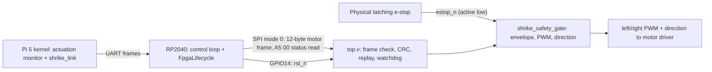

import { Callout } from 'nextra/components'

# Shrike FPGA Safety Gate

**Relevant source files**

- [firmware/shrike/fpga/README.md](https://github.com/pro-utkarshM/axiomOS/blob/feat/fpga-bringup/firmware/shrike/fpga/README.md)
- [firmware/shrike/fpga/shrike_safety_gate.sv](https://github.com/pro-utkarshM/axiomOS/blob/feat/fpga-bringup/firmware/shrike/fpga/shrike_safety_gate.sv)
- [firmware/shrike/fpga/tb_shrike_safety_gate.sv](https://github.com/pro-utkarshM/axiomOS/blob/feat/fpga-bringup/firmware/shrike/fpga/tb_shrike_safety_gate.sv)
- [firmware/shrike/fpga/forgefpga/axiomos_r04.ffpga](https://github.com/pro-utkarshM/axiomOS/blob/feat/fpga-bringup/firmware/shrike/fpga/forgefpga/axiomos_r04.ffpga)
- [firmware/shrike/fpga/forgefpga/ffpga/src/top.v](https://github.com/pro-utkarshM/axiomOS/blob/feat/fpga-bringup/firmware/shrike/fpga/forgefpga/ffpga/src/top.v)
- [firmware/shrike/fpga/forgefpga/ffpga/src/spi_target.v](https://github.com/pro-utkarshM/axiomOS/blob/feat/fpga-bringup/firmware/shrike/fpga/forgefpga/ffpga/src/spi_target.v)
- [firmware/shrike/fpga/forgefpga/ffpga/src/shrike_safety_gate.v](https://github.com/pro-utkarshM/axiomOS/blob/feat/fpga-bringup/firmware/shrike/fpga/forgefpga/ffpga/src/shrike_safety_gate.v)
- [firmware/shrike/fpga/forgefpga/ffpga/timing-constraints/clk_50mhz.sdc](https://github.com/pro-utkarshM/axiomOS/blob/feat/fpga-bringup/firmware/shrike/fpga/forgefpga/ffpga/timing-constraints/clk_50mhz.sdc)
- [firmware/shrike/fpga/forgefpga/ffpga/timing-constraints/clk_18ns_guard.sdc](https://github.com/pro-utkarshM/axiomOS/blob/feat/fpga-bringup/firmware/shrike/fpga/forgefpga/ffpga/timing-constraints/clk_18ns_guard.sdc)
- [firmware/shrike/fpga/forgefpga/io-plan.csv](https://github.com/pro-utkarshM/axiomOS/blob/feat/fpga-bringup/firmware/shrike/fpga/forgefpga/io-plan.csv)
- [firmware/shrike/fpga/forgefpga/sim/tb_axiomos_r04_top.v](https://github.com/pro-utkarshM/axiomOS/blob/feat/fpga-bringup/firmware/shrike/fpga/forgefpga/sim/tb_axiomos_r04_top.v)
- [scripts/verify/fpga-safety-preflight.ys](https://github.com/pro-utkarshM/axiomOS/blob/feat/fpga-bringup/scripts/verify/fpga-safety-preflight.ys)
- [scripts/verify/fpga-mapping-preflight.ys](https://github.com/pro-utkarshM/axiomOS/blob/feat/fpga-bringup/scripts/verify/fpga-mapping-preflight.ys)
- [scripts/verify/fpga-build-evidence.py](https://github.com/pro-utkarshM/axiomOS/blob/feat/fpga-bringup/scripts/verify/fpga-build-evidence.py)
- [docs/plans/active/shrike-fpga-bench.md](https://github.com/pro-utkarshM/axiomOS/blob/feat/fpga-bringup/docs/plans/active/shrike-fpga-bench.md)

The Shrike-lite V1.0/R0.4 board pairs an RP2040 microcontroller with a Renesas ForgeFPGA (SLG47910). In axiomos the FPGA is the **final motor-PWM authority**: it receives signed motor commands from the RP2040 over SPI, generates both PWM outputs itself, and forces them low on a physical e-stop. This page describes the RTL, the board assignments and the build evidence recorded on the `feat/fpga-bringup` branch.

<Callout type="warning">
Nothing on this branch has been programmed into the FPGA. The branch records a synthesized, placed and routed design that passes setup timing, plus host-side checks. Post-route hold and pulse-width compliance, asynchronous interface timing, physical oscillator measurement, powered-off continuity, the concrete runtime adapter and all physical acceptance runs are still open. The `fpga-runtime` RP2040 feature remains disabled.
</Callout>

## Position in the control chain



The e-stop line is routed directly to the FPGA and must not be generated by RP2040 firmware. The `*_pwm_out` signals are the only connections to the motor-driver enable inputs; RP2040 PWM must not be routed around the gate.

## Safety gate behavior

`shrike_safety_gate.sv` is the reference for the gate implemented in the ForgeFPGA project (`ffpga/src/shrike_safety_gate.v`). Its ports and rules, per the FPGA README:

| Signal | Role |
|---|---|
| `estop_n` | Physical latching e-stop, active low |
| `rst_n` | Runtime reset on FPGA GPIO18 / package pin 9, driven by RP2040 GPIO14. Separate from package pin 11 (PWR), which clears configuration |
| `left_duty_permille`, `right_duty_permille` | Signed 12-bit copies of the commanded setpoints, `-1000..=1000` per-mille |
| `left_pwm_in`, `right_pwm_in` | Retained, ignored compatibility ports with no physical assignment |
| `*_pwm_out` | Final PWM to the motor-driver enable inputs |
| `*_direction_out` | FPGA-owned polarity: negative is high, nonnegative is low; forced low whenever drive is gated |

- One invalid command disables **both** motors.
- E-stop assertion forces both outputs low combinationally. Deassertion passes through a two-stage synchronizer and the gate stays disarmed until a fresh, complete motor transaction begun after that qualification is accepted.
- The default envelope is plus or minus 800 per-mille. Changing it requires matching the kernel actuation envelope.
- Production defaults are a 50 MHz clock and a 20 kHz PWM carrier. A configuration producing zero or more than 100,000,000 carrier cycles fails closed.

Changes on this branch to the gate RTL:

- `rst_n` and `estop_n` are combined into one asynchronous `safety_rst_n` rather than two asynchronous reset inputs on the same process.
- The PWM counter width is sized from the period (`$clog2`) and the wrap is predicted one cycle ahead, removing the terminal-count decode from the increment path.
- The former 64-bit multiply and divide is replaced by a constant-ratio reduction (the period/1000 ratio is reduced by its GCD, for example 2500/1000 becomes 5/2) that preserves `floor(magnitude * period / 1000)`.
- For the default 800 limit, the envelope check is a bit-pattern function over the signed 12-bit value instead of a magnitude comparison.

## SPI command and status protocol

`top.v` is derived from the pinned Vicharak `spi_loopback_led` scaffold. A motor command is one chip-select transaction of exactly 96 bits (12 bytes) using the `shrike_link` framing constants: sync `0x7E`, version `0x01`, motor type `0x01`, a 6-byte payload and a CRC. CRC is initialized by chip select; the sync byte does not update it. Only a complete, fresh frame resets the command watchdog (default `COMMAND_TIMEOUT_CYCLES = 2500000`, 50 ms at 50 MHz); traffic and rejected frames do not refresh it.

After the motor transaction ends, a separate SPI mode-0 transaction sends `A5 00` under one chip select. MISO returns the status byte during `A5`, then the last accepted sequence during `00`:

| Status bit | Meaning |
|---|---|
| 7 | READY |
| 6 | COMMAND_VALID |
| 5 | WATCHDOG_EXPIRED |
| 4..0 | Zero |

Chip select must be held low for at least four FPGA clock rising edges before the first SPI clock edge so that the snapshot loads. Short, long, malformed or repeated status reads do not change duties, validity, watchdog state or e-stop re-arm. Status confirms command acceptance, not motor movement.

To meet timing, the RTL on this branch precomputes byte checks, CRC and payload destinations during SPI reception (`spi_target.v` now exposes the next shift word `o_rx_next_data` and predicts byte boundaries), and splits the watchdog counter into 11-bit pieces with registered carry prediction. The FPGA README states these preserve command/status latency, replay history, exact timeout and asynchronous safety shutdown.

## Clock and pin assignments

`clk_50mhz.sdc` is the registered constraint:

```tcl
create_clock -name clk {clk} -period 20.000 -waveform {0 10.000}
```

It constrains analysis only; it does not set or calibrate the on-chip oscillator (`OSC_CLK` on West Input0). `clk_18ns_guard.sdc` (18 ns, 55.556 MHz) is a separate robustness build that replaces, never accompanies, the 50 MHz file. The SLG47910 datasheet maximum of 54.110 MHz is stated at 2.5 V VDDIO; the R0.4 board uses 3.3 V, so the guard is a robustness target, not frequency certification.

| Signal | FPGA GPIO / package pin | Board connection |
|---|---|---|
| `rst_n` | 18 / 9 | RP2040 GPIO14 through R7; J2 pin 15 |
| `estop_n` | 7 / 20 | J2 pin 19 |
| `left_pwm_out` | 8 / 23 | J3 PMOD pin 6 |
| `right_pwm_out` | 9 / 24 | J3 PMOD pin 5 |
| `left_direction_out` | 10 / 1 | J3 PMOD pin 8 |
| `right_direction_out` | 11 / 2 | J3 PMOD pin 7 |
| `spi_sck`, `spi_ss_n`, `spi_mosi`, `spi_miso` | 3/16, 4/17, 5/18, 6/19 | RP2040 GPIO2, GPIO1, GPIO3, GPIO0 |

`io-plan.csv` lists all assignments with fabric coordinates. All 17 active assignments are marked `FORGE_EXPORT_CONFIRMED_PENDING_CONTINUITY`: a fresh Forge I/O Planner export and the post-PnR report agree, but powered-off continuity checks are still required. RP2040 GPIO12 (PWR) and GPIO13 (EN) are configuration controls, not RTL ports. `left_pwm_in`/`right_pwm_in` are unbound and optimized away.

## Recorded build results (2026-09-12)

| Item | Result |
|---|---|
| Toolchain | Forge 6.55.001 |
| Nominal 20 ns, typical corner | Setup passes, WNS +9.710 ns |
| 18 ns guard, all five corners | Setup passes; worst WNS +0.300 ns at the slow 85 °C corner |
| Failing setup endpoints | Zero in every final build |
| Utilization | 114 of 140 CLBs |
| Bitstream | Generated; final nominal MCU image 46,408 bytes |
| Simulation | Exhaustive range/PWM checks, baseline differential, mapped simulation and a production-netlist smoke test pass |

The checked-in project settings (classic ABC, hard-mux inference disabled, control LUTs preserved then flattened before EDIF, `-TIMING_DRIVEN_PACKING_THR 0.8`) are part of the qualified configuration; different settings need fresh simulation and timing evidence. Exported timing reports contain setup results only, so hold and pulse-width compliance are not established.

## Verification tools

| Tool | What it checks | What it does not |
|---|---|---|
| `tb_shrike_safety_gate.sv` (iverilog or verilator) | Gate truth table, envelope, e-stop re-arm | Synthesis, pins, timing |
| `fpga-safety-preflight.ys` | Hierarchy, process lowering, conflicting or undriven drivers, loops, inferred latches, async set/reset emulation, using the Renesas-bundled Yosys | Pins or bitstream |
| `fpga-mapping-preflight.ys` | Xilinx intermediate mapping, mapped latches, carry blocks within 140 CLBs | Full resources, placement, routing, timing |
| `fpga-build-evidence.py` | Retained manifest and six builds (nominal plus five guard corners) against current RTL, settings, SDC and the 17 pins; compares with retained `results.json`; never rewrites evidence | Hold/pulse timing, programming, runtime, hardware |

See [Shrike FPGA Targets](/axiomos/fpga-bringup/getting-started/shrike-fpga) for commands and [Hardware-in-the-Loop](/axiomos/fpga-bringup/testing/hardware-in-the-loop) for the bench observer.

## Open gates

From the bench plan's current status table:

| Requirement | Status |
|---|---|
| Vendor toolchain, generated bitstream, fit and routing | Complete for the recorded candidate |
| Nominal and all five guard setup corners | Complete |
| Project, I/O planner and post-route pin assignments | All 17 match; continuity open |
| Post-route hold/pulse, asynchronous interfaces, actual oscillator | Open |
| Factory recovery UF2 and observed restoration | Passed via BOOT + RST; cold-plug entry failed |
| Paired sink, reverse TX ownership, local drain model | Host implementation and regressions pass; no hardware acceptance |
| Concrete configuration/runtime adapter, physical reset/drain | Open; `fpga-runtime` disabled |
| Functional/fault campaign, one-hour pilot, 24-hour soak | Open |

On 2026-09-15 the remaining physical checks were moved to the final v0.5 phase; they remain mandatory before hardware actuation and release.
