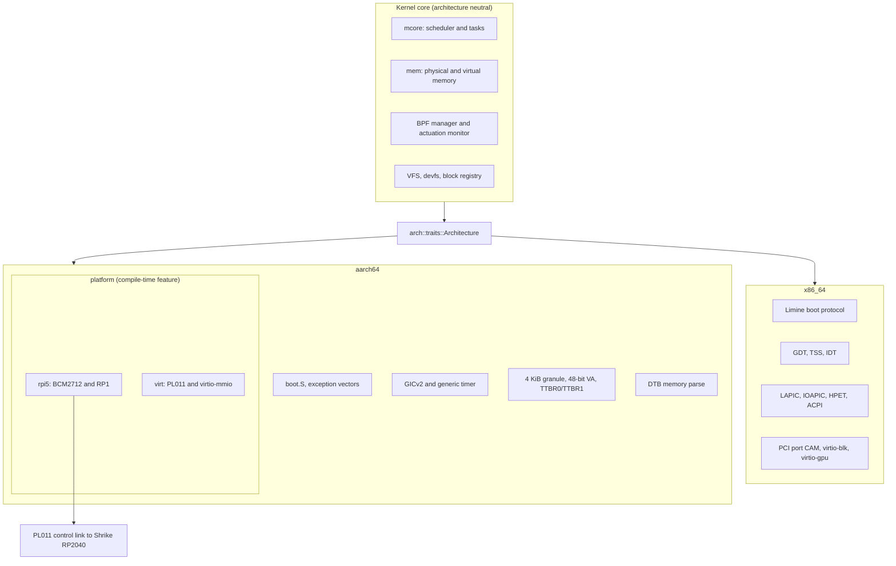
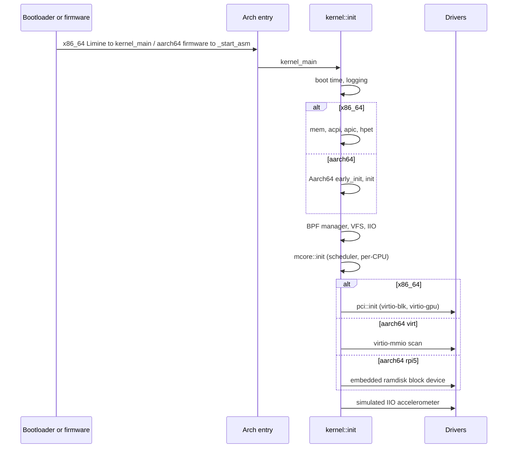

import { Callout } from 'nextra/components'

# Platform and Hardware Layer

<details>
<summary>Relevant source files</summary>

- [kernel/src/arch/mod.rs](https://github.com/pro-utkarshM/axiomOS/blob/feat/fpga-bringup/kernel/src/arch/mod.rs)
- [kernel/src/arch/traits.rs](https://github.com/pro-utkarshM/axiomOS/blob/feat/fpga-bringup/kernel/src/arch/traits.rs)
- [kernel/src/arch/aarch64/mod.rs](https://github.com/pro-utkarshM/axiomOS/blob/feat/fpga-bringup/kernel/src/arch/aarch64/mod.rs)
- [kernel/src/arch/aarch64/platform/mod.rs](https://github.com/pro-utkarshM/axiomOS/blob/feat/fpga-bringup/kernel/src/arch/aarch64/platform/mod.rs)
- [kernel/src/arch/x86_64.rs](https://github.com/pro-utkarshM/axiomOS/blob/feat/fpga-bringup/kernel/src/arch/x86_64.rs)
- [kernel/src/lib.rs](https://github.com/pro-utkarshM/axiomOS/blob/feat/fpga-bringup/kernel/src/lib.rs)
- [kernel/Cargo.toml](https://github.com/pro-utkarshM/axiomOS/blob/feat/fpga-bringup/kernel/Cargo.toml)
- [ci/manifests/targets.toml](https://github.com/pro-utkarshM/axiomOS/blob/feat/fpga-bringup/ci/manifests/targets.toml)
- [docs/decisions/0003-supported-targets.md](https://github.com/pro-utkarshM/axiomOS/blob/feat/fpga-bringup/docs/decisions/0003-supported-targets.md)
- [kernel/demos/riscv/README.md](https://github.com/pro-utkarshM/axiomOS/blob/feat/fpga-bringup/kernel/demos/riscv/README.md)

</details>

This section documents the code that sits between the axiomOS kernel core (scheduler, memory manager, BPF runtime) and physical or emulated hardware: CPU architecture support, interrupt controllers, boards, and device drivers.

<Callout type="warning">
  axiomOS describes itself as a research kernel under active hardware bring-up on Raspberry Pi 5. Hardware claims in these pages are limited to what the source and the repository's operations docs show. Where the repository says a number or behavior is unmeasured or unverified, these pages say so too.
</Callout>

## Supported targets

Support tiers come from [ADR-0003](https://github.com/pro-utkarshM/axiomOS/blob/feat/fpga-bringup/docs/decisions/0003-supported-targets.md) (accepted 2026-07-14, marked source-of-truth) and are mirrored in [`ci/manifests/targets.toml`](https://github.com/pro-utkarshM/axiomOS/blob/feat/fpga-bringup/ci/manifests/targets.toml).

| Target | Triple | Tier (ADR 0003) | Required release evidence |
|---|---|---|---|
| x86_64 QEMU/OVMF | `x86_64-unknown-none` | Supported | Build, strict lint, host suites, signed production boot, unsigned development negative tests, SMP QEMU integration tests |
| AArch64 Raspberry Pi 5 | `aarch64-unknown-none` | Supported after HIL | Build, strict lint, production signing policy, physical boot, GPIO IRQ, control-link, timer, storage, failure-state HIL |
| AArch64 `virt` (QEMU) | `aarch64-unknown-none` | Experimental | Compile check only; not a production hardware claim |
| RISC-V demo | `riscv64gc-unknown-none-elf` | Experimental standalone | Target lint and build only; no axiomOS compatibility claim |
| RP2040 firmware (Shrike) | `thumbv6m-none-eabi` | Supported after HIL | Target lint/build, mock-HAL state-machine tests, physical control-link/watchdog/failsafe HIL |

"Supported after HIL" means the target is not considered supported until the hardware-in-the-loop evidence listed in the ADR exists. The hardware runbook ([hardware-validation-and-benchmarking.md](https://github.com/pro-utkarshM/axiomOS/blob/feat/fpga-bringup/docs/operations/hardware-validation-and-benchmarking.md)) states that it does not authorize a safety-relevant robot deployment and that QEMU or RTL simulation numbers must not be turned into physical timing or safety claims.

### RISC-V status

The main kernel supports only x86_64 and AArch64. Per ADR-0003, the alternate RISC-V manifest, entrypoints, linker, feature, null allocator and a dormant architecture module were retired from the main kernel. The only RISC-V artifact is `kernel/demos/riscv`, a standalone demo whose README lists boot assembly, OpenSBI console calls, DTB address capture, a linker script, hart ID handling and BSS clearing. It lives outside the production kernel and release artifact. A required CI check named `target-boundary-static` rejects drift back into the main kernel.

## Layer overview



The architecture-neutral code in `kernel/src` calls into one architecture module selected by `cfg(target_arch)`. On AArch64 a second axis, the board, is selected by Cargo features: `rpi5` or `virt` (both imply `aarch64_arch`).

## The `Architecture` trait

[`kernel/src/arch/traits.rs`](https://github.com/pro-utkarshM/axiomOS/blob/feat/fpga-bringup/kernel/src/arch/traits.rs) defines the contract:

```rust
pub trait Architecture {
    fn early_init();
    fn init();
    fn enable_interrupts();
    fn disable_interrupts();
    fn are_interrupts_enabled() -> bool;
    fn wait_for_interrupt();
    fn shutdown() -> !;
    fn reboot() -> !;
}
```

The same file defines `TaskContext` (stack pointer, instruction pointer and an `ArchState`), where `ArchState` is per-architecture:

| Architecture | `ArchState` contents |
|---|---|
| x86_64 | `rflags`, `rbp`, `rbx`, `r12` to `r15` (default `rflags` is `0x202`, interrupts enabled) |
| aarch64 (with `aarch64_arch`) | `x19` to `x30` (callee-saved, frame pointer, link register), `ttbr0`, `ttbr1` |

Implementation status of the trait differs between architectures:

- **AArch64** implements `Architecture` for the `Aarch64` struct ([`aarch64/mod.rs`](https://github.com/pro-utkarshM/axiomOS/blob/feat/fpga-bringup/kernel/src/arch/aarch64/mod.rs)): `early_init` installs the exception vector table; `init` runs memory initialization, GIC and timer initialization, and syscall setup; interrupt masking uses `daifset`/`daifclr`; shutdown and reboot go through PSCI.
- **x86_64** does not implement the trait on a struct. [`arch/x86_64.rs`](https://github.com/pro-utkarshM/axiomOS/blob/feat/fpga-bringup/kernel/src/arch/x86_64.rs) re-exports free functions (`shutdown`, `shootdown_tlb`, `handle_tlb_shootdown_ipi`), and `kernel::init` calls `mem::init`, `acpi::init`, `apic::init`, `hpet::init` directly under `cfg(target_arch = "x86_64")`. Its `shutdown` writes to the QEMU debug-exit port `0xf4` and then halts, so it is an emulator-oriented shutdown, not an ACPI power-off.

Both architectures export a `UserContext` type and a `restore_user_context` function from `arch/mod.rs`; AArch64's `UserContext` wraps an `ExceptionContext` plus `sp`.

## Boot and initialization order

`kernel::init` in [`kernel/src/lib.rs`](https://github.com/pro-utkarshM/axiomOS/blob/feat/fpga-bringup/kernel/src/lib.rs) is shared; the architecture-specific steps are:



## Page map

| Page | Covers |
|---|---|
| [AArch64](/axiomos/fpga-bringup/platform/aarch64) | Entry assembly, exception vectors, GICv2, generic timer, MMU, QEMU `virt` |
| [x86-64](/axiomos/fpga-bringup/platform/x86-64) | Limine requests, GDT/TSS/IDT, ACPI, LAPIC/IOAPIC, HPET, SSE, SMP |
| [Raspberry Pi 5](/axiomos/fpga-bringup/platform/raspberry-pi-5) | `kernel8.img`, `config.txt`, memory map, boot flow, hardware status, wiring and HIL notes |
| [RP1 Peripherals](/axiomos/fpga-bringup/platform/rp1) | GPIO, PWM, UART, MSI-X interrupt route; what is missing |
| [Device Tree](/axiomos/fpga-bringup/platform/device-tree) | What the DTB parser actually extracts |
| [Drivers and Control Link](/axiomos/fpga-bringup/platform/drivers) | VirtIO, PCI, block, IIO, devfs, serial, watchdog hook, Shrike link and firmware |
| [Shrike FPGA Safety Gate](/axiomos/fpga-bringup/platform/fpga) | ForgeFPGA RTL, SPI protocol, pins, timing closure and open hardware gates |
