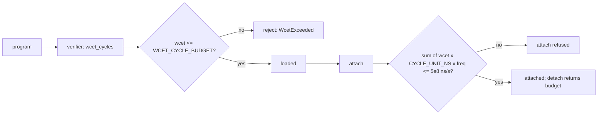

import { Callout } from 'nextra/components'

# Verifier Assurance

**Relevant source files**

- [docs/security/verifier-assurance.md](https://github.com/pro-utkarshM/axiomOS/blob/feat/fpga-bringup/docs/security/verifier-assurance.md)
- [kernel/crates/kernel_bpf/src/verifier/core.rs](https://github.com/pro-utkarshM/axiomOS/blob/feat/fpga-bringup/kernel/crates/kernel_bpf/src/verifier/core.rs)
- [kernel/crates/kernel_bpf/src/verifier/pruner.rs](https://github.com/pro-utkarshM/axiomOS/blob/feat/fpga-bringup/kernel/crates/kernel_bpf/src/verifier/pruner.rs)
- [kernel/crates/kernel_bpf/src/verifier/state.rs](https://github.com/pro-utkarshM/axiomOS/blob/feat/fpga-bringup/kernel/crates/kernel_bpf/src/verifier/state.rs)
- [kernel/crates/kernel_bpf/src/verifier/cost.rs](https://github.com/pro-utkarshM/axiomOS/blob/feat/fpga-bringup/kernel/crates/kernel_bpf/src/verifier/cost.rs)
- [kernel/crates/kernel_bpf/src/verifier/admission.rs](https://github.com/pro-utkarshM/axiomOS/blob/feat/fpga-bringup/kernel/crates/kernel_bpf/src/verifier/admission.rs)
- [kernel/crates/kernel_bpf/src/cost_corpus.rs](https://github.com/pro-utkarshM/axiomOS/blob/feat/fpga-bringup/kernel/crates/kernel_bpf/src/cost_corpus.rs)
- [kernel/crates/kernel_bpf/benches/verifier.rs](https://github.com/pro-utkarshM/axiomOS/blob/feat/fpga-bringup/kernel/crates/kernel_bpf/benches/verifier.rs)
- [formal/README.md](https://github.com/pro-utkarshM/axiomOS/blob/feat/fpga-bringup/formal/README.md)

If a program can be loaded on a running robot, verifying it competes with the control loop for CPU. Unlike Linux, whose verifier has only a heuristic complexity limit, axiomos aims for verification cost that is **bounded and pre-declarable** as a function of program size, and separately for a static bound on the program's own execution cost. This page covers the assurance argument; the mechanics are in [Verifier](/axiomos/fpga-bringup/bpf/verifier).

## The bounded fragment F

A program is in F when:

1. **Its CFG is loop-free.** The embedded profile enforces this (`verify_embedded_constraints` rejects back edges). The cloud profile permits loops and is therefore not in F; it relies on the state budget to stay bounded.
2. **It uses only allow-listed helpers**, none of which allocate dynamically.
3. **It needs no dynamic allocation or unbounded memory.**
4. **Its instruction count is at most `P::MAX_INSN_COUNT`** (`check_basic`).

## Abstract domain and the cost bound

Each register is tracked as a **tnum** (known bits) times an **unsigned interval**, plus a flat register-type lattice; stack slots take one of a few `StackSlot` values. The domain has finite height `h`, so monotone exploration visits each program point at most `h + 1` times:

```text
states_explored  <=  (h + 1) * n      =>     verification cost = O(n)
```

The metric is `VerifyStats::states_explored` from `Verifier::verify_with_stats`. For straight-line code it is exactly one state per instruction; the `bounded_fragment_state_count_is_linear` test asserts `states_explored <= n` over a range of sizes, and `cost_corpus` tests pin the bound at the measurement sizes.

## What makes the bound real

| Mechanism | Location | Role |
|---|---|---|
| Loop-free fragment (embedded) | `verifier/core.rs` `verify_embedded_constraints` | Keeps `h` small; removes back-edge blow-up |
| Explicit worklist, no recursion | `verifier/core.rs` `explore` | Bounds native-stack use; verification cannot overflow the kernel stack |
| Sparse stack state | `verifier/state.rs` `StackState` | About 1 KiB per state instead of about 1 MiB |
| Recorded-state budget | `verifier/pruner.rs` `DEFAULT_MAX_STATES` (8,192; 64 per pc) | Exceeding it rejects with `StateLimitExceeded` |
| Liveness-aware pruning | `verifier/liveness.rs`, `verifier/pruner.rs` | Fewer distinct states, tighter constant |

The current ceiling is the pruner's per-pc subsumption walk, which is quadratic in states on a non-converging (cloud-profile) loop. Making it sub-quadratic, as Linux's `is_state_visited` does with hashing, is named as the next lever for raising the budget.

## Static WCET model

`verifier/cost.rs` assigns each instruction a static cycle cost (`insn_cycle_cost`: helper calls and memory accesses cost more than plain ALU; division and remainder are the expensive ALU ops) and computes WCET as the **longest path** through the loop-free CFG (`wcet_cycles`, a reverse longest-path DP). Because it takes the maximum over branches, WCET is not the naive sum of instruction costs. It is returned as `VerifyStats::wcet_cycles`.

Two enforcement points consume it:



- **Per-program budget (embedded profile):** `WCET_CYCLE_BUDGET = RT_PERIOD_NS / CYCLE_UNIT_NS`, about 166,666 units, one 1 kHz control period. The check runs with the structural profile constraints **before** path-sensitive exploration. The documentation notes this budget is currently unreachable through the syscall path because the 4096-instruction load cap keeps loadable programs about two orders of magnitude below it; it stands as a structural guard.
- **Utilization admission (kernel):** `BpfManager::attach` consults an `AdmissionLedger` in utilization form. Each attach commits `wcet x CYCLE_UNIT_NS x freq` ns of CPU per second, capped at `UTILIZATION_BUDGET_NS_PER_S = 5 x 10^8` (U = 0.5, the EDF utilization test).

<Callout type="warning">
**Calibration status.** `CYCLE_UNIT_NS = 6` comes from a historical Raspberry Pi 5 (Cortex-A76) calibration that measured about 5.74 ns per unit. That campaign's raw UART capture and kernel artifact hash were not retained, so per the [evidence policy](/axiomos/fpga-bringup/performance) it is **not** current benchmark evidence. The admission model itself is tested in the required gate. Every hook is also assumed to fire at the nominal 1 kHz; per-hook and caller-declared frequencies are future work, and no head-to-head comparison against PREVAIL has been run.
</Callout>

## How to measure

| Method | Command / location | Notes |
|---|---|---|
| CI state-count bound | `cargo test -p kernel_bpf --features cloud-profile` | Asserts linear state count |
| Cost of a program | `Verifier::verify_with_stats(...)` | Read `states_explored`, `wcet_cycles` |
| Host wall-clock curve | `kernel/crates/kernel_bpf/benches/verifier.rs` | Criterion; needs host helper stubs. The attributable campaign is on [Current Results](/axiomos/fpga-bringup/performance/current-results) |
| On-device curve | kernel feature `verifier-cost` + `verifier_bench` userspace driver | Emits `AXIOM VERIFIER COST prog_id=... insns=... states=... cycles=... wcet=...`; reduce with `cargo xtask bench verifier -- LOG` |

## Formal status

The only machine-checked artifact is a Lean 4 proof-of-concept that formalizes the tnum domain with soundness proofs for representative operators (`formal/AxiomFormal/Tnum.lean`). The roadmap to a full "verifier accepts implies interpreter safe" theorem is in `formal/README.md` (#91). The verifier itself is unproven; its assurance rests on Rust's type system, zero `unsafe`, tests, fuzzing, Miri, mutation testing and review.
