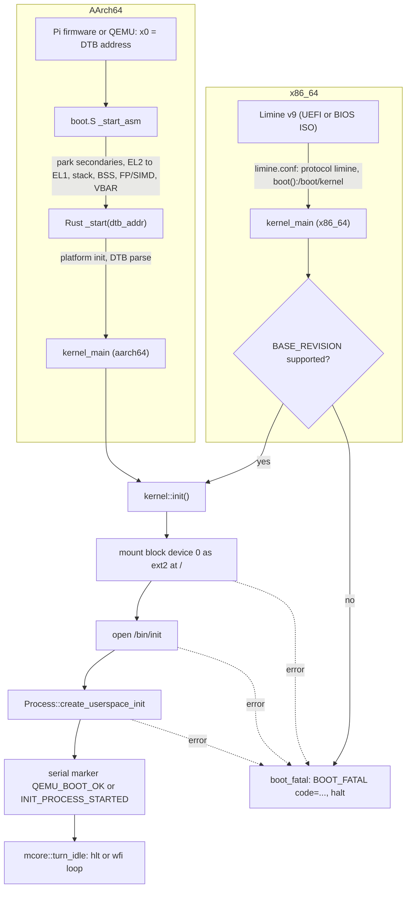

import { Callout } from 'nextra/components'

# Boot Flow

**Relevant source files**

- [limine.conf](https://github.com/pro-utkarshM/axiomOS/blob/main/limine.conf)
- [kernel/src/limine.rs](https://github.com/pro-utkarshM/axiomOS/blob/main/kernel/src/limine.rs)
- [kernel/src/main.rs](https://github.com/pro-utkarshM/axiomOS/blob/main/kernel/src/main.rs)
- [kernel/src/lib.rs](https://github.com/pro-utkarshM/axiomOS/blob/main/kernel/src/lib.rs)
- [kernel/src/arch/aarch64/boot.S](https://github.com/pro-utkarshM/axiomOS/blob/main/kernel/src/arch/aarch64/boot.S)
- [kernel/src/arch/aarch64/boot.rs](https://github.com/pro-utkarshM/axiomOS/blob/main/kernel/src/arch/aarch64/boot.rs)
- [kernel/src/arch/aarch64/mod.rs](https://github.com/pro-utkarshM/axiomOS/blob/main/kernel/src/arch/aarch64/mod.rs)
- [kernel/src/arch/aarch64/dtb.rs](https://github.com/pro-utkarshM/axiomOS/blob/main/kernel/src/arch/aarch64/dtb.rs)
- [kernel/src/mcore/mod.rs](https://github.com/pro-utkarshM/axiomOS/blob/main/kernel/src/mcore/mod.rs)
- [kernel/src/mem/mod.rs](https://github.com/pro-utkarshM/axiomOS/blob/main/kernel/src/mem/mod.rs)
- [docs/operations/boot.md](https://github.com/pro-utkarshM/axiomOS/blob/main/docs/operations/boot.md)

Both architectures converge on the same Rust entry symbol, `kernel_main`, which calls `kernel::init()`, mounts the ext2 root filesystem, starts `/bin/init`, and turns the boot CPU into an idle loop. The paths into `kernel_main` differ.

## End-to-end sequence



## x86_64: Limine handoff

`limine.conf` boots the `/axiomos` entry with the Limine protocol and `kernel_path: boot():/boot/kernel`, zero timeout. The kernel declares its Limine requests in [kernel/src/limine.rs](https://github.com/pro-utkarshM/axiomOS/blob/main/kernel/src/limine.rs):

| Request | Used for |
|---|---|
| `DateAtBootRequest` (`BOOT_TIME`) | Boot wall-clock seconds (`BOOT_TIME_SECONDS`) |
| `ExecutableFileRequest`, `ExecutableAddressRequest` | Kernel image location (backtraces, symbolization) |
| `MemoryMapRequest` | Physical allocator stage 1 |
| `HhdmRequest` | Higher-half direct map offset for `phys_to_virt` |
| `RsdpRequest` | ACPI tables |
| `StackSizeRequest` | 256 KiB (`262_144`) boot stack |
| `ModuleRequest` | Boot modules |
| `MpRequest` | Application processors (SMP) |

`kernel_main` first checks `BASE_REVISION.is_supported()`. The Limine revision and OVMF image are pinned in `ci/manifests/build-inputs.env` (Limine `v9.6.7-binary`, OVMF `edk2-stable202511-r2`).

## AArch64: firmware entry

`boot.S` is entered with the DTB physical address in `x0`, MMU off, at EL2 or EL1. It:

1. Saves the DTB address and parks every core except core 0.
2. If at EL2, configures `HCR_EL2` (AArch64 EL1), disables FP/SIMD traps (`CPTR_EL2`), grants EL1 timer access (`CNTHCTL_EL2`), and `eret`s to EL1h with all interrupts masked.
3. Sets up a 64 KiB boot stack, clears BSS, enables FP/SIMD (`CPACR_EL1.FPEN`), installs `VBAR_EL1`.
4. Calls Rust `_start(dtb_addr)`.

Rust `_start` ([boot.rs](https://github.com/pro-utkarshM/axiomOS/blob/main/kernel/src/arch/aarch64/boot.rs)) records the DTB address, runs `platform::rpi5::init()` or `platform::virt::init()` depending on the feature, parses the device tree (a parse failure is logged and the kernel falls back to platform defaults), then jumps to `kernel_main`.

<Callout type="info">
On AArch64 only the boot core runs; `mcore::init` initializes the run queues and sleep queue but does not start secondary cores. On x86_64, `mcore::init` uses the Limine `MpRequest` to hand each application processor the boot CR3 and send it to `cpu_init_and_idle`.
</Callout>

## `kernel::init()` order

[kernel/src/lib.rs](https://github.com/pro-utkarshM/axiomOS/blob/main/kernel/src/lib.rs) initializes subsystems in dependency order and returns a typed `KernelInitError` instead of panicking:

| Step | x86_64 | AArch64 |
|---|---|---|
| 1 | `init_boot_time` (Limine date) | boot time stays at epoch 0 (no RTC source) |
| 2 | `log::init` | `log::init` |
| 3 | `mem::init`, `acpi::init`, `apic::init`, `hpet::init` | `Aarch64::early_init` (exception vectors), `Aarch64::init` (`mem::init`, GIC + timer + RP1 GPIO IRQ, syscall) |
| 4 | `BPF_MANAGER` created | same |
| 5 | `bench::init` (only with `bench` feature) | same |
| 6 | `backtrace::init` | same |
| 7 | `file::init` (VFS, devfs at `/dev`) | same |
| 8 | `driver::iio::init` | same |
| 9 | `mcore::init` (run queues, sleep, cleanup; SMP bring-up) | `mcore::init` (single core) |
| 10 | `pci::init` (PCI enumeration, VirtIO devices) | `virt`: VirtIO MMIO init; `rpi5`: embedded ramdisk |
| 11 | `driver::iio::init_simulated_device` | same |
| 12 | print `AXIOM KERNEL METRICS` (boot ms, heap KB, image MB) | same |

Memory init itself is two-staged on both architectures: physical allocator stage 1 from the boot memory map, `AddressSpace` init, heap init, virtual-memory manager init, then physical stage 2 (frame-state and refcount tables, which need the heap) and heap stage 2. See [Memory](/axiomos/main/architecture/memory).

## After `init()`

On **x86_64**, `kernel_main` requires block device 0, mounts it as ext2 at `/`, verifies `/bin/init` exists, creates the init process, prints `INIT_PROCESS_STARTED` (with `audit-diagnostics`) and then always prints `QEMU_BOOT_OK`. The marker is deliberately emitted only after root mount and init creation so that the QEMU smoke gate proves more than kernel initialization.

On **AArch64**, `kernel_main` initializes per-CPU context for CPU 0, enables IRQs, and, if a block device exists, mounts it and starts `/bin/init` (printing `INIT_PROCESS_STARTED`, plus `PI5_BOOT_OK` under `bench`). With `rpi5` it then spawns the Shrike control-link task (`control_link::spawn`).

## Boot failure handling

Boot prerequisites map to a `BootError` enum with stable codes, emitted as one bounded record before halting, following [ADR-0002](/axiomos/main/decisions/adr-0002-error-policy):

```text
BOOT_FATAL code=bootloader-revision-unsupported | boot-time-unavailable |
  filesystem-initialization | embedded-ramdisk-initialization |
  iio-simulation-initialization | root-block-device-missing |
  root-filesystem-invalid | root-mount-failed | init-path-invalid |
  init-executable-missing | init-process-creation-failed
```

The panic handler prints `V04_PANIC kind=panic`, the location and message, and an optional backtrace (`backtrace` feature), then halts.

## Diagnostic features

| Feature | Effect on boot |
|---|---|
| `audit-diagnostics` | One-shot serial markers consumed by the local audit gate |
| `bringup-diagnostics` | Raw single-character writes to the Pi 5 debug UART10 at each boot stage, plus a forced scheduling probe |
| `audit-fault-injection` | Runs a physical-memory fault-injection probe after `QEMU_BOOT_OK` (x86_64) |
| `bench` | v0.3 HIL bench instrumentation and emergency console |
