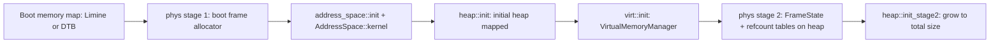

import { Callout } from 'nextra/components'

# Memory

**Relevant source files**

- [docs/architecture/memory.md](https://github.com/pro-utkarshM/axiomOS/blob/main/docs/architecture/memory.md)
- [kernel/src/mem/mod.rs](https://github.com/pro-utkarshM/axiomOS/blob/main/kernel/src/mem/mod.rs)
- [kernel/src/mem/phys.rs](https://github.com/pro-utkarshM/axiomOS/blob/main/kernel/src/mem/phys.rs)
- [kernel/src/mem/heap.rs](https://github.com/pro-utkarshM/axiomOS/blob/main/kernel/src/mem/heap.rs)
- [kernel/src/mem/heap_policy.rs](https://github.com/pro-utkarshM/axiomOS/blob/main/kernel/src/mem/heap_policy.rs)
- [kernel/src/mem/virt.rs](https://github.com/pro-utkarshM/axiomOS/blob/main/kernel/src/mem/virt.rs)
- [kernel/src/mem/address_space/mod.rs](https://github.com/pro-utkarshM/axiomOS/blob/main/kernel/src/mem/address_space/mod.rs)
- [kernel/src/arch/aarch64/mem.rs](https://github.com/pro-utkarshM/axiomOS/blob/main/kernel/src/arch/aarch64/mem.rs)
- [kernel/src/mcore/mtask/process/mem.rs](https://github.com/pro-utkarshM/axiomOS/blob/main/kernel/src/mcore/mtask/process/mem.rs)
- [kernel/src/syscall/validation.rs](https://github.com/pro-utkarshM/axiomOS/blob/main/kernel/src/syscall/validation.rs)
- [kernel/crates/kernel_physical_memory](https://github.com/pro-utkarshM/axiomOS/tree/main/kernel/crates/kernel_physical_memory)
- [kernel/crates/kernel_map_transaction/src/lib.rs](https://github.com/pro-utkarshM/axiomOS/blob/main/kernel/crates/kernel_map_transaction/src/lib.rs)
- [kernel/crates/kernel_usermem/src/lib.rs](https://github.com/pro-utkarshM/axiomOS/blob/main/kernel/crates/kernel_usermem/src/lib.rs)

The memory subsystem is normative for both supported kernel targets (x86_64 and AArch64). Its core rules: page-table mutation goes through `AddressSpace`, multi-page mapping is transactional, every mutation is followed by TLB invalidation **before** frames are released, and every syscall-level user copy goes through one bounded, page-validated contract.

## Initialization pipeline

On AArch64, `arch::aarch64::mm::init()` builds page tables and the stage-1 allocator from the device tree before the shared steps ([kernel/src/mem/mod.rs](https://github.com/pro-utkarshM/axiomOS/blob/main/kernel/src/mem/mod.rs)).

## Physical memory

- `kernel_physical_memory` provides the host-testable sparse frame manager (`FrameState`: `Unusable`, `Allocated`, `Free`) and an optional `fault-injection` controller used by the audit gate.
- `kernel/src/mem/phys.rs` wraps it in a `MultiStageAllocator`, keeps per-frame `u32` reference counts (`FrameRefCounts`, with an "immortal" sentinel for frames that are never freed), and records reserved regions. `PhysicalMemory` is the zero-sized facade the rest of the kernel uses.

## Kernel heap

The heap is a `linked_list_allocator::LockedHeap`. Its size is computed from usable RAM by the pure, host-tested [heap_policy.rs](https://github.com/pro-utkarshM/axiomOS/blob/main/kernel/src/mem/heap_policy.rs):

| Quantity | Rule |
|---|---|
| Initial heap | 8 bytes per 4 KiB frame (room for frame metadata), clamped to 2 MiB to 128 MiB, rounded to 2 MiB |
| Total heap | `usable_ram / 256`, clamped between `max(initial + 2 MiB, 8 MiB)` and 512 MiB, rounded to 2 MiB |
| Frame metadata | 5 bytes per frame (one `FrameState` byte plus one `u32` refcount) |

The 8 MiB floor exists because a four-CPU boot consumes just under 4 MiB before userspace starts.

## Address-space layout (AArch64)

From [kernel/src/arch/aarch64/mem.rs](https://github.com/pro-utkarshM/axiomOS/blob/main/kernel/src/arch/aarch64/mem.rs) (48-bit VA, kernel in TTBR1, user in TTBR0):

| Region | Base | Size |
|---|---|---|
| Physical direct map (HHDM) | `0xFFFF_8000_0000_0000` | up to 64 TiB |
| Kernel image (QEMU virt load) | `0xFFFF_8000_4008_0000` | — |
| Kernel heap | `0xFFFF_C000_0000_0000` | up to 4 GiB |
| Kernel stacks | `0xFFFF_D000_0000_0000` | 64 KiB per stack |
| MMIO | `0xFFFF_E000_0000_0000` | 16 TiB |
| User space | `0x0` to `0x0001_0000_0000_0000` | 256 TiB |
| User stack top | `0x0000_007F_0000_0000` | — |
| User heap | `0x0000_0000_1000_0000` | — |

`MAIR_EL1` encodes Device-nGnRnE, Device-nGnRE, Normal write-back and Normal non-cacheable attributes. On x86_64 the HHDM offset comes from Limine, and the kernel heap starts at page-table index 257 of the upper half.

## AddressSpace ownership

`AddressSpace` (`kernel/src/mem/address_space`) owns:

- the architecture top-level user page-table frame;
- an `RwLock` around `AddressSpaceMapper` that serializes page-table mutation against user-memory validation and copying;
- a resident-CPU bitmask that identifies TLB invalidation targets (the scheduler marks the next task's address space resident on the CPU it switches to).

Each `Process` owns an optional `AddressSpace`, a lower-half virtual allocator, and `MemoryRegions` metadata. The kernel address space is global; user spaces share the required kernel mappings. On x86_64, operations needing the recursive mapping temporarily activate the target CR3 with interrupts disabled and restore the previous CR3. On AArch64 the switch is a TTBR0 change while kernel mappings stay in TTBR1.

## Mapping transactions

Both architectures use `kernel_map_transaction::MapRangeTransaction` to record installed pages and frames consumed but not installed. On any failure the rollback:

1. unmaps installed pages in reverse order;
2. releases the frames returned by those unmaps;
3. releases every pending frame exactly once.

`commit()` suppresses rollback. Range protection changes snapshot each page's flags first and restore earlier pages in reverse order if a later update fails. The transaction has fixed 512-page mapped and pending capacities so it can be used before the heap exists; callers must stay within that bound (the heap policy chunks large mappings accordingly).

## Fork, copy-on-write and exec

- `fork` clones current mappings through typed address-space and memory-region paths. Writable private regions are remapped in the parent without `WRITABLE` and with a `COPY_ON_WRITE` flag ([process/mem.rs](https://github.com/pro-utkarshM/axiomOS/blob/main/kernel/src/mcore/mtask/process/mem.rs)).
- Copy-on-write faults use typed replacement paths; if publishing the private page fails, the old mapping is restored before the error is returned.
- `exec` builds a replacement image and publishes it only after preflight and rollback-capable allocation/protection complete.
- `MemoryRegion` teardown unmaps before releasing the physical frames currently present in the PTEs, including private pages installed after CoW.

## TLB invalidation and reclamation

Every successful map, unmap or protection change invokes the address-space shootdown path **before** released frames return to the allocator:

- **x86_64:** targets CPUs in the address space's resident mask (all online CPUs for the kernel address space) using an epoch/acknowledgement shootdown. The QEMU gate checks for a `TLB_SHOOTDOWN_OK` marker.
- **AArch64:** uses the architecture broadcast TLB invalidation sequence.

New page-table mutations must use the `AddressSpace` surface, not an architecture walker directly, unless they provide equivalent invalidation and ownership proof.

## User-memory boundary

All syscall-level user copies go through the `kernel_usermem::UserMemory` contract and the `kernel/src/syscall/validation.rs` adapter. A copy:

1. rejects null, overflowing, upper-half and over-64-KiB ranges (`MAX_USER_COPY = 64 * 1024`);
2. walks every covered page while holding the mapper **read** guard;
3. requires `PRESENT | USER_ACCESSIBLE`, plus `WRITABLE` for kernel-to-user copies;
4. copies in page-bounded chunks while the same guard excludes map/unmap writers.

Failures stay typed as `UserMemError` and become `EFAULT` at the syscall boundary (the QEMU gate checks `USERCOPY_EFAULT_OK`).

## Fault policy

| Fault | Behavior |
|---|---|
| User page fault, invalid opcode, general protection, invalid TSS, segment fault | Terminate the current task (exit status 139, or 132 for invalid opcode on x86_64) |
| Kernel-stack guard fault | Kernel panic, to preserve kernel control-flow integrity |
| Lazy / file-backed page fault | Not implemented; a fault is never treated as demand-paging work |
| CoW fault | Typed replacement; old mapping restored on failure |

<Callout type="warning">
Known gaps: no demand paging (user pages are populated eagerly), `AddressSpace` per-frame ownership on drop and task-stack isolation are tracked issues (#69, #70), and the unsafe ledger lists concurrency fault injection, multicore TLB shootdown tests, and SMP allocator stress as **missing** evidence for the memory obligations.
</Callout>

## Change rule

Any change to frame ownership, invalidation ordering, fork/CoW, or user-copy permissions requires a failing-before / passing-after test at the narrowest host-testable seam plus both supported kernel target checks ([memory.md](https://github.com/pro-utkarshM/axiomOS/blob/main/docs/architecture/memory.md)).
