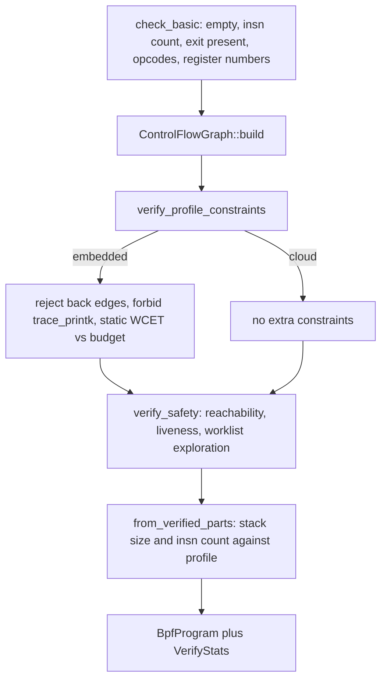

import { Callout } from 'nextra/components'

# Verifier

Relevant source files

- [kernel/crates/kernel_bpf/src/verifier/core.rs](https://github.com/pro-utkarshM/axiomOS/blob/main/kernel/crates/kernel_bpf/src/verifier/core.rs)
- [kernel/crates/kernel_bpf/src/verifier/cfg.rs](https://github.com/pro-utkarshM/axiomOS/blob/main/kernel/crates/kernel_bpf/src/verifier/cfg.rs)
- [kernel/crates/kernel_bpf/src/verifier/state.rs](https://github.com/pro-utkarshM/axiomOS/blob/main/kernel/crates/kernel_bpf/src/verifier/state.rs)
- [kernel/crates/kernel_bpf/src/verifier/pruner.rs](https://github.com/pro-utkarshM/axiomOS/blob/main/kernel/crates/kernel_bpf/src/verifier/pruner.rs)
- [kernel/crates/kernel_bpf/src/verifier/liveness.rs](https://github.com/pro-utkarshM/axiomOS/blob/main/kernel/crates/kernel_bpf/src/verifier/liveness.rs)
- [kernel/crates/kernel_bpf/src/verifier/refine.rs](https://github.com/pro-utkarshM/axiomOS/blob/main/kernel/crates/kernel_bpf/src/verifier/refine.rs)
- [kernel/crates/kernel_bpf/src/verifier/cost.rs](https://github.com/pro-utkarshM/axiomOS/blob/main/kernel/crates/kernel_bpf/src/verifier/cost.rs)
- [kernel/crates/kernel_bpf/src/verifier/admission.rs](https://github.com/pro-utkarshM/axiomOS/blob/main/kernel/crates/kernel_bpf/src/verifier/admission.rs)
- [kernel/crates/kernel_bpf/src/verifier/map_policy.rs](https://github.com/pro-utkarshM/axiomOS/blob/main/kernel/crates/kernel_bpf/src/verifier/map_policy.rs)
- [kernel/crates/kernel_bpf/src/verifier/error.rs](https://github.com/pro-utkarshM/axiomOS/blob/main/kernel/crates/kernel_bpf/src/verifier/error.rs)
- [kernel/crates/kernel_bpf/docs/VERIFICATION.md](https://github.com/pro-utkarshM/axiomOS/blob/main/kernel/crates/kernel_bpf/docs/VERIFICATION.md)
- [kernel/src/bpf/mod.rs](https://github.com/pro-utkarshM/axiomOS/blob/main/kernel/src/bpf/mod.rs)

The verifier is the only producer of `VerifiedProgram` values. `Verifier::verify_with_stats(prog_type, insns, config)` returns a `BpfProgram` plus `VerifyStats` (`states_explored`, `wcet_cycles`, and the proven-constant `referenced_map_handles`). The kernel manager calls it on every load and again at every attach.

## Phases

The ordering is deliberate: profile structural constraints (loop-freedom, forbidden helpers, the WCET budget) run before path-sensitive exploration, so an over-budget or looping embedded program is rejected without paying exploration cost, and the WCET check cannot be masked by the explorer's state cap.

## Control-flow graph

`ControlFlowGraph::build` computes basic-block leaders, edges, back edges, exit points, and a compressed-sparse-row successor table so `successors(i)` is proportional to out-degree. This keeps liveness, reachability and WCET passes linear. Any instruction that is not reachable (other than wide-instruction continuations) is `UnreachableInstruction`.

## Abstract state

Each register carries a type from the `RegType` lattice (`NotInit`, `Scalar`, `PtrToStack`, `PtrToMapValue`, `PtrToMapKey`, `PtrToCtx`, `PtrToPacket*`, `ConstPtrToMap`, `PtrToFp`, `NullPtr`) and, for scalars, a `ScalarValue` that combines a known-bits `TnumValue` with an unsigned interval. Pointers returned by map lookup and ring buffer reserve are maybe-null until a null check clears the flag on the taken branch. Stack state is sparse (`StackState`), so only touched slots cost memory.

| Module | Role |
|---|---|
| `alu.rs` | Constant folding and tnum propagation through ALU ops, with 32-bit width semantics |
| `refine.rs` | Tightens scalar ranges on each arm of a conditional branch |
| `pruner.rs` | State subsumption: skip a path if an earlier state at the same pc covers it |
| `liveness.rs` | Backward dataflow so differences in dead registers do not block pruning |
| `map_policy.rs` | Map value sizes, generation-checked handles, and read/write permission checks |

The pruner retains at most 8192 states in total (`DEFAULT_MAX_STATES`) and 64 per program counter (`DEFAULT_MAX_STATES_PER_PC`). Exceeding the total yields `StateLimitExceeded`. Exploration uses an explicit worklist rather than recursion, so verification does not grow the kernel stack with branch nesting.

## What is checked

- Structure: empty program, no exit, instruction count over `MAX_INSN_COUNT`, invalid opcodes, registers above 10, invalid jump targets.
- Registers: use of uninitialized registers, writes to `r10` (the frame pointer), division by a provably zero divisor (including after 32-bit truncation).
- Memory: stack, context and map-value accesses are bounds-checked against sizes supplied in `VerifyConfig`; dereferencing a maybe-null pointer is rejected (`MisalignedAccess` exists as an error variant; its exact trigger conditions were not traced for this page). With the zero-config `verify()` entry, context and map-value accesses are rejected because no region size is known.
- Context size: R1 is bounded to `size_of::<BpfContext>()` for every hook; the per-hook payload reached through `BpfContext::data` is bounded by `ctx_data_size` (see [Hooks](/axiomos/main/bpf/hooks)).
- Helpers: ID must be known and available in the active profile, argument count and register types must match the signature, and the caller must satisfy the helper's tier (below).
- Maps: constant map handles must resolve in the generation-checked table; a lookup yields exactly that map's value size; a dynamic handle is bounded to the smallest map and is rejected if any map is unavailable or write-only. Mutating helpers (`map_update_elem`, `map_delete_elem`, `ringbuf_output`, `timeseries_push`) require a provably writable map handle; stores through a read-only lookup are rejected.
- Stack: computed maximum depth must fit the profile (`StackExceeded`).

### Caller tiers and helper policy

`VerifyConfig` carries `caller` (`Unprivileged`, `Privileged`, `Trusted`), `allow_actuation`, and `forbid_logging_helpers`. A helper signature can set a minimum tier, require actuation authority, or be marked as possibly logging. `verify_call` raises `HelperRequiresPrivilege`, `ActuationCapabilityRequired` or `LoggingHelperForbidden` accordingly. The helper table is on [Maps and Helpers](/axiomos/main/bpf/maps-and-helpers).

## WCET bound and admission

`cost.rs` assigns a static cost in relative cycle units to each instruction and computes the program's WCET as a fixed invocation base (95 units) plus the longest path through the loop-free CFG, using a single reverse dynamic-programming pass.

| Instruction class | Cost |
|---|---:|
| Default (cheap ALU, jump, mov, exit) | 1 |
| Memory load/store | 2 |
| Division and modulo | 2 |
| Helper: counter reads (ktime, cpu id, prandom, pid, uid, latency, boot time, heap, image, sensor timestamp) | 4 |
| Helper: copies and device access (probe_read, comm, GPIO, PWM, motor pair, IIO, CAN) | 10 |
| Helper: ring buffer (output, reserve, submit, discard) | 12 |
| Helper: map operations (lookup, update, delete, timeseries push) | 16 |
| Helper: trace_printk | 20 |
| Unknown helper ID | 8 |

The cost constants are described in source as conservative bounds calibrated against a 2026-06-11 Raspberry Pi 5 (Cortex-A76) run; the source also notes that trace_printk's real cost is serial-I/O-bound and is not modeled by its weight, so it is banned by policy instead.

Two enforcement points use the result on the embedded profile:

1. **Per-program budget (verifier).** `wcet_cycles` above `WCET_CYCLE_BUDGET` (`RT_PERIOD_NS / CYCLE_UNIT_NS`, 1,000,000 / 6) is rejected with `WcetExceeded`. Any back edge is rejected with `UnboundedLoop`, and `bpf_trace_printk` with `HelperForbiddenOnRtFragment`. On the cloud profile the budget is `u64::MAX` and back edges are not rejected by this check; non-terminating exploration is bounded by `MAX_INSN_COUNT` per path (`InfiniteLoop`) and the state budget.
2. **Utilization admission (kernel, at attach).** `AdmissionLedger::admit` adds `wcet_cycles * CYCLE_UNIT_NS * freq_hz` nanoseconds of CPU per second for the attachment, and refuses (`AdmissionRejected`) if the total would exceed `UTILIZATION_BUDGET_NS_PER_S` (500,000,000 on embedded, i.e. half a core). Detach releases exactly what attach committed. `BpfManager::hook_frequency_hz` assumes every hook fires at the control-loop rate (1 kHz on embedded); per-hook frequencies are noted in source as future work. On cloud the frequency is 0 and the budget unbounded, so admission never rejects.

<Callout type="info">
This is a load-time utilization ledger, not an EDF scheduler. Whether the cost model's units match real execution time on a given board is a calibration question the source itself leaves open (`CYCLE_UNIT_NS` is described as rounded up from a measured value); treat the budgets as policy constants, not proven timing guarantees.
</Callout>

## Limits summary

| Limit | Cloud | Embedded | Source |
|---|---:|---:|---|
| Instructions | 1,000,000 | 100,000 | `PhysicalProfile::MAX_INSN_COUNT` |
| Stack | 512 KiB | 8 KiB | `MAX_STACK_SIZE` |
| WCET per program | unbounded | about 166,666 units | `WCET_CYCLE_BUDGET` |
| Verifier recorded states | 8192 total, 64 per pc | same | `StatePruner` |
| Subprogram call depth | 8 | 8 | loader `normalize` |
| Raw `BPF_PROG_LOAD` instruction count | 4096 | 4096 | `sys_bpf` |
| ELF payload | 1 MiB | 1 MiB | `BpfLimits::max_elf_bytes` |

## Selected `VerifyError` variants

`InvalidOpcode`, `InvalidRegister`, `UninitializedRegister`, `OutOfBoundsAccess`, `InvalidMemoryAccess`, `UnreachableInstruction`, `InfiniteLoop`, `StateLimitExceeded`, `InvalidJump`, `NoExit`, `EmptyProgram`, `InvalidHelper`, `HelperRequiresPrivilege`, `ActuationCapabilityRequired`, `LoggingHelperForbidden`, `PointerLeakUnprivileged`, `HelperNotAvailable`, `InvalidMapId`, `WriteToReadOnlyMap`, `WriteMapNotProvablyWritable`, `HelperArgCount`, `HelperArgType`, `DivisionByZero`, `StackExceeded`, `InsnCountExceeded`, `WriteToReadOnly`, `MisalignedAccess`, `WcetExceeded`, `InterruptUnsafe`, `DynamicAllocationAttempted`, `UnboundedLoop`, `HelperForbiddenOnRtFragment`. Every variant carries the failing instruction index where one applies.

## Assurance

The fuzz targets `verify_only` (termination and no panics) and `verify_then_exec` (a verified program must execute without panicking in the interpreter) exercise this code; the fuzz README states the PR smoke job runs `verify_only` for 60 seconds and a weekly job runs longer campaigns. Building the kernel with the `verifier-cost` feature emits per-load cost markers on the UART.
