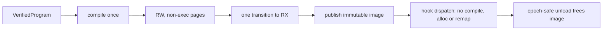

import { Callout } from 'nextra/components'

# ADR-0004: BPF JIT Policy

**Relevant source files**

- [docs/decisions/0004-bpf-jit-policy.md](https://github.com/pro-utkarshM/axiomOS/blob/main/docs/decisions/0004-bpf-jit-policy.md)
- [kernel/crates/kernel_bpf/src/profile/mod.rs](https://github.com/pro-utkarshM/axiomOS/blob/main/kernel/crates/kernel_bpf/src/profile/mod.rs)
- [kernel/crates/kernel_bpf/src/execution/jit_aarch64.rs](https://github.com/pro-utkarshM/axiomOS/blob/main/kernel/crates/kernel_bpf/src/execution/jit_aarch64.rs)
- [kernel/crates/kernel_bpf/src/execution/jit](https://github.com/pro-utkarshM/axiomOS/tree/main/kernel/crates/kernel_bpf/src/execution/jit)
- [kernel/crates/kernel_bpf/src/execution/interpreter.rs](https://github.com/pro-utkarshM/axiomOS/blob/main/kernel/crates/kernel_bpf/src/execution/interpreter.rs)

**Status:** Accepted. **Date:** 2026-07-14.

## Context

The engineering audit (finding C-06) found that JIT pages were mapped read-write-execute and that programs were recompiled on every hook fire. That made the JIT both a W^X violation and an unverified component inside the TCB.

## Decision

axiomos v1.0 is **interpreter-only**. No shipped profile enables a BPF JIT, and JIT support is off the release critical path. Experimental JIT code must not provide kernel allocator symbols, executable mappings or production call sites. The existing AArch64 per-execution compiler/allocator path is to be removed from the shipped `kernel_bpf` surface or relocated to an experiment; keeping it behind an undocumented feature is not enough, because dead `unsafe` code still adds audit and maintenance surface.

A future JIT requires a new superseding ADR **and** all of:

1. Compilation exactly once, after verification and before publication.
2. The verified program owns an immutable executable image until epoch-safe unload completes.
3. Code is emitted into writable, non-executable pages and transitioned once to read-only executable. No mapping is ever writable and executable at once.
4. Compilation, allocation, protection changes and cache maintenance are fully fallible and transactional.
5. Hook dispatch performs no compilation, allocation, mapping or protection change.
6. Differential tests compare every supported instruction and helper against the interpreter, including malformed and resource-failure cases.

## State on `main`

- `CloudProfile::JIT_ALLOWED` and `EmbeddedProfile::JIT_ALLOWED` are both `false`, with a test asserting the cloud value "must stay false until C-06 redesign".
- JIT source still exists in the tree: `jit_aarch64.rs` (compiled only under an experimental feature or in tests) and an x86_64 code generator under `execution/jit` that no shipped path selects. The unsafe ledger keeps a BPF-EXECUTION-JIT obligation for them.

<Callout type="info">
The README still advertises an AArch64 JIT with under 5 ns overhead. Per this ADR and the evidence policy, that figure is neither a shipped capability nor current benchmark evidence.
</Callout>
