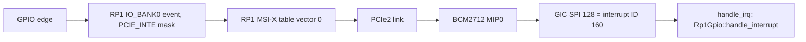

import { Callout } from 'nextra/components'

# RP1 Peripherals

Relevant source files

- [kernel/src/arch/aarch64/platform/rpi5/gpio.rs](https://github.com/pro-utkarshM/axiomOS/blob/main/kernel/src/arch/aarch64/platform/rpi5/gpio.rs)
- [kernel/src/arch/aarch64/platform/rpi5/pwm.rs](https://github.com/pro-utkarshM/axiomOS/blob/main/kernel/src/arch/aarch64/platform/rpi5/pwm.rs)
- [kernel/src/arch/aarch64/platform/rpi5/uart.rs](https://github.com/pro-utkarshM/axiomOS/blob/main/kernel/src/arch/aarch64/platform/rpi5/uart.rs)
- [kernel/src/arch/aarch64/platform/rpi5/pl011.rs](https://github.com/pro-utkarshM/axiomOS/blob/main/kernel/src/arch/aarch64/platform/rpi5/pl011.rs)
- [kernel/src/arch/aarch64/platform/rpi5/rp1_irq.rs](https://github.com/pro-utkarshM/axiomOS/blob/main/kernel/src/arch/aarch64/platform/rpi5/rp1_irq.rs)
- [kernel/src/arch/aarch64/platform/rpi5/mmio.rs](https://github.com/pro-utkarshM/axiomOS/blob/main/kernel/src/arch/aarch64/platform/rpi5/mmio.rs)
- [kernel/src/arch/aarch64/platform/rpi5/memory_map.rs](https://github.com/pro-utkarshM/axiomOS/blob/main/kernel/src/arch/aarch64/platform/rpi5/memory_map.rs)
- [kernel/src/arch/aarch64/interrupts.rs](https://github.com/pro-utkarshM/axiomOS/blob/main/kernel/src/arch/aarch64/interrupts.rs)
- [kernel/src/syscall/bpf.rs](https://github.com/pro-utkarshM/axiomOS/blob/main/kernel/src/syscall/bpf.rs)
- [kernel/src/actuation.rs](https://github.com/pro-utkarshM/axiomOS/blob/main/kernel/src/actuation.rs)
- [kernel/src/bench.rs](https://github.com/pro-utkarshM/axiomOS/blob/main/kernel/src/bench.rs)

RP1 is the Raspberry Pi 5's southbridge. It is a separate chip reached from the BCM2712 over PCIe (the PCIe2 link), and it holds the 40-pin-header peripherals. axiomOS has no general PCIe or device-tree-driven driver model for it: the kernel uses fixed physical addresses inside a window the firmware has already set up (see [Raspberry Pi 5](/axiomos/main/platform/raspberry-pi-5) for the `config.txt` shortcuts).

## Register access

[`mmio.rs`](https://github.com/pro-utkarshM/axiomOS/blob/main/kernel/src/arch/aarch64/platform/rpi5/mmio.rs) provides `MmioReg<T>`, a volatile register wrapper with `read`, `write`, `modify`, `set_bits`, `clear_bits`, `is_set`, `wait_set` and `wait_clear` (the waits spin).

RP1 registers are addressed as `RP1_PERIPHERAL_BASE + offset`, where the base is the higher-half alias of physical `0x1F_0000_0000`:

| Block | RP1 offset | Status |
|---|---|---|
| UART0 (PL011-compatible) | `0x0003_0000` | Used by the Shrike control link |
| UART1 | `0x0003_4000` | Address defined; no driver found |
| I2C0 | `0x0007_0000` | Address defined; no driver found |
| SPI0 | `0x0005_0000` | Address defined; no driver found |
| PWM0 | `0x0009_8000` | Driver |
| PWM1 | `0x0009_C000` | Driver |
| IO_BANK0 (GPIO) | `0x000D_0000` | Driver |
| PADS_BANK0 | `0x000F_0000` | Driver (pad control) |
| PCIe endpoint APB config | `0x0010_8000` | Used by the MSI-X route |
| Clocks | `0x0001_8000` | PWM0 clock only |

Register layouts in the drivers are cross-checked in comments against the Linux sources `pinctrl-rp1.c`, `pwm-rp1.c` and `clk-rp1.c`. RP1 exposes atomic set (`+0x2000`) and clear (`+0x3000`) aliases for ordinary peripheral registers; the driver uses them for the PCIe interrupt-enable mask. The RP1 PCIe config block is the exception, using `+0x800` and `+0xC00`.

## GPIO

[`gpio.rs`](https://github.com/pro-utkarshM/axiomOS/blob/main/kernel/src/arch/aarch64/platform/rpi5/gpio.rs) implements `Rp1Gpio` for the **28 user GPIOs** (`NUM_PINS = 28`; out-of-range pins assert).

| Feature | API |
|---|---|
| Function select | `set_function` with `GpioFunction` (`Alt0` to `Alt4`, `Gpio` = 5, `Alt6` to `Alt8`, `Null` = 31); `get_function` |
| Output | `set_high`, `set_low`, `toggle`, `configure_output`, `force_output_override` |
| Input | `read`, `configure_input` |
| Pulls | `set_pull` with `GpioPull`, programmed through PADS_BANK0 (schmitt, pull select, input enable, output disable bits) |
| Edge events | `enable_interrupt(pin, rising, falling)`, `disable_interrupt`, `clear_interrupt`, `get_pending_events`, `has_rising_event`, `has_falling_event` |
| Diagnostics | `pad_readback`, `ctrl_readback`, `interrupt_state` (full readback of status, control, pad, raw interrupts, PCIe enable and status) |
| UART pinmux | `setup_uart` sets GPIO14 and GPIO15 to Alt4 |

Level-triggered event enable bits are defined but marked unused; the code arms rising and falling edges only.

### GPIO interrupt route

RP1 interrupts reach the CPU as PCIe MSI-X messages, so a pin interrupt crosses several stages. [`rp1_irq.rs`](https://github.com/pro-utkarshM/axiomOS/blob/main/kernel/src/arch/aarch64/platform/rpi5/rp1_irq.rs) documents and programs the route for **RP1 vector 0 (IO_BANK0)**:

`initialize_gpio_route` validates every stage with readbacks and returns a typed error for each failure mode: PCIe link down, root-bus readback, endpoint unavailable (expects vendor/device `0x0001_1DE4` and chip id `0x2000_1927`), missing or invalid MSI-X capability, invalid BAR layout, inbound-window, MIP, MSI-X table and vector readbacks. It repoints the RP1 BARs itself (BAR1 peripherals at PCIe 0, BAR2 SRAM at 4 MiB, BAR0 MSI-X table at 8 MiB, a 9 MiB outbound window), quiesces leftover firmware state, and enables MSI-X globally only after everything downstream is installed.

On the GIC side, `interrupts::init` unconditionally (on `rpi5`) marks ID 160 edge-triggered, enables it at priority `0x80`, and dispatches it to `gpio::handle_interrupt`. That handler reads the pending PCIe interrupt bitmap, scans pending pins, reads events, invokes attached BPF programs with a timestamp from the generic counter, clears events, and acknowledges the RP1 vector.

<Callout type="warning">
  In the source reviewed, `init_pcie_interrupt_route` (and `enable_pwm0_clock`, below) are called from `kernel/src/bench.rs`, which is compiled only with the `bench` feature. `sys_bpf` GPIO attach calls `configure_input` and `enable_interrupt` for the pin, but no call to the route initializer appears on that path, and no other call site was found. Whether a non-bench image establishes the MSI-X route some other way was not confirmed. The GPIO interrupt HIL evidence required by ADR-0003 is also a pending checklist item, not a recorded result.
</Callout>

### How GPIO is used by the rest of the kernel

- `sys_bpf` attach for GPIO edges: after the BPF manager records the route, the pin is configured as input and its edge interrupt enabled.
- BPF helpers and `actuation::guard_gpio` write pins through `Rp1Gpio`, with the actuation monitor deciding first.
- `bench.rs` uses GPIO23 as a sensor input and GPIO24 as an e-stop input (see [Raspberry Pi 5](/axiomos/main/platform/raspberry-pi-5)).

## PWM

[`pwm.rs`](https://github.com/pro-utkarshM/axiomOS/blob/main/kernel/src/arch/aarch64/platform/rpi5/pwm.rs) drives RP1's own PWM block, which the file states does **not** use the BCM2835 register layout. Each of PWM0 and PWM1 has a `GLOBAL_CTRL` register (bit N enables channel N, bit 31 latches) and four channels at a 16-byte stride with `CHAN_CTRL`, `RANGE`, `PHASE` and `DUTY`.

- **Channel numbering is 1-based** in the public API to match the actuation monitor: channels 1 to 4 map to hardware channels 0 to 3. GPIO12 (Alt0) is PWM0 hardware channel 0, so monitor channel 1.
- **API:** `init` (disables all channels), `enable`, `disable`, `set_range`, `set_data`, `set_frequency`, `set_duty_cycle` (percent), `debug_regs`.
- **Channel default:** `CHAN_CTRL = 0x101` (trailing-edge mark/space plus FIFO-pop mask), matching the Linux driver.
- **Clock:** the PWM counter has a functional clock separate from the APB bus, and firmware leaves it gated. `enable_pwm0_clock` programs the divider, selects the parent through the AUX source mux and sets the enable bit so the crystal oscillator feeds PWM0 divide-by-one. Per the code comments, an earlier approach that skipped selecting the aux source left the counter frozen.
- **Assumed rate:** `RP1_PWM_CLOCK_HZ = 50_000_000` is an assumption used to turn a requested frequency into `RANGE`. A source comment says to calibrate it against a scope before quoting carrier frequencies, and the runbook asks for the physical period to be measured separately.
- **Motor ownership:** actuation channels 1 and 2 on chip 0 are owned by the signed Shrike motor link in normal builds (`control_link::motor_side`), so local RP1 PWM is not what drives the wheels on those channels. See [Drivers](/axiomos/main/platform/drivers).

## UARTs

| Role | Hardware | Driver |
|---|---|---|
| Kernel console | BCM2712 PL011 UART10 at `0x10_7D00_1000` (not RP1) | `uart.rs`, no-op init relying on firmware; blocking and non-blocking TX and RX |
| Shrike control link | RP1 UART0 on GPIO14/15 | `pl011.rs`, real init at 115200 8N1 with a 48 MHz UART clock default, polled |

The control-link PL011 driver masks all interrupts; `enable_rx_irq` exists but the comments state IRQ-driven RX is deferred because it needs RP1 peripheral interrupt demultiplexing (issue 65). The `rpi5/mod.rs` module also creates `UART`, `PWM0` and `PWM1` as lazily initialized mutex-guarded globals.

## What is missing

The README states there are **no I2C, SPI, CAN or Ethernet drivers**, and only GPIO, PWM and UART exist on RP1. The source agrees:

| Peripheral | State |
|---|---|
| I2C, SPI | Only base offset constants (`RP1_I2C0_OFFSET`, `RP1_SPI0_OFFSET`); no driver. The IIO module's header says it will interface with I2C/SPI drivers in future |
| CAN, Ethernet | No driver |
| UART1 | Address constant only |
| RP1 interrupt demux for peripherals other than IO_BANK0 vector 0 | Not implemented (IRQ-driven UART RX deferred) |
| General PCIe enumeration | Not implemented; RP1 is configured with fixed constants, relying on `pciex4_reset=0` |
| DMA, USB, SD/MMC, ADC | No driver found |

Issue references from the README for the missing drivers include 63 and 64 (and others on the roadmap, issue 81).
