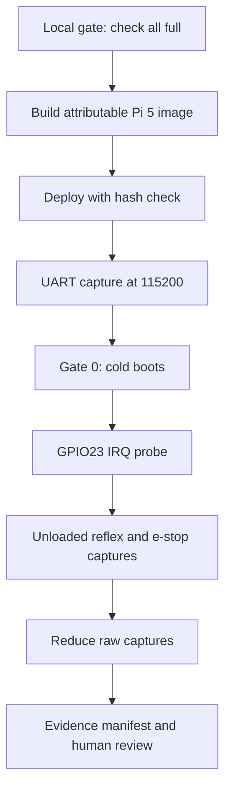

import { Callout } from 'nextra/components'

# Hardware-in-the-Loop

Relevant source files

- [docs/operations/hardware-validation-and-benchmarking.md](https://github.com/pro-utkarshM/axiomOS/blob/main/docs/operations/hardware-validation-and-benchmarking.md)
- [docs/operations/README.md](https://github.com/pro-utkarshM/axiomOS/blob/main/docs/operations/README.md)
- [scripts/hil/gate0-cold-boots.sh](https://github.com/pro-utkarshM/axiomOS/blob/main/scripts/hil/gate0-cold-boots.sh)
- [scripts/hil/gpio23-probe.sh](https://github.com/pro-utkarshM/axiomOS/blob/main/scripts/hil/gpio23-probe.sh)
- [scripts/hil/shrike-gpio23-pulse.sh](https://github.com/pro-utkarshM/axiomOS/blob/main/scripts/hil/shrike-gpio23-pulse.sh)
- [scripts/hil/v03d-estop-cycle.sh](https://github.com/pro-utkarshM/axiomOS/blob/main/scripts/hil/v03d-estop-cycle.sh)
- [scripts/hil/v03d-reduce.py](https://github.com/pro-utkarshM/axiomOS/blob/main/scripts/hil/v03d-reduce.py)
- [scripts/hil/pwm-containment-reduce.py](https://github.com/pro-utkarshM/axiomOS/blob/main/scripts/hil/pwm-containment-reduce.py)
- [scripts/benchmark/analyze-v03.py](https://github.com/pro-utkarshM/axiomOS/blob/main/scripts/benchmark/analyze-v03.py)

<Callout type="warning">
There is no hardware-in-the-loop CI. Raspberry Pi 5 testing is manual (README, issue 76). Nothing on this page runs in GitHub Actions or in `cargo xtask check all`. The hardware runbook says it does not authorize a safety-relevant robot deployment and that QEMU and RTL simulation numbers must not be converted into physical timing or safety claims.
</Callout>

## Rules from the runbook

`docs/operations/hardware-validation-and-benchmarking.md` is the canonical checklist. Key rules:

- Freeze a clean commit and do not mix artifacts from another revision.
- Keep the production Ed25519 public key offline except for exporting the 32-byte public-key file for the Pi build.
- Start with motors disconnected or mechanically unloaded, with an independently accessible physical e-stop.
- Treat an unexpected reset, kernel panic, missing serial marker, failed provenance hash, watchdog reset, PWM output while e-stop is active, or uncontrolled movement as a stop condition: remove motor power, preserve the capture, file a regression.
- Every publishable result needs a commit, command, pinned toolchain, hardware boundary, raw output, and hashes of the raw output and measured artifact.

## Flow



## Preflight and image

```bash
cargo xtask check all --profile full
scripts/verify/fpga-safety-gate.sh
export AXIOM_BPF_TRUSTED_KEY_PATH=/secure/path/axiomos-ed25519.pub
cargo xtask build rpi5 -- release embedded-rpi5
sha256sum -c target/aarch64-unknown-none/release/rpi5-artifacts.sha256
cargo xtask deploy rpi5 -- /path/to/mounted/pi-boot
```

See [Raspberry Pi 5](/axiomos/main/getting-started/raspberry-pi-5) for build and deploy detail. The runbook requires recording the boot-firmware revision on the card, since the repository does not pin it.

## Scripts in scripts/hil

These require physical equipment: a Pi 5 with debug-probe UART, a sigrok-compatible logic analyzer (`fx2lafw` by default), and for most of them a Shrike RP2040 board driven with `mpremote`. Serial ports default to specific `/dev/serial/by-id/` paths from the author's lab, so override `PI_UART` and `SHRIKE_UART`. Output goes to `RUN_DIR`, which defaults under `artifacts/runs/`.

| Script | Purpose | Image feature needed |
|--------|---------|----------------------|
| `gate0-cold-boots.sh` | Gate 0: three cold boots (`BOOTS`, default 3, `BOOT_SECONDS` default 30) graded against expected and forbidden markers from the image's `build.toml`. Expected: `PI5_BENCH_READY`, `INIT_PROCESS_STARTED`, `PI5_BOOT_OK`, `SIGNED_BPF_LOAD_OK`. Forbidden: `PI5_BENCH_FAIL`, `panic`, `fatal`, `watchdog`. `PI5_BENCH_READY` proves route initialization only | `bench` image |
| `gpio23-probe.sh` | Single-edge GPIO23 interrupt probe: capture UART plus logic analyzer and grade against `PI5_GPIO_IRQ_PROVEN`. The kernel latches the marker once per boot, so power-cycle between attempts | `bench` |
| `shrike-gpio23-static-high.sh` | Static-high electrical isolation check for Shrike GPIO22 to Pi GPIO23 (2.2 kOhm series; analyzer D0 disconnected) | `bench` |
| `shrike-gpio23-pulse.sh` | Unloaded repeated GPIO reflex capture. Shrike GP22 to Pi GPIO23, GP21 to GPIO24 (e-stop, active low), analyzer D1 on GPIO12. Runs `PULSE_COUNT` pulses (default 5) and requires `ACTUATORS_MOTORS_DISCONNECTED=YES` | `bench-reflex-rearm`; PWM mode needs `bench-pwm` or `bench-pwm-containment` |
| `v03d-estop-cycle.sh` | Unloaded e-stop capture at 24 MHz; refuses a normal bench image | `bench-estop-rearm` |
| `v03d-reduce.py` | Reduces a sigrok `.sr` capture into GPIO24-falling to GPIO12-falling latencies; requires 100 or more ordered pairs at 24 MHz, a safe final state, and a maximum under 1 ms; rejects missing or extra edges and missing re-arms | none (offline) |
| `v03b-reduce.py` | Reduces `PI5_MC` and `PI5_MA` serial lines to count, min, median, p95, p99, p99.9, max | none (offline) |
| `pwm-containment-reduce.py` | Offline unloaded PWM containment check (D0 is GPIO23, D1 is GPIO12): 50 percent baseline, clamp to 90 percent, invalid channel rejected, final LOW. Not an e-stop latency or WCET measurement | `bench-pwm-containment` |
| `flash-rpi5-gpio-diag.sh` | Flashes a retained GPIO diagnostic image to the Pi boot device and checks its hash against the image's `build.toml` | n/a |

Example, the V03-D e-stop cycle:

```bash
cargo xtask build rpi5 -- release embedded-rpi5,bench-estop-rearm
ACTUATORS_MOTORS_DISCONNECTED=YES scripts/hil/v03d-estop-cycle.sh
```

Wiring sheets live in `docs/operations/wiring/` (Pi 5 UART, unloaded e-stop, unloaded PWM).

<Callout type="info">
Bench images use a bounded deferred console. Any `PI5_BENCH_LOG_LOSS dropped_records=N` marker invalidates serial-derived evidence. `PI5_BENCH_TIMING` endpoints are software endpoints (M-C is GPIO handler stamp to local output write; M-B ends after local safe writes). They are not physical-edge-to-motor measurements; capture electrically for that claim.
</Callout>

## Staged checklist

The runbook's section 4 proceeds in order, with a retained capture and explicit pass decision before the next stage:

1. Kernel and rootfs: boot markers (`INIT_PROCESS_STARTED`, `SIGNED_BPF_LOAD_OK`), no panic, page fault, reboot loop or watchdog reset.
2. GPIO, timer and BPF dispatch with actuators disconnected: at least 100 injections per edge type, recording successes, drops and unexpected routes; e-stop assertion leaves PWM disabled.
3. Shrike control link and RP2040: control-link framing, watchdog and fail-safe, invalid frames, link loss. `V04_CHUNK` tracing needs the `trace-control-link` feature.
4. Final PWM safety gate: FPGA board, bitstream hash, logic-analyzer probing of both PWM outputs at and beyond the plus or minus 800 per-mille limit. The powered actuator test comes only after the unloaded tests and is deferred in the electronics campaign.
5. One-hour pilot, then 24-hour unloaded electronics soak with complete-coverage raw capture. The runbook says the current short-capture scripts and V04 reducer do not alone qualify this full-duration oracle.

A passing run is reported as "24-hour unloaded electronics acceptance", which unlocks runtime development under the hardware-first plan but does not check off the powered pilot or robot soak.

## Benchmark campaigns

| Campaign | Command | Notes |
|----------|---------|-------|
| Host verifier baseline | `cargo bench --locked -p kernel_bpf --bench verifier --features embedded-profile` | Record executable and raw-log hashes; only Criterion intervals present in raw output are publishable |
| Pi 5 verifier cost | `cargo xtask bench verifier -- LOG -o CSV --plot PNG --cntfrq HZ` | Needs a separate `verifier-cost` image and `/bin/verifier_bench`; see [Benchmarks](/axiomos/main/userspace/benchmarks) |
| GPIO-to-actuation and e-stop latency | `bench` image plus logic analyzer | Report sample count, min, median, p95, p99, max, trigger config, analyzer sample rate and excluded samples; repeat after cold boot, warm boot and load |

Kernel benches exist in `kernel/crates/kernel_bpf/benches/` (`verifier.rs`, `interpreter.rs`, `maps.rs`). Reducers `scripts/benchmark/analyze-v03.py`, `analyze-v04.py` and `v04-behavior-runner.py` process retained captures; the gate runs self-tests for the reducers but not the physical campaigns.

## Evidence review

Raw UART logs, analyzer exports, CSV and plots, command transcripts, and hardware, firmware and bitstream hashes go into a retained campaign directory with a provenance manifest under `docs/performance/evidence/COMMIT/`. Failures are linked to issues, not deleted. `python3 -B scripts/verify/benchmark-provenance.py` and the full local gate run after adding evidence, and a human reviews wiring, stop-condition results and the manifest before any new tag or hardware claim. Completing the checklist does not by itself close the outstanding HIL, soak, secure-boot, SMP or runtime-evolution issues.
