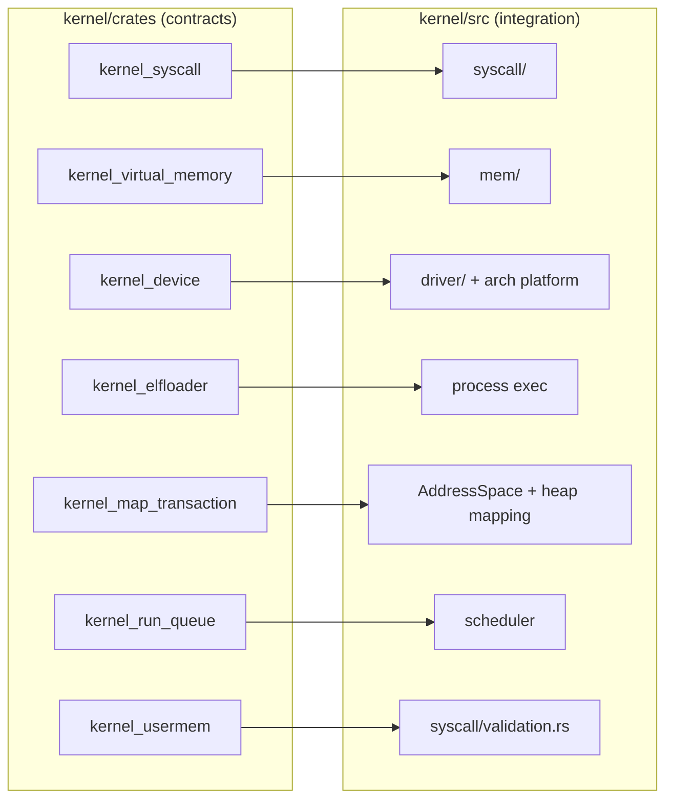

# Kernel Crate Boundaries

**Relevant source files**

- [docs/architecture/kernel-crate-boundaries.md](https://github.com/pro-utkarshM/axiomOS/blob/feat/v0.5-runtime/docs/architecture/kernel-crate-boundaries.md)
- [kernel/Cargo.toml](https://github.com/pro-utkarshM/axiomOS/blob/feat/v0.5-runtime/kernel/Cargo.toml)
- [kernel/crates](https://github.com/pro-utkarshM/axiomOS/tree/feat/v0.5-runtime/kernel/crates)
- [ci/manifests/components.toml](https://github.com/pro-utkarshM/axiomOS/blob/feat/v0.5-runtime/ci/manifests/components.toml)
- [docs/reference/generated/components.md](https://github.com/pro-utkarshM/axiomOS/blob/feat/v0.5-runtime/docs/reference/generated/components.md)
- [docs/reference/component-naming.md](https://github.com/pro-utkarshM/axiomOS/blob/feat/v0.5-runtime/docs/reference/component-naming.md)

`kernel/crates/kernel_*` and `kernel/src` have different ownership roles, and a pair must never independently implement the same policy or state transition.

## Boundary rules

- `kernel/crates/kernel_*` holds reusable, policy-free contracts and host-testable algorithms where practical.
- `kernel/src` composes those contracts with architecture, process, scheduler, memory and device integration.
- A **crate is canonical** when its public contract is consumed directly by both host tests and kernel integration; `kernel/src` then supplies adapters only.
- A **`kernel/src` module is canonical** when it owns platform state or lifecycle; a similarly named crate must stay a narrow contract or be retired.
- Error, ownership, rollback, protection and fault semantics belong in the canonical layer and must not be silently weakened by an adapter.
- New extraction work must name the canonical side, list the adapter boundary, and add a static or host test that prevents duplicate policy from returning.

## Integration pairs

| Reusable contract | Kernel integration |
|---|---|
| `kernel_syscall` | `kernel/src/syscall/` |
| `kernel_virtual_memory` | `kernel/src/mem/` |
| `kernel_device` | `kernel/src/driver/` and architecture platform code |
| `kernel_elfloader` | process exec / image loading |
| `kernel_map_transaction` | address-space and heap mapping |
| `kernel_run_queue` | scheduler task ownership and CPU selection |
| `kernel_usermem` | `kernel/src/syscall/validation.rs` (user-copy adapter) |

## Crate inventory

Roles and gates come from the generated [component inventory](https://github.com/pro-utkarshM/axiomOS/blob/feat/v0.5-runtime/docs/reference/generated/components.md).

| Crate | Role | Required gate |
|---|---|---|
| `kernel_abi` | Public userspace ABI (syscall numbers, errno, BPF command and attach numbers, `fcntl`, `mman`, time, uio). On the branch it adds `managed.rs` (managed administration commands 256 to 269, request/response structs, `MANAGED_TARGET_*`, slot and operation states) and `recorder.rs` (recorder status/read ABI), plus `BPF_CAP_BEHAVIOR_ADMIN`, `ManagedControlContextV1` and helper 1009 | host lint and tests |
| `kernel_bpf` | BPF runtime: loader, verifier, maps, interpreter, signing, profiles, attach, actuation. Branch additions: `signing/managed.rs` (AXMB bundle authentication), `verifier/managed.rs` and `verifier/budget.rs` (typed managed verification and fallible buffer budgets), `actuation/recorder.rs` (recorder retention core) | cloud/embedded lint, tests, Miri |
| `kernel_devfs` | Device filesystem (`/dev`) | host lint and tests |
| `kernel_device` | Device contracts (block, raw) | host lint and tests |
| `kernel_elfloader` | ELF loader | host lint, tests, fuzz |
| `kernel_map_transaction` | `map_range` rollback bookkeeping | host lint and tests |
| `kernel_memapi` | Mapped-memory contract | host lint and tests (interface-only) |
| `kernel_pci` | PCI configuration contracts | host lint and tests |
| `kernel_physical_memory` | Sparse physical frame manager, fault injection | host lint and tests |
| `kernel_run_queue` | Per-CPU runnable queue core (Cordyceps MPSC queues, bounded steal) | host lint, tests, Loom model |
| `kernel_syscall` | Syscall contracts (access, fcntl, malloc, mman, stat, unistd, user pointers) | host lint and tests |
| `kernel_time` | Clock conversion and deadline queues; `periodic.rs` adds the absolute `PeriodicSchedule` used by the managed timer, plus `checked_frequency_ticks_to_nanoseconds` | host lint and tests |
| `kernel_usermem` | Fault-safe user-memory access contract (audit finding C-01) | host lint and tests |
| `kernel_vfs` | Virtual filesystem and path types | host lint and tests |
| `kernel_virtual_memory` | Virtual-memory segment allocator | host lint and tests |
| `shrike_link` | Pi 5 to Shrike-lite UART control-link codec, session, watchdog (`no_std`, zero-dep). Branch additions: `handoff.rs` (safe barrier/acknowledgement and requalification state), `installer.rs` (framed debug-UART installer codec shared by `rk runtime` and the in-guest installer) | host lint and tests |

`kernel/crates/kernel_wait_channel_tests` contains host tests for the wait-channel protocol; it has no library crate of its own.

## Naming contract

| Prefix / suffix | Meaning |
|---|---|
| `kernel_*` | Internal reusable kernel crate |
| `axiom_*` / `axiomos-*` | Host-side repository or shipped axiomos tooling |
| `rk_*` | Runtime-kit tools and services |
| `shrike_*` | Hardware or firmware components |
| `*_demo` | Demonstration program or crate |
| `*_bench` | Benchmark program or crate |
