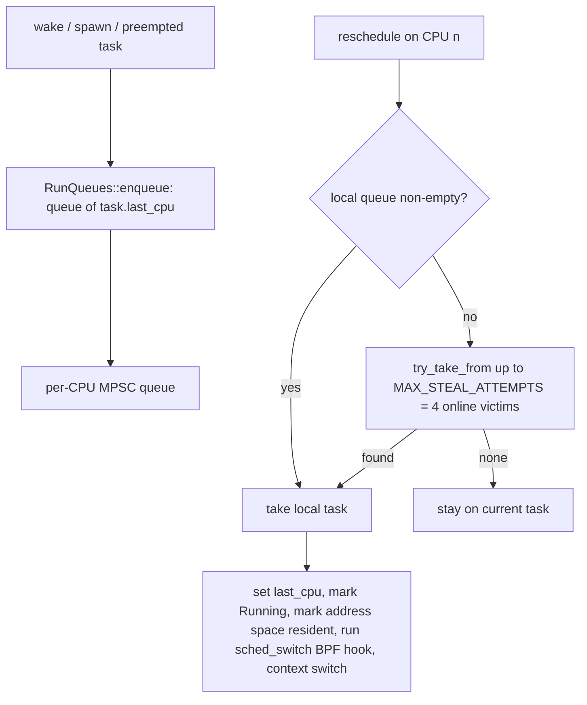
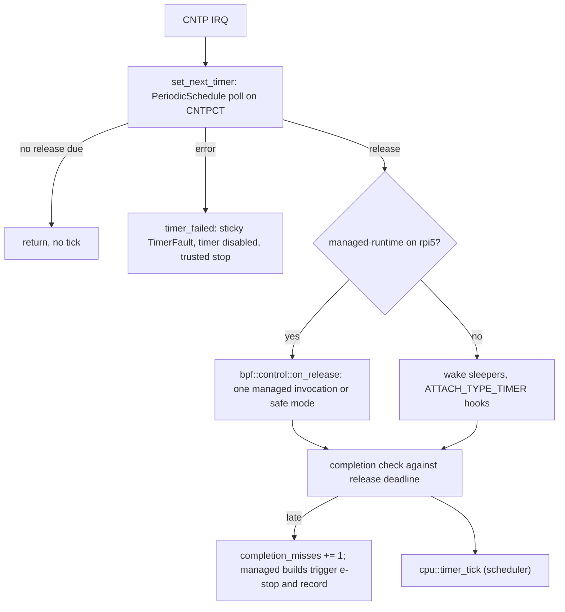

import { Callout } from 'nextra/components'

# Scheduling & Locking

**Relevant source files**

- [docs/decisions/0001-runtime-scheduling-locking.md](https://github.com/pro-utkarshM/axiomOS/blob/feat/v0.5-runtime/docs/decisions/0001-runtime-scheduling-locking.md)
- [kernel/src/mcore/mod.rs](https://github.com/pro-utkarshM/axiomOS/blob/feat/v0.5-runtime/kernel/src/mcore/mod.rs)
- [kernel/src/mcore/mtask/scheduler/mod.rs](https://github.com/pro-utkarshM/axiomOS/blob/feat/v0.5-runtime/kernel/src/mcore/mtask/scheduler/mod.rs)
- [kernel/src/mcore/mtask/scheduler/run_queue.rs](https://github.com/pro-utkarshM/axiomOS/blob/feat/v0.5-runtime/kernel/src/mcore/mtask/scheduler/run_queue.rs)
- [kernel/src/mcore/mtask/scheduler/wait_channel.rs](https://github.com/pro-utkarshM/axiomOS/blob/feat/v0.5-runtime/kernel/src/mcore/mtask/scheduler/wait_channel.rs)
- [kernel/src/mcore/mtask/scheduler/wait_protocol.rs](https://github.com/pro-utkarshM/axiomOS/blob/feat/v0.5-runtime/kernel/src/mcore/mtask/scheduler/wait_protocol.rs)
- [kernel/src/mcore/mtask/scheduler/sleep.rs](https://github.com/pro-utkarshM/axiomOS/blob/feat/v0.5-runtime/kernel/src/mcore/mtask/scheduler/sleep.rs)
- [kernel/src/mcore/mtask/task/state.rs](https://github.com/pro-utkarshM/axiomOS/blob/feat/v0.5-runtime/kernel/src/mcore/mtask/task/state.rs)
- [kernel/crates/kernel_run_queue/src](https://github.com/pro-utkarshM/axiomOS/tree/feat/v0.5-runtime/kernel/crates/kernel_run_queue/src)
- [kernel/src/arch/aarch64/interrupts.rs](https://github.com/pro-utkarshM/axiomOS/blob/feat/v0.5-runtime/kernel/src/arch/aarch64/interrupts.rs)
- [kernel/src/syscall/mod.rs](https://github.com/pro-utkarshM/axiomOS/blob/feat/v0.5-runtime/kernel/src/syscall/mod.rs)
- [kernel/crates/kernel_time/src/periodic.rs](https://github.com/pro-utkarshM/axiomOS/blob/feat/v0.5-runtime/kernel/crates/kernel_time/src/periodic.rs)
- [kernel/src/mcore/context.rs](https://github.com/pro-utkarshM/axiomOS/blob/feat/v0.5-runtime/kernel/src/mcore/context.rs)
- [kernel/src/bpf/control.rs](https://github.com/pro-utkarshM/axiomOS/blob/feat/v0.5-runtime/kernel/src/bpf/control.rs)
- [kernel/src/bpf/preparation.rs](https://github.com/pro-utkarshM/axiomOS/blob/feat/v0.5-runtime/kernel/src/bpf/preparation.rs)

The runtime rules are normative in [ADR-0001](/axiomos/v0.5-runtime/decisions/adr-0001-scheduling-locking). This page describes what the code on the `feat/v0.5-runtime` branch implements and where it still differs from the ADR. The run queue, wait protocol and lock ranks are unchanged from `main`; the AArch64 timer and the managed-runtime execution path are new.

## Tasks and states

A `Task` (`kernel/src/mcore/mtask/task`) belongs to a `Process` and is in one of `Ready`, `Running`, `Sleeping`, `Waiting` or `Finished`. Each CPU has an `ExecutionContext` holding its current task; the boot CPU becomes an idle task via `mcore::turn_idle()` (`hlt` / `wfi` loop).

## Per-CPU run queues

`kernel_run_queue` is the host-testable core shared by production and model tests: Cordyceps MPSC queues, a local-first dequeue policy, a rotating victim cursor, and a bounded steal loop.

- `victim_at(online_mask, local_cpu, ordinal)` excludes the local CPU and wraps over online CPUs, so one dequeue probes at most four real queues. A failed steal never spins on another CPU's queue.
- No runnable task may be present in more than one queue; exact-once ownership is a Loom/model-test obligation.

## The reschedule path

`reschedule` ([scheduler/mod.rs](https://github.com/pro-utkarshM/axiomOS/blob/feat/v0.5-runtime/kernel/src/mcore/mtask/scheduler/mod.rs)) asserts interrupts are disabled, then:

1. Disposes of the previous ("zombie") task: terminate-pending tasks go to `TaskCleanup`, `Sleeping` tasks to `TaskSleep`, `Waiting` tasks are parked through their wait registration, otherwise the task is marked ready and re-enqueued.
2. Dequeues the next task (local first, then bounded steal). If none, it returns without switching.
3. Records `last_cpu`, marks the task running, marks its address space resident on this CPU, and fetches CR3 (x86_64) or TTBR0 (AArch64). On x86_64 it updates the TSS `rsp0` to the next task's kernel stack.
4. Builds a `SchedSwitchContext` (`cpu_id`, `prev_pid`, `prev_tid`, `next_pid`, `next_tid`) and runs BPF programs attached to `ATTACH_TYPE_SCHED_SWITCH`.
5. Saves FPU state (`fxsave` on x86_64), restores TLS (`FsBase` or `TPIDR_EL0`), and hands the old/new stack pointers and page-table root to the assembly switch.

## Timer tick

On x86_64 the tick comes from the LAPIC (`kernel/src/mcore/lapic.rs`) and is unchanged.

On AArch64 the branch replaces the relative "re-arm `cntfrq / 100` ahead" tick with an **absolute 100 Hz release grid**. `kernel_time::periodic::PeriodicSchedule` advances `next_deadline += period` from a one-time start, numbers every release, and on each poll returns at most the latest due release. Releases skipped while the CPU was late are counted (`missed`, `late`, `max_wake_lateness`) instead of being replayed as a catch-up burst. Reversed clocks and counter exhaustion reject without changing the schedule.

- `init_timer` now runs from `kernel_main` after CPU0's execution context exists and immediately before IRQs are enabled; a failure is the new `timer-initialization` boot error. Architecture init only clears the timer interrupt.
- The first failure (`Busy`, `NotStarted`, `AlreadyStarted`, `InvalidPeriod`, `ClockReversed`, `Exhausted`, `Stopped`, `ManagedControl`) is latched in a sticky `TIMER_FAULT`. It disables the timer and invokes the trusted stop path; a pending IRQ cannot rearm it.
- `timer_snapshot()` exposes the release statistics, the last release, completion misses and the fault code without blocking (`try_lock` under masked IRQs). Version-2 recorder status reports these cumulative counters.
- Completion accounting ends before EOI and scheduler dispatch, so it does not cover the whole interrupt path.
- In `managed-runtime` images the timer does not run generic `TIMER` fanout or timer diagnostics, and does not log. See [Executor](/axiomos/v0.5-runtime/runtime/executor).

## Managed-runtime execution context

The managed runtime (opt-in `managed-runtime` feature) adds two execution contexts with strict separation of work:

| Context | May do | Must not do |
|---|---|---|
| Timer IRQ release on Pi 5 CPU0 | Borrow the exclusive control slot with `try_lock` once, freeze one sensor sample, invoke one verified instance, submit one motor pair under the IRQ-masked link lock, append bounded recorder records | Take `BPF_MANAGER`, allocate, destroy artifacts, wait for readers, drain the UART, run IIO fanout, format output |
| Permanent preparation worker (a root-process kernel task using the existing wait queue) | Authenticate, verify, build fresh instances, stage installations, release and refund retired objects, with IRQs enabled outside short commit sections | Run in a syscall or receive critical section |

The control-slot lock is a new lock taken **before** the BPF manager lock, with local IRQs masked. Global lifecycle helpers require Pi 5 CPU0 with only CPU0 online. While a managed role owns the wheel pair, legacy BPF mutation syscalls reject (including consuming ring-buffer reads). Legacy AArch64 syscall dispatch stays IRQ-masked and outside the qualified timing workload; the branch does not rewrite syscall preemption.

`mcore::context::with_interrupts_masked` is now a free function usable before any execution context exists; the global allocator uses it (see [Memory](/axiomos/v0.5-runtime/architecture/memory)).

## Waiting and sleeping

`WaitChannel` is one lock-free primitive shared by timer, child-exit and pipe events. It owns a `WaitEpoch` (a generation counter), a `DrainGate`, and a sink of parked items. Waiters subscribe, observe the current generation, then park via a `WaitRegistration`; publishers call `wake_all`. Wake, cancellation and exit are generation-checked so a wake published between "check condition" and "park" is not lost.

`sys_nanosleep` computes a monotonic deadline, calls `task.begin_sleep(deadline)` and reschedules with interrupts masked; it returns `EINTR` with the remaining time if woken early (for example by `SYS_INTERRUPT_SLEEP`).

## Interrupt and preemption rules (ADR-0001)

- Context-switch preparation runs with local interrupts masked and an exclusive, non-escaping scheduler borrow that ends before assembly transfers control. No blocking, allocation, filesystem operation or unbounded retry is allowed there.
- Interrupt handlers never sleep, allocate, take a blocking lock, do filesystem I/O, or log synchronously. They may update bounded per-CPU state, publish a wake event and request rescheduling.
- Task-context code registers a wait while holding the producer's condition lock, transitions to waiting, releases the lock, and only then reschedules.
- Release builds compile all `log` macros out. Serial evidence for the audit gate needs `audit-diagnostics`; raw AArch64 UART probes need `bringup-diagnostics`. Neither is in a shipped profile.

## Lock ranks

Locks are acquired in strictly increasing rank (except a documented same-rank shard rule). The scheduler may consume owned handles prepared at lower ranks but must not acquire a lower-ranked lock while holding scheduler state; queue publication and wake APIs therefore take owned values rather than callbacks.

| Rank | Class |
|---:|---|
| 10 | Process tree and global registries |
| 20 | Process lifecycle and file-descriptor tables |
| 30 | Address-space and memory-region state |
| 40 | VFS namespace and filesystem state |
| 50 | File, pipe and device object state |
| 60 | BPF manager mutation state |
| 70 | BPF map and execution leases |
| 80 | Per-CPU scheduler / run-queue state |
| 90 | Per-CPU trace and interrupt bookkeeping |

<Callout type="warning">
**Implementation gaps.** The ADR says debug/test builds assert the held-rank stack and that preemption-disabled sections nest through a CPU-local counter. A search of `kernel/src` on `main` finds no lock-rank assertion or preemption-count primitive, so treat those two items as policy enforced by review (the README also lists the missing `preempt_disable` primitive as issue #62). The reschedule IPI (decision 2) is explicitly **not implemented**: a remote wakeup enqueues to `last_cpu` and runs when that CPU next reschedules. Priority inheritance on kernel mutexes is also absent (#60).
</Callout>

## Future reschedule-IPI contract

ADR-0001 fixes the contract an IPI implementation must follow before it may land:

1. Destination policy belongs to the scheduler; the APIC/GIC layer only transports a bounded, non-blocking `request_reschedule(cpu)`.
2. One scheduler-owned pending bit per target coalesces notifications; only the clear-to-set transition sends an IPI, and queue publication happens-before notification.
3. The handler only acknowledges and latches a CPU-local reschedule request.
4. The target clears the pending bit only at a scheduler boundary and then rechecks its queue (clear-then-recheck prevents lost wakeups).
5. Masking delays delivery, not publication.

It may be implemented only after a required SMP-4 regression (planned `qemu-smp4-scheduler-smoke`, not yet landed) passes **and** a repeatable measurement shows the no-IPI behavior misses an accepted wakeup-latency objective.
