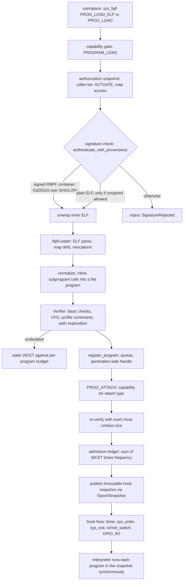
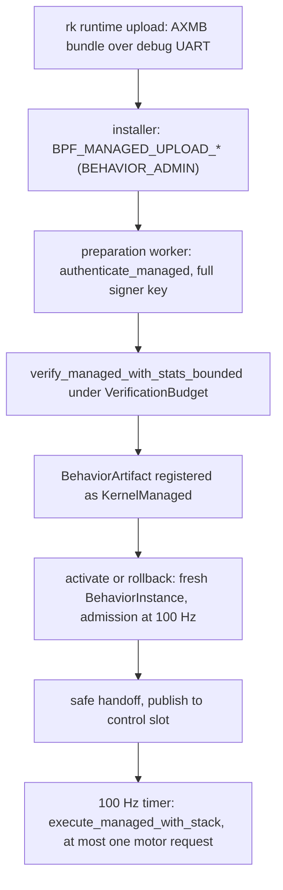

import { Callout } from 'nextra/components'

# eBPF Subsystem

Relevant source files

- [kernel/crates/kernel_bpf/README.md](https://github.com/pro-utkarshM/axiomOS/blob/feat/v0.5-runtime/kernel/crates/kernel_bpf/README.md)
- [kernel/crates/kernel_bpf/src/lib.rs](https://github.com/pro-utkarshM/axiomOS/blob/feat/v0.5-runtime/kernel/crates/kernel_bpf/src/lib.rs)
- [kernel/crates/kernel_bpf/docs/ARCHITECTURE.md](https://github.com/pro-utkarshM/axiomOS/blob/feat/v0.5-runtime/kernel/crates/kernel_bpf/docs/ARCHITECTURE.md)
- [kernel/crates/kernel_bpf/docs/PROFILES.md](https://github.com/pro-utkarshM/axiomOS/blob/feat/v0.5-runtime/kernel/crates/kernel_bpf/docs/PROFILES.md)
- [kernel/src/bpf/mod.rs](https://github.com/pro-utkarshM/axiomOS/blob/feat/v0.5-runtime/kernel/src/bpf/mod.rs)
- [kernel/src/syscall/bpf.rs](https://github.com/pro-utkarshM/axiomOS/blob/feat/v0.5-runtime/kernel/src/syscall/bpf.rs)
- [docs/security/bpf-trust.md](https://github.com/pro-utkarshM/axiomOS/blob/feat/v0.5-runtime/docs/security/bpf-trust.md)
- [kernel/src/syscall/managed.rs](https://github.com/pro-utkarshM/axiomOS/blob/feat/v0.5-runtime/kernel/src/syscall/managed.rs)
- [kernel/src/bpf/managed.rs](https://github.com/pro-utkarshM/axiomOS/blob/feat/v0.5-runtime/kernel/src/bpf/managed.rs)
- [docs/security/managed-bundle-v1.md](https://github.com/pro-utkarshM/axiomOS/blob/feat/v0.5-runtime/docs/security/managed-bundle-v1.md)
- [docs/decisions/0004-bpf-jit-policy.md](https://github.com/pro-utkarshM/axiomOS/blob/feat/v0.5-runtime/docs/decisions/0004-bpf-jit-policy.md)

The axiomOS eBPF subsystem lets user-supplied, verified bytecode run synchronously inside kernel hooks (timer tick, syscall entry and exit, scheduler switch, GPIO and IIO events). On `feat/v0.5-runtime` it also hosts a second, separate program plane: signed **managed controllers** that are uploaded after boot, prepared by a kernel worker and executed once per 100 Hz release by an exclusive control slot, outside ordinary hook fanout (see [Runtime](/axiomos/v0.5-runtime/runtime)). The subsystem is split into a `no_std` library crate, `kernel_bpf`, that provides mechanisms (loader, verifier, interpreter, maps, signing, actuation policy) and a kernel-side integration layer, `kernel/src/bpf`, that owns policy (authorization, quotas, handles, hook snapshots).

Execution is interpreter-only. No shipped profile enables a JIT (see [Execution and JIT](/axiomos/v0.5-runtime/bpf/jit-and-execution)).

## Crate layout

| Location | Role |
|---|---|
| `kernel/crates/kernel_bpf/src/bytecode` | Raw instructions, opcodes, registers, and the `BpfProgram` / `VerifiedProgram` representations |
| `kernel/crates/kernel_bpf/src/loader` | ELF64 parser, relocations, subprogram call normalization |
| `kernel/crates/kernel_bpf/src/verifier` | CFG, register/stack state, tnum, pruning, liveness, helper registry, WCET cost model, admission ledger; `budget.rs` (fallible, byte-charged verifier buffers) and `managed.rs` (managed contract, `ManagedProgram`, `BehaviorArtifact`) are new on this branch |
| `kernel/crates/kernel_bpf/src/execution` | Interpreter (including the capture-only managed entry `execute_managed_with_stack`), `BpfContext`, hook context structs; non-shipped compilers |
| `kernel/crates/kernel_bpf/src/maps` | Array, hash, ring buffer, time-series maps |
| `kernel/crates/kernel_bpf/src/attach` | Attach metadata types (GPIO, IIO, PWM, kprobe, tracepoint) and the GPIO route table |
| `kernel/crates/kernel_bpf/src/signing` | Legacy signed container (`RBPF`) and, new on this branch, the canonical managed bundle (`AXMB`, `signing/managed.rs`); Ed25519 verification |
| `kernel/crates/kernel_bpf/src/profile` | `CloudProfile` and `EmbeddedProfile` constants |
| `kernel/crates/kernel_bpf/src/actuation` | ARM-A actuation reference monitor decision core; `recorder.rs` holds the bounded runtime recorder retention core |
| `kernel/crates/kernel_bpf/src/concurrency` | `EpochSnapshot` used to publish hook snapshots |
| `kernel/src/bpf` | `BpfManager`, `authorization`, `handles`, `limits`, `trust`, `snapshot`, `helpers`; new managed modules `managed`, `managed_allocation`, `preparation` (upload and lifecycle worker), `installation`, `control` (exclusive control slot) and `recorder` |
| `kernel/src/syscall/bpf.rs` | `sys_bpf` command dispatch and capability gating; managed commands are routed to `kernel/src/syscall/managed.rs` before the legacy size gate |
| `kernel/crates/kernel_abi/src/bpf.rs` | Command, map type, attach type, helper and capability constants shared with userspace |
| `kernel/crates/kernel_abi/src/managed.rs`, `recorder.rs` | Versioned managed administration and recorder request layouts (commands 256 to 269) |

Tests and tooling live in `kernel/crates/kernel_bpf/tests` (integration, profile contracts, semantic consistency, concurrency model), `kernel/crates/kernel_bpf/fuzz` (four libfuzzer targets: `verify_only`, `verify_then_exec`, `signed_container`, `ringbuf_sequences`), and `kernel/crates/kernel_bpf/benches`.

## Build-time profiles

Exactly one of the `cloud-profile` or `embedded-profile` features must be enabled on `kernel_bpf`; enabling both or neither is a `compile_error!`. The profile is exposed as the `ActiveProfile` type alias.

| Constant | Cloud | Embedded |
|---|---:|---:|
| Stack | 512 KiB | 8 KiB |
| Max instructions | 1,000,000 | 100,000 |
| Per-map profile budget | 0 (kernel quotas only) | 64 KiB |
| `JIT_ALLOWED` | false | false |
| Per-program WCET budget | unbounded | 10 ms period at 6 ns per unit (about 1,666,666 units) |
| Utilization budget | unbounded | 500,000,000 ns per second |
| Map resize methods | compiled | erased |

On this branch the embedded `RT_PERIOD_NS` changed from 1,000,000 (1 kHz) to 10,000,000 (100 Hz), matching the managed executor, and `CYCLE_UNIT_NS = 6` is described as a provisional model value pending shipped-interpreter calibration. See [PROFILES.md](https://github.com/pro-utkarshM/axiomOS/blob/feat/v0.5-runtime/kernel/crates/kernel_bpf/docs/PROFILES.md) for the normative table.

## Load-to-fire pipeline

This is the legacy plane. Managed controllers take a different path:

Key properties, each described in detail on the linked pages:

- Only verifier-produced `VerifiedProgram` values can reach the interpreter ([Verifier](/axiomos/v0.5-runtime/bpf/verifier)).
- Raw instruction loads carry no signature and are rejected whenever signature enforcement is active ([Trust Model](/axiomos/v0.5-runtime/bpf/trust-model)).
- Attach re-runs verification with the exact payload size for the hook and forbids logging helpers on latency-sensitive hooks ([Hooks](/axiomos/v0.5-runtime/bpf/hooks)).
- Hook dispatch reads a fixed-capacity immutable snapshot and takes no manager lock ([Hooks](/axiomos/v0.5-runtime/bpf/hooks)).
- A legacy ELF must contain exactly one program and no map declarations, and unsupported or malformed relocations are rejected before publication ([Loader](/axiomos/v0.5-runtime/bpf/loader)).
- `ManagedProgram` has no conversion to a legacy program, so managed code cannot enter ordinary hooks or a JIT; managed private maps are not reachable through legacy map APIs ([Trust Model](/axiomos/v0.5-runtime/bpf/trust-model)).

## Honest scope notes

<Callout type="warning">
The crate documentation states that the embedded profile does not provide an EDF BPF scheduler or a static allocator: admission is a utilization ledger, and all maps use checked heap allocation. Performance figures quoted in source comments (for example the 6 ns per WCET unit calibration) come from historical benchmark records; the source itself notes they are not claimed as current artifact-backed measurement. On this branch the cost-model comments were rewritten to say the weights are retained model values that do not qualify the shipped interpreter; v0.5 requires a retained Pi 5 interpreter corpus before they become a timing claim. This documentation does not restate them as current results.
</Callout>

## Page map

- [Loader](/axiomos/v0.5-runtime/bpf/loader): ELF parsing, relocations, subprograms, `sys_bpf` commands
- [Verifier](/axiomos/v0.5-runtime/bpf/verifier): safety analysis, WCET, admission, limits
- [Execution and JIT](/axiomos/v0.5-runtime/bpf/jit-and-execution): interpreter, JIT policy
- [Hooks](/axiomos/v0.5-runtime/bpf/hooks): attach types and dispatch
- [Maps and Helpers](/axiomos/v0.5-runtime/bpf/maps-and-helpers): map types and helper table
- [Trust Model](/axiomos/v0.5-runtime/bpf/trust-model): signing, authorization, handles, quotas, managed ownership
- [Runtime](/axiomos/v0.5-runtime/runtime): managed bundles, lifecycle, executor, handoff, installer and recorder
