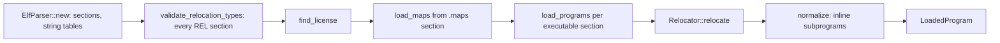

import { Callout } from 'nextra/components'

# Loader

Relevant source files

- [kernel/crates/kernel_bpf/src/loader/mod.rs](https://github.com/pro-utkarshM/axiomOS/blob/feat/v0.5-runtime/kernel/crates/kernel_bpf/src/loader/mod.rs)
- [kernel/crates/kernel_bpf/src/loader/elf.rs](https://github.com/pro-utkarshM/axiomOS/blob/feat/v0.5-runtime/kernel/crates/kernel_bpf/src/loader/elf.rs)
- [kernel/crates/kernel_bpf/src/loader/reloc.rs](https://github.com/pro-utkarshM/axiomOS/blob/feat/v0.5-runtime/kernel/crates/kernel_bpf/src/loader/reloc.rs)
- [kernel/crates/kernel_bpf/src/loader/normalize.rs](https://github.com/pro-utkarshM/axiomOS/blob/feat/v0.5-runtime/kernel/crates/kernel_bpf/src/loader/normalize.rs)
- [kernel/crates/kernel_bpf/src/loader/error.rs](https://github.com/pro-utkarshM/axiomOS/blob/feat/v0.5-runtime/kernel/crates/kernel_bpf/src/loader/error.rs)
- [kernel/src/syscall/bpf.rs](https://github.com/pro-utkarshM/axiomOS/blob/feat/v0.5-runtime/kernel/src/syscall/bpf.rs)
- [kernel/crates/kernel_abi/src/bpf.rs](https://github.com/pro-utkarshM/axiomOS/blob/feat/v0.5-runtime/kernel/crates/kernel_abi/src/bpf.rs)
- [kernel/src/syscall/managed.rs](https://github.com/pro-utkarshM/axiomOS/blob/feat/v0.5-runtime/kernel/src/syscall/managed.rs)
- [kernel/crates/kernel_abi/src/managed.rs](https://github.com/pro-utkarshM/axiomOS/blob/feat/v0.5-runtime/kernel/crates/kernel_abi/src/managed.rs)
- [kernel/src/bpf/mod.rs](https://github.com/pro-utkarshM/axiomOS/blob/feat/v0.5-runtime/kernel/src/bpf/mod.rs)
- [userspace/tools/bpf_loader/src/main.rs](https://github.com/pro-utkarshM/axiomOS/blob/feat/v0.5-runtime/userspace/tools/bpf_loader/src/main.rs)
- [userspace/tools/signed_bpf_loader/src/main.rs](https://github.com/pro-utkarshM/axiomOS/blob/feat/v0.5-runtime/userspace/tools/signed_bpf_loader/src/main.rs)

The loader is a libbpf-free ELF64 reader. It turns an ELF object into one or more `LoadedProgram` values (flat instruction vectors with a program type) plus map definitions. It does not verify anything; verification is the next stage ([Verifier](/axiomos/v0.5-runtime/bpf/verifier)).

The ELF loader serves only the legacy plane. Managed controllers are not ELF: they arrive as canonical `AXMB` bundles of normalized raw instructions with fixed local bindings and no relocation step ([Managed Bundles](/axiomos/v0.5-runtime/runtime/managed-bundles)).

## Stages

### ELF parsing

`ElfParser::new` rejects data shorter than 64 bytes, a bad magic, a non-64-bit class, an unknown endianness byte, and any `e_machine` other than `EM_BPF` (247). Both little- and big-endian ELF files are parsed. Errors are typed in `LoadError` (for example `ElfTooSmall`, `InvalidMagic`, `UnsupportedClass`, `UnsupportedMachine`, `SectionOutOfBounds`, and the new `UnsupportedRelocationType(u32)`).

Section parsing is stricter on this branch (commit `3438690`, "reject ambiguous legacy ELF composition"):

- A second `SHT_SYMTAB` section is rejected (`InvalidRelocation`).
- Any `SHT_RELA` section is rejected (`InvalidRelocation`); only `SHT_REL` is supported.
- The section-header string table (when `e_shstrndx` is nonzero) and the symbol table's linked string table must exist, be `SHT_STRTAB`, and lie within the file using checked arithmetic; otherwise `InvalidStringTable`. Previously an out-of-range table was silently skipped.
- A symbol table whose size is not a multiple of 24 bytes is rejected.

The loader enforces per-object counts: the defaults are 8 programs and 16 maps on the embedded profile, and 64 programs and 128 maps on the cloud profile (`TooManyPrograms`, `TooManyMaps`).

### Map definitions

Map definitions are read from a `.maps` section as fixed 20-byte records (`type`, `key_size`, `value_size`, `max_entries`, `flags`, each a native-endian `u32`). The loader recognises these raw type numbers: 0 unspec, 1 hash, 2 array, 3 prog array, 4 perf event array, 5 per-CPU hash, 6 per-CPU array, 7 stack trace, 8 cgroup array, and 27 ring buffer; types 9, 10 and 11 (LRU hash, LRU per-CPU hash, LPM trie) exist only in cloud builds. Anything else is `UnsupportedMapType`.

<Callout type="info">
Recognising a map type in an ELF definition is separate from being creatable at runtime. The kernel manager only creates hash, array, ring buffer and time-series maps (see [Maps and Helpers](/axiomos/v0.5-runtime/bpf/maps-and-helpers)). BTF-defined maps are not parsed: the source carries a TODO for BTF parsing on the cloud profile.
</Callout>

### Program sections and types

Executable sections (`SHF_EXECINSTR`) are treated as programs. If at least one executable section is not named `.text` or `text`, those two names are considered subprogram sections and are skipped as entry points. The program type is derived from the section name prefix:

| Section prefix | `BpfProgType` |
|---|---|
| `socket`, `sk_` | SocketFilter |
| `kprobe`, `kretprobe`, `fentry`, `fexit` | Kprobe |
| `tracepoint`, `tp/`, `raw_tracepoint`, `raw_tp/`, `iter/` | Tracepoint |
| `xdp` | Xdp |
| `perf_event` | PerfEvent |
| `cgroup` | CgroupSkb |
| `sched_cls`, `tc` | SchedCls |
| `lwt_` | LwtIn |
| anything else | SocketFilter (default) |

The program type does not select the hook: the attach type passed to `BPF_PROG_ATTACH` does (see [Hooks](/axiomos/v0.5-runtime/bpf/hooks)).

`BpfManager::load_program_authorized` now goes through `legacy_elf_entry`, which requires the parsed object to contain **exactly one program and zero map definitions**; anything else fails with `NotLoaded` before quotas are charged or a handle is published. On `main` the manager silently took the first program and ignored map declarations it could not install. The bundled `examples/bpf/hello.bpf.c` was reduced to a single entry accordingly and is used as the signed-load smoke fixture.

### Relocations

Before anything else, `Relocator::validate_relocation_types` walks every relocation section in the object (`ElfParser::all_relocations`), not just those attached to program sections. Each `SHT_REL` section must target an executable program section (`sh_info` nonzero, in range, and a program), must link to the one symbol table, must have a size that is a multiple of 16 bytes, and every entry's symbol index must lie inside that table. Violations are `InvalidRelocation` or `UndefinedSymbol`. Relocations for a section are now matched only by `sh_info`, no longer by a `.rel<name>` naming convention.

| Relocation | Handling |
|---|---|
| `R_BPF_64_64` (1) | Map reference: the `ld_imm64` is rewritten with `src_reg = 1` (pseudo map) and `imm` set to the index of the named map in the object's map list; an unknown map name is `UndefinedSymbol` |
| `R_BPF_64_32` (10) | Call: a known helper name is rewritten to the runtime helper ID; a function symbol defined in an executable section becomes a BPF-to-BPF pseudo call |
| `R_BPF_64_ABS64` (2), `R_BPF_64_ABS32` (3) | Rejected: `UnsupportedRelocationType` (on `main` they were accepted and left unchanged) |
| any other type | Rejected: `UnsupportedRelocationType` (on `main` they were ignored) |

Because the legacy manager also rejects map declarations, an `R_BPF_64_64` map relocation can be parsed but an object that needs it cannot be loaded through `sys_bpf`. BPF-to-BPF call relocations remain supported.

Helper names resolve through the runtime `HelperId` enum, not the Linux uapi numbering. Seventeen names are recognised: `bpf_map_lookup_elem`, `bpf_map_update_elem`, `bpf_map_delete_elem`, `bpf_probe_read`, `bpf_ktime_get_ns`, `bpf_trace_printk`, `bpf_get_prandom_u32`, `bpf_get_smp_processor_id`, `bpf_get_current_pid_tgid`, `bpf_get_current_uid_gid`, `bpf_get_current_comm`, `bpf_ringbuf_output`, `bpf_ringbuf_reserve`, `bpf_ringbuf_submit`, `bpf_ringbuf_discard`, `bpf_timeseries_push`, and `bpf_sensor_last_timestamp`. A helper the loader does not know is left unrelocated, so the verifier rejects it rather than risking dispatch to a different helper. Names such as `bpf_gpio_set` or `bpf_pwm_write` are not in the relocation table; programs that need them must encode the helper ID directly (the bundled demo does this with `kernel_abi` constants).

### Subprograms and call normalization

When a program section calls functions in other executable sections, those sections are appended after the root section (`linked_call_sections`) and calls are resolved to relative pseudo-call offsets. `normalize` then removes pseudo calls entirely by inline expansion, so the verifier only ever sees helper calls. If a program has no subprogram calls it is returned unchanged.

| Constant | Value |
|---|---:|
| `BPF_PSEUDO_CALL` (`src_reg` marker) | 1 |
| `FRAME_SIZE` per inlined frame | 512 bytes |
| `MAX_CALL_DEPTH` | 8 |

Normalization rejects: recursion (`RecursiveCall`), depth over 8 (`CallDepthExceeded`), malformed or non-entry call targets (`MalformedPseudoCall`), expanded size over the profile instruction limit (`ExpansionTooLarge`), jump offsets that overflow `i16` or leave their subprogram (`JumpOffsetOverflow`, `JumpTargetOutOfRange`), and direct `r10`-relative accesses outside the callee's own frame (`StackOffsetOutOfFrame`). Each inlined callee's stack accesses are displaced by its depth times the frame size. A `source_map` from new to original instruction indices is produced but is not yet threaded to `LoadedProgram`.

## `sys_bpf` commands

`sys_bpf(cmd, attr_ptr, size)` requires `size` of at least `size_of::<BpfAttr>()`. Before dispatch it checks the caller's `BpfCapabilities`. Commands defined in `kernel_abi` are numerous (mirroring Linux numbering), but the ABI catalog lists these as supported:

| Command | Value | Capability required | Notes |
|---|---:|---|---|
| `BPF_MAP_CREATE` | 0 | `MAP_CREATE` | `prog_type` carries the map type, `insn_cnt` the key size, `insns` low 32 bits the value size and high 32 bits `max_entries` |
| `BPF_MAP_LOOKUP_ELEM` | 1 | `MAP_READ` | Returns -2 when the key is absent |
| `BPF_MAP_UPDATE_ELEM` | 2 | `MAP_WRITE` | Write access to the map is checked |
| `BPF_MAP_DELETE_ELEM` | 3 | `MAP_WRITE` | |
| `BPF_PROG_LOAD` | 5 | `PROGRAM_LOAD` | Raw instructions; `insn_cnt` must be 1 to 4096; rejected when signature enforcement is on |
| `BPF_OBJ_PIN` | 6 | `OBJECT_PIN` | Path up to 256 bytes; offered access in `file_flags` |
| `BPF_OBJ_GET` | 7 | `OBJECT_PIN` | Requested access must be within the pin's offered rights |
| `BPF_PROG_ATTACH` | 8 | any attach capability, then the one for the attach type | |
| `BPF_PROG_DETACH` | 9 | as attach | |
| `BPF_OBJ_GET_INFO_BY_FD` | 15 | `MAP_READ` | Returns a `BpfObjectInfo` (maps only) |
| `BPF_PROG_LOAD_ELF` | 36 | `PROGRAM_LOAD` | Custom command; `insn_cnt` is the file size (1 byte to 1 MiB) and `insns` the pointer |
| `BPF_RINGBUF_POLL` | 37 | `MAP_READ` | Custom, nonblocking; returns bytes copied, 0 if empty, -28 if the buffer is too small |
| `BPF_PROG_UNLOAD` | 101 | `PROGRAM_LOAD` | Fails with busy while attached or referenced |
| `BPF_MAP_DESTROY` | 102 | `MAP_WRITE` | |
| `BPF_OBJ_UNPIN` | 103 | `OBJECT_PIN` | `OBJECT_ADMIN` allows unpinning other owners' pins |
| `BPF_BENCH_EXEC` | 100 | `PRIVILEGED_VERIFY` | Only compiled with the `verifier-cost` feature |

Other command numbers hit the unknown-command path and return -1.

### Managed administration commands

Fourteen additional commands (256 to 269) exist when the kernel is built with the `managed-runtime` feature; the ABI catalog lists them as "managed-runtime feature". `sys_bpf` routes them to `kernel/src/syscall/managed.rs` **before** the legacy `size_of::<BpfAttr>()` check, because each has its own exact versioned layout. All require the `BEHAVIOR_ADMIN` capability, an exact version and structure size, and zero reserved fields; they copy bounded requests into fixed storage (`copy_from_userspace_into`, `copy_to_userspace_bounded`) rather than allocating.

| Command | Value | Purpose |
|---|---:|---|
| `BPF_MANAGED_UPLOAD_BEGIN` / `_CHUNK` / `_FINALIZE` | 256 / 257 / 258 | Stream one bundle (at most 256 KiB, 256-byte chunks) and hand it to the preparation worker |
| `BPF_MANAGED_OPERATION_QUERY` | 259 | Query an operation ID through four terminal receipts |
| `BPF_MANAGED_CANCEL` | 260 | Cancel an upload, preparation or rearm |
| `BPF_MANAGED_ACTIVATE` / `_ROLLBACK` | 261 / 262 | Generation-checked activation of the candidate or the previous artifact |
| `BPF_MANAGED_SLOT_QUERY` | 263 | Slot status (v1) or one retained artifact's identity (v2) |
| `BPF_MANAGED_INSTALLATION_CANCEL` | 264 | Cancel a lifecycle request |
| `BPF_MANAGED_DEACTIVATE` / `_RETIRE` | 265 / 266 | Safe deactivation; retire an inactive artifact |
| `BPF_MANAGED_RECORDER_STATUS` / `_READ` | 267 / 268 | Bounded recorder export |
| `BPF_MANAGED_REARM` | 269 | Explicit link requalification |

Semantics, errno mapping and lifecycle are described in [Runtime](/axiomos/v0.5-runtime/runtime) and [Installer](/axiomos/v0.5-runtime/runtime/installer).

### Legacy commands while a managed controller owns the wheels

When the managed control slot owns the motor pair (`actuation::managed_motor_pair_owned`), `sys_bpf` returns `EBUSY` for legacy mutation commands before any copying or allocation: `MAP_CREATE`, `MAP_UPDATE_ELEM`, `MAP_DELETE_ELEM`, `MAP_DESTROY`, `OBJ_PIN`, `OBJ_GET`, `OBJ_UNPIN`, `PROG_LOAD`, `PROG_LOAD_ELF`, `PROG_UNLOAD`, `PROG_ATTACH`, `PROG_DETACH`, `RINGBUF_POLL` and `BENCH_EXEC`. `MAP_LOOKUP_ELEM` and `OBJ_GET_INFO_BY_FD` stay available, except that a lookup on a ring buffer (which consumes a record like `RINGBUF_POLL`) also returns `EBUSY`. Legacy reads are explicitly outside the v0.5 timing claim.

The load path in `kernel/src/syscall/bpf.rs` derives a `BpfLoadAuthorization` from the process's capabilities: `PRIVILEGED_VERIFY` selects the `Privileged` verifier tier (otherwise `Unprivileged`), `ACTUATE` enables actuation helpers, and `MAP_READ` / `MAP_WRITE` decide which maps the program may reference. See [Trust Model](/axiomos/v0.5-runtime/bpf/trust-model).

Error mapping (`bpf_error_errno`): out-of-memory and resource limits map to `ENOMEM`, busy objects to `EBUSY`, not-loaded to `ENOENT`, read-only map, signature rejected and permission denied to `EPERM`, and everything else to `EINVAL`. Several paths return a bare -1.

## How userspace invokes loading

- `userspace/tools/signed_bpf_loader` in a legacy build reads a signed container from `/var/lib/rkbpf/programs/startup.rbpf` (up to 256 KiB), fills a `BpfAttr` with `insn_cnt` as the length and `insns` as the pointer, and calls `BPF_PROG_LOAD_ELF`. It prints `SIGNED_BPF_LOAD_OK` or `SIGNED_BPF_LOAD_REJECTED`. With the `managed-runtime` feature the same binary instead becomes the dedicated debug-UART installer (`managed_start`, with the framing in `src/lib.rs`); with `managed-syscall-probe` it runs a QEMU probe of the managed `SYS_BPF` boundary ([Installer](/axiomos/v0.5-runtime/runtime/installer)).
- `userspace/tools/bpf_loader` is an end-to-end demo that creates an array map and a ring buffer map, loads a hand-assembled raw program with `BPF_PROG_LOAD`, attaches it to the timer hook, and polls the ring buffer. It also contains negative checks (unprivileged map create, load and attach denials).
- `examples/bpf/README.md` is stale in places: it lists attach type 2 as syscall, whereas `kernel_abi` defines type 2 as GPIO and syscall entry as 5.
