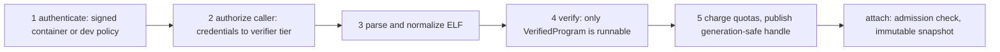

import { Callout } from 'nextra/components'

# Trust Model

Relevant source files

- [docs/security/bpf-trust.md](https://github.com/pro-utkarshM/axiomOS/blob/feat/v0.5-runtime/docs/security/bpf-trust.md)
- [kernel/src/bpf/trust.rs](https://github.com/pro-utkarshM/axiomOS/blob/feat/v0.5-runtime/kernel/src/bpf/trust.rs)
- [kernel/src/bpf/authorization.rs](https://github.com/pro-utkarshM/axiomOS/blob/feat/v0.5-runtime/kernel/src/bpf/authorization.rs)
- [kernel/src/bpf/handles.rs](https://github.com/pro-utkarshM/axiomOS/blob/feat/v0.5-runtime/kernel/src/bpf/handles.rs)
- [kernel/src/bpf/limits.rs](https://github.com/pro-utkarshM/axiomOS/blob/feat/v0.5-runtime/kernel/src/bpf/limits.rs)
- [kernel/src/bpf/snapshot.rs](https://github.com/pro-utkarshM/axiomOS/blob/feat/v0.5-runtime/kernel/src/bpf/snapshot.rs)
- [kernel/src/syscall/bpf.rs](https://github.com/pro-utkarshM/axiomOS/blob/feat/v0.5-runtime/kernel/src/syscall/bpf.rs)
- [kernel/crates/kernel_bpf/src/signing/mod.rs](https://github.com/pro-utkarshM/axiomOS/blob/feat/v0.5-runtime/kernel/crates/kernel_bpf/src/signing/mod.rs)
- [kernel/crates/kernel_bpf/src/signing/authentication.rs](https://github.com/pro-utkarshM/axiomOS/blob/feat/v0.5-runtime/kernel/crates/kernel_bpf/src/signing/authentication.rs)
- [kernel/crates/kernel_bpf/src/signing/verifier.rs](https://github.com/pro-utkarshM/axiomOS/blob/feat/v0.5-runtime/kernel/crates/kernel_bpf/src/signing/verifier.rs)
- [kernel/crates/kernel_bpf/src/signing/signature.rs](https://github.com/pro-utkarshM/axiomOS/blob/feat/v0.5-runtime/kernel/crates/kernel_bpf/src/signing/signature.rs)
- [kernel/Cargo.toml](https://github.com/pro-utkarshM/axiomOS/blob/feat/v0.5-runtime/kernel/Cargo.toml)
- [kernel/crates/kernel_bpf/src/signing/managed.rs](https://github.com/pro-utkarshM/axiomOS/blob/feat/v0.5-runtime/kernel/crates/kernel_bpf/src/signing/managed.rs)
- [kernel/crates/kernel_abi/src/bpf.rs](https://github.com/pro-utkarshM/axiomOS/blob/feat/v0.5-runtime/kernel/crates/kernel_abi/src/bpf.rs)
- [docs/security/managed-bundle-v1.md](https://github.com/pro-utkarshM/axiomOS/blob/feat/v0.5-runtime/docs/security/managed-bundle-v1.md)

`docs/security/bpf-trust.md` is marked normative for the shipped BPF control and execution planes. Admission is ordered and fail-closed.

## Signing

### Container format

A signed object is a fixed 120-byte header followed by the program data (the ELF). Fields, in order:

| Field | Size | Notes |
|---|---:|---|
| Magic `RBPF` | 4 | `SIGNED_PROGRAM_MAGIC` |
| Version | 1 | Must be 1 (`SIGNING_VERSION`) |
| Flags | 1 | `REQUIRES_CAP`, `DEBUG_BUILD`, `HAS_EXPIRY` bits are defined |
| Reserved | 2 | Skipped |
| Program hash | 32 | SHA3-256 of the program data |
| Signature | 64 | Ed25519 over the 32-byte hash |
| Signer ID | 8 | First 8 bytes of the public key |
| Timestamp | 8 | Little-endian Unix time |

### Verification

`SignatureVerifier::verify` checks, in order: the signer ID is in the trust store (`UntrustedSigner`), the SHA3-256 of the payload matches the header hash (`HashMismatch`, compared in constant time), and the Ed25519 signature over the hash verifies with `verify_strict` (`InvalidSignature`). Weak public keys are rejected both when a `TrustedKey` is constructed and at verify time. The trust store holds at most 32 keys on the cloud profile and 4 on the embedded profile.

Source observations worth knowing:

- The header timestamp and the flag bits are parsed, but the verification path above does not evaluate them. `SigningError::SignatureExpired` exists, yet no code in the signing module returns it, and `HAS_EXPIRY` is not consulted.
- The signer ID is a truncated public key used to select a key, not an authenticator by itself; trust comes from the full Ed25519 check.
- Verification is over the program hash only, not over header fields such as flags or timestamp.

### Authentication entry point

`authenticate_with_provenance(bytes, allow_unsigned)` is the single gate used by `BpfManager::load_program_authorized`:

| Input | allow_unsigned false | allow_unsigned true |
|---|---|---|
| Valid signed container from a trusted key | accepted (`Signed`) | accepted (`Signed`) |
| Signed container that is malformed, untrusted, tampered, or wrong version | rejected | rejected (fails closed regardless of policy) |
| No `RBPF` magic, or data shorter than the header | rejected (`UnsignedRejected`) | accepted as `Unsigned` |

Authentication happens before ELF parsing, so an unauthenticated payload never reaches the parser when enforcement is on. The result is mapped to `BpfError::SignatureRejected` (`EPERM` to userspace).

### Defaults and features

| Build | Policy |
|---|---|
| Kernel build without `bpf-unsigned-development` and not under test | Signed-only. `AXIOM_BPF_TRUSTED_KEY_PATH` names a 32-byte Ed25519 public key that is embedded with `include_bytes!` at compile time into an immutable one-key trust store. An invalid key panics at manager construction |
| `bpf-unsigned-development` feature, or unit tests | `allow_unsigned` is true and the trust store is empty; plain ELF and raw instruction loads are accepted |
| `bpf-production-signed` feature | A compatibility marker only; signed loading is already the default. Enabling it together with `bpf-unsigned-development` is a compile error |

### Managed bundle authentication

Managed controllers do not use the `RBPF` container. They are `AXMB` bundles whose Ed25519 signature covers a domain-separated SHA3-256 digest of the 160-byte manifest, which itself binds the payload digest ([Managed Bundles](/axiomos/v0.5-runtime/runtime/managed-bundles)). Trust selection for bundles uses the new `get_key_by_public_key`, which compares all 32 public-key bytes; a truncated legacy key ID can never select a different key. The resulting artifact retains the full signer public key and fingerprint, the bundle and payload digests and the manifest. Authentication runs in the preparation worker and grants no admission or activation; the effective effect ceiling is the intersection of the signed declaration, signer policy and the control slot.

The `bpf-unsigned-development` feature is described in `kernel/Cargo.toml` as an escape hatch for local demo images that "production artifacts must never enable". The workspace root exposes `bpf-unsigned-development` and `bpf-unsigned-development-aarch64` pass-through features, and build scripts such as `scripts/build/rpi5.sh` require `AXIOM_BPF_TRUSTED_KEY_PATH` to exist and be exactly 32 bytes.

Raw instruction loads (`BPF_PROG_LOAD`) carry no signature container and are rejected with `SignatureRejected` whenever `allow_unsigned` is false. Bytecode compiled into the kernel image (`load_kernel_builtin_program`) bypasses the signature check on the basis that its provenance is the authenticated kernel image; that function is crate-private so syscall callers cannot reach it.

<Callout type="warning">
Signature authenticity does not raise privilege. The caller tier given to the verifier comes only from process credentials, never from the signer. Only kernel built-ins use the `Trusted` tier. A signed program from a trusted key still needs the `ACTUATE` capability to use actuation helpers.
</Callout>

## Authorization

`Credentials` carries a `BpfCapabilities` bitmask. Fork and exec inherit the exact mask; a process can restrict or drop rights but cannot regain them. The ABI constants:

| Bit | Capability | Gates |
|---:|---|---|
| 0 | `PROGRAM_LOAD` | `PROG_LOAD`, `PROG_LOAD_ELF`, `PROG_UNLOAD` |
| 1 | `MAP_CREATE` | `MAP_CREATE` |
| 2 | `MAP_READ` | lookup, info, ring buffer poll; read rights for pins and program map access |
| 3 | `MAP_WRITE` | update, delete, destroy; write rights |
| 4 | `ATTACH_TRACE` | timer, sys_enter, sys_exit attach |
| 5 | `ATTACH_SCHEDULER` | sched_switch attach |
| 6 | `ATTACH_DEVICE` | GPIO, PWM (rejected later), IIO attach |
| 7 | `OBJECT_PIN` | pin, get, unpin |
| 8 | `ACTUATE` | actuation helpers admitted at load |
| 9 | `PRIVILEGED_VERIFY` | selects the `Privileged` verifier tier; also gates `BPF_BENCH_EXEC` |
| 10 | `OBJECT_ADMIN` | unpin objects owned by others |
| 11 | `BEHAVIOR_ADMIN` | New on this branch: managed `SYS_BPF` commands 256 to 269 (upload, activate, rollback, deactivate, retire, cancel, query, recorder, rearm) |

`BEHAVIOR_ADMIN` is deliberately narrow: it grants no legacy load, attach, map mutation, privileged verification or actuation authority. Legacy init receives none. In a `managed-runtime` image the bootstrap init holds only `BEHAVIOR_ADMIN`, delegates it to one installer process and drops its own capabilities permanently ([Installer](/axiomos/v0.5-runtime/runtime/installer)).

At load, `BpfLoadAuthorization` is captured as an immutable snapshot (`caller` tier, `allow_actuation`, `map_access`) and stored with the program. Unprivileged callers get stricter verifier rules: helpers marked privileged (`bpf_probe_read`, `bpf_get_boot_time_ms`, `bpf_get_kernel_heap_kb`, `bpf_get_kernel_image_mb`) are refused, and `PointerLeakUnprivileged` guards pointer returns. The source comments state the initial userspace process deliberately lacks trace and device attach and actuation rights; the demo loader contains checks for these denials.

Capability checks are an outer gate. Manager methods also enforce object ownership (`PermissionDenied` for a foreign program), per-map grants, pin offered access, and verifier-time map visibility.

## Handles

Program and map IDs are `u32` handles that encode a slot (low 10 bits, `SLOT_BITS = 10`) and a generation (remaining bits). Freed slots are reused only with an incremented generation, and the generation is capped so the handle fits a positive `c_int`. A stale handle therefore fails to decode rather than naming a replacement object. The verifier receives the generation table (`map_generations`) so constant map handles in bytecode are validated against current generations. Reservation of both backing vectors happens before a slot is published, so allocation failure cannot expose a half-built handle.

## Pins, grants and lifetime

- Maps are owner-scoped by default. A pinned path (up to 256 bytes, at most 128 or 32 pins on cloud or embedded) offers read, write or read/write access; a caller may request only rights present in both its credentials and the offer.
- A successful foreign `OBJ_GET` installs a per-owner grant, bounded to 64 grants per map (`MAX_MAP_GRANTS`). Allocation failure while extending grants or the pin table publishes neither the new authority nor the new path.
- Unload and destroy fail while an object is attached, pinned, leased, or otherwise referenced.
- Object ownership is an explicit `ObjectOwner` enum on this branch: `Process(pid)`, `KernelManaged`, `Reserved` or `Orphaned` (`e44dc70`). Previously a numeric owner with a sentinel was used; now no numeric PID can inherit an orphaned map's ownership. Accepted managed artifacts and instances are `KernelManaged` and survive loader exit; an incomplete upload remains process-owned and is cancelled on exit.
- On process teardown the scheduler-owned cleanup removes the owner's attachments and admission charges, publishes the replacement snapshot, revokes grants made to the exiting owner, transfers still-pinned maps to the explicit `Orphaned` owner (on `main` this was the `u64::MAX` sentinel), and reclaims programs and unpinned maps only when no execution reference remains. The document describes this as deterministic lifecycle ownership, not garbage collection.

## Threat assumptions and non-goals

Stated or evident in the source and trust document:

- The trusted signing key is provisioned at build time and the kernel image itself is trusted. There is no runtime key rotation or revocation: the production trust store is immutable.
- Hook dispatch must stay bounded and allocation-free; the design relies on the immutable snapshot, the epoch reclamation (with Loom models of the algorithm), per-CPU guarded interpreter stacks, and nested-execution rejection rather than on locking.
- Physical outputs are not trusted to program logic: actuation helpers need an explicit capability and pass through the actuation monitor before reaching hardware.
- The remaining assurance gaps are recorded by the project itself: physical GPIO and control-link hardware-in-the-loop testing, an independent review of the unsafe and concurrency code, and measured coverage for deferred host-capable components are not replaced by the local test gate (see the engineering audit referenced from `bpf-trust.md`).

The crate itself lists verifier fuzzing (`verify_only`, `verify_then_exec`), signed-container fuzzing (`signed_container`) and a ring buffer model (`ringbuf_sequences`) as adversarial inputs, which supports but does not prove the properties above.
