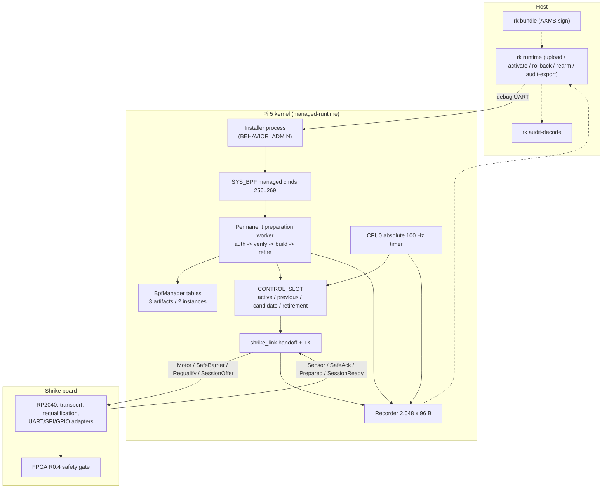

import { Callout } from 'nextra/components'

# Changes from main

**Relevant source files**

- [docs/plans/active/v0.5-bounded-runtime-evolution.md](https://github.com/pro-utkarshM/axiomOS/blob/feat/v0.5-runtime/docs/plans/active/v0.5-bounded-runtime-evolution.md)
- [docs/security/managed-bundle-v1.md](https://github.com/pro-utkarshM/axiomOS/blob/feat/v0.5-runtime/docs/security/managed-bundle-v1.md)
- [docs/security/runtime-installer-v1.md](https://github.com/pro-utkarshM/axiomOS/blob/feat/v0.5-runtime/docs/security/runtime-installer-v1.md)
- [docs/performance/v0.5-acceptance.json](https://github.com/pro-utkarshM/axiomOS/blob/feat/v0.5-runtime/docs/performance/v0.5-acceptance.json)
- [docs/reviews/releases/2026-09-12-v0.5-m0/README.md](https://github.com/pro-utkarshM/axiomOS/blob/feat/v0.5-runtime/docs/reviews/releases/2026-09-12-v0.5-m0/README.md)

## Summary

Branch `feat/v0.5-runtime` is **108 commits ahead of `main`** and touches about 222 files (+50,351 / -1,890 lines). It implements the accepted v0.5 "bounded runtime evolution" contract: a managed controller slot on the Raspberry Pi 5 that runs one signed, verified eBPF controller at an absolute 100 Hz release grid and can be uploaded, activated, rolled back, deactivated, retired and audited after boot, with every transition passing through an MCU-acknowledged safe-output boundary.

<Callout type="warning">
**Unmerged.** The branch completes the planned M1 software prerequisites and M2 to M6 software with host/model tests. Physical qualification (deferred M1 electronics and the M7 campaign) has not run, physical actuation stays disabled, and the default runtime profile and FPGA artifact remain `None`.
</Callout>

## New architecture

On `main`, controllers are legacy BPF programs attached to hooks (TIMER, IIO, GPIO) and fanned out by hook snapshots. On this branch the managed controller is a separate object type that ordinary hooks and the JIT cannot accept; legacy hook execution is unchanged outside managed-mode restrictions.

## Changed areas

| Area | Change | Page |
|---|---|---|
| Managed runtime (new) | Control slot, artifacts/instances/installations, worker, retirement | [Runtime overview](/axiomos/v0.5-runtime/runtime), [Lifecycle](/axiomos/v0.5-runtime/runtime/lifecycle) |
| Bundle format (new) | AXMB v1 bundle, managed verifier, helper 1009, `ManagedControlContextV1` | [Managed Bundles](/axiomos/v0.5-runtime/runtime/managed-bundles) |
| Scheduling | Absolute 100 Hz CPU0 release grid (`kernel_time::periodic`), missed/late accounting, sticky timer fault | [Executor](/axiomos/v0.5-runtime/runtime/executor), [Scheduling and Locking](/axiomos/v0.5-runtime/architecture/scheduling-and-locking) |
| Control link | SessionOffer/Ready, SafeBarrier/Ack, Requalify/Prepared messages; whole-frame reverse TX; PL011 bounded reset | [Safe Handoff and Rearm](/axiomos/v0.5-runtime/runtime/handoff-and-rearm), [Protocols](/axiomos/v0.5-runtime/architecture/protocols) |
| Management ABI | 14 versioned `SYS_BPF` commands, `BEHAVIOR_ADMIN` capability, installer debug-UART framing | [Installer](/axiomos/v0.5-runtime/runtime/installer) |
| Audit | Bounded kernel recorder, `audit-export`, offline decoder | [Audit Recorder](/axiomos/v0.5-runtime/runtime/recorder) |
| Verifier | Fallible bounded budgets, branch-join stack-depth fix, managed entry, map helper extent checks | [Verifier](/axiomos/v0.5-runtime/bpf/verifier) |
| Loader | Stricter legacy ELF rejection (one map-free entry, relocation validation) | [Loader](/axiomos/v0.5-runtime/bpf/loader) |
| Interpreter | ALU32/shift and endian semantics aligned with verifier; managed invocation capture | [Execution and JIT](/axiomos/v0.5-runtime/bpf/jit-and-execution) |
| Trust | Full signer identity retained; AXMB authentication; object owners | [Trust Model](/axiomos/v0.5-runtime/bpf/trust-model) |
| Memory | Heap lock access masks local IRQs | [Memory](/axiomos/v0.5-runtime/architecture/memory) |
| Pi 5 platform | Managed timer path, sensor snapshot, PL011 quiescence, rearm coordinator | [Raspberry Pi 5](/axiomos/v0.5-runtime/platform/raspberry-pi-5) |
| Firmware / FPGA | RP2040 transport, requalification, real UART/SPI/input adapters, verified bitstream streaming, R0.4 RTL/pins/timing | [Drivers](/axiomos/v0.5-runtime/platform/drivers), [Hardware-in-the-loop](/axiomos/v0.5-runtime/testing/hardware-in-the-loop) |
| Tools | `rk bundle`, `rk runtime`, `rk audit-decode`, `signed_bpf_loader` library + installer + syscall probe | [Tools](/axiomos/v0.5-runtime/userspace/tools) |
| Examples | Three managed C controllers | [Managed Bundles](/axiomos/v0.5-runtime/runtime/managed-bundles) |
| Verification | v0.5 host runner, reducers, audit stitcher, Shrike bench capture, FPGA preflights, CI changes | [Acceptance and Qualification](/axiomos/v0.5-runtime/runtime/qualification), [CI](/axiomos/v0.5-runtime/testing/ci), [Tests](/axiomos/v0.5-runtime/testing/tests) |
| Security docs | Unsafe ledger refresh, verifier assurance updates | [Unsafe Code](/axiomos/v0.5-runtime/security/unsafe-code), [Verifier Assurance](/axiomos/v0.5-runtime/security/verifier-assurance) |

No pages were removed: the branch adds subsystems but deletes no tracked files.

## Notable commits

| Commit | Description |
|---|---|
| `01766ce` | Freeze runtime contract and host acceptance checks (M0) |
| `8d27130` | Authenticate bounded managed controller bundles |
| `c977440` | Retain maximum stack depth across branch joins (verifier fix) |
| `f40a964` | Add narrow `BEHAVIOR_ADMIN` authority |
| `1f334bd` | Bound verifier buffer allocation and failure recovery |
| `e44dc70` | Separate object lifetime from process identifiers |
| `3438690` | Reject ambiguous legacy ELF composition |
| `2111f87` | Verify and capture bounded managed invocations |
| `0bb53c2` | Own bounded managed instances with fresh private state |
| `291b810` | Prepare bounded managed uploads in kernel worker |
| `4e4f20c` | Mask local IRQs around heap lock access |
| `6e8ff84` / `41e8384` | Lifecycle worker, absolute releases, managed controller execution |
| `9335e6a` | Gate publication on correlated safe handoff |
| `d176e5f` / `f1249aa` | Deactivation and inactive-artifact retirement |
| `49bf178` | Bounded debug-UART installer workflow |
| `70aaa77` | Managed bundle authoring and controller examples |
| `ab024ca` / `1db9b29` | Recorder retention core and offline trace decoder |
| `824c833` / `70b4a32` | FPGA configuration streaming and runtime SPI transactions on the MCU |
| `89ef8a5` | Integrate R0.4 RTL timing and pin contracts |
| `3f5badf` | Coordinate explicit rearm over bounded UART |
| `c0c0d01` / `d35236a` | Map helper input extent and aliasing fixes |
| `016dcf0` / `c1e1a5c` | Physical acceptance reduction and evidence binding |
| `90734303` | Document rearm ABI and shipped audit decoding |

## Migration notes

- **Opt-in.** All managed functionality is behind the `managed-runtime` feature (root: `managed-runtime` for x86_64, `managed-runtime-aarch64` for AArch64). Images built without it keep the `main` behavior.
- **Pi 5 managed build:** `AXIOM_BPF_TRUSTED_KEY_PATH=... bash scripts/build/rpi5.sh release embedded-rpi5,managed-runtime`. This builds the managed `init` and installer into the rootfs.
- **Controllers use AXMB, not RBPF.** Use `rk bundle` to sign raw instruction streams; `rk runtime upload` rejects the legacy signed ELF. Legacy `rk sign` / RBPF loading still works for hook programs.
- **Legacy ELF loading is stricter.** Programs must have exactly one map-free entry; unsupported relocation types, RELA, multiple symbol tables and inconsistent string tables reject before publication. BPF-to-BPF call relocations are still supported.
- **Legacy mutation is restricted while managed control owns the wheel pair:** legacy BPF mutation syscalls and consuming ring-buffer reads return errors; ordinary userspace commands to the managed pair are rejected.
- **Capabilities.** `BEHAVIOR_ADMIN` is new; legacy init receives none, and administration grants no actuation.
- **Managed images drop generic TIMER fanout** and synchronous timer diagnostics.
- **Operational guards unchanged.** `fpga-runtime` remains disabled; physical activation requires the deferred qualification.
