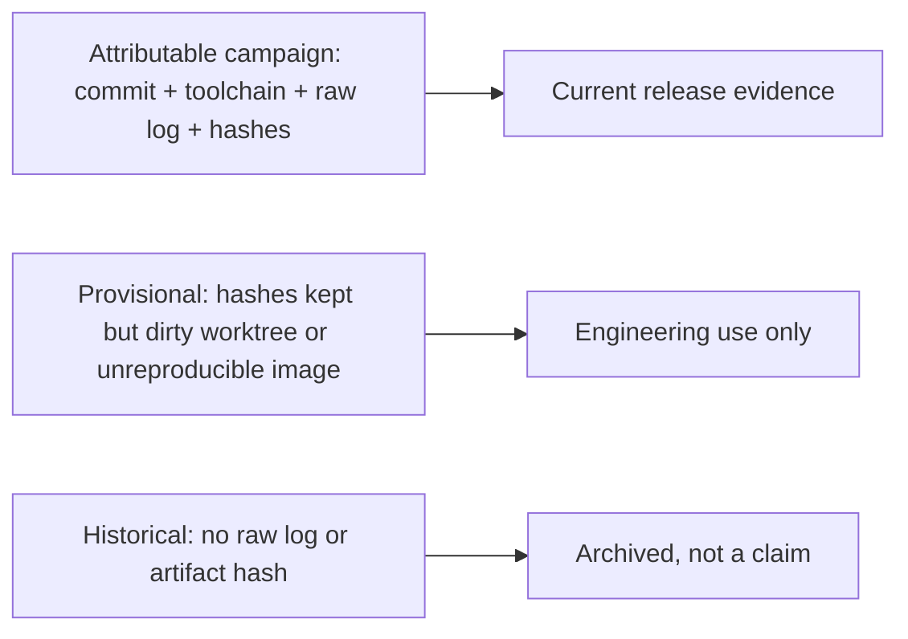

import { Callout } from 'nextra/components'

# Performance Evidence Policy

**Relevant source files**

- [docs/performance/README.md](https://github.com/pro-utkarshM/axiomOS/blob/feat/v0.5-runtime/docs/performance/README.md)
- [docs/performance/methodology.md](https://github.com/pro-utkarshM/axiomOS/blob/feat/v0.5-runtime/docs/performance/methodology.md)
- [docs/performance/v0.5-acceptance.json](https://github.com/pro-utkarshM/axiomOS/blob/feat/v0.5-runtime/docs/performance/v0.5-acceptance.json)
- [scripts/benchmark/analyze-v05.py](https://github.com/pro-utkarshM/axiomOS/blob/feat/v0.5-runtime/scripts/benchmark/analyze-v05.py)
- [scripts/benchmark/v05-host-runner.py](https://github.com/pro-utkarshM/axiomOS/blob/feat/v0.5-runtime/scripts/benchmark/v05-host-runner.py)
- [scripts/benchmark/v05-audit-stitch.py](https://github.com/pro-utkarshM/axiomOS/blob/feat/v0.5-runtime/scripts/benchmark/v05-audit-stitch.py)
- [scripts/benchmark/v05-physical-reducer.py](https://github.com/pro-utkarshM/axiomOS/blob/feat/v0.5-runtime/scripts/benchmark/v05-physical-reducer.py)
- [scripts/benchmark/verifier-cost.py](https://github.com/pro-utkarshM/axiomOS/blob/feat/v0.5-runtime/scripts/benchmark/verifier-cost.py)
- [docs/performance/current-results.md](https://github.com/pro-utkarshM/axiomOS/blob/feat/v0.5-runtime/docs/performance/current-results.md)
- [docs/performance/evidence](https://github.com/pro-utkarshM/axiomOS/tree/feat/v0.5-runtime/docs/performance/evidence)
- [scripts/verify/benchmark-provenance.py](https://github.com/pro-utkarshM/axiomOS/blob/feat/v0.5-runtime/scripts/verify/benchmark-provenance.py)
- [scripts/benchmark](https://github.com/pro-utkarshM/axiomOS/tree/feat/v0.5-runtime/scripts/benchmark)

axiomos separates performance claims into **method**, **current evidence**, and **history**. A number counts as current release evidence only if its campaign records all of:

| Requirement | Purpose |
|---|---|
| Exact source commit | Ties the number to code |
| Pinned toolchain | Rules out compiler drift |
| Exact command | Reproducibility |
| Host or hardware boundary | Scope of the claim |
| Tracked raw output | Numbers must be present in the raw log |
| SHA-256 of raw log and measured executable or image | Identifies the artifact that produced the result |

Each campaign lives under `docs/performance/evidence/COMMIT/` with a `manifest.toml` and the raw captures.

<Callout type="warning">
No QEMU, Raspberry Pi, Linux-comparison, boot-time, interrupt-latency, WCET, or comparative-speed headline is current release evidence until it is rerun under this contract. A developer-host campaign does not establish a hardware latency objective.
</Callout>

## Provenance gate

```bash
python3 -B scripts/verify/benchmark-provenance.py
```

The checker (also run as `benchmark-provenance-static` in the [audit gate](/axiomos/v0.5-runtime/security/audit-findings)) verifies the raw-log hash, confirms the Cargo-reported executable path and every declared result marker appear in the log, validates source-input hashes against the recorded Git commit, and requires a well-formed executable hash. It does not claim byte-identical binaries across different hosts or linkers.

## Evidence tiers



## Adding a campaign

1. Start from a clean, committed tree with the pinned toolchain.
2. Store raw output and `manifest.toml` under `docs/performance/evidence/COMMIT/`.
3. Record the Cargo-reported executable, its SHA-256, host/hardware controls, exact command, and hashes of benchmark source, `Cargo.lock` and `rust-toolchain.toml` at that commit.
4. Add only results present in the raw output. Hardware campaigns must also retain UART and logic-analyzer captures and deployed-image hashes.
5. Run the benchmark-provenance and documentation-link checks.

## v0.5 acceptance configuration

`docs/performance/v0.5-acceptance.json` (schema `axiomos.v05.acceptance.v1`) is the data file the v0.5 reducers consume. Its values, as committed:

| Group | Values |
|---|---|
| CPU | CPU 0, 1 slot, `period_ns` 10,000,000 (100 Hz), modeled utilization 50 percent, modeled cycle unit 6 ns |
| Timing | handoff timeout 80 ms, reset quiescence 200 ms, local UART drain timeout 1 s, Pi requalification timeout 2 s, Pi session offer timeout 80 ms, timing status query timeout 2 s |
| Resources | 3 artifacts, 1 upload, 262,144 upload bytes, 1 operation, 2 instances, 16,384 private-array payload bytes, 1 retire batch |
| Recorder | 2048 records of up to 96 bytes, 196,608 bytes of storage |
| Campaign minimums | 100,000 host churn operations; 3 physical boots; 10,000 successful transitions (1,000 per boot); 1,000,000 releases; 5 fault-phase repeats; 3600 s pilot; 86,400 s soak; motors not connected; recorder p99 overhead at most 50,000 ppm |
| Fault matrix | faults `stop`, `link_loss`, `mcu_reset`, `ack_failure`; phases `preparation`, `handoff`, `committed` |

It lists 16 required gates (for example trace subset, authentication and loading, handoff, scheduling, recorder, reset quiescence, physical campaign, fault matrix). Missing evidence yields `not_evaluated`, or `blocked` for the physical campaign. The release policy says all required gates must pass and that synthetic evidence can never pass a release. The `fault_matrix` gate is the one marked as not implemented by the reducer.

<Callout type="warning">
The embedded profile's control period changed from 1 kHz (1 ms) to 100 Hz (10 ms), with `RT_PERIOD_NS` of 10,000,000 and a utilization budget of 500,000,000 ns per second. The 6 ns per cycle unit is retained only as an unqualified model value: the source says it is not a measured interpreter bound and that qualification must recalibrate the shipped interpreter, helpers, private state, request handling and recorder overhead before any timing claim. Earlier text derived from a measured Pi 5 JIT figure no longer applies, since the shipped runtime uses the interpreter.
</Callout>

### v0.5 tooling

| Tool | Role |
|---|---|
| `scripts/benchmark/analyze-v05.py` | Strict JSONL reducer for trace integrity and cycle timing. `--describe` prints the versioned trace and expectations formats, `--show-acceptance` prints the configuration, `--self-test` runs synthetic checks, `--expectations FILE` supplies independent exact counts. Optional `--reclamation`, `--software` and `--physical-campaign` validate retained host resource tests, the fixed host software-property suite and the hardware campaign. It cannot issue a v0.5 release pass on its own |
| `scripts/benchmark/v05-host-runner.py` | Retains host lifecycle evidence and exports the recorder through the real `rk` CLI. Its docstring calls this synthetic evidence, never hardware timing or release qualification, and asks for a clean checkout and a new output directory. Failed runs are retained |
| `scripts/benchmark/v05-audit-stitch.py` | Stitches bounded audit exports (see [Recorder](/axiomos/v0.5-runtime/runtime/recorder)) without turning them into a physical pass |
| `scripts/benchmark/v05-physical-reducer.py` | Reduces retained physical evidence; raw inputs remain authoritative. Requires per-run provenance (source features, toolchain, kernel, rootfs, firmware, FPGA, wiring, instrument) |
| `scripts/benchmark/verifier-cost.py` | Now also parses optional `clock_hz`, `wcet` and `modeled_ns` fields on `AXIOM EXEC COST` lines and writes them to the CSV |

The hardware-side capture tool is `scripts/hil/shrike-bench.py` ([Hardware-in-the-loop](/axiomos/v0.5-runtime/testing/hardware-in-the-loop)). The software-only status of all of this is described in [Qualification](/axiomos/v0.5-runtime/runtime/qualification).

## Reproducible Pi 5 images

Pi 5 `kernel8.img` builds are bit-reproducible on the same host and toolchain because both `build.rs` and `kernel/build.rs` pin the ext2 UUID, a non-zero `hash_seed`, and `SOURCE_DATE_EPOCH` (otherwise `mke2fs` stamps random values into every image). Reproduction needs the same feature set and trust-root inputs:

```bash
export AXIOM_BPF_TRUSTED_KEY_PATH=PATH_TO_LAB_PUBLIC_KEY
export AXIOM_SIGNED_BPF_STARTUP_PATH=PATH_TO_SIGNED_STARTUP_RBPF
cargo clean
cargo xtask build rpi5 -- release FEATURES_FROM_BUILD_TOML
sha256sum target/aarch64-unknown-none/release/kernel8.img
```

An image whose `build.toml` records `worktree_dirty = true` cannot be reproduced and stays provisional regardless of how well its hashes are recorded.
