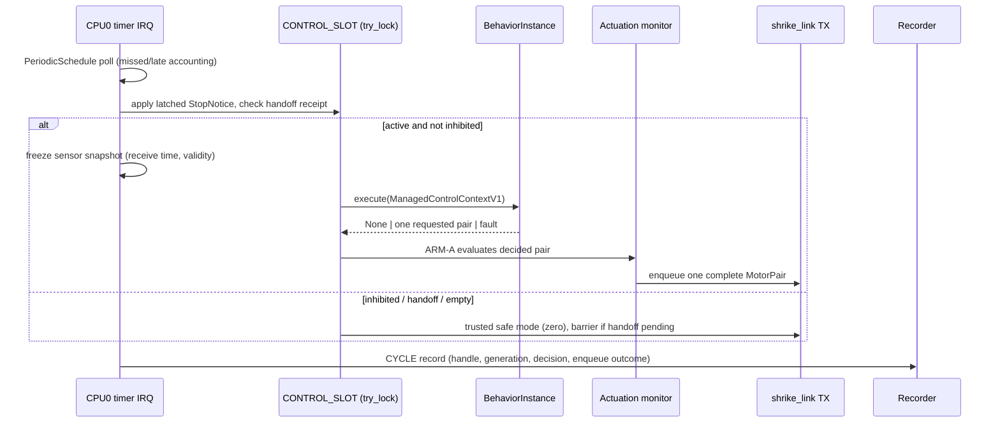

import { Callout } from 'nextra/components'

# 100 Hz Executor

**Relevant source files**

- [kernel/crates/kernel_time/src/periodic.rs](https://github.com/pro-utkarshM/axiomOS/blob/feat/v0.5-runtime/kernel/crates/kernel_time/src/periodic.rs)
- [kernel/src/arch/aarch64/interrupts.rs](https://github.com/pro-utkarshM/axiomOS/blob/feat/v0.5-runtime/kernel/src/arch/aarch64/interrupts.rs)
- [kernel/src/bpf/control.rs](https://github.com/pro-utkarshM/axiomOS/blob/feat/v0.5-runtime/kernel/src/bpf/control.rs)
- [kernel/src/bpf/installation.rs](https://github.com/pro-utkarshM/axiomOS/blob/feat/v0.5-runtime/kernel/src/bpf/installation.rs)
- [kernel/src/actuation.rs](https://github.com/pro-utkarshM/axiomOS/blob/feat/v0.5-runtime/kernel/src/actuation.rs)
- [kernel/src/arch/aarch64/platform/rpi5/control_link.rs](https://github.com/pro-utkarshM/axiomOS/blob/feat/v0.5-runtime/kernel/src/arch/aarch64/platform/rpi5/control_link.rs)
- [kernel/crates/kernel_bpf/src/execution/interpreter.rs](https://github.com/pro-utkarshM/axiomOS/blob/feat/v0.5-runtime/kernel/crates/kernel_bpf/src/execution/interpreter.rs)

In a `managed-runtime` image, the Pi 5 CPU0 physical timer drives one exclusive control slot on an **absolute 100 Hz grid**. Each release either invokes the active verified controller or services trusted safe mode. Managed control never runs through ordinary TIMER/IIO hook fanout, and managed images omit generic TIMER observers and timer diagnostics.

## Absolute releases

`kernel_time::periodic::PeriodicSchedule` advances `next_deadline += period` from a one-time start after CPU0 context initialization:

- At most one release is returned per poll; skipped releases are counted (`missed_before`) without catch-up bursts.
- Each `PeriodicRelease` carries `sequence`, `scheduled`, `deadline`, `actual` and `wake_lateness`.
- `completed_in_time(now)` requires `actual <= now < deadline`.
- Clock reversal and counter exhaustion reject with `ReleaseError` without changing the schedule.
- Cumulative `ReleaseStats` track serviced, missed and late releases and maximum lateness.

A sticky timer fault disables the timer and invokes trusted stop; it cannot rearm on a pending IRQ. Completion accounting currently ends before EOI and scheduler dispatch.

## One release

## Frozen sensor snapshot

The Pi adapter copies the raw sonar echo (microseconds) when a CRC-validated `Sensor` frame completes, timestamped with Pi receive time from CNTPCT, converted with the same checked frequency as releases. It is not MCU acquisition time. Missing, future, zero-echo, unsupported-flag, asserted e-stop, stopped and stale samples (at least 80 ms old) are marked invalid; the controller receives validity explicitly. The 80 ms ceiling reuses the provisional link timeout.

## Request and failure handling

- A successful invocation submits one complete decided pair; no request becomes zero.
- Duplicate requests, interpreter/map faults, skipped releases, reversed clocks, deadline expiry and queue failure inhibit the installation and enter the trusted stop path.
- A failure after enqueue preserves the actual queue outcome; it never claims physical rollback.
- Ordinary pair commands cannot claim managed authority. Legacy BPF mutation syscalls (including consuming ring-buffer reads) reject while the managed role owns the wheel pair.
- Trusted stops notify the slot without taking its lock, so releasing the e-stop latch cannot resume old code.

Managed motor provenance (originating cycle, installation generation, artifact handle) travels inside the pending request and TX frame, so a later activation cannot relabel a partial frame.

## Interpreter fixes

Alongside the executor, the shared interpreter was aligned with the verifier on ALU32 operand/shift semantics and endian conversion width/direction, and read-only context payload provenance was fixed (`ed46a6b`).

<Callout type="warning">
The 10 ms period and 50% modeled utilization ceiling are frozen, but interpreter/helper cost weights, IRQ-off duration and whole-image timing are unqualified. A 60-second QEMU `virt` run produced no boot markers and is not scheduling evidence. Timing is qualified only by the M7 campaign using the `managed-runtime-bench-markers` image.
</Callout>
