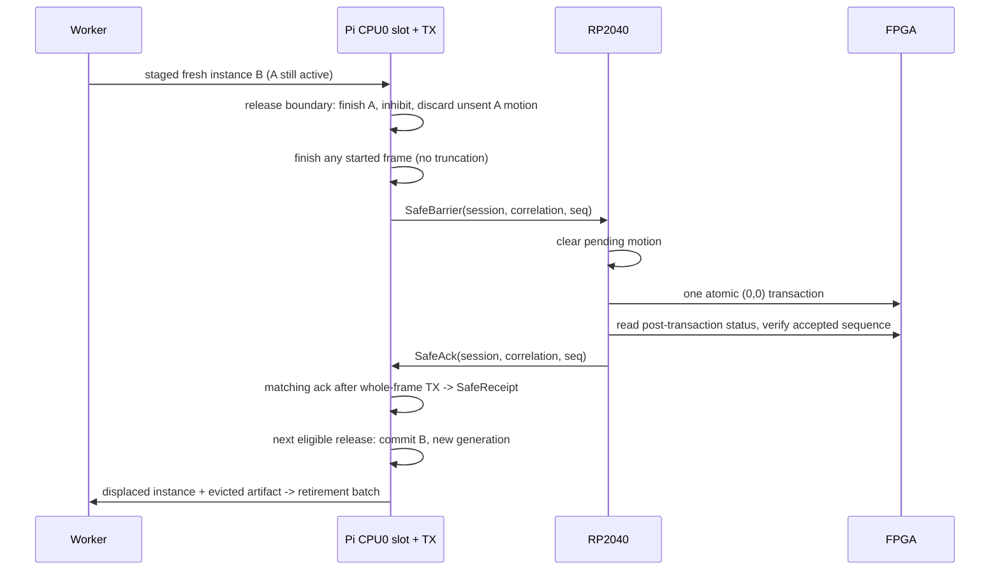
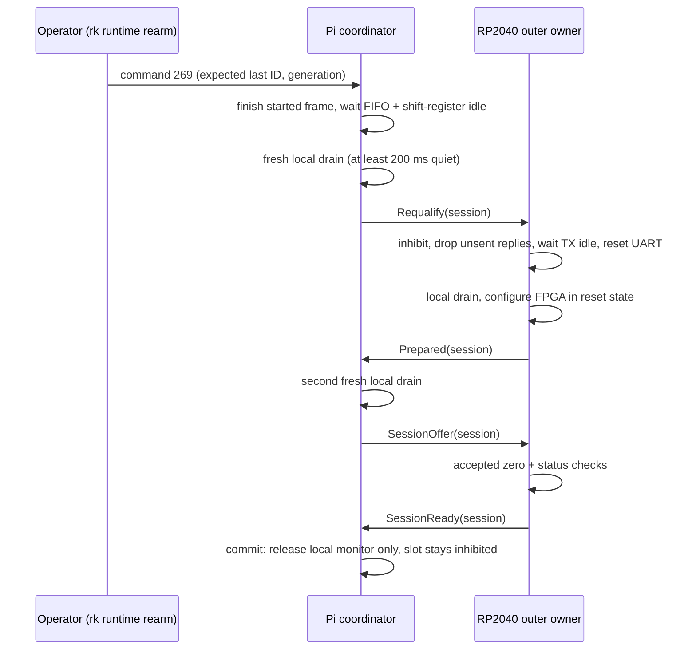

import { Callout } from 'nextra/components'

# Safe Handoff and Rearm

**Relevant source files**

- [kernel/crates/shrike_link/src/lib.rs](https://github.com/pro-utkarshM/axiomOS/blob/feat/v0.5-runtime/kernel/crates/shrike_link/src/lib.rs)
- [kernel/crates/shrike_link/src/handoff.rs](https://github.com/pro-utkarshM/axiomOS/blob/feat/v0.5-runtime/kernel/crates/shrike_link/src/handoff.rs)
- [kernel/crates/shrike_link/src/tx.rs](https://github.com/pro-utkarshM/axiomOS/blob/feat/v0.5-runtime/kernel/crates/shrike_link/src/tx.rs)
- [kernel/src/arch/aarch64/platform/rpi5/control_link.rs](https://github.com/pro-utkarshM/axiomOS/blob/feat/v0.5-runtime/kernel/src/arch/aarch64/platform/rpi5/control_link.rs)
- [kernel/src/arch/aarch64/platform/rpi5/control_link/rearm.rs](https://github.com/pro-utkarshM/axiomOS/blob/feat/v0.5-runtime/kernel/src/arch/aarch64/platform/rpi5/control_link/rearm.rs)
- [kernel/src/arch/aarch64/platform/rpi5/pl011.rs](https://github.com/pro-utkarshM/axiomOS/blob/feat/v0.5-runtime/kernel/src/arch/aarch64/platform/rpi5/pl011.rs)
- [firmware/shrike/control/src/control.rs](https://github.com/pro-utkarshM/axiomOS/blob/feat/v0.5-runtime/firmware/shrike/control/src/control.rs)
- [firmware/shrike/control/src/transport.rs](https://github.com/pro-utkarshM/axiomOS/blob/feat/v0.5-runtime/firmware/shrike/control/src/transport.rs)
- [firmware/shrike/control/src/requalification.rs](https://github.com/pro-utkarshM/axiomOS/blob/feat/v0.5-runtime/firmware/shrike/control/src/requalification.rs)
- [firmware/shrike/rp2040/src/uart.rs](https://github.com/pro-utkarshM/axiomOS/blob/feat/v0.5-runtime/firmware/shrike/rp2040/src/uart.rs)

Controller replacement is a deliberate safe-output pause, confirmed by the MCU before the new installation is published. Link resets require explicit, bilateral requalification and operator rearm. Both reuse the existing Shrike UART framing and CRC; no generic reliable RPC is added.

## Control-link messages

Wire frame: `SYNC(0x7E) VER(0x01) TYPE LEN PAYLOAD CRC_LO CRC_HI`. The branch adds six message types:

| Type | Direction | Message | Payload |
|---|---|---|---|
| `0x01` | Pi to Shrike | MotorSetpoint | seq u8, left/right i16 (existing) |
| `0x02` | Pi to Shrike | Estop | existing |
| `0x03` | Pi to Shrike | Heartbeat | existing |
| `0x04` | Pi to Shrike | **SessionOffer** | session u32 (nonzero) |
| `0x05` | Pi to Shrike | **SafeBarrier** | session u32, correlation u64, sequence u8 |
| `0x06` | Pi to Shrike | **Requalify** | session u32 (nonzero) |
| `0x81` | Shrike to Pi | Sensor | existing |
| `0x82` | Shrike to Pi | Heartbeat | existing |
| `0x83` | Shrike to Pi | **SessionReady** | session u32 |
| `0x84` | Shrike to Pi | **SafeAck** | barrier field order |
| `0x85` | Shrike to Pi | **Prepared** | session u32 |

Reverse MCU replies have whole-frame priority and explicit backpressure; started telemetry is never truncated. Session zero consumes motor sequence zero, so the Pi's first barrier uses sequence one.

## Acknowledged safe handoff

- `SafeReceipt` has no public constructor and no `Clone`; identity data alone is not a publication permit.
- Wrong or stale acknowledgement identities are recorded as ignored/rejected and cannot commit.
- The **80 ms** operational timeout counts from handoff entry, including acknowledgement and commit. Timeout fails the operation, suppresses motion and invokes the stop path; it does not prove outputs became safe at that instant.
- Stop before publication cancels replacement; stop after publication leaves the new installation committed but inhibited. Neither resumes control automatically. Replacement never issues an e-stop release.

Host tests inject handoff at every byte offset of an old frame and cover wrong identities, cancellation, stop, timeout and reset.

## Reset, requalification and rearm

There is no qualified persistent boot ID. After a reset or link discontinuity, handoff eligibility is cancelled, mailboxes are cleared and outputs stay disarmed until requalification, explicit operator rearm and a fresh activation.

Bounds on the Pi side: each quiet interval is 200 ms plus clock quantization; the complete attempt is bounded by 2 s, the final offer by 80 ms, with a finite 1,048,576-pass ceiling even for a frozen clock; each pass moves at most 64 bytes per direction. The local UART attempt bound is 1 s. The PL011 reset follows the ARM DDI0183G 3.3.8 reprogramming sequence; FIFO-empty alone is not treated as transmit completion.

Rearm preserves the slot generation, artifacts, private state and admission charge, and keeps the controller inhibited; a separate activation must build a fresh instance. It never sends the legacy e-stop-release frame. A stop epoch and durable operation-specific failure prevent consumed stop mailboxes from authorizing a later release.

## MCU side

The RP2040 firmware adds:

- a bounded transport (`transport.rs`) with whole-frame reverse ownership and backpressure,
- a requalification owner (`requalification.rs`) that requires the exact nonzero session and rejects traffic following a complete `Requalify`,
- real UART0, SPI0 and GPIO input adapters (`rp2040/src/uart.rs`, `spi.rs`, `inputs.rs`) with bounded register operations,
- FPGA configuration streaming of a SHA-256-verified, immutable `BitstreamImage` and a bounded runtime READY transition.

<Callout type="warning">
All of this is host/model and target-compile evidence. Bilateral reset buffering, session establishment, FPGA runtime timing and operator rearm are unqualified on hardware. The default runtime profile and FPGA artifact remain `None`; only the opt-in qualification image selects the pinned R0.4 bitstream and a candidate timing profile.
</Callout>
