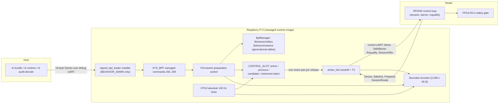

import { Callout, Cards } from 'nextra/components'

# Managed Runtime Overview

**Relevant source files**

- [docs/plans/active/v0.5-bounded-runtime-evolution.md](https://github.com/pro-utkarshM/axiomOS/blob/feat/v0.5-runtime/docs/plans/active/v0.5-bounded-runtime-evolution.md)
- [docs/security/managed-bundle-v1.md](https://github.com/pro-utkarshM/axiomOS/blob/feat/v0.5-runtime/docs/security/managed-bundle-v1.md)
- [docs/security/runtime-installer-v1.md](https://github.com/pro-utkarshM/axiomOS/blob/feat/v0.5-runtime/docs/security/runtime-installer-v1.md)
- [docs/performance/v0.5-acceptance.json](https://github.com/pro-utkarshM/axiomOS/blob/feat/v0.5-runtime/docs/performance/v0.5-acceptance.json)
- [kernel/src/bpf/managed.rs](https://github.com/pro-utkarshM/axiomOS/blob/feat/v0.5-runtime/kernel/src/bpf/managed.rs)
- [kernel/src/bpf/installation.rs](https://github.com/pro-utkarshM/axiomOS/blob/feat/v0.5-runtime/kernel/src/bpf/installation.rs)
- [kernel/src/bpf/preparation.rs](https://github.com/pro-utkarshM/axiomOS/blob/feat/v0.5-runtime/kernel/src/bpf/preparation.rs)
- [kernel/src/bpf/recorder.rs](https://github.com/pro-utkarshM/axiomOS/blob/feat/v0.5-runtime/kernel/src/bpf/recorder.rs)
- [kernel/src/syscall/managed.rs](https://github.com/pro-utkarshM/axiomOS/blob/feat/v0.5-runtime/kernel/src/syscall/managed.rs)
- [kernel/crates/shrike_link/src/handoff.rs](https://github.com/pro-utkarshM/axiomOS/blob/feat/v0.5-runtime/kernel/crates/shrike_link/src/handoff.rs)

The `feat/v0.5-runtime` branch adds a **managed runtime**: a single, bounded control slot on the Raspberry Pi 5 that executes one signed, verified controller at an absolute 100 Hz release grid, and that can be replaced, rolled back, deactivated and inspected after boot without reflashing. It is the implementation of the accepted v0.5 contract, [v0.5-bounded-runtime-evolution.md](https://github.com/pro-utkarshM/axiomOS/blob/feat/v0.5-runtime/docs/plans/active/v0.5-bounded-runtime-evolution.md).

The product goal stated in the contract: an operator uploads a signed controller to a running Pi 5, prepares it while the active controller runs, transfers control through a confirmed safe-output interval, manually returns to the previous artifact, and inspects the audit trail. Every activation and rollback starts with fresh private state and bounded memory.

<Callout type="warning">
**Status: software and host/model complete; physical qualification open.** The branch closes the planned M1 software prerequisites and M2 to M6 implementation and host tests. The deferred M1 electronics qualification and the M7 hardware campaign (three cold boots, 10,000 transitions, one million releases, fault matrix, 1-hour pilot, 24-hour soak) have not been run. Physical actuation stays disabled, the default runtime profile and FPGA artifact are `None`, and the physical reducer reports `fault_matrix: not_evaluated` and `physical_acceptance: false`.
</Callout>

## Product decisions

| Decision | v0.5 contract |
|---|---|
| Control rate | One CPU0 executor at 100 Hz with absolute 10 ms deadlines |
| Replacement | A deliberate safe-output pause; the sink confirms it is safe before publication |
| State | Fresh, zero-initialized private state on every activation and rollback |
| Rollback | Explicit selection of the retained previous artifact; issues a new installation generation |
| Retention | One active artifact, one previous artifact, one transient candidate |
| Recorder | Bounded RAM window (2,048 records of 96 bytes), export and explicit loss accounting |
| Hardware | Pi 5 + RP2040 + programmed FPGA; motors and chassis deferred |

Out of scope for v0.5: state migration, deterministic replay, crash-persistent recording, automatic rollback, SMP controller execution and Linux integration.

## Architecture

## Core objects

| Object | Contents and lifetime |
|---|---|
| `BehaviorArtifact` | Immutable signed identity, normalized code, verifier result, admission cost and binding contract |
| `BehaviorInstance` | Artifact reference, newly allocated private state and captured runtime bindings |
| `Installation` | Instance, kernel-issued generation, control-slot authority and activation receipt |

Artifact identity (behavior ID, signer revision, SHA3-256 of bundle and payload, full signer fingerprint, helper/context versions, state declaration) is distinct from installation generation: A to B to A never reuses A's former generation.

## Resource bounds

From [v0.5-acceptance.json](https://github.com/pro-utkarshM/axiomOS/blob/feat/v0.5-runtime/docs/performance/v0.5-acceptance.json):

| Resource | Bound |
|---|---|
| Control slots | 1 (CPU0) |
| Distinct retained artifacts | 3 |
| Incomplete uploads | 1, at most 256 KiB |
| Accepted management operations | 1 |
| State instances | 2 |
| Private ARRAY payload | 16 KiB |
| Retirement batches | 1 (one displaced instance + one evicted artifact) |
| Terminal receipts | 4 |
| Recorder | 2,048 records, 96 bytes each (192 KiB) |
| Handoff timeout | 80 ms |
| Reset quiescence | 200 ms |

Embedded program and map budgets are unchanged; managed objects are charged against them.

## Build features

| Feature | Effect |
|---|---|
| `managed-runtime` (kernel) | Preallocates the upload buffer, starts the permanent worker, enables the managed slot, ABI and recorder |
| `managed-runtime` / `managed-runtime-aarch64` (root) | Forward to kernel, `init` and `signed_bpf_loader` for x86_64 / AArch64 images |
| `managed-runtime-bench-markers` | Qualification-only GPIO12/GPIO13 release and recorder markers |
| `managed-syscall-probe` (root) | Opt-in QEMU image exercising the real x86 `SYS_BPF` boundary from the installer |

The Pi 5 build is `bash scripts/build/rpi5.sh release embedded-rpi5,managed-runtime` with `AXIOM_BPF_TRUSTED_KEY_PATH` set.

## Milestones

| Order | Work | Branch status |
|---|---|---|
| M0 | Contract, acceptance configuration, baseline | Done (`01766ce`, [M0 review](https://github.com/pro-utkarshM/axiomOS/blob/feat/v0.5-runtime/docs/reviews/releases/2026-09-12-v0.5-m0/README.md)) |
| M1 | Atomic MCU pair sink, FPGA adapter, bounded reverse TX, stop/rearm/reset | Software done; physical qualification deferred |
| M2 | ELF rejection, signer, managed parser, fallible budgets, admin capability, worker | Software done |
| M3 | Artifact/instance/installation ownership, retirement, accounting | Software done |
| M4 | Absolute releases, frozen sensors, one request per cycle, explicit faults | Software done |
| M5 | Expected generations, safe barrier/ack, publication, deactivation, rollback | Software done |
| M6 | Post-boot CLI, queries/export, decoder, example controllers | Software done |
| M7 | Hardware acceptance campaign | Not run |

## Section pages

<Cards>
  <Cards.Card title="Managed Bundles" href="/axiomos/v0.5-runtime/runtime/managed-bundles" />
  <Cards.Card title="Lifecycle and Ownership" href="/axiomos/v0.5-runtime/runtime/lifecycle" />
  <Cards.Card title="100 Hz Executor" href="/axiomos/v0.5-runtime/runtime/executor" />
  <Cards.Card title="Safe Handoff and Rearm" href="/axiomos/v0.5-runtime/runtime/handoff-and-rearm" />
  <Cards.Card title="Installer and rk runtime" href="/axiomos/v0.5-runtime/runtime/installer" />
  <Cards.Card title="Audit Recorder" href="/axiomos/v0.5-runtime/runtime/recorder" />
  <Cards.Card title="Acceptance and Qualification" href="/axiomos/v0.5-runtime/runtime/qualification" />
</Cards>
