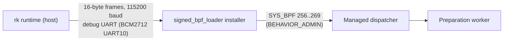

import { Callout } from 'nextra/components'

# Installer and rk runtime

**Relevant source files**

- [docs/security/runtime-installer-v1.md](https://github.com/pro-utkarshM/axiomOS/blob/feat/v0.5-runtime/docs/security/runtime-installer-v1.md)
- [docs/security/managed-bundle-v1.md](https://github.com/pro-utkarshM/axiomOS/blob/feat/v0.5-runtime/docs/security/managed-bundle-v1.md)
- [kernel/crates/shrike_link/src/installer.rs](https://github.com/pro-utkarshM/axiomOS/blob/feat/v0.5-runtime/kernel/crates/shrike_link/src/installer.rs)
- [kernel/src/syscall/installer_io.rs](https://github.com/pro-utkarshM/axiomOS/blob/feat/v0.5-runtime/kernel/src/syscall/installer_io.rs)
- [kernel/src/syscall/managed.rs](https://github.com/pro-utkarshM/axiomOS/blob/feat/v0.5-runtime/kernel/src/syscall/managed.rs)
- [kernel/src/mcore/mtask/process/credentials.rs](https://github.com/pro-utkarshM/axiomOS/blob/feat/v0.5-runtime/kernel/src/mcore/mtask/process/credentials.rs)
- [userspace/core/init/src/main.rs](https://github.com/pro-utkarshM/axiomOS/blob/feat/v0.5-runtime/userspace/core/init/src/main.rs)
- [userspace/tools/signed_bpf_loader/src/lib.rs](https://github.com/pro-utkarshM/axiomOS/blob/feat/v0.5-runtime/userspace/tools/signed_bpf_loader/src/lib.rs)
- [userspace/tools/signed_bpf_loader/src/syscall_probe.rs](https://github.com/pro-utkarshM/axiomOS/blob/feat/v0.5-runtime/userspace/tools/signed_bpf_loader/src/syscall_probe.rs)
- [userspace/tools/rk_cli/src/commands/runtime.rs](https://github.com/pro-utkarshM/axiomOS/blob/feat/v0.5-runtime/userspace/tools/rk_cli/src/commands/runtime.rs)

The operator path is a single physical chain:



The RP1 control UART to Shrike stays separate. There is no networking, SSH, writable filesystem or shell in this path.

## Authority: `BEHAVIOR_ADMIN`

`BEHAVIOR_ADMIN` is a new, separate process capability (`f40a964`). In the managed rootfs the bootstrap `init` receives only `BEHAVIOR_ADMIN`, delegates it to one installer, then permanently drops its own capabilities; ordinary children receive none. Administration grants no legacy BPF mutation, privileged verification or direct GPIO/PWM/motor authority. Legacy image provisioning is unchanged.

## Management ABI

Fourteen commands use independently versioned, padding-free structures through `SYS_BPF`, dispatched before the legacy `BpfAttr` size check:

| Command | Number | Structure / bytes | Result |
|---|---|---|---|
| Upload begin | 256 | `ManagedUploadBeginV1` / 24 | New upload/operation ID |
| Upload chunk | 257 | `ManagedUploadChunkV1` / 288 | Total bytes received |
| Upload finalize | 258 | `ManagedOperationRequestV1` / 24 | Accepted operation ID |
| Operation query | 259 | `ManagedOperationV1` / 200 | Status written in place |
| Cancel upload/preparation/rearm | 260 | `ManagedOperationRequestV1` / 24 | Cancellation requested |
| Activate | 261 | `ManagedInstallationRequestV1` / 32 | Accepted operation ID |
| Rollback | 262 | `ManagedInstallationRequestV1` / 32 | Accepted operation ID |
| Slot query | 263 | `ManagedSlotV1` / 64; `ManagedSlotArtifactV2` / 224 | Slot status or one artifact's identity |
| Cancel installation | 264 | `ManagedInstallationCancelV1` / 40 | Lifecycle cancellation requested |
| Deactivate | 265 | `ManagedInstallationRequestV1` / 32 | Accepted operation ID |
| Retire inactive artifact | 266 | `ManagedInstallationRequestV1` / 32 | Accepted operation ID |
| Recorder status | 267 | `ManagedAuditStatusV1` / 176; `V2` / 256 | Window (+ cumulative timer counters in v2) |
| Recorder read | 268 | `ManagedAuditReadV1` / 248 | At most two records + explicit cursor gap |
| Explicit rearm | 269 | `ManagedRearmRequestV1` / 32 | Accepted rearm operation ID |

Errors: `EINVAL` malformed, `ENOTSUP` unsupported version/feature, `EACCES` authentication, `ENOEXEC` rejected bytecode, `E2BIG` bundle/profile bound, `ENOMEM` capacity, `EBUSY` busy, `ESTALE` stale identity, `EOVERFLOW` counter exhaustion, `EPERM` wrong upload owner, `ETIMEDOUT` (74) handoff timeout, `ENOLINK` missing link, `EPROTO` protocol/clock failure.

Uploads stream at most 256 bytes per chunk at the next expected offset; exact replays are idempotent; gaps and conflicting overlaps reject. IDs increase without wrapping. Lost responses are resolved by querying, never by blind re-execution.

## Installer transport

The kernel gives the installer exclusive raw fd0/fd1 ownership of the debug UART after checking its capability. Each call copies at most 16 stack bytes and never waits for FIFO space (`EAGAIN` on idle, `EBUSY` on competing ownership, `EIO` on RX faults). Formatted console output is suppressed while owned.

Each request credit permits one 16-byte frame:

| Bytes | Content |
|---|---|
| 0 | Magic `0xA5` |
| 1 | Kind (high nibble), payload length 0..8 (low nibble) |
| 2..5 | u32 sequence |
| 6..13 | Payload, zero-padded |
| 14..15 | CRC16 over bytes 0..13 |

Kinds: Request 0, RequestLast 1, Poll 2, Reset 3, Ack 8, Response 9, ResponseLast 10, Error 11. Exact duplicates replay the cached reply without redispatch; altered duplicates and stale sequences reject; RX errors require Reset. Messages start with the u16 management command; the only extra command is `0xffff` (trusted stop). No legacy BPF or arbitrary syscall is forwarded.

## Operator commands

```sh
rk runtime --port /dev/ttyUSB0 query
rk runtime --port /dev/ttyUSB0 upload controller.axmb
rk runtime --port /dev/ttyUSB0 query --operation 0
rk runtime --port /dev/ttyUSB0 rearm --expected-generation 0
rk runtime --port /dev/ttyUSB0 activate --expected-generation 0 --artifact 0
rk runtime --port /dev/ttyUSB0 rollback --expected-generation 1 --artifact 0
rk runtime --port /dev/ttyUSB0 stop
rk runtime --port /dev/ttyUSB0 audit-export --output audit.jsonl
```

Use the observed generation and artifact handle (handle zero can be valid; check presence flags). `deactivate` and `retire` take the same options. `cancel ID` cancels upload/preparation/rearm; lifecycle cancels also need `--expected-generation`, `--artifact` and `--target-kind`. On timeout or serial error the CLI exits with an unknown-outcome diagnostic and does not retransmit.

## Syscall probe image

The opt-in `managed-syscall-probe` x86 image runs the installer against the real `SYS_BPF` boundary in QEMU: query copy-back, malformed sizes/versions/reserved fields, unmapped input and read-only output rejection, a malformed upload reaching the worker's terminal error, and capability-drop checks in a forked child. The full audit runs it alongside the legacy and signed-production smoke images.

<Callout type="info">
UART receive capacity, timing under upload pressure and physical post-boot upload on the Pi 5 are not yet qualified.
</Callout>
