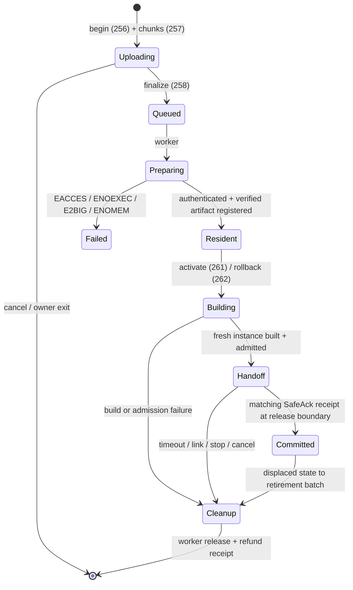

import { Callout } from 'nextra/components'

# Lifecycle and Ownership

**Relevant source files**

- [kernel/src/bpf/preparation.rs](https://github.com/pro-utkarshM/axiomOS/blob/feat/v0.5-runtime/kernel/src/bpf/preparation.rs)
- [kernel/src/bpf/installation.rs](https://github.com/pro-utkarshM/axiomOS/blob/feat/v0.5-runtime/kernel/src/bpf/installation.rs)
- [kernel/src/bpf/managed.rs](https://github.com/pro-utkarshM/axiomOS/blob/feat/v0.5-runtime/kernel/src/bpf/managed.rs)
- [kernel/src/bpf/managed_allocation.rs](https://github.com/pro-utkarshM/axiomOS/blob/feat/v0.5-runtime/kernel/src/bpf/managed_allocation.rs)
- [kernel/src/bpf/control.rs](https://github.com/pro-utkarshM/axiomOS/blob/feat/v0.5-runtime/kernel/src/bpf/control.rs)
- [kernel/src/bpf/authorization.rs](https://github.com/pro-utkarshM/axiomOS/blob/feat/v0.5-runtime/kernel/src/bpf/authorization.rs)
- [kernel/src/syscall/managed.rs](https://github.com/pro-utkarshM/axiomOS/blob/feat/v0.5-runtime/kernel/src/syscall/managed.rs)
- [kernel/crates/kernel_abi/src/managed.rs](https://github.com/pro-utkarshM/axiomOS/blob/feat/v0.5-runtime/kernel/crates/kernel_abi/src/managed.rs)
- [kernel/crates/kernel_bpf/src/verifier/admission.rs](https://github.com/pro-utkarshM/axiomOS/blob/feat/v0.5-runtime/kernel/crates/kernel_bpf/src/verifier/admission.rs)
- [kernel/src/mem/heap.rs](https://github.com/pro-utkarshM/axiomOS/blob/feat/v0.5-runtime/kernel/src/mem/heap.rs)

The managed lifecycle moves a controller from upload to execution and back out again through one **permanent preparation worker** and one kernel-private **control slot**. Bulk work (authentication, verification, allocation, destruction) runs in the worker, outside the `BPF_MANAGER` lock with IRQs enabled; the timer never allocates, destroys, waits for readers or takes the manager lock.

## Lifecycle



Contract-level flow:

```text
upload -> authenticate/verify artifact -> resident candidate
       -> prepare/admit fresh instance -> request handoff
       -> old invocation completes -> trusted safe mode -> sink confirms zero
       -> publish installation -> execute new controller

displaced artifact -> previous
displaced instance + evicted previous artifact -> retirement batch -> worker release
previous artifact -> fresh instance -> same handoff -> new installation generation
```

## Ownership model

- **Process-owned:** an incomplete upload belongs to the uploading process and is cancelled through the existing owner-exit cleanup.
- **Kernel-owned:** once finalize is accepted, the operation survives installer exit. Accepted artifacts and installations use explicit `KernelManaged` ownership, independent of loader PID.
- **Object owners:** map and program ownership distinguish process-owned, reserved and orphaned objects explicitly (`e44dc70`); no numeric PID can inherit an orphaned map.

The manager stores managed objects in its existing generational program/map tables:

| Bound | Value |
|---|---|
| Retained artifacts | 3 (active, previous, candidate) |
| Instances | 2 (active and staged) |
| Upload buffer | One preallocated 256 KiB buffer, charged to the program-byte limit even when idle |
| Verifier/wrapper reservation | 512 KiB reserved at finalize |
| Terminal receipts | 4, scalar status and identity only |
| Retirement batch | 1, holding one displaced instance and one evicted artifact |

Artifacts share immutable code and retain no mutable state. Each instance gets newly zeroed private storage built outside the manager lock. Charges for code, private array backing, boxes, reference-count headers and registry capacity follow the pinned allocator/toolchain layouts and remain until actual release.

### Reclamation

Reclamation separates three steps: **extract** from the table without releasing charges, **drop** the owned object in the worker outside the lock, then **refund** by consuming an opaque receipt. A pending release holds counts, byte charges and insertion capacity. Strong/weak readers and map leases cause a busy retry without losing bindings. Generation exhaustion rejects before removing entries. Accepted preparation and reclamation exclude each other.

## Control slot

`CONTROL_SLOT` is a `spin::Mutex` separate from manager storage. Combined paths lock the slot first, then the manager, with local IRQs masked; the release boundary uses only `try_lock` on the slot. It owns:

- the active installation (instance + generation),
- the retained previous artifact,
- the resident candidate,
- staged fresh state,
- one retirement batch.

Trusted stops never take the slot lock; they latch a first-cause `StopNotice` into a bounded mailbox that the next CPU0 boundary consumes before publication.

## Administrative operations

| Operation | Command | Preconditions | Effect on commit |
|---|---|---|---|
| Activate | 261 | Expected last operation ID and generation; exact candidate handle | Fresh instance published; new generation; displaced active becomes previous |
| Rollback | 262 | Exact retained previous artifact | Fresh, zeroed instance; new generation; the displaced active becomes previous |
| Deactivate | 265 | Exact active artifact | Slot empty and inhibited; generation advances; active becomes previous |
| Retire inactive | 266 | Exact inactive artifact | All candidate/previous aliases removed; generation unchanged; no handoff |
| Cancel lifecycle | 264 | Operation ID, generation, handle, target kind | Cannot undo a committed operation |
| Rearm | 269 | Inhibited slot | Link requalification only; see [Safe Handoff and Rearm](/axiomos/v0.5-runtime/runtime/handoff-and-rearm) |

All require `BEHAVIOR_ADMIN`, exact versions, sizes and zero reserved fields. Activation, rollback and deactivation require space for two cleanup IDs before acceptance; exhaustion returns `EOVERFLOW` before any change. Stale identities return `ESTALE`; a conflicting operation returns `EBUSY`. Public operation IDs and internal instance cleanup IDs are independent counters.

Failure semantics:

- Preparation failure preserves the active identity, private state, previous artifact and active admission charge.
- Entering handoff inhibits motion; failure afterwards may leave the old installation current but stopped.
- Publication has one authoritative commit point and no fallible work follows its first mutation.
- No fault automatically selects previous code. Physical actions are never rolled back.

## Admission

The existing utilization ledger holds one fixed managed reservation at 100 Hz with a 50% modeled ceiling. Preparation reserves the larger of the active and replacement costs alongside ordinary attachments; cancellation preserves the settled active charge. A consumed worker receipt settles the result after publication, so the timer never mutates the ledger. Deactivation reserves a zero replacement charge.

<Callout type="info">
Cost weights are model values for the shipped interpreter and remain unqualified until the Pi 5 calibration corpus runs in the M7 campaign.
</Callout>

## Allocator change

The global allocator now masks local IRQs only while accessing its locked heap (`4e4f20c`), closing a same-CPU preemption deadlock window between the timer and worker. This does not bound the linked-list allocator's fragmentation-dependent traversal time.

## Evidence

Host tests cover 100,000 fresh-instance creation/reclamation cycles and 100,000 committed installation/rollback transitions with stable resource and reference counts, failure at all four instance allocation stages, generation exhaustion, retained strong/weak readers, and 120 legal writer/cancel/stop/worker interleavings at single-CPU method boundaries. These are ownership and sequencing evidence, not physical or parallel-memory-model evidence.
