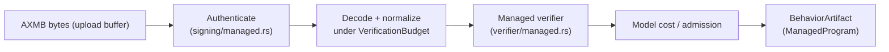

import { Callout } from 'nextra/components'

# Managed Bundles

**Relevant source files**

- [docs/security/managed-bundle-v1.md](https://github.com/pro-utkarshM/axiomOS/blob/feat/v0.5-runtime/docs/security/managed-bundle-v1.md)
- [kernel/crates/kernel_bpf/src/signing/managed.rs](https://github.com/pro-utkarshM/axiomOS/blob/feat/v0.5-runtime/kernel/crates/kernel_bpf/src/signing/managed.rs)
- [kernel/crates/kernel_bpf/src/verifier/managed.rs](https://github.com/pro-utkarshM/axiomOS/blob/feat/v0.5-runtime/kernel/crates/kernel_bpf/src/verifier/managed.rs)
- [kernel/crates/kernel_bpf/src/verifier/budget.rs](https://github.com/pro-utkarshM/axiomOS/blob/feat/v0.5-runtime/kernel/crates/kernel_bpf/src/verifier/budget.rs)
- [kernel/crates/kernel_bpf/src/execution/interpreter.rs](https://github.com/pro-utkarshM/axiomOS/blob/feat/v0.5-runtime/kernel/crates/kernel_bpf/src/execution/interpreter.rs)
- [kernel/crates/kernel_abi/src/managed.rs](https://github.com/pro-utkarshM/axiomOS/blob/feat/v0.5-runtime/kernel/crates/kernel_abi/src/managed.rs)
- [userspace/tools/rk_cli/src/commands/bundle.rs](https://github.com/pro-utkarshM/axiomOS/blob/feat/v0.5-runtime/userspace/tools/rk_cli/src/commands/bundle.rs)
- [userspace/tools/rk_cli/src/commands/verify.rs](https://github.com/pro-utkarshM/axiomOS/blob/feat/v0.5-runtime/userspace/tools/rk_cli/src/commands/verify.rs)
- [examples/bpf/managed/README.md](https://github.com/pro-utkarshM/axiomOS/blob/feat/v0.5-runtime/examples/bpf/managed/README.md)

A managed controller is delivered as an **AXMB bundle**: a canonical binary container that is separate from the legacy `RBPF` signed-ELF container. Authentication of a bundle does not admit, publish or execute it; the preparation worker independently verifies the instructions, enforces fallible memory budgets and performs timing admission.

## Bundle format v1

All integers are unsigned little-endian. A bundle is exactly a 224-byte header followed by `instruction_count * 8` bytes of BPF instructions; the complete bundle is at most 256 KiB. Empty payloads, truncation, trailing bytes, unknown versions/features and nonzero reserved bytes reject.

| Offset | Length | Field |
|---|---|---|
| 0 | 4 | Magic `AXMB` |
| 4 | 2 | Bundle version, exactly 1 |
| 6 | 2 | Header length, exactly 224 |
| 8 | 4 | Complete bundle length |
| 12 | 4 | Instruction slot count (including wide-immediate continuations) |
| 16 | 16 | Opaque logical behavior ID |
| 32 | 8 | Signer-provided revision |
| 40 | 2 | Control slot, exactly 0 |
| 42 | 2 | Managed context version, exactly 1 |
| 44 | 2 | Managed helper contract version, exactly 1 |
| 46 | 2 | Binding flags: bit 0 declares the read-only envelope at local handle 0 |
| 48 | 4 | Effect ceiling: bit 0 permits requesting a wheel pair |
| 52 | 4 | Private ARRAY value size |
| 56 | 4 | Private ARRAY maximum entries |
| 60 | 4 | Reserved zero |
| 64 | 32 | SHA3-256 of the executable payload |
| 96 | 32 | Full Ed25519 signer public key |
| 128 | 32 | Reserved zero |
| 160 | 64 | Ed25519 signature |
| 224 | variable | Executable payload |

Private state is either absent (both ARRAY fields zero) or one zero-initialized ARRAY at local handle 1, four-byte keys, with value size times entries at most 16 KiB. There is no initializer, external map, pinning or shared map.

### Signature

The signature is ordinary Ed25519 (not Ed25519ph) over a 32-byte SHA3-256 digest:

```text
SHA3-256( "axiomos managed bundle v1" || 0x00 || header[0..160] )
```

The header's payload digest binds the whole executable payload, so authentication needs no payload-sized temporary allocation. A signature over only the executable digest (the legacy scheme) is not accepted. Trust selection compares all 32 public-key bytes; the retained signer fingerprint is SHA3-256 of the key. The artifact retains the manifest, full signer identity, SHA3-256 of the whole signed bundle and SHA3-256 of the payload. Installation generations are kernel-issued and never encoded in the bundle.

## Managed verification



`ManagedContract` retains the binding declarations and the intersection of the signed, signer-policy and control-slot effect ceilings. Verification returns a `ManagedProgram`; ordinary hook and JIT APIs cannot accept that type.

Rules enforced by the managed verifier:

- Only map lookup, private-array update and `ManagedMotorPairV1` (helper 1009) are permitted. Direct GPIO/PWM/motor helpers are denied.
- Map handles must be proven constants, exactly 0 (envelope, read-only) or 1 (private array), with local generation zero.
- Undeclared, global or stale handles, unsupported instruction modes, pseudo bindings, non-normalized calls, malformed wide immediates and loops reject.
- Key and update-value buffers must fit their exact declared extent and contain initialized scalar bytes; nullable map values require refinement.
- Managed pointer spills and pointer-to-scalar conversion reject.

Preparation-path buffer growth and state copies are fallible and charged to a `VerificationBudget` that accounts for the pinned allocator's 16-byte minimum and 8-byte size quantum, overlapping growth and retained output. Exhaustion returns explicit resource errors without affecting the active controller.

## Managed context and helper

The managed payload is a sealed, padding-free 56-byte `ManagedControlContextV1` passed through the existing context wrapper:

| Field | Type |
|---|---|
| version, size | u32, u32 (1, 56) |
| cycle ID | u64 |
| scheduled / actual / sensor time | u64 nanoseconds each |
| sensor value | i64 (raw sonar echo in microseconds) |
| validity, reserved | u32 (0 or 1), u32 zero |

Helper 1009 takes two sign-extended per-mille values in `[-1000, 1000]`. Success records one invocation-local request; it is captured, not applied. A second or malformed request aborts the invocation even if the bytecode ignores the helper result. Execution or map failure returns no request. Successful completion distinguishes `None` from an explicit `(0, 0)` for audit; `None` maps to the defined zero output. Legacy `MotorPairV1` keeps its separate semantics.

## Authoring

`rk bundle` signs a raw, nonempty stream of 8-byte little-endian instructions with an external Ed25519 PKCS#8 key. It reuses the kernel's canonical manifest builder and signing hash, rejects ELF input and writes only to a new file.

```sh
rk bundle --input target/managed-bpf/clear_streak.bin \
  --output target/managed-bpf/clear_streak.axmb \
  --key /path/to/signing-key.pk8 \
  --behavior-id 00000000000000000000000000000003 --revision 1 --motor-pair \
  --array-value-size 4 --array-entries 1

rk verify --input controller.axmb --key /path/to/signer.pub
```

`rk verify` authenticates AXMB bundles and reports the full signed identity; directory trust selection matches the full public key (an 8-byte prefix match is insufficient). Legacy `rk sign` and `RBPF` verification remain available.

### Example controllers

`examples/bpf/managed/` contains three C controllers built by `build.sh` (Clang + LLVM objcopy, output in `target/managed-bpf/`):

| Example | Policy |
|---|---|
| `conservative_obstacle.c` | Stop below 1400 us echo; otherwise 250 per-mille cruise |
| `slow_approach.c` | Stop through 600 us, 100 per-mille through 1399 us, otherwise 300 per-mille |
| `clear_streak.c` | Uses private array handle 1; requires three consecutive samples of at least 1400 us before 180 per-mille |

Each requests `(0, 0)` for an invalid sensor or nonpositive echo. Host tests in `rk_cli/tests/managed_bundle.rs` and the kernel compile the actual sources and run them through the verifier, manager and interpreter.

<Callout type="info">
The thresholds and speeds are uncalibrated demonstration values. No generated controller is included in a boot image; bundles are uploaded after boot.
</Callout>
