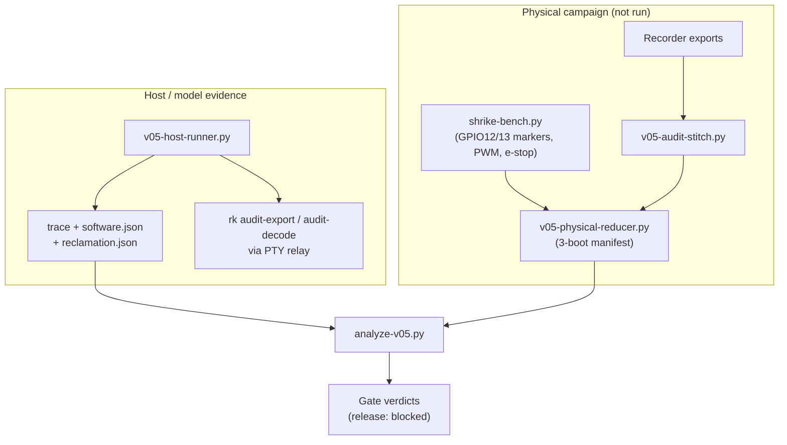

import { Callout } from 'nextra/components'

# Acceptance and Qualification

**Relevant source files**

- [docs/performance/v0.5-acceptance.json](https://github.com/pro-utkarshM/axiomOS/blob/feat/v0.5-runtime/docs/performance/v0.5-acceptance.json)
- [docs/plans/active/v0.5-bounded-runtime-evolution.md](https://github.com/pro-utkarshM/axiomOS/blob/feat/v0.5-runtime/docs/plans/active/v0.5-bounded-runtime-evolution.md)
- [docs/reviews/releases/2026-09-12-v0.5-m0/README.md](https://github.com/pro-utkarshM/axiomOS/blob/feat/v0.5-runtime/docs/reviews/releases/2026-09-12-v0.5-m0/README.md)
- [scripts/benchmark/v05-host-runner.py](https://github.com/pro-utkarshM/axiomOS/blob/feat/v0.5-runtime/scripts/benchmark/v05-host-runner.py)
- [scripts/benchmark/analyze-v05.py](https://github.com/pro-utkarshM/axiomOS/blob/feat/v0.5-runtime/scripts/benchmark/analyze-v05.py)
- [scripts/benchmark/v05-audit-stitch.py](https://github.com/pro-utkarshM/axiomOS/blob/feat/v0.5-runtime/scripts/benchmark/v05-audit-stitch.py)
- [scripts/benchmark/v05-physical-reducer.py](https://github.com/pro-utkarshM/axiomOS/blob/feat/v0.5-runtime/scripts/benchmark/v05-physical-reducer.py)
- [scripts/hil/shrike-bench.py](https://github.com/pro-utkarshM/axiomOS/blob/feat/v0.5-runtime/scripts/hil/shrike-bench.py)
- [scripts/verify/engineering-audit.sh](https://github.com/pro-utkarshM/axiomOS/blob/feat/v0.5-runtime/scripts/verify/engineering-audit.sh)

v0.5 is complete only when live upload, preparation, confirmed safe handoff, activation, fresh-state rollback and inspection work on qualified electronics within the declared timing and resource bounds. The thresholds live in the machine-readable [v0.5-acceptance.json](https://github.com/pro-utkarshM/axiomOS/blob/feat/v0.5-runtime/docs/performance/v0.5-acceptance.json); changing a threshold is a contract change. Synthetic evidence can never pass a release (`synthetic_evidence_can_pass_release: false`).

## Evidence pipeline



## Software gates (host)

`python3 -B scripts/benchmark/v05-host-runner.py --output target/v05-host-trace` retains the exact test executables, signed bundles, toolchain, raw output, acceptance configuration, reducer results and `SHA256SUMS`.

| Evidence | Content |
|---|---|
| Trace | 16 releases, four update attempts: two successes, one stale-generation rejection, one acknowledgement timeout; a modeled legacy-syscall stall (three missed releases) must fail coverage |
| `software.json` | 18 exact host tests: authentication/loading, preparation isolation, private state, ownership, publication races (120 interleavings plus stop/commit and stale A to B to A) |
| `reclamation.json` | 8 exact tests: three churn witnesses with high-water marks, counter exhaustion, retirement batch, capacity exclusion, delayed refunds |
| CLI | Real `rk` relays installer frames through a host PTY; every exported byte compared with the kernel capture; truncated export must reject |

Per the contract, the clean host workflow passes all 41 software cases and exports 93 recorder records, and the canonical quick audit passes 96 checks with no failures (QEMU fault-injection smoke disabled). The kernel host suite runs with:

```sh
EMBEDDED_DISK_PATH=/dev/null cargo test --locked -p kernel --lib \
  --features embedded-profile,managed-runtime
```

## Physical campaign requirements

From the acceptance configuration (motors disconnected):

| Requirement | Threshold |
|---|---|
| Cold boots | 3, each passing independently |
| Successful activation/rollback transitions | 10,000 total, 1,000 per boot, across 10 phase bins |
| Releases | 1,000,000 under upload, preparation, rollback and recorder pressure |
| Fault matrix | stop, link loss, MCU reset, ack failure x preparation, handoff, committed; 5 repeats each |
| Load trials | Valid replacement, invalid signature (`EACCES`), verifier rejection (`ENOEXEC`), over-budget (`E2BIG`), manual rollback |
| Pilot / soak | 3,600 s pilot, then 86,400 s continuous soak |
| Recorder overhead | Paired p99 at most 50,000 ppm |
| Calibration | `verifier-cost` corpus: 5 samples of 64 runs per shape |

The `managed-runtime-bench-markers` image drives GPIO12 high for each timer release and GPIO13 immediately before the recorder append; `shrike-bench.py` captures both markers with the FPGA PWM/direction outputs, e-stop and workload stimulus.

## Current verdict

<Callout type="warning">
The physical campaign has not run. The 2026-09-22 qualification review found that the reducer could reuse audit exports across boots and accept pilot/soak endpoints without continuous capture; those inputs now reject. Because independent fault-injection observations cannot yet be bound to operation phase and boot/capture clocks, the reducer reports `fault_matrix: not_evaluated`, `physical_campaign: blocked` and `physical_acceptance: false`. No threshold was relaxed.
</Callout>

Earlier retained physical results (10,000 paired safe-LOW monitor measurements, 1,000 PWM corpus requests) belong to their recorded images and do not qualify the new controller, handoff protocol or FPGA output path. GPIO reflex still misses the legacy latency target.
