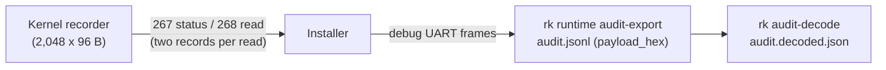

import { Callout } from 'nextra/components'

# Audit Recorder

**Relevant source files**

- [kernel/src/bpf/recorder.rs](https://github.com/pro-utkarshM/axiomOS/blob/feat/v0.5-runtime/kernel/src/bpf/recorder.rs)
- [kernel/src/bpf/recorder/events.rs](https://github.com/pro-utkarshM/axiomOS/blob/feat/v0.5-runtime/kernel/src/bpf/recorder/events.rs)
- [kernel/crates/kernel_bpf/src/actuation/recorder.rs](https://github.com/pro-utkarshM/axiomOS/blob/feat/v0.5-runtime/kernel/crates/kernel_bpf/src/actuation/recorder.rs)
- [kernel/crates/kernel_abi/src/recorder.rs](https://github.com/pro-utkarshM/axiomOS/blob/feat/v0.5-runtime/kernel/crates/kernel_abi/src/recorder.rs)
- [userspace/tools/rk_cli/src/commands/runtime/audit.rs](https://github.com/pro-utkarshM/axiomOS/blob/feat/v0.5-runtime/userspace/tools/rk_cli/src/commands/runtime/audit.rs)
- [userspace/tools/rk_cli/src/commands/runtime/audit/decode.rs](https://github.com/pro-utkarshM/axiomOS/blob/feat/v0.5-runtime/userspace/tools/rk_cli/src/commands/runtime/audit/decode.rs)
- [docs/security/runtime-installer-v1.md](https://github.com/pro-utkarshM/axiomOS/blob/feat/v0.5-runtime/docs/security/runtime-installer-v1.md)

The managed runtime keeps one statically allocated, kernel-owned **bounded RAM recorder**: 2,048 fixed records of 96 bytes (192 KiB). Recording cannot block control or make activation depend on log space. It promises a retained window after a normal stop, not lossless continuous export, a 24-hour history, power-loss recovery or replay.

## Retention core

- Each record envelope has sequence, recording ticks (CNTPCT), correlation, kind and a 64-byte payload.
- On wrap the oldest records are overwritten and loss counters increment; sequence exhaustion never wraps.
- Append, status and read run in a short IRQ-masked section on the qualified CPU, without the program-manager lock, allocation or waiting.
- The latest authoritative stop summary is kept separately and survives overwrite.
- Unchanged inhibited/stopped cycles increment suppression counters instead of new records.

Record kinds (`kernel_abi::recorder`):

| Kind | Value | Content |
|---|---|---|
| ARTIFACT | 1 | Four fragments carrying the 224-byte authenticated identity (manifest, bundle digest, signer fingerprint) |
| OPERATION | 2 | Upload outcomes (`operation_kind = 1`) and lifecycle boundaries (`operation_kind = 2`) |
| CYCLE | 3 | Controller cycle: artifact handle, generation, decision, local enqueue outcome |
| STOP | 4 | Trusted stop with specific cause |
| LINK | 5 | Clock ready (1), monitor release (2), motor TX (3), handoff protocol (4), session (5) subtypes |

Lifecycle events: acceptance, worker start, build outcome, handoff entry, commit, cancellation, retirement custody, reclamation settled. Actions: activate, rollback, deactivate, retire, rearm. Motor TX events distinguish framing, local UART completion and pending/frame discards (superseded, safe pair, expired, stop, handoff, inhibited). Handoff events: barrier begun, framed, local complete, reply matched/ignored/rejected, receipt committed.

## Export and decode

`rk runtime audit-export` freezes the end cursor from the initial status query, reads two records at a time and writes JSONL: a versioned `axiomos-managed-audit` header (clock frequency, session, slot generation, last operation ID, up to three retained artifact identities), record envelopes, explicit gap entries, and an end marker. Overwrite during export appears only as a reported gap; a concurrent slot change fails export.

`rk audit-decode audit.jsonl --output audit.decoded.json` validates schemas offline (input capped at 8 MiB), resolves identities from header context or complete fragment groups, joins public and internal operation IDs, checks protocol and lifecycle order, and lists missing context as `semantic_gaps`. Output declares `payloads_decoded: true`, `qualification_evaluated: false` and `signature_reverified: false`.

## Status v2

Version-2 recorder status keeps the v1 window fields and adds cumulative timer serviced, missed, late, completion-miss and safe-cycle counters plus the sticky timer fault. Long pilot/soak reduction uses this snapshot because a rolling window cannot prove that earlier releases were not missed.

<Callout type="info">
Recorder events distinguish policy approval, local enqueue and local UART acceptance; `sink_acceptance` is always unknown in decoded output. None of these proves motor movement. Recorder overhead (5% paired p99 target) is measured only in the physical campaign.
</Callout>
