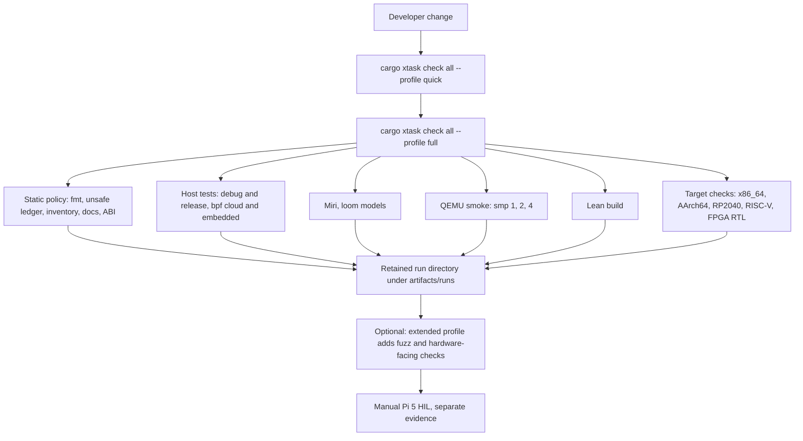

import { Callout } from 'nextra/components'

# Testing Overview

Relevant source files

- [docs/operations/testing.md](https://github.com/pro-utkarshM/axiomOS/blob/feat/v0.5-runtime/docs/operations/testing.md)
- [docs/operations/release-verification.md](https://github.com/pro-utkarshM/axiomOS/blob/feat/v0.5-runtime/docs/operations/release-verification.md)
- [CONTRIBUTING.md](https://github.com/pro-utkarshM/axiomOS/blob/feat/v0.5-runtime/CONTRIBUTING.md)
- [ci/README.md](https://github.com/pro-utkarshM/axiomOS/blob/feat/v0.5-runtime/ci/README.md)
- [scripts/verify/engineering-audit.sh](https://github.com/pro-utkarshM/axiomOS/blob/feat/v0.5-runtime/scripts/verify/engineering-audit.sh)
- [.github/workflows/build.yml](https://github.com/pro-utkarshM/axiomOS/blob/feat/v0.5-runtime/.github/workflows/build.yml)
- [.github/workflows/fuzz.yml](https://github.com/pro-utkarshM/axiomOS/blob/feat/v0.5-runtime/.github/workflows/fuzz.yml)

axiomOS testing is layered by what can be trusted at each level. Host tests cover everything extractable into `no_std` crates; QEMU smoke tests cover boot and in-guest probes; fuzzing and Miri cover adversarial and unsafe surfaces; Lean proofs cover a small slice of the verifier's abstract domain; and Raspberry Pi 5 behavior is validated manually.

<Callout type="warning">
There is no hardware-in-the-loop CI; Pi 5 testing is manual (README, issue 76). `docs/operations/release-verification.md` says a local pass must not be taken as physical HIL, independent review, a ForgeFPGA bitstream, or robot-level evidence.
</Callout>

<Callout type="info">
The managed runtime is covered by software, host and QEMU tests only. Physical qualification has not been run and actuation is disabled. See [Qualification](/axiomos/v0.5-runtime/runtime/qualification).
</Callout>

## Strategy

| Layer | What it checks | Where |
|-------|----------------|-------|
| Static policy | Formatting, clippy, unsafe-code ledger, inventory, boundaries, generated docs, ABI surface, error policy | `cargo xtask check ...`, `scripts/verify/*.py` |
| Host unit and integration tests | Kernel subsystems extracted as crates (`kernel_bpf`, `kernel_vfs`, `kernel_elfloader`, and others) | `cargo test -p ...` |
| Concurrency models | Loom models for the run queue and BPF epoch snapshot | `kernel_run_queue`, `kernel_bpf` |
| Miri | Undefined behavior in unsafe code | `cargo miri test` per crate |
| QEMU smoke | Boot reaches `QEMU_BOOT_OK`, `init` probes pass | audit gate, `scripts/test/smoke-bpf.sh` |
| Fuzzing | Verifier, signed container, ring buffer, ELF loader, syscall arguments, bridge protocol | `cargo fuzz` |
| Formal proofs | Tnum operator soundness in Lean | `formal/` |
| Managed-runtime host and model tests | Lifecycle, interleavings, bundle authentication, installer, Shrike control and FPGA simulation, v0.5 reducers | `kernel/src/bpf/*_tests.rs`, `firmware/shrike/simulation/tests`, `tests/scripts/test_v05_*.py` (see [Tests](/axiomos/v0.5-runtime/testing/tests)) |
| Hardware validation | GPIO, e-stop, PWM, timing on real boards | `scripts/hil/`, manual runbook |

The kernel binary cannot run standard Rust unit tests because it uses a custom linker script. CONTRIBUTING.md therefore asks that new functionality be extracted into separate host-testable crates where possible.

## Gate flow



## Commands

From `docs/operations/testing.md`:

```bash
cargo xtask check inventory
cargo xtask check boundary
cargo xtask check docs
cargo xtask check all --profile quick --no-qemu
cargo xtask check all --profile full
```

Substantial runs retain the command, environment, commit, results, summary and logs under ignored `artifacts/runs/` directories.

## Pages

| Page | Covers |
|------|--------|
| [Tests](/axiomos/v0.5-runtime/testing/tests) | Host tests, kernel tests, script tests, smoke, fuzzing |
| [CI and gates](/axiomos/v0.5-runtime/testing/ci) | Manifests, profiles, xtask checks, GitHub workflows |
| [Formal verification](/axiomos/v0.5-runtime/testing/formal-verification) | Lean tnum proofs |
| [Hardware-in-the-loop](/axiomos/v0.5-runtime/testing/hardware-in-the-loop) | HIL scripts and manual Pi 5 validation |
