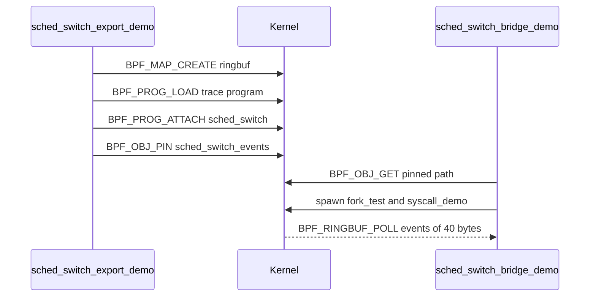

import { Callout } from 'nextra/components'

# Demos

Relevant source files

- [userspace/demos/gpio_demo/src/main.rs](https://github.com/pro-utkarshM/axiomOS/blob/feat/v0.5-runtime/userspace/demos/gpio_demo/src/main.rs)
- [userspace/demos/iio_demo/src/main.rs](https://github.com/pro-utkarshM/axiomOS/blob/feat/v0.5-runtime/userspace/demos/iio_demo/src/main.rs)
- [userspace/demos/timeseries_demo/src/main.rs](https://github.com/pro-utkarshM/axiomOS/blob/feat/v0.5-runtime/userspace/demos/timeseries_demo/src/main.rs)
- [userspace/demos/sched_switch_demo/src/main.rs](https://github.com/pro-utkarshM/axiomOS/blob/feat/v0.5-runtime/userspace/demos/sched_switch_demo/src/main.rs)
- [userspace/demos/sched_switch_export_demo/src/main.rs](https://github.com/pro-utkarshM/axiomOS/blob/feat/v0.5-runtime/userspace/demos/sched_switch_export_demo/src/main.rs)
- [userspace/demos/sched_switch_bridge_demo/src/main.rs](https://github.com/pro-utkarshM/axiomOS/blob/feat/v0.5-runtime/userspace/demos/sched_switch_bridge_demo/src/main.rs)
- [userspace/demos/safety_demo/src/main.rs](https://github.com/pro-utkarshM/axiomOS/blob/feat/v0.5-runtime/userspace/demos/safety_demo/src/main.rs)
- [examples/bpf/managed/README.md](https://github.com/pro-utkarshM/axiomOS/blob/feat/v0.5-runtime/examples/bpf/managed/README.md)
- [examples/bpf/managed/managed.h](https://github.com/pro-utkarshM/axiomOS/blob/feat/v0.5-runtime/examples/bpf/managed/managed.h)
- [examples/bpf/managed/build.sh](https://github.com/pro-utkarshM/axiomOS/blob/feat/v0.5-runtime/examples/bpf/managed/build.sh)
- [examples/bpf/hello.bpf.c](https://github.com/pro-utkarshM/axiomOS/blob/feat/v0.5-runtime/examples/bpf/hello.bpf.c)
- [ci/manifests/components.toml](https://github.com/pro-utkarshM/axiomOS/blob/feat/v0.5-runtime/ci/manifests/components.toml)

The demos under `userspace/demos/` are executable examples and integration probes, not production tools. Most follow the same pattern: create a map, build a small BPF program from raw instructions, `BPF_PROG_LOAD` it, `BPF_PROG_ATTACH` it to a hook, then read results.

## Catalog

All except `safety_demo` are installed in `/bin` of the rootfs.

| Binary | Role (components.toml) | Purpose | Platform notes |
|--------|------------------------|---------|----------------|
| `gpio_demo` | GPIO demo | Loads a BPF program attached to GPIO 17 rising edge that toggles an LED on GPIO 18 (button to LED), then runs indefinitely | GPIO attach is Pi 5 only |
| `pwm_demo` | PWM demo | Retired. Prints that PWM observation hooks are unsupported (suggests the actuation audit and external capture) and exits 1. The command name is kept | Pi 5 PWM |
| `timeseries_demo` | time-series map demo | Creates a `TIMESERIES` map, loads a producer program attached to the timer, and reads the latest timestamp and value from userspace | Timer attach |
| `iio_demo` | IIO demo | Ringbuf map plus a BPF filter attached to IIO device 0 that keeps sensor values within 100 to 900 (the constants `MIN_VALUE` and `MAX_VALUE`); event layout must match `kernel_bpf/src/attach/iio.rs` | IIO attach is Pi 5 only |
| `syscall_demo` | syscall demo | Exercises `malloc`, `writev`, `pipe`, `dup`, `dup2`, `read`, `write` and `close` | |
| `sys_exit_demo` | task-exit probe | Creates a ringbuf, loads a program on the `sys_exit` hook, polls events (`syscall_nr`, `result`). Four-step banner | Gate: target build and QEMU |
| `sched_switch_demo` | scheduler demo | Creates a ringbuf, loads a `sched_switch` trace program, attaches it, and prints live scheduler events from the same process | |
| `sched_switch_export_demo` | scheduler export demo | Same hook, but pins the ringbuf at `/sys/fs/bpf/maps/sched_switch_events` with `BPF_OBJ_PIN` so another process can consume it | Used by `smoke-bpf.sh` |
| `sched_switch_bridge_demo` | scheduler bridge demo | Opens the pinned ringbuf (`BPF_OBJ_GET`), launches a workload (`fork_test` twice and `syscall_demo`), polls up to 120 times and prints events. Tells you to run the export demo first if the object is missing | Consumer half of the pair |
| `file_io_demo` | filesystem demo | Reads `/bin/init` and writes to `/dev/null` | |
| `fork_test` | process lifecycle probe | `fork`, child prints and exits 42, parent `waitpid` checks status. Also the `execve` target in init's lifecycle probe | Gate: target build and QEMU |
| `safety_demo` | safety-state demo | "Legacy BPF reflex demo": a motor program on the timer (PWM0 channel 1 at 50 percent duty) and a monitored limit-switch reflex on GPIO 17. It states it is not the hard e-stop path | Not in the rootfs (disposition `none`) |

<Callout type="warning">
`safety_demo` prints that it is a monitored BPF reflex path and not the hard e-stop. The hard stop path it points to is `SYS_ESTOP`, the watchdog, and the GPIO24 bench path.
</Callout>

## Typical sequence: scheduler tracing

Each `sched_switch` event is 40 bytes: `cpu_id`, `prev_pid`, `prev_tid`, `next_pid`, `next_tid`, all `u64`. In the development configuration, `init` spawns the export demo and then the bridge demo. The [UART forwarder](/axiomos/v0.5-runtime/userspace/tools) reads the same pinned object.

## Running a demo

Demos are plain executables in `/bin`. The README lists a "shell + basic utilities", but the repository only shows `init` auto-starting the loader; to launch another demo, spawn it from a program via `spawn` or `spawn_restricted`, or use whatever shell the kernel provides. Hook availability matters: GPIO, IIO and PWM attach types are listed as Raspberry Pi 5 only in `docs/reference/generated/abi.md`.

## Managed controller examples

`examples/bpf/managed/` holds three C controllers for the [managed runtime](/axiomos/v0.5-runtime/runtime), with a shared `managed.h`. Each reads the frozen sensor snapshot and makes one capture-only motor-pair request. The sensor value is the raw sonar echo duration from Shrike in microseconds, not a calibrated distance. A request of `(0, 0)` is made for an invalid sensor flag or a nonpositive echo.

| Controller | Behavior |
|------------|----------|
| `conservative_obstacle.c` | Stops below 1400 us, otherwise requests 250 per-mille cruise |
| `slow_approach.c` | Stops through 600 us, requests 100 per-mille through 1399 us, otherwise 300 per-mille |
| `clear_streak.c` | Uses private array handle 1; after three consecutive samples of at least 1400 us it requests 180 per-mille, and an invalid or nearer sample resets the streak |

<Callout type="warning">
The thresholds are compile-time demonstration knobs pending sensor and chassis calibration. The README states these examples have no physical safety qualification, and the kernel still applies its trusted actuation monitor after capture.
</Callout>

`examples/bpf/managed/build.sh` compiles each with `clang -target bpfel -mcpu=v3 -O2` and extracts `.text` with `llvm-objcopy` into `target/managed-bpf/*.bin`. Sign them with [`rk bundle`](/axiomos/v0.5-runtime/userspace/tools) (`--motor-pair` for all three, plus `--array-value-size 4 --array-entries 1` for `clear_streak`). Generated files are not part of the boot image.

`examples/bpf/hello.bpf.c` is now described as the production signed-load smoke fixture for the legacy ELF loader, which accepts exactly one entry and no maps. Its timer example section was removed.
