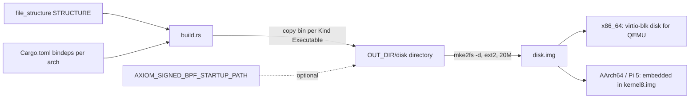

import { Callout } from 'nextra/components'

# Userspace Overview

Relevant source files

- [userspace/README.md](https://github.com/pro-utkarshM/axiomOS/blob/feat/v0.5-runtime/userspace/README.md)
- [userspace/core/file_structure/src/lib.rs](https://github.com/pro-utkarshM/axiomOS/blob/feat/v0.5-runtime/userspace/core/file_structure/src/lib.rs)
- [build.rs](https://github.com/pro-utkarshM/axiomOS/blob/feat/v0.5-runtime/build.rs)
- [Cargo.toml](https://github.com/pro-utkarshM/axiomOS/blob/feat/v0.5-runtime/Cargo.toml)
- [ci/manifests/components.toml](https://github.com/pro-utkarshM/axiomOS/blob/feat/v0.5-runtime/ci/manifests/components.toml)
- [docs/reference/generated/abi.md](https://github.com/pro-utkarshM/axiomOS/blob/feat/v0.5-runtime/docs/reference/generated/abi.md)

Userspace in axiomOS is a set of small `no_std`, `no_main` Rust programs that run in ring 3 (x86_64) or EL0 (AArch64), talk to the kernel through a custom syscall ABI, and are packed into an ext2 root filesystem at build time. There is no libc; every program links the tiny runtime `minilib`.

## Layout

The `userspace/` directory is grouped by role. Package names stay stable.

| Directory | Role |
|-----------|------|
| `core/` | `init`, `minilib`, and `file_structure` (the rootfs model) |
| `tools/` | BPF loaders, the `rk` host CLI, the `rk_bridge` ROS2 bridge, and the UART forwarder |
| `demos/` | Executable examples and integration probes. Not production tools |
| `benchmarks/` | Measurement workloads and the verifier calibration driver |

`ci/manifests/components.toml` declares the exact workspace and rootfs disposition of every crate. Directory grouping alone does not promote a demo or benchmark into a shipped product surface.

## How binaries become a rootfs

1. **Declare.** `userspace/core/file_structure` exports a const `STRUCTURE` tree of `Dir` and `File` entries. Files are `Kind::Executable` or `Kind::Resource`. `validate()` rejects empty, `.`, `..`, slash-containing and duplicate names.
2. **Depend.** The root `Cargo.toml` lists every binary as an artifact dependency (`artifact = "bin"`) for both `x86_64-unknown-none` and `aarch64-unknown-none`, with an `_x86` or `_aarch64` suffix on the dependency name, all `optional` and enabled by the `x86_64_deps` or `aarch64_deps` features.
3. **Copy.** `build.rs` walks `STRUCTURE`. For each executable it reads the environment variable `CARGO_BIN_FILE_<DEP>_<name>` that Cargo sets, and copies the binary into a temporary `disk` directory. A missing variable panics, so adding a file to `STRUCTURE` without a matching dependency fails the build. `Kind::Resource` is currently a `todo!()`.
4. **Pack.** `mke2fs -t ext2 -m 5 -d <dir> ... 20M`, with a fixed UUID, hash seed and `SOURCE_DATE_EPOCH=0` so the image is reproducible.
5. **Deliver.** On x86_64 the image is attached as a VirtIO block device. On the Pi, `scripts/build/rpi5.sh` embeds it in the kernel.

The kernel mounts the image read-only (README: VFS + ext2, read-only) and loads `/bin/init` as the first process. Boot panics if `/bin/init` is missing.

## Rootfs contents

From `STRUCTURE`:

| Path | Contents |
|------|----------|
| `/bin` | `init`, `gpio_demo`, `pwm_demo`, `timeseries_demo`, `iio_demo`, `syscall_demo`, `sys_exit_demo`, `sched_switch_demo`, `sched_switch_export_demo`, `sched_switch_bridge_demo`, `rk_uart_forwarder`, `file_io_demo`, `fork_test`, `bpf_loader`, `signed_bpf_loader`, `benchmark`, `verifier_bench` |
| `/dev/fd` | Empty directory |
| `/var/tmp` | Empty directory |
| `/var/lib/rkbpf/programs` | Empty unless `AXIOM_SIGNED_BPF_STARTUP_PATH` is set at build time, which places `startup.rbpf` here. `build.rs` also writes `/var/hello.txt` |

`safety_demo` and the host tools `rk` and `rk_bridge` are not in the rootfs. `safety_demo` has artifact disposition `none` in the component manifest; `rk_bridge` and `rk` are host binaries.

<Callout type="info">
The kernel exposes pinned BPF objects under `/sys/fs/bpf/maps/...` (for example `/sys/fs/bpf/maps/sched_switch_events`). Those paths are created at runtime by `BPF_OBJ_PIN`, not stored in the image.
</Callout>

## Boot-time behavior of init

`init` first runs a series of diagnostic probes that print markers (for example `USERCOPY_EFAULT_OK`, `NANOSLEEP_WAITQ_OK`, `PIPE_WAITQ_OK`, `LIFECYCLE_EXEC_WAIT_OK`, `BPF_FOREIGN_OWNER_DENY_OK`), then spawns the BPF workload:

| Build | What init spawns |
|-------|------------------|
| Default (signed) | `/bin/signed_bpf_loader` with `BPF_CAP_PROGRAM_LOAD` and `BPF_CAP_MAP_READ` |
| `bpf-unsigned-development` | `/bin/sched_switch_export_demo`, then after 100 ms `/bin/sched_switch_bridge_demo`, each with a restricted capability set |

It then parks in `pause()`.

With the `managed-runtime` feature, `init` runs none of those probes. It spawns only `/bin/signed_bpf_loader` (built in installer mode) with `BPF_CAP_BEHAVIOR_ADMIN`, drops its own BPF capabilities and sleeps. See [Installer](/axiomos/v0.5-runtime/runtime/installer) and the [managed runtime](/axiomos/v0.5-runtime/runtime). See [Core libraries](/axiomos/v0.5-runtime/userspace/core-libraries) for details.

## Where things run

| Page | Covers |
|------|--------|
| [Core libraries](/axiomos/v0.5-runtime/userspace/core-libraries) | `init`, `minilib`, `file_structure` |
| [Demos](/axiomos/v0.5-runtime/userspace/demos) | Every demo program |
| [Tools](/axiomos/v0.5-runtime/userspace/tools) | Loaders, `rk` (including `rk bundle` and `rk runtime`), `rk_bridge`, forwarder, wire protocol |
| [Benchmarks](/axiomos/v0.5-runtime/userspace/benchmarks) | `benchmark` and `verifier_bench` |
