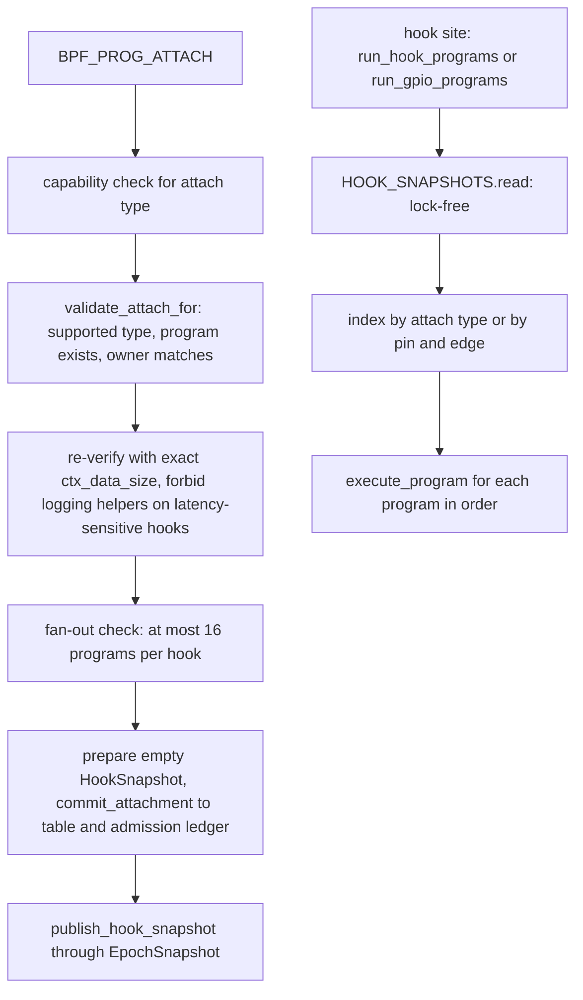

import { Callout } from 'nextra/components'

# Hooks

Relevant source files

- [kernel/crates/kernel_abi/src/bpf.rs](https://github.com/pro-utkarshM/axiomOS/blob/release/v0.5.0-alpha.3/kernel/crates/kernel_abi/src/bpf.rs)
- [kernel/crates/kernel_abi/src/catalog.rs](https://github.com/pro-utkarshM/axiomOS/blob/release/v0.5.0-alpha.3/kernel/crates/kernel_abi/src/catalog.rs)
- [kernel/src/bpf/mod.rs](https://github.com/pro-utkarshM/axiomOS/blob/release/v0.5.0-alpha.3/kernel/src/bpf/mod.rs)
- [kernel/src/syscall/bpf.rs](https://github.com/pro-utkarshM/axiomOS/blob/release/v0.5.0-alpha.3/kernel/src/syscall/bpf.rs)
- [kernel/src/syscall/mod.rs](https://github.com/pro-utkarshM/axiomOS/blob/release/v0.5.0-alpha.3/kernel/src/syscall/mod.rs)
- [kernel/src/mcore/mtask/scheduler/mod.rs](https://github.com/pro-utkarshM/axiomOS/blob/release/v0.5.0-alpha.3/kernel/src/mcore/mtask/scheduler/mod.rs)
- [kernel/src/arch/idt.rs](https://github.com/pro-utkarshM/axiomOS/blob/release/v0.5.0-alpha.3/kernel/src/arch/idt.rs)
- [kernel/src/arch/aarch64/interrupts.rs](https://github.com/pro-utkarshM/axiomOS/blob/release/v0.5.0-alpha.3/kernel/src/arch/aarch64/interrupts.rs)
- [kernel/src/arch/aarch64/platform/rpi5/gpio.rs](https://github.com/pro-utkarshM/axiomOS/blob/release/v0.5.0-alpha.3/kernel/src/arch/aarch64/platform/rpi5/gpio.rs)
- [kernel/src/driver/iio.rs](https://github.com/pro-utkarshM/axiomOS/blob/release/v0.5.0-alpha.3/kernel/src/driver/iio.rs)
- [kernel/crates/kernel_bpf/src/attach/mod.rs](https://github.com/pro-utkarshM/axiomOS/blob/release/v0.5.0-alpha.3/kernel/crates/kernel_bpf/src/attach/mod.rs)
- [kernel/crates/kernel_bpf/src/attach/route.rs](https://github.com/pro-utkarshM/axiomOS/blob/release/v0.5.0-alpha.3/kernel/crates/kernel_bpf/src/attach/route.rs)

## Attach types in the ABI

`kernel_abi` defines the numeric attach types passed in `BpfAttr::attach_btf_id` to `BPF_PROG_ATTACH`. The manager's `is_supported_attach_type` accepts all seven constants.

| Value | Constant | Accepted by `BpfManager` | Required capability | Fired from |
|---:|---|---|---|---|
| 1 | `BPF_ATTACH_TYPE_TIMER` | yes | `ATTACH_TRACE` | Timer interrupt handler: `kernel/src/arch/idt.rs` (x86_64) and `kernel/src/arch/aarch64/interrupts.rs` (aarch64) |
| 2 | `BPF_ATTACH_TYPE_GPIO` | yes | `ATTACH_DEVICE` | Raspberry Pi 5 GPIO IRQ path in `rpi5/gpio.rs` via `run_gpio_programs` |
| 3 | `BPF_ATTACH_TYPE_PWM` | yes | `ATTACH_DEVICE` | Raspberry Pi 5 PWM driver: `Rp1Pwm::trigger_event` in `rpi5/pwm.rs` |
| 4 | `BPF_ATTACH_TYPE_IIO` | yes | `ATTACH_DEVICE` | `IioManager::dispatch_event` in `kernel/src/driver/iio.rs` |
| 5 | `BPF_ATTACH_TYPE_SYS_ENTER` (alias `BPF_ATTACH_TYPE_SYSCALL`) | yes | `ATTACH_TRACE` | Start of the syscall dispatcher in `kernel/src/syscall/mod.rs` |
| 6 | `BPF_ATTACH_TYPE_SYS_EXIT` | yes | `ATTACH_TRACE` | End of the syscall dispatcher |
| 7 | `BPF_ATTACH_TYPE_SCHED_SWITCH` | yes | `ATTACH_SCHEDULER` | The scheduler's `reschedule`, just before the task swap |

The ABI catalog (`SUPPORTED_BPF_ATTACH_TYPES`) lists timer, sys_enter, sys_exit and sched_switch for the cloud and embedded profiles, and GPIO, PWM and IIO for Raspberry Pi 5.

Details verified in code:

- **Timer.** On aarch64 the timer tick handler samples the counter to compute interrupt latency from the vector-entry timestamp, stores it in the `BpfContext`, then runs the hook. On x86_64 the handler runs the hook with an empty context. The context payload is empty (`VERIFY_CTX_DATA_SIZE_NONE`).
- **Syscall entry and exit.** Compiled for `x86_64` and `aarch64`. Entry passes `SyscallTraceContext` (`syscall_nr`, `arg1` to `arg6`, all `u64`); exit passes `SyscallExitContext` (`syscall_nr`, `result` as `i64`). Entry hooks run before the syscall body and exit hooks after the result is computed.
- **Scheduler switch.** `SchedSwitchContext` carries `cpu_id`, `prev_pid`, `prev_tid`, `next_pid`, `next_tid`.
- **GPIO.** Requires `aarch64` with the `rpi5` feature. `BPF_PROG_ATTACH` takes the pin from `attr.key` (must be 0 to 27) and edge flags from `attr.value` (1 rising, 2 falling, 3 both; zero flags enable both edges), registers a per-pin, per-edge route, configures the pin as input and enables the interrupt. The IRQ handler builds a `GpioEvent` (`timestamp`, `chip_id`, `line`, `edge`, `value`) and dispatches only to programs routed for that pin and edge. On other targets the generic attach path is used and no GPIO IRQ is armed.
- **IIO.** `IioEvent` carries `timestamp`, `device_id`, `channel`, `value`, `scale`, `offset`, `reserved`. In the tree the event sources are a simulated accelerometer task (x86_64 and non-rpi5 aarch64) and a synthetic ultrasonic injection in the Pi 5 control-link code. The syscall layer comment notes device and sensor selection from `attr.key` and `attr.value` is not implemented for IIO.
- **PWM.** Requires `aarch64` with the `rpi5` feature for the event source. The Pi 5 PWM driver builds a `PwmEvent` (`timestamp`, `chip_id`, `channel`, `period_ns`, `duty_ns`, `polarity`, `enabled`) when a channel is enabled, disabled or reconfigured and runs the programs attached to the PWM hook. The `sys_bpf` attach path only logs the requested chip and channel; it does not change PWM hardware state. The `bpf_pwm_write` helper (an actuator, not an observer) is a separate mechanism; see [Maps and Helpers](/axiomos/v0.5.0-alpha.3/bpf/maps-and-helpers).

### Attach metadata that is not wired to the kernel

`kernel_bpf::attach::AttachType` is a broader abstraction (kprobe, kretprobe, tracepoint, raw tracepoint, perf event, XDP, cgroup skb, socket filter, sched cls, IIO, GPIO, PWM, serial, CAN, I2C, SPI) with `KprobeAttach`, `TracepointAttach`, `GpioAttach`, `IioAttach` and `PwmAttach` helper types. These are library-level metadata; the kernel's `sys_bpf` path only recognises the numeric attach types in the table above. The ELF loader's section-name prefixes (`kprobe`, `xdp`, and so on) do not create hooks.

## Dispatch

- **Snapshot structure.** `HookSnapshot` holds a fixed array of 16-program lists indexed directly by attach type (slots up to `SCHED_SWITCH`) and 84 GPIO lists (28 pins times 3 edge slots) of 8 programs each. Constants: `HOOK_FANOUT_LIMIT = 16`, `GPIO_IRQ_FANOUT_LIMIT = 8`, `BPF_GPIO_PIN_COUNT = 28`.
- **Publication.** Attach and detach run under the serialized `BpfManager`. They build a complete replacement snapshot and publish it through `EpochSnapshot`; readers touch only atomics and never allocate, lock, or change reference counts, and the old snapshot is reclaimed after reader epochs drain. A `loom` model of the algorithm exists behind the `loom-model` feature.
- **Execution.** `run_snapshot` executes each attached program synchronously in registration order. A program error aborts the remaining programs in that call and is returned to the caller; every hook site in the kernel ignores or traces the result (`let _ =`).
- **Re-verification at attach.** Attach runs the verifier again with `ctx_data_size` set to the hook's payload struct size (`SyscallTraceContext`, `SyscallExitContext`, `SchedSwitchContext`, `GpioEvent`, `PwmEvent`, `IioEvent`; none for timer). Load-time verification uses the maximum across hook payloads. The R1-reachable `BpfContext` size is the same for every hook.
- **Logging ban.** `forbid_logging_helpers` is set for timer, GPIO and sched_switch. A program that calls `bpf_trace_printk` can still load and attach to sys_enter (the unit test covers the cloud profile) but attach to those three hooks fails with `VerificationFailed`.
- **Admission.** Every attachment commits `wcet * CYCLE_UNIT_NS * freq` to the ledger. On embedded, all hooks are assumed to fire at 1 kHz regardless of hook type ([Verifier](/axiomos/v0.5.0-alpha.3/bpf/verifier)).
- **Detach and unload.** Detach releases the admission contribution and removes GPIO routes for the program. Unload fails with busy while a program is attached or still referenced by a snapshot.

<Callout type="info">
GPIO detach does not disable the pin's hardware interrupt: `sys_bpf` carries a comment that `BpfManager` does not track per-pin attachments yet, and calls this a known limitation.
</Callout>
