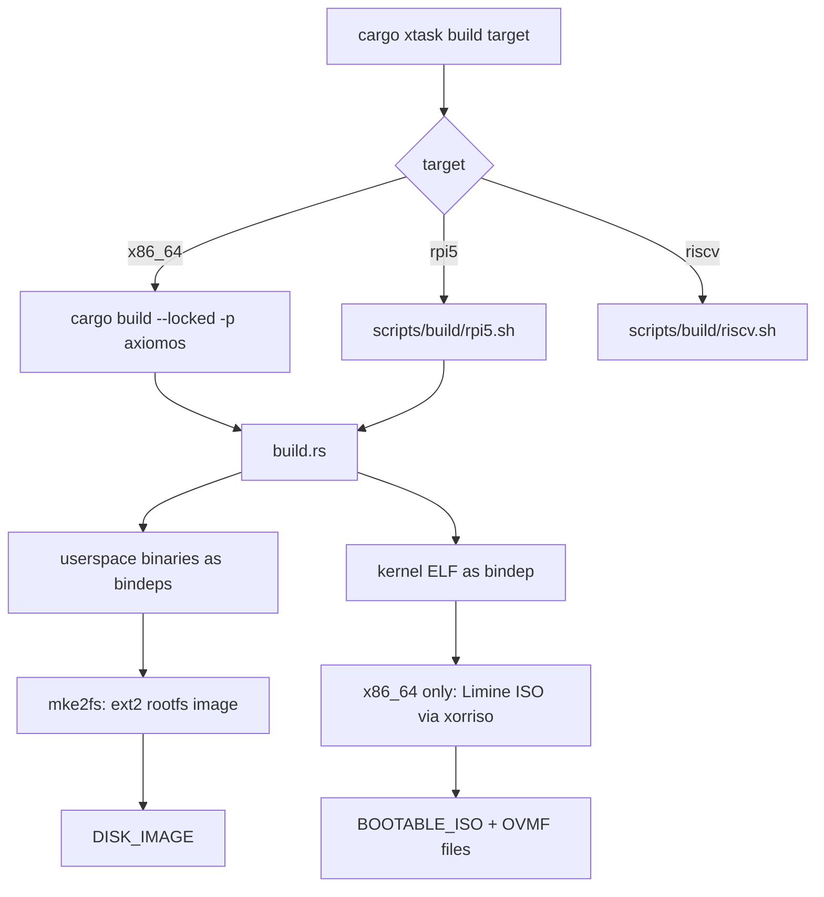

import { Callout, Steps } from 'nextra/components'

# Building

Relevant source files

- [Cargo.toml](https://github.com/pro-utkarshM/axiomOS/blob/release/v0.5.0-alpha.3/Cargo.toml)
- [build.rs](https://github.com/pro-utkarshM/axiomOS/blob/release/v0.5.0-alpha.3/build.rs)
- [src/main.rs](https://github.com/pro-utkarshM/axiomOS/blob/release/v0.5.0-alpha.3/src/main.rs)
- [tools/xtask/src/cli.rs](https://github.com/pro-utkarshM/axiomOS/blob/release/v0.5.0-alpha.3/tools/xtask/src/cli.rs)
- [tools/xtask/src/commands.rs](https://github.com/pro-utkarshM/axiomOS/blob/release/v0.5.0-alpha.3/tools/xtask/src/commands.rs)
- [scripts/README.md](https://github.com/pro-utkarshM/axiomOS/blob/release/v0.5.0-alpha.3/scripts/README.md)
- [scripts/build/rpi5.sh](https://github.com/pro-utkarshM/axiomOS/blob/release/v0.5.0-alpha.3/scripts/build/rpi5.sh)
- [kernel/Cargo.toml](https://github.com/pro-utkarshM/axiomOS/blob/release/v0.5.0-alpha.3/kernel/Cargo.toml)
- [docs/operations/build.md](https://github.com/pro-utkarshM/axiomOS/blob/release/v0.5.0-alpha.3/docs/operations/build.md)
- [docs/reference/generated/artifacts.md](https://github.com/pro-utkarshM/axiomOS/blob/release/v0.5.0-alpha.3/docs/reference/generated/artifacts.md)

The build is driven by Cargo plus a typed command surface, `cargo xtask`. The root package (`axiomos`) is both the host-side QEMU runner (`src/main.rs`) and the image assembler (`build.rs`), which builds the kernel and every userspace binary for the target architecture as artifact dependencies.

## Build flow



## cargo xtask

`cargo xtask` is an alias for `run --locked --package xtask --`. The grammar below comes from `tools/xtask/src/cli.rs` and the usage text in `commands.rs`.

| Command | What it does |
|---------|--------------|
| `cargo xtask build x86_64` | `cargo build --locked -p axiomos` |
| `cargo xtask build rpi5` | Runs `scripts/build/rpi5.sh` |
| `cargo xtask build riscv` | Runs `scripts/build/riscv.sh` (standalone RISC-V demo kernel) |
| `cargo xtask run x86_64` | `cargo run --locked -p axiomos --` (runner args after `--`) |
| `cargo xtask run virt` | Runs `scripts/run/virt.sh` (AArch64 QEMU virt) |
| `cargo xtask run riscv` | Runs `scripts/run/riscv.sh` |
| `cargo xtask deploy rpi5` | Runs `scripts/deploy/rpi5.sh` |
| `cargo xtask bench verifier` | Runs `scripts/benchmark/verifier-cost.py` (alias `verifier-cost`) |
| `cargo xtask debug qemu` | Runs `scripts/debug/qemu-triage.sh` |
| `cargo xtask inventory --check` | Validates the component inventory |
| `cargo xtask boundary --check` | Validates workspace/artifact boundaries (`--check` is required) |
| `cargo xtask docs [--check]` | Regenerates or checks `docs/reference/generated/` |
| `cargo xtask check NAME` | Focused checks and `all`; see [CI](/axiomos/v0.5.0-alpha.3/testing/ci) |
| `cargo xtask ci [--quick or --full or --extended]` | Compatibility entry point for the audit gate |

`build`, `run`, `deploy`, `bench` and `debug` all take a target, an optional `--dry-run`, and trailing arguments after `--` that are forwarded to the underlying implementation. `--dry-run` prints the delegated command instead of running it.

```bash
cargo xtask build rpi5 --dry-run
cargo xtask run x86_64 -- --headless --smp 2
```

## x86_64 via plain Cargo

```bash
cargo build              # debug
cargo build --release    # release
cargo run                # build then boot in QEMU
cargo run -- --no-run    # build only; prints KERNEL_BINARY, BOOTABLE_ISO, DISK_IMAGE
```

The default feature set is `x86_64_deps`, which pulls the x86_64 builds of the kernel (with `cloud-profile`) and all userspace crates.

## AArch64 and Raspberry Pi 5

The AArch64 image uses `--no-default-features --features aarch64_deps`:

```bash
cargo build --release --target aarch64-unknown-none \
  --no-default-features --features aarch64_deps
```

`scripts/build/rpi5.sh` wraps the two-stage process for the Pi; see [Raspberry Pi 5](/axiomos/v0.5.0-alpha.3/getting-started/raspberry-pi-5).

## Cargo features

Root `Cargo.toml` features:

| Feature | Effect |
|---------|--------|
| `x86_64_deps` (default) | x86_64 kernel and userspace artifacts |
| `aarch64_deps` | AArch64 kernel and userspace artifacts |
| `bpf-unsigned-development` | Enables the kernel and `init` development path for unsigned BPF (x86_64) |
| `bpf-unsigned-development-aarch64` | Same, for AArch64 |
| `audit-diagnostics` / `audit-diagnostics-aarch64` | One-shot serial markers consumed by the audit gate |
| `audit-fault-injection` | Fault-injection boot probe (x86_64) |
| `bringup-diagnostics` | Raw AArch64 register/UART probes for bring-up |
| `host-runner-tests` | Compile only the host runner and its tests; `build.rs` rejects it outside the debug profile or with target artifact features |

Kernel features (`kernel/Cargo.toml`) that you pass for the Pi build via `scripts/build/rpi5.sh`:

| Feature | Meaning |
|---------|---------|
| `cloud-profile` | Cloud eBPF profile (used for x86_64 and AArch64 virt) |
| `embedded-profile` | Embedded eBPF profile; implies `rpi5` |
| `embedded-rpi5` | Alias for `embedded-profile` (default for the Pi script) |
| `virt` | AArch64 QEMU virt platform |
| `verifier-cost` | Emit `AXIOM VERIFIER COST` markers (instrumentation, not for production) |
| `bench` | On-chip latency instrumentation, physical e-stop button IRQ path and an auto-loaded GPIO reflex |
| `audit-diagnostics`, `audit-fault-injection`, `bringup-diagnostics` | As above |

<Callout type="warning">
`cloud-profile` and `embedded-profile` are mutually exclusive in `kernel_bpf`, and one of them is required. `bpf-unsigned-development` is an explicit escape hatch for local demo images. The kernel source says production artifacts must never enable it.
</Callout>

### Signed versus unsigned BPF

Without `bpf-unsigned-development`, the kernel includes the production trust key with `include_bytes!(env!("AXIOM_BPF_TRUSTED_KEY_PATH"))`, so `AXIOM_BPF_TRUSTED_KEY_PATH` must be set at build time. The Pi and virt scripts check that the file exists and is exactly 32 bytes. With the feature, the trust module takes a different path and no key is needed. In that mode `init` spawns `sched_switch_export_demo` and `sched_switch_bridge_demo` instead of `signed_bpf_loader`.

An optional signed startup program can be baked into the rootfs: set `AXIOM_SIGNED_BPF_STARTUP_PATH` to a signed container and `build.rs` copies it to `/var/lib/rkbpf/programs/startup.rbpf`.

## Environment variables

| Variable | Used by | Purpose |
|----------|---------|---------|
| `AXIOM_BPF_TRUSTED_KEY_PATH` | kernel build, rpi5.sh, virt.sh | 32-byte Ed25519 public key |
| `AXIOM_SIGNED_BPF_STARTUP_PATH` | build.rs | Signed program placed in the rootfs |
| `AXIOM_ARTIFACT_PATHS` | build.rs | File to which build.rs writes `KERNEL_BINARY`, `DISK_IMAGE`, `BOOTABLE_ISO` and OVMF paths for that exact invocation |
| `AXIOM_DISK_IMAGE` | rpi5.sh (kernel stage) | Rootfs image embedded in the kernel |
| `AXIOMOS_QEMU_MONITOR_PORT`, `AXIOMOS_QEMU_DISABLE_MONITOR`, `AXIOMOS_QEMU_AUDIT_NAME` | src/main.rs | Runner QEMU options |

## What build.rs produces

<Steps>

### Resolve the kernel

The kernel ELF comes from `CARGO_BIN_FILE_KERNEL_X86_kernel` or `CARGO_BIN_FILE_KERNEL_AARCH64_kernel`, set by Cargo for the artifact dependency.

### Populate the rootfs directory

`userspace/core/file_structure` declares the tree. Each executable is copied from its artifact dependency into `/bin`. See [Userspace](/axiomos/v0.5.0-alpha.3/userspace).

### Make the ext2 image

`mke2fs -d` builds a 20M ext2 image. For the Pi 5 the image is embedded in the kernel, so it is part of the `kernel8.img` provenance hashes.

### x86_64 only: ISO and firmware

Limine is cloned at the pinned revision, an ISO is built with `xorriso`, and OVMF is fetched (checked against `OVMF_SHA256`).

</Steps>

## Artifacts

Per `docs/reference/generated/artifacts.md`:

| Artifact | Producer | Location |
|----------|----------|----------|
| x86_64 boot ISO, kernel ELF, rootfs | `cargo build --locked --release -p axiomos` | Paths reported by `target/release/axiomos --no-run` |
| Pi 5 kernel ELF | `cargo xtask build rpi5 -- release embedded-rpi5` | `target/aarch64-unknown-none/release/kernel` |
| Pi 5 raw kernel | same | `target/aarch64-unknown-none/release/kernel8.img` |
| Pi 5 hashes | same | `target/aarch64-unknown-none/release/rpi5-artifacts.sha256` |
| AArch64 virt rootfs | `cargo xtask run virt` | Reported by the invocation |

Do not select artifacts by newest timestamp. Use the paths reported through `AXIOM_ARTIFACT_PATHS` or `--no-run`.

## Scripts layout

`scripts/README.md` states that scripts are focused process adapters behind `cargo xtask`.

| Responsibility | Script |
|----------------|--------|
| Build | `build/riscv.sh`, `build/rpi5.sh` |
| Run | `run/riscv.sh`, `run/virt.sh` |
| Deploy | `deploy/rpi5.sh` |
| Smoke test | `test/smoke-bpf.sh` |
| Verify | `verify/engineering-audit.sh`, `verify/*.py`, `verify/gates/` |
| Benchmark | `benchmark/analyze-v03.py`, `benchmark/verifier-cost.py` |
| Debug | `debug/qemu-triage.sh` |
