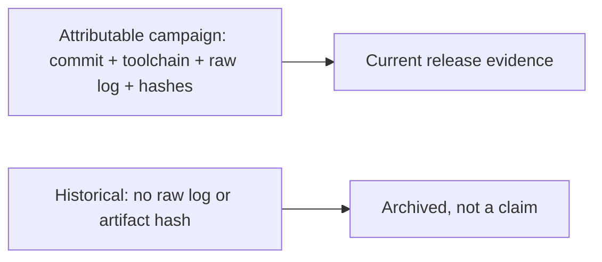

import { Callout } from 'nextra/components'

# Performance Evidence Policy

**Relevant source files**

- [docs/performance/README.md](https://github.com/pro-utkarshM/axiomOS/blob/release/v0.5.0-alpha.3/docs/performance/README.md)
- [docs/performance/methodology.md](https://github.com/pro-utkarshM/axiomOS/blob/release/v0.5.0-alpha.3/docs/performance/methodology.md)
- [docs/performance/current-results.md](https://github.com/pro-utkarshM/axiomOS/blob/release/v0.5.0-alpha.3/docs/performance/current-results.md)
- [docs/performance/evidence](https://github.com/pro-utkarshM/axiomOS/tree/release/v0.5.0-alpha.3/docs/performance/evidence)
- [scripts/verify/benchmark-provenance.py](https://github.com/pro-utkarshM/axiomOS/blob/release/v0.5.0-alpha.3/scripts/verify/benchmark-provenance.py)
- [scripts/benchmark](https://github.com/pro-utkarshM/axiomOS/tree/release/v0.5.0-alpha.3/scripts/benchmark)

axiomos separates performance claims into **method**, **current evidence**, and **history**. A number counts as current release evidence only if its campaign records all of:

| Requirement | Purpose |
|---|---|
| Exact source commit | Ties the number to code |
| Pinned toolchain | Rules out compiler drift |
| Exact command | Reproducibility |
| Host or hardware boundary | Scope of the claim |
| Tracked raw output | Numbers must be present in the raw log |
| SHA-256 of raw log and measured executable or image | Identifies the artifact that produced the result |

Each campaign lives under `docs/performance/evidence/COMMIT/` with a `manifest.toml` and the raw captures.

<Callout type="warning">
No QEMU, Raspberry Pi, Linux-comparison, boot-time, interrupt-latency, WCET, or comparative-speed headline is current release evidence until it is rerun under this contract. A developer-host campaign does not establish a hardware latency objective.
</Callout>

## Provenance gate

```bash
python3 -B scripts/verify/benchmark-provenance.py
```

The checker (also run as `benchmark-provenance-static` in the [audit gate](/axiomos/v0.5.0-alpha.3/security/audit-findings)) verifies the raw-log hash, confirms the Cargo-reported executable path and every declared result marker appear in the log, validates source-input hashes against the recorded Git commit, and requires a well-formed executable hash. It does not claim byte-identical binaries across different hosts or linkers.

## Evidence tiers



## Adding a campaign

1. Start from a clean, committed tree with the pinned toolchain.
2. Store raw output and `manifest.toml` under `docs/performance/evidence/COMMIT/`.
3. Record the Cargo-reported executable, its SHA-256, host/hardware controls, exact command, and hashes of benchmark source, `Cargo.lock` and `rust-toolchain.toml` at that commit.
4. Add only results present in the raw output. Hardware campaigns must also retain UART and logic-analyzer captures and deployed-image hashes.
5. Run the benchmark-provenance and documentation-link checks.
