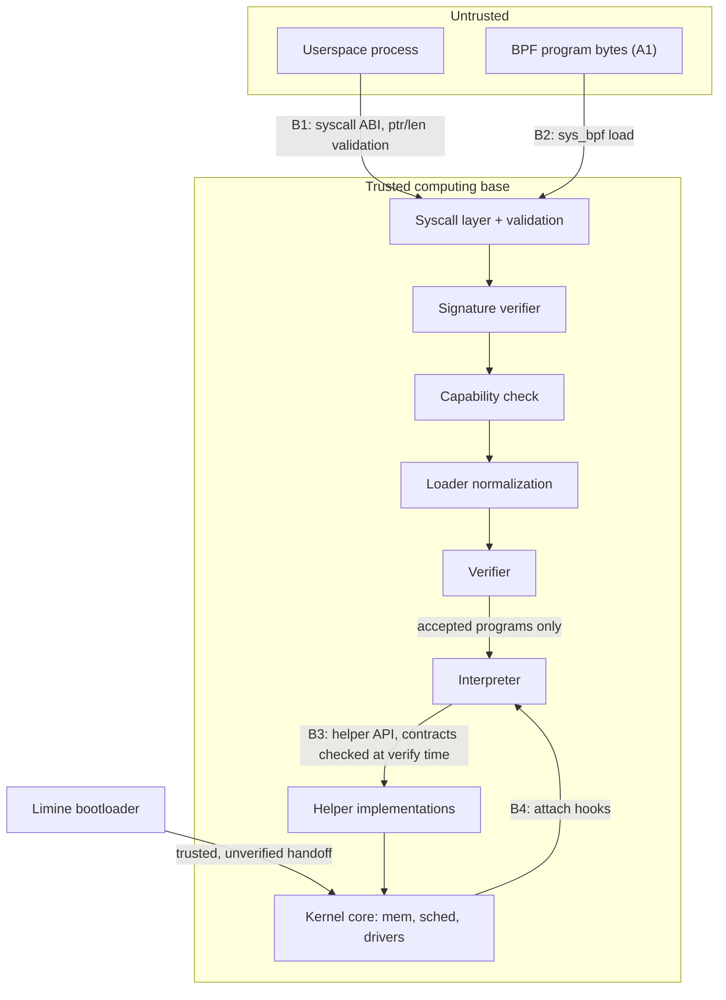

import { Callout } from 'nextra/components'

# Threat Model

**Relevant source files**

- [docs/security/threat-model.md](https://github.com/pro-utkarshM/axiomOS/blob/release/v0.5.0-alpha.3/docs/security/threat-model.md)
- [docs/security/bpf-trust.md](https://github.com/pro-utkarshM/axiomOS/blob/release/v0.5.0-alpha.3/docs/security/bpf-trust.md)
- [kernel/src/syscall/validation.rs](https://github.com/pro-utkarshM/axiomOS/blob/release/v0.5.0-alpha.3/kernel/src/syscall/validation.rs)
- [kernel/src/syscall/bpf.rs](https://github.com/pro-utkarshM/axiomOS/blob/release/v0.5.0-alpha.3/kernel/src/syscall/bpf.rs)
- [kernel/src/bpf/mod.rs](https://github.com/pro-utkarshM/axiomOS/blob/release/v0.5.0-alpha.3/kernel/src/bpf/mod.rs)
- [kernel/src/bpf/trust.rs](https://github.com/pro-utkarshM/axiomOS/blob/release/v0.5.0-alpha.3/kernel/src/bpf/trust.rs)
- [kernel/src/bpf/authorization.rs](https://github.com/pro-utkarshM/axiomOS/blob/release/v0.5.0-alpha.3/kernel/src/bpf/authorization.rs)
- [kernel/crates/kernel_bpf/src/verifier](https://github.com/pro-utkarshM/axiomOS/tree/release/v0.5.0-alpha.3/kernel/crates/kernel_bpf/src/verifier)
- [kernel/crates/kernel_bpf/src/signing](https://github.com/pro-utkarshM/axiomOS/tree/release/v0.5.0-alpha.3/kernel/crates/kernel_bpf/src/signing)
- [kernel/crates/kernel_bpf/src/profile/mod.rs](https://github.com/pro-utkarshM/axiomOS/blob/release/v0.5.0-alpha.3/kernel/crates/kernel_bpf/src/profile/mod.rs)

The threat model is a living document whose line citations refer to commit `f2e38bc` (2026-07-03). It carries an audit erratum, and several of its gaps have since been addressed in code. This page summarizes it and marks where the code at this release has moved on.

<Callout type="warning">
**Audit erratum (2026-07-11), as recorded in the source document:** at the audited commit (C-01) user-pointer validation was numeric only, (C-06) JIT pages were RWX and recompiled per hook fire, and (H-02) the x86 clock treated HPET ticks as nanoseconds. At this release, user copies go through the page-walking `kernel_usermem` contract ([Memory](/axiomos/v0.5.0-alpha.3/architecture/memory)), and both shipped profiles set `JIT_ALLOWED = false` with a test asserting it stays false "until C-06 redesign". H-02 is why legacy x86 QEMU timings are invalid ([Current Results](/axiomos/v0.5.0-alpha.3/performance/current-results)).
</Callout>

## Assets

| Asset | Location | Notes |
|---|---|---|
| Kernel image | `kernel/` (Limine on x86_64) | Compromise is total |
| BPF verifier | `kernel_bpf/src/verifier/` | The load-bearing safety gate; zero `unsafe` |
| BPF interpreter | `kernel_bpf/src/execution/interpreter.rs` | Must match the verifier's semantics |
| JIT | `kernel_bpf/src/execution/jit_aarch64.rs` | Not enabled in any shipped profile (ADR-0004) |
| Attach points | GPIO, PWM, IIO, timer, syscall, scheduler hooks | Physical actuation is the highest-consequence output |
| BPF maps | `kernel_bpf/src/maps/` | Shared state between programs and kernel |
| Signing trust store | `kernel_bpf/src/signing/` (Ed25519) | One compiled-in production key |
| Persistent state | rootfs | No integrity protection at rest |
| Control link | `shrike_link` UART to RP2040 | Fail-safe state machine on link loss |

## Adversaries

| # | Adversary | In scope | Verdict |
|---|---|---|---|
| A1 | Malicious BPF author (program bytes fully attacker-chosen) | Yes, primary | The threat the verifier exists for |
| A2 | Compromised userspace (arbitrary syscalls) | Yes | Syscall boundary validated; per-process BPF capabilities now gate commands |
| A3 | Remote network attacker | Partially | No NIC driver exists; OTA is out-of-band (SD card / serial) |
| A4 | OTA man-in-the-middle | Partially | Programs are Ed25519-authenticated; the kernel image itself is unsigned |
| A5 | Physical access (JTAG, SD swap, side channels) | No | A robot in an attacker's hands is the attacker's robot |
| A6 | Supply chain (malicious dependency) | Acknowledged, not defended | Small `no_std` dependency tree; no vendoring or `cargo vet` gate |
| A7 | Speculative execution via BPF | Known gap | No Spectre mitigations (#89) |

## Trust boundaries

- **B1 userspace to kernel:** every user pointer/length crosses the bounded `UserMemory` adapter.
- **B2 BPF load:** authenticate, authorize, normalize, verify. Nothing executes unverified.
- **B3 BPF runtime:** programs reach the kernel only through helpers whose signatures and argument bounds were checked at verify time.
- **B4 attach:** attachment checks the hook context and passes utilization admission.
- **Bootloader:** the Limine handoff is trusted and unverified; there is no secure or measured boot.

## Mitigation map

| Attack | Primary defense |
|---|---|
| A1 out-of-bounds access | Stack bounds and ranged dereference checks for map-value, ctx and packet pointers; per-map value sizes and per-program-type ctx sizes |
| A1 unbounded execution | Verifier recorded-state budget (8,192 states, 64 per pc) plus an interpreter hard instruction limit (100k embedded / 1M cloud) |
| A1 stack / call-depth abuse | Profile stack bound; BPF-to-BPF inlining capped at `MAX_CALL_DEPTH = 8` with an expansion size cap |
| A1 helper contract abuse | `validate_helper_call` with privilege tier and pointer-argument bounds; helper IDs unified with the runtime table |
| A1 arithmetic corruption | Division/modulo-by-zero rejection, uninitialized-register rejection, tnum plus signed/unsigned range tracking |
| A1 real-time starvation | Static WCET budget at verify time; utilization admission at attach (see [Verifier Assurance](/axiomos/v0.5.0-alpha.3/security/verifier-assurance)) |
| A2 syscall boundary | `kernel/src/syscall/validation.rs`; attach-time GPIO pin and PWM chip/channel validation |
| A4 program authenticity | Ed25519 trusted-signer, hash and signature verification; raw instruction loads rejected when enforcement is on |
| Execution engine integrity | Interpreter only in shipped profiles |

## Gaps

| ID | Gap (as filed) | Status at this release |
|---|---|---|
| G1 | Spectre-class speculation unmitigated (#89) | Open |
| G2 | No privilege check at attach (#176) | The normative trust policy now gates trace/scheduler/device attach with per-process `BpfCapabilities`; init lacks device attach and actuation rights |
| G3 | JIT output not independently checked (#177) | Moot for shipped profiles (no JIT); remains a precondition in ADR-0004 |
| G4 | Signature enforcement default-off, no key provisioning (#20) | Production builds are signed-only with a build-time key; unsigned needs `bpf-unsigned-development`. Key provisioning beyond the build-time key is not described |
| G5 | No secure / measured boot (#178) | Open |
| G6 | Dependency supply chain unaudited (#179) | Open |
| G7 | Kernel image and persistent state unsigned at rest | Open |

## TCB and the seL4 comparison

Measured with `wc -l` over `*.rs` (excluding `tests/`) at `f2e38bc`:

| Component | LoC |
|---|---:|
| Kernel core (`kernel/src`) | 20,756 |
| BPF subsystem (`kernel_bpf`) | 26,258 |
| of which verifier | 7,649 (zero `unsafe`) |
| All kernel crates | 36,564 |
| axiomos TCB (order of magnitude) | about 57k LoC Rust |

seL4, by contrast, has about 8,700 LoC of C plus about 600 asm with machine-checked functional correctness down to the binary. The repository's own reading: the axiomos TCB is about six times larger, and it is **trusted, not proven**. The differentiator is not assurance depth but that untrusted, hot-swappable robotics logic is a first-class kernel object with static safety and timing admission. Formal work is limited to a Lean 4 proof-of-concept for the tnum domain (`formal/`, #91); see [Testing & Verification](/axiomos/v0.5.0-alpha.3/testing).
