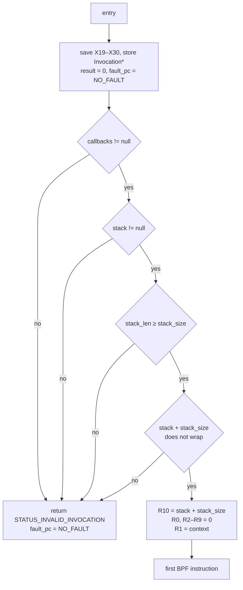
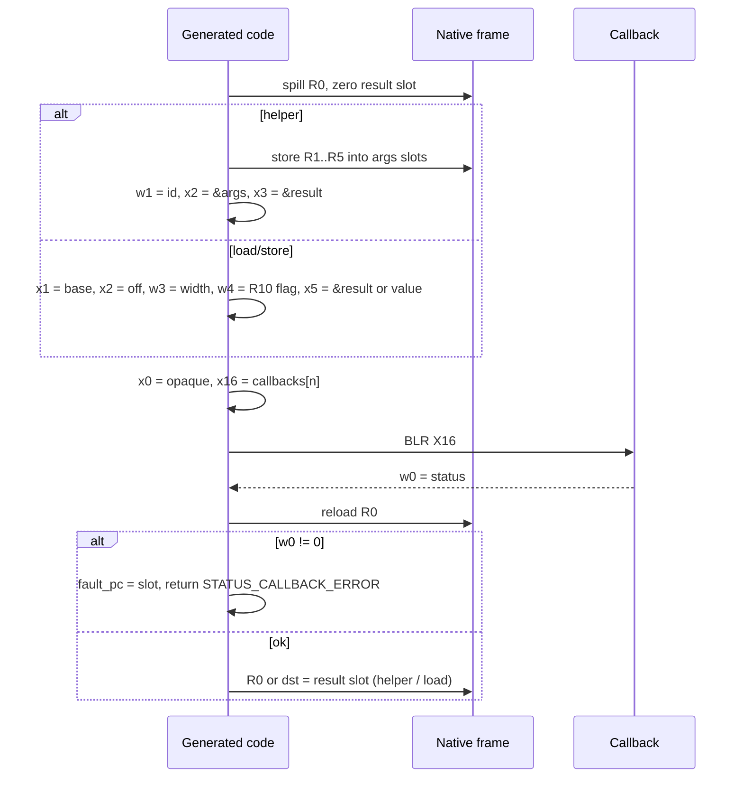

import { Callout } from 'nextra/components'

# Invocation and callback ABI

**Relevant source files**

- [src/aarch64.rs](https://github.com/volnlabs/rbpf/blob/main/src/aarch64.rs)
- [jit.md](https://github.com/volnlabs/rbpf/blob/main/jit.md)
- [tests/aarch64_jit.rs](https://github.com/volnlabs/rbpf/blob/main/tests/aarch64_jit.rs)
- [tests/aarch64/managed.rs](https://github.com/volnlabs/rbpf/blob/main/tests/aarch64/managed.rs)

Generated code is entered through a single `unsafe extern "C"` function. It takes a pointer to a `#[repr(C)]` invocation frame and returns a numeric status. No Rust enums, references, slices, or `Result`s cross the machine-code boundary. The generated code follows [AAPCS64](https://github.com/ARM-software/abi-aa/blob/main/aapcs64/aapcs64.rst).

## Entry point

```rust
pub type NativeEntry = unsafe extern "C" fn(*mut Invocation) -> u32;
```

The entry point is at `CodeInfo.entry_offset`, which is currently always 0. Call it only on little-endian AArch64, after external semantic verification, read-only executable publication, and cache synchronization. The image, invocation frame, stack, callback table, and every region the callbacks touch must stay valid and exclusively accessible for the whole call.

## `Invocation`

```rust
#[repr(C)]
pub struct Invocation {
    pub context: *const u8,               // +0   initial BPF R1
    pub stack: *mut u8,                   // +8   BPF stack base (caller-initialized)
    pub stack_len: usize,                 // +16  must be ≥ CompileOptions.stack_size
    pub opaque: *mut c_void,              // +24  passed to every callback
    pub callbacks: *const RuntimeCallbacks, // +32 non-null
    pub result: u64,                      // +40  BPF R0 on success; 0 on failure
    pub fault_pc: u64,                    // +48  BPF slot on failure, or NO_FAULT
}
```

The generated code hard-codes these offsets. A `const` block of `offset_of!` assertions, compiled on 64-bit little-endian targets, catches any layout drift.

### Stack contract

- `R10 = stack + CompileOptions.stack_size`. R10 always uses the **compiled** extent, even when `stack_len` is larger.
- The embedder initializes the stack. The generated code does not clear it.
- The BPF stack is separate from the native call and spill frame.
- `context` becomes R1. In AxiomOS it points to the embedder's context *wrapper*, not necessarily the payload.

The prologue checks the frame before running any BPF instruction:



## Status codes

| Constant | Value | Meaning | `fault_pc` |
|---|---|---|---|
| `STATUS_OK` | 0 | `EXIT` reached; `result` holds R0 | `NO_FAULT` |
| `STATUS_CALLBACK_ERROR` | 1 | A callback returned nonzero | slot of the faulting instruction |
| `STATUS_DIVISION_BY_ZERO` | 2 | DIV/MOD with a zero divisor | slot of the faulting instruction |
| `STATUS_INVALID_INVOCATION` | 3 | Null callbacks/stack, short or wrapping stack | `NO_FAULT` |
| `NO_FAULT` | `u64::MAX` | No instruction caused the fault | — |

A callback's own nonzero code is **not** passed through: the generated code always reports `STATUS_CALLBACK_ERROR`. Keep detailed errors in the `opaque` state. AxiomOS, for example, stores its `BpfError` there. On any failure, `result` stays 0.

## `RuntimeCallbacks`

```rust
#[repr(C)]
pub struct RuntimeCallbacks {
    pub helper: HelperCallback, // +0
    pub load: LoadCallback,     // +8
    pub store: StoreCallback,   // +16
}

pub type HelperCallback =
    unsafe extern "C" fn(opaque: *mut c_void, id: u32, args: *const u64, out: *mut u64) -> u32;
pub type LoadCallback =
    unsafe extern "C" fn(opaque: *mut c_void, base: u64, offset: i64, width: u32,
                         base_is_r10: u32, out: *mut u64) -> u32;
pub type StoreCallback =
    unsafe extern "C" fn(opaque: *mut c_void, base: u64, offset: i64, width: u32,
                         base_is_r10: u32, value: u64) -> u32;
```

The parameter names above are descriptive. The source declares the types positionally.

| Callback | Triggered by | Arguments | On success |
|---|---|---|---|
| `helper` | `CALL imm` (`src = 0`) | `id = imm as u32`, `args` → five `u64` (R1–R5) | write `*out`, return 0. R0 = `*out`. |
| `load` | `LDX{B,H,W,DW}` | base register value, sign-extended `off`, width 1/2/4/8, R10 flag | write zero-extended value to `*out`, return 0. `dst` = value. |
| `store` | `ST*` / `STX*` | base (= `dst` register), `off`, width, R10 flag, `value` (sign-extended `imm` for ST, `src` register for STX) | store the low `width` bytes, return 0 |

Callbacks receive **decoded operands**; they are never asked to interpret an instruction.

<Callout type="warning">
The `base_is_r10` flag is 1 **only when the instruction names R10 as its base register**. It says nothing about pointer provenance. If R10 has been copied into another register, an access through that register reports flag 0. Callbacks must validate the effective address (`base + offset`) and the full `width`-byte extent against their memory policy whatever the flag says. `tests/aarch64_jit.rs::copied_stack_pointer_has_no_r10_flag_and_still_needs_bounds_check` covers this case.
</Callout>

Callback rules:

- `args` and `out` pointers are valid only during the call. Do not retain or modify them.
- **Never unwind** through generated code. Report every error through the return status and the opaque state.
- Do not modify the `Invocation` frame or the generated image.
- Enforce callback latency bounds outside the image. Forward-only control flow bounds the number of BPF instructions executed, not wall-clock time.

## Native register and frame layout

| BPF | AArch64 | Notes |
|---|---|---|
| R0 | X9 | caller-saved. Spilled to the frame around every callback and reloaded afterwards. |
| R1–R10 | X19–X28 | callee-saved, so they survive callbacks without spilling |
| scratch | X10 (`TMP`), X11 (`TMP2`) | immediates, divisor checks, MOD quotient |
| call target | X16 | `BLR X16` |
| callback args | X0–X5 | X0 = `opaque` |
| — | X18 | never touched (platform register) |
| — | X29 | normal frame pointer: SP + 80 |

Because R1–R5 live in callee-saved registers, they keep their values across helper calls. The BPF calling convention treats them as clobbered, so programs must not rely on this.

Native stack frame (160 bytes, 16-byte aligned):

| SP offset | Contents |
|---|---|
| 0–79 | X19–X28 saved pairs |
| 80 | X29, X30 (FP/LR record) |
| 96 | saved BPF R0 |
| 104 | saved `Invocation*` |
| 112 | callback result slot (zeroed before each call) |
| 120–159 | five helper argument slots |

## Callback sequence



When a callback fails, the epilogue runs straight away and no later instruction executes. `helper_failure_stops_before_store_or_second_call` tests this.

## Example callbacks

This is a simplified version of the Linux harness in `tests/aarch64_jit.rs`. `State::resolve` stands in for the embedder's region lookup.

```rust
unsafe extern "C" fn load(
    opaque: *mut c_void, base: u64, offset: i64, width: u32,
    is_frame_pointer: u32, out: *mut u64,
) -> u32 {
    let state = unsafe { &mut *opaque.cast::<State>() };
    let Some(bytes) = state.resolve(base, offset, width as usize) else {
        return STATUS_CALLBACK_ERROR; // any nonzero value aborts execution
    };
    let mut value = [0u8; 8];
    value[..width as usize].copy_from_slice(bytes);
    unsafe { *out = u64::from_le_bytes(value) }; // zero-extended
    STATUS_OK
}

static CALLBACKS: RuntimeCallbacks = RuntimeCallbacks { helper, load, store };

let mut invocation = Invocation {
    context: context.as_mut_ptr(),
    stack: stack.as_mut_ptr(),
    stack_len: stack.len(),
    opaque: (state as *mut State).cast(),
    callbacks: &CALLBACKS,
    result: 0,
    fault_pc: NO_FAULT,
};
let status = unsafe { (image.entry())(&mut invocation) };
```

The code image and the callback table can be reused across invocations and relocated. Branches are image-relative and callback addresses come from the frame, so the image holds no instance-specific pointers. It can be written through one alias and executed through another.
