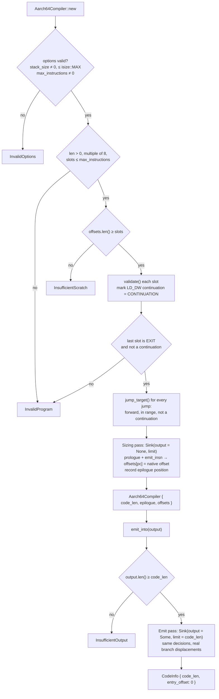

# Validation and code generation

**Relevant source files**

- [src/aarch64.rs](https://github.com/volnlabs/rbpf/blob/main/src/aarch64.rs)
- [jit.md](https://github.com/volnlabs/rbpf/blob/main/jit.md)
- [tests/aarch64_jit.rs](https://github.com/volnlabs/rbpf/blob/main/tests/aarch64_jit.rs)

All of `src/aarch64.rs` runs without allocation. It never formats strings, and it never uses a panic as a capacity check. All offset, length and displacement arithmetic is checked.

## Two passes over one `Sink`



`Sink` has an optional output buffer, a position, and a byte limit. In the sizing pass `output` is `None`: words are counted but not written, and branch range checks are skipped because targets are not known yet. The emit pass uses the `offsets` recorded during sizing, so forward branches resolve directly. No relocation list is needed.

The limit is `min(options.max_code_size, MAX_CODE_SIZE)`, where `MAX_CODE_SIZE = 2^27 - 4`. Keeping the whole image under +128 MiB guarantees that every unconditional `B` (±128 MiB range) can reach any point in the image. Going over the limit returns `CodeTooLarge`.

## Validation rules (`validate`)

| Check | Error |
|---|---|
| `dst > 10` or `src > 10` | `InvalidProgram` |
| `LD_DW_IMM`: `dst == 10`, `src != 0`, `off != 0`, last slot, or a continuation with nonzero `opc/dst/src/off` | `InvalidProgram` |
| ALU/ALU64 with `dst == 10` or `off != 0` | `InvalidProgram` |
| `BPF_END` not in ALU32 class, `src != 0`, or `imm` not in 16/32/64 | `InvalidProgram` |
| `NEG` with a register source, `src != 0`, or `imm != 0` | `InvalidProgram` |
| Binary ALU / conditional jump with a non-canonical source (`BPF_X` with `imm != 0`, or `BPF_K` with `src != 0`) | `InvalidProgram` |
| `EXIT` with any nonzero field | `InvalidProgram` |
| `CALL` with `dst/src/off != 0` (local calls, pseudo calls) | `UnsupportedInstruction` |
| `JA` other than the canonical JMP-class form | `UnsupportedInstruction` |
| `LDX/ST/STX` not in `BPF_MEM` mode (`ABS`, `IND`, atomics) | `UnsupportedInstruction` |
| `LDX` into R10, `LDX/STX` with `imm != 0`, `ST` with `src != 0` | `InvalidProgram` |
| Any other class or opcode | `UnsupportedInstruction` |
| Negative offset, target past the end, or target in an `LD_DW` continuation | `InvalidJump` |
| Last slot not `EXIT` | `InvalidProgram` (with `pc = count - 1`) |

`JitError.pc` holds the original BPF slot index whenever the error belongs to an instruction.

## Instruction lowering

| BPF | AArch64 |
|---|---|
| immediate operand | `MOVZ`/`MOVK` into `TMP` (see below), then the register form |
| `ADD SUB OR AND XOR` | `ADD/SUB/ORR/AND/EOR` (shifted-register form), 32- or 64-bit (`sf` bit) |
| `MUL` | `MADD` with zero register |
| `DIV` | `CMP rhs, #0` + `B.NE` over a failure block, then `UDIV` |
| `MOD` | same zero check, then `UDIV TMP2, dst, rhs` and `MSUB dst, TMP2, rhs, dst` (dst = dst - TMP2 * rhs) |
| `LSH RSH ARSH` | `LSLV/LSRV/ASRV` (hardware masks the count to the register width) |
| `NEG` | `SUB dst, ZR, dst` |
| `MOV` | `ORR dst, ZR, src` (W form zero-extends) |
| `LE16/32/64` | `UXTH` / `MOV w,w` / nothing |
| `BE16/32/64` | `REV16 W` / `REV W` / `REV X`, then the same zero-extension as LE |
| `LD_DW_IMM` | 64-bit immediate sequence into the mapped register |
| `JA` | `B target` |
| conditional jump | `CMP` (or `TST` for `JSET`) at width, `B.<inverse cond> +8`, `B target` |
| `LDX/ST/STX`, `CALL` | callback sequence (see [ABI](/rbpf/aarch64-jit/abi)) |
| `EXIT` | store R0 to `Invocation.result`, `W0 = STATUS_OK`, `B epilogue` |

Conditional branches use a **fixed layout**: an inverted conditional branch skips over an unconditional `B`. The conditional encoding therefore never needs range relaxation, and the reach of `B` is guaranteed by the 128 MiB image cap.

Condition codes per BPF op: `JEQ` EQ, `JNE`/`JSET` NE, `JGT` HI, `JGE` HS, `JLT` LO, `JLE` LS, `JSGT` GT, `JSGE` GE, `JSLT` LT, `JSLE` LE.

### Checked failure blocks (`require`)

`require(valid_cond, status, pc, epilogue)` reserves one word for a `B.<valid_cond>` and emits the failure block: load `Invocation*`, write `fault_pc`, set `W0 = status`, `B epilogue`. It then patches the reserved word to branch past that block. The conditional displacement (±1 MiB) is range-checked. The prologue's invocation checks, the divide-by-zero checks, and callback status checks all use this helper.

### Immediates (`Sink::imm`)

- A 64-bit value whose upper 48 bits are all ones becomes a single `MOVN` (fork commit `208a940`). Small negative constants therefore take 1 instruction instead of 4.
- Otherwise: `MOVZ` for halfword 0, plus `MOVK` only for the **nonzero** higher halfwords (fork commit `785f1d7`). `MOVZ` clears the other bits, so skipping zero halfwords is safe.
- 32-bit forms use `W` registers (2 halfwords at most).
- ALU and JMP immediates are sign-extended from `i32` to the operation width, so JMP64 compares against the sign-extended 64-bit value.

`compact_immediates_use_fewer_halfword_writes` (host) and `compact_immediates_clear_old_register_bits` (native) test this.

## Prologue and epilogue

```text
SUB  SP, SP, #160
STP  X19..X30 pairs at [SP, #0..#80]
ADD  X29, SP, #80
STR  X0, [SP, #104]                 ; Invocation*
STR  XZR, [X0, #40]                 ; result = 0
MOV  TMP, #NO_FAULT ; STR TMP, [X0, #48]
check callbacks != 0, stack != 0, stack_len >= stack_size,
      ADDS X28, stack, stack_size (no carry)   -> else STATUS_INVALID_INVOCATION
MOV  X9, X19..X27 <- XZR             ; BPF R0..R9 = 0
LDR  X19, [X0, #0]                   ; R1 = context
...
epilogue:
LDP  X19..X30 pairs
ADD  SP, SP, #160
RET
```

## Encoding tests

The host-side tests in `tests/aarch64_jit.rs` run on every architecture:

- `rejects_invalid_streams_and_targets`: every rejection category, with the expected `pc`.
- `bounded_buffers_and_canaries`: short output and scratch are rejected, and canary bytes around the output stay intact.
- `compact_immediates_use_fewer_halfword_writes`: checks the `MOVN`/`MOVK` savings.
- `rejects_invalid_options_and_checks_callback_branch_encoding`: checks the options validation and the exact encoding of the callback status branch.

The native suite runs only under `all(target_arch = "aarch64", target_os = "linux")`. See [Testing and CI](/rbpf/testing).
