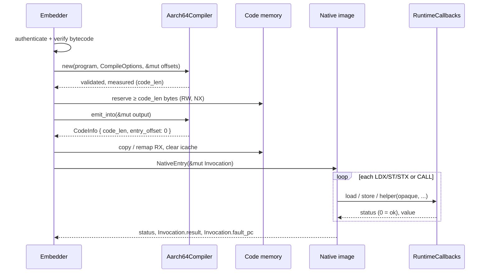

import { Callout, Steps } from 'nextra/components'

# AArch64 JIT

**Relevant source files**

- [src/aarch64.rs](https://github.com/volnlabs/rbpf/blob/main/src/aarch64.rs)
- [jit.md](https://github.com/volnlabs/rbpf/blob/main/jit.md)
- [README.md](https://github.com/volnlabs/rbpf/blob/main/README.md)
- [tests/aarch64_jit.rs](https://github.com/volnlabs/rbpf/blob/main/tests/aarch64_jit.rs)
- [tests/aarch64/managed.rs](https://github.com/volnlabs/rbpf/blob/main/tests/aarch64/managed.rs)
- [Cargo.toml](https://github.com/volnlabs/rbpf/blob/main/Cargo.toml)

The `aarch64-jit` feature exposes `rbpf::aarch64`, the main addition in the volnlabs fork. It is an **allocation-free, two-pass compiler** from a normalized, forward-only BPF subset to little-endian AArch64 machine code. It was designed for the AxiomOS `no_std` Raspberry Pi 5 managed runtime: AxiomOS compiles authenticated, verified bytecode once while preparing a program, then runs the immutable image on every release.

## Design boundaries

| rbpf owns | The embedder (e.g. AxiomOS) owns |
|---|---|
| Structural validation of the bytecode | Authentication and **semantic** verification (pointer types, bounds) |
| Exact sizing and instruction encoding | Executable memory: W^X mapping, RW to RX transition |
| The native entry/callback ABI | Instruction-cache synchronization |
| Typed, allocation-free errors | The BPF stack, its initialization, and the context wrapper |
| | Memory and helper policy, enforced inside the callbacks |
| | Image lifetime: keep it mapped until every execution finishes |
| | Callback latency bounds |

The design intentionally leaves out LLVM, Cranelift, an optimizing IR, an executable allocator, and an automatic fallback to the interpreter. The existing VM wrappers' `jit_compile()` still means the x86_64 backend only. AArch64 code is produced through this low-level API alone.

The feature adds **no dependencies** and does not require `std`. Compilation works on any host. Only *running* the output requires little-endian AArch64. CI checks that the library builds with `cargo check --lib --target aarch64-unknown-none --no-default-features --features aarch64-jit`.

## End-to-end flow



## Public API

```rust
pub struct CompileOptions {
    pub max_instructions: usize, // max encoded BPF slots (LD_DW_IMM counts as 2)
    pub max_code_size: usize,    // max emitted bytes incl. prologue/epilogue
    pub stack_size: usize,       // BPF stack extent used for R10; nonzero
}

impl<'program, 'scratch> Aarch64Compiler<'program, 'scratch> {
    pub fn new(
        program: &'program [u8],
        options: CompileOptions,
        offsets: &'scratch mut [u32], // ≥ one u32 per encoded slot
    ) -> Result<Self, JitError>;
    pub fn code_len(&self) -> usize;
    pub fn emit_into(&self, output: &mut [u8]) -> Result<CodeInfo, JitError>;
}

pub struct CodeInfo { pub code_len: usize, pub entry_offset: usize } // entry_offset is 0

pub struct JitError { pub kind: ErrorKind, pub pc: Option<usize> }
pub enum ErrorKind {
    InvalidProgram, UnsupportedInstruction, InvalidJump, InvalidOptions,
    InsufficientScratch, InsufficientOutput, CodeTooLarge,
}
```

`JitError` implements `Display` (for example `AArch64 JIT InvalidJump at BPF slot 3`) and `core::error::Error`. The ABI types `Invocation`, `RuntimeCallbacks`, `NativeEntry`, the callback signatures, and the `STATUS_*` / `NO_FAULT` constants are covered in [Invocation and callback ABI](/rbpf/aarch64-jit/abi).

## Usage

<Steps>

### Validate and measure

```rust
use rbpf::aarch64::{Aarch64Compiler, CompileOptions};

let mut offsets = [0u32; MAX_SLOTS];
let compiler = Aarch64Compiler::new(
    program,
    CompileOptions { max_instructions: MAX_SLOTS, max_code_size: 8192, stack_size: 8192 },
    &mut offsets,
)?;
```

`new` checks the options, validates every instruction and jump target, then runs a **sizing pass** that records each slot's native offset in `offsets`. The scratch contents are unspecified after a failure.

### Emit into writable, non-executable storage

```rust
let info = compiler.emit_into(&mut rw_buffer[..compiler.code_len()])?;
```

A buffer shorter than `code_len()` is rejected before anything is written. Bytes past `code_len` are left untouched. The **emit pass** makes the same decisions as the sizing pass, so its length matches exactly.

### Publish as executable

Release the mutable borrow. Make the bytes read-only and executable (never RWX), then synchronize the instruction cache. The test harness does this with `mmap(RW)`, `copy`, `__clear_cache`, `mprotect(R|X)`, and later `munmap`.

### Invoke

```rust
let entry: NativeEntry = unsafe { core::mem::transmute(exec_base.add(info.entry_offset)) };
let status = unsafe { entry(&mut invocation) };
```

</Steps>

## Supported subset

| Class | Support |
|---|---|
| ALU32 / ALU64 | `ADD SUB MUL DIV OR AND LSH RSH NEG MOD XOR MOV ARSH`, immediate and register forms. ALU32 results are zero-extended. |
| Endian | `LE`/`BE` 16/32/64. Must use the ALU32 class (`BPF_END`), `src = 0`. |
| `LD_DW_IMM` | Full 64-bit immediate; jumping into the continuation slot is rejected |
| JMP / JMP32 | `JA` plus `JEQ JGT JGE JSET JNE JSGT JSGE JLT JLE JSLT JSLE`, **forward only** |
| LDX / ST / STX | `BPF_MEM` mode, widths 1/2/4/8, lowered to `load`/`store` callbacks |
| `CALL` | External helper (`src = 0`), lowered to the `helper` callback |
| `EXIT` | Stores R0 to `Invocation.result` and returns `STATUS_OK` |

**Rejected**: backward jumps (loops), local calls, tail calls, atomics (XADD), legacy `LD_ABS`/`LD_IND`, pseudo bindings, non-canonical reserved fields, unknown opcodes, registers above 10, writes to R10. Unknown instructions are never turned into no-ops.

Division or modulo by zero ends execution with `STATUS_DIVISION_BY_ZERO`. This **intentionally differs** from Linux and from rbpf's interpreter, which produce 0 or leave `dst` unchanged. AxiomOS treats a zero divisor as an execution error.

<Callout type="warning">
A successful compile only means the encoding is supported and structurally valid. Every structurally accepted control-flow path terminates, because jumps are forward-only and the program must end with `EXIT`. **Safe** execution still depends on an external verifier and correct callbacks. Calling the generated code is an `unsafe` embedding boundary.
</Callout>

## Performance model

ALU operations and branches run natively. Every memory access and helper call goes through an indirect callback, so the embedder's checks are shared by all accesses. The source flags this as a deliberate ceiling:

```rust
// ponytail: checked callbacks cost a call per memory access; inline only
// after profiling and equivalent bounds/permission tests justify it.
```

Two encoding optimizations landed after the first version. `MOVK` is skipped for zero halfwords, and constants whose upper 48 bits are all ones are encoded with a single `MOVN`. See [Validation and code generation](/rbpf/aarch64-jit/codegen).

## Validation status (from `jit.md`)

- Host tests pass with `--features aarch64-jit`, with `--no-default-features --features aarch64-jit`, and with `--all-features`.
- AArch64 Linux tests pass under QEMU and in native `ubuntu-24.04-arm` CI jobs, both with and without default features. The release-mode `aarch64_jit` test also passes.
- `aarch64-unknown-none` bare-metal builds pass.
- **Not yet done**: execution on a physical Pi 5, and AxiomOS integration (publication, W^X lifecycle, hardware gates).
