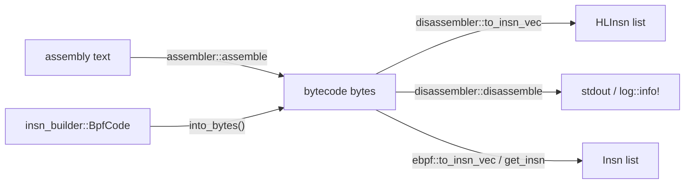

# Assembler, disassembler, builder

**Relevant source files**

- [src/assembler.rs](https://github.com/volnlabs/rbpf/blob/main/src/assembler.rs)
- [src/asm_parser.rs](https://github.com/volnlabs/rbpf/blob/main/src/asm_parser.rs)
- [src/disassembler.rs](https://github.com/volnlabs/rbpf/blob/main/src/disassembler.rs)
- [src/insn_builder.rs](https://github.com/volnlabs/rbpf/blob/main/src/insn_builder.rs)
- [src/ebpf.rs](https://github.com/volnlabs/rbpf/blob/main/src/ebpf.rs)
- [tests/assembler.rs](https://github.com/volnlabs/rbpf/blob/main/tests/assembler.rs)
- [tests/disassembler.rs](https://github.com/volnlabs/rbpf/blob/main/tests/disassembler.rs)

You can write bytecode by hand, but rbpf also offers three ways to produce or inspect it.



## Instruction encoding (`rbpf::ebpf`)

```rust
pub struct Insn {
    pub opc: u8,  // opcode
    pub dst: u8,  // low nibble of byte 1
    pub src: u8,  // high nibble of byte 1
    pub off: i16, // bytes 2..4, little-endian
    pub imm: i32, // bytes 4..8, little-endian
}

pub fn get_insn(prog: &[u8], idx: usize) -> Insn;   // panics if out of range
pub fn to_insn_vec(prog: &[u8]) -> Vec<Insn>;       // LD_DW_IMM stays two Insns
impl Insn {
    pub fn to_array(&self) -> [u8; INSN_SIZE];
    pub fn to_vec(&self) -> Vec<u8>;
}
```

`ebpf` also exports every opcode constant (`ADD64_IMM`, `JEQ_REG32`, `LD_DW_IMM`, `CALL`, `EXIT`, ...), the class, size, mode and operation masks (`BPF_ALU64`, `BPF_DW`, `BPF_MEM`, `BPF_X`, ...), and the `Helper` type.

## Assembler

```rust
pub fn assemble(src: &str) -> Result<Vec<u8>, String>;
```

```rust
use rbpf::assembler::assemble;

let prog = assemble("add64 r1, 0x605
                     mov64 r2, 0x32
                     mov64 r1, r0
                     be16 r0
                     neg64 r2
                     exit").unwrap();
```

The parser in `asm_parser.rs` is built on the `combine` crate. Under `no_std` it produces less descriptive error messages.

### Syntax summary

| Mnemonic | Form | Notes |
|---|---|---|
| `add sub mul div or and lsh rsh mod xor mov arsh` | `op dst, src` or `op dst, imm` | No suffix or `64` means ALU64; `32` suffix means ALU32 |
| `neg`, `neg64`, `neg32` | `neg dst` | |
| `be16/32/64`, `le16/32/64` | `be16 dst` | |
| `lddw` | `lddw dst, imm64` | Two slots |
| `ldx{w,h,b,dw}` | `ldxw dst, [src+off]` | |
| `st{w,h,b,dw}` | `stw [dst+off], imm` | |
| `stx{w,h,b,dw}` | `stxw [dst+off], src` | |
| `ldabs{w,h,b,dw}` | `ldabsw imm` | Legacy packet load |
| `ldind{w,h,b,dw}` | `ldindw src, imm` | Legacy packet load |
| `ja` | `ja +off` | |
| `jeq jgt jge jlt jle jset jne jsgt jsge jslt jsle` (+ `32` suffix) | `jeq dst, src_or_imm, +off` | `32` suffix means JMP32 |
| `call` | `call imm` | Helper call (`src = 0`) |
| `callx` | `callx imm` | Encodes `CALL` with `src = 1`, which is a **local** (eBPF-to-eBPF) call, not a call through a register |
| `exit` | `exit` | |

The assembler rejects out-of-range values with messages such as `Failed to encode ja: Invalid offset 32768`, `Failed to encode add: Invalid destination register 16`, or `Failed to encode add: Invalid immediate 4294967296`. The assembler has no mnemonic for the legacy XADD instructions.

## Disassembler

```rust
pub struct HLInsn {
    pub opc: u8,
    pub name: String, // mnemonic (not canonical)
    pub desc: String, // full text, e.g. "lddw r0, 0x1122334455667788"
    pub dst: u8,
    pub src: u8,
    pub off: i16,
    pub imm: i64,     // LD_DW_IMM halves merged into one value
}

pub fn to_insn_vec(prog: &[u8]) -> Vec<HLInsn>;
pub fn disassemble(prog: &[u8]); // println! with std, log::info! without
```

`disassembler::to_insn_vec` merges the two halves of `LD_DW_IMM`, so it can return fewer entries than `prog.len() / 8`. `examples/to_json.rs` builds on it to print a program as JSON.

## Instruction builder

`insn_builder` provides a fluent API. Each method returns a typed builder: `Move`, `SwapBytes`, `Load`, `Store`, `Jump`, `FunctionCall` or `Exit`. These implement the `Instruction` trait (`set_dst`, `set_src`, `set_off`, `set_imm`), and `push()` appends the instruction to the `BpfCode`.

```rust
use rbpf::insn_builder::*;

let mut program = BpfCode::new();
program.add(Source::Imm, Arch::X64).set_dst(1).set_imm(0x605).push()
       .mov(Source::Imm, Arch::X64).set_dst(2).set_imm(0x32).push()
       .mov(Source::Reg, Arch::X64).set_src(0).set_dst(1).push()
       .swap_bytes(Endian::Big).set_dst(0).set_imm(0x10).push()
       .negate(Arch::X64).set_dst(2).push()
       .exit().push();

let bytes: &[u8] = (&program).into_bytes(); // IntoBytes for &BpfCode
```

| `BpfCode` method | Produces |
|---|---|
| `add sub mul div bit_or bit_and left_shift right_shift negate modulo bit_xor mov signed_right_shift` | ALU ops, taking `Source::{Imm, Reg}` and `Arch::{X64, X32}` |
| `swap_bytes(Endian::{Big, Little})` | `BE` / `LE` |
| `load`, `load_abs`, `load_ind`, `load_x` | `LD` imm, `LD_ABS`, `LD_IND`, `LDX`, each taking a `MemSize` |
| `store`, `store_x` | `ST`, `STX` |
| `jump_unconditional`, `jump_conditional(Cond, Source)` | `JA`, conditional jumps |
| `call`, `exit` | `CALL`, `EXIT` |
