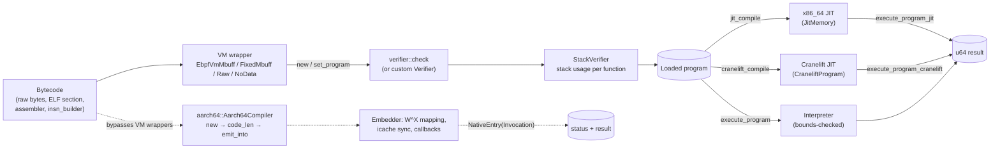

import { Callout } from 'nextra/components'

# rbpf

**Relevant source files**

- [README.md](https://github.com/volnlabs/rbpf/blob/main/README.md)
- [jit.md](https://github.com/volnlabs/rbpf/blob/main/jit.md)
- [Cargo.toml](https://github.com/volnlabs/rbpf/blob/main/Cargo.toml)
- [src/lib.rs](https://github.com/volnlabs/rbpf/blob/main/src/lib.rs)
- [src/ebpf.rs](https://github.com/volnlabs/rbpf/blob/main/src/ebpf.rs)
- [src/aarch64.rs](https://github.com/volnlabs/rbpf/blob/main/src/aarch64.rs)

rbpf is a user-space virtual machine for eBPF programs, written in Rust and derived from Rich Lane's C project [uBPF](https://github.com/iovisor/ubpf). The crate (`rbpf` 0.4.1, edition 2024, dual Apache-2.0/MIT) bundles:

- an **interpreter** with runtime memory-bounds checks,
- a handwritten **x86_64 JIT** (non-Windows x86_64 only),
- an optional **Cranelift JIT** (`cranelift` feature),
- an optional, allocation-free **AArch64 compiler** (`aarch64-jit` feature) added by this fork,
- a structural **verifier**, an **assembler**, a **disassembler**, and an **instruction builder**.

It runs with or without the Rust standard library (`std` feature, on by default).

## The volnlabs fork

The fork lives at [github.com/volnlabs/rbpf](https://github.com/volnlabs/rbpf). It tracks upstream [qmonnet/rbpf](https://github.com/qmonnet/rbpf) (up to the 0.4.1 release and the legacy-XADD and JIT dry-run sizing commits) and adds the following:

| Change | Where | Summary |
|---|---|---|
| AArch64 JIT | `src/aarch64.rs`, `aarch64-jit` feature | Two-pass, allocation-free compiler for a forward-only BPF subset. It writes into caller-owned buffers and uses a C ABI (`Invocation`, `RuntimeCallbacks`). Built for the AxiomOS `no_std` Pi 5 managed runtime. See [AArch64 JIT](/rbpf/aarch64-jit). |
| x86 JIT architecture gating | `src/lib.rs`, tests | x86 emitter, `jit_compile()` and `execute_program_jit()` are gated on `all(target_arch = "x86_64", not(windows))`. They used to be gated on `not(windows)` only, so non-x86 hosts no longer get the x86 emitter. |
| Interpreter fixes | `src/interpreter.rs` | JMP64 immediates are sign-extended before unsigned comparison. NEG64 wraps at `i64::MIN`. MOD32 by zero clears the upper 32 bits. Jumps keep the full-width program counter. |
| `EbpfVmFixedMbuff::set_program` fix | `src/lib.rs` | The replacement program is verified before its metadata layout is installed, so a rejected program leaves the old state intact. |
| CI | `.github/workflows/test.yaml` | Migrated to GitHub Actions (AppVeyor removed). Adds blocking native ARM64 jobs, a bare-metal `aarch64-unknown-none` check, caching, and a coverage summary. x86 JIT conformance is non-blocking. |
| AxiomOS fixtures | `tests/fixtures/axiomos`, `tests/aarch64/managed.rs` | Real controller bytecode, run natively through the AArch64 JIT. |

<Callout type="info">
`Cargo.toml` still lists `repository = "https://github.com/qmonnet/rbpf"`, and the README's git-dependency snippet points at upstream. To use the fork's AArch64 compiler, depend on the volnlabs repository directly (see [Getting started](/rbpf/getting-started)).
</Callout>

## Architecture at a glance

The four VM wrapper structs share one implementation (`EbpfVmMbuff`) and differ only in how they supply memory to the program. Each one can run the loaded program through the interpreter, the x86_64 JIT, or the Cranelift JIT. The AArch64 compiler is a separate low-level API. It does not use the VM wrappers, their helper `HashMap`, or the rbpf verifier.

## Module map

| Module | Visibility | Purpose |
|---|---|---|
| `lib.rs` | public | VM wrapper structs, the `Verifier`, `Helper` and `StackUsageCalculator` types, and the `lib` re-export shim for `std`/`no_std` |
| `ebpf` | public | Opcode constants, `Insn`, `get_insn`, `to_insn_vec`, limits (`PROG_MAX_INSNS`, `STACK_SIZE`, `MAX_CALL_DEPTH`) |
| `interpreter` | private | Interpreter loop and `check_mem` |
| `verifier` | private | Default structural verifier `check` |
| `stack` | private | `StackVerifier`, `StackFrame`, per-function stack usage |
| `jit` | private, x86_64 non-Windows | Handwritten x86_64 emitter, `JitMemory` |
| `cranelift` | private, `cranelift` feature | Cranelift-based JIT |
| `aarch64` | public, `aarch64-jit` feature | Allocation-free AArch64 compiler and ABI types |
| `helpers` | public | Sample helpers (`bpf_trace_printf`, `bpf_time_getns`, `memfrob`, ...) |
| `assembler`, `asm_parser` | public / private | Text assembly to bytecode |
| `disassembler` | public | Bytecode to `HLInsn` / text |
| `insn_builder` | public | Fluent builder (`BpfCode`) |

## Key limits (from `src/ebpf.rs`)

| Constant | Value |
|---|---|
| `INSN_SIZE` | 8 bytes |
| `PROG_MAX_INSNS` | 1,000,000 |
| `STACK_SIZE` | 512 bytes |
| `LOCAL_FUNCTION_STACK_SIZE` | 256 bytes (default per local function) |
| `MAX_CALL_DEPTH` | 8 |

## Where to go next

- [Getting started](/rbpf/getting-started): dependency, features, first program
- [VM wrappers and memory model](/rbpf/vms)
- [AArch64 JIT](/rbpf/aarch64-jit): the fork's main addition
- [Verifier and stack usage](/rbpf/verifier)
- [Testing and CI](/rbpf/testing)
