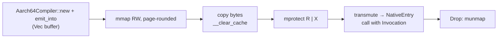
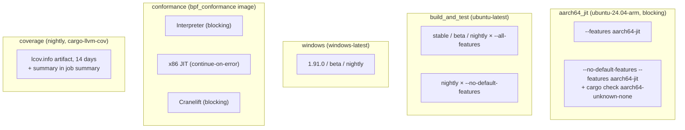

import { Callout } from 'nextra/components'

# Testing and CI

**Relevant source files**

- [.github/workflows/test.yaml](https://github.com/volnlabs/rbpf/blob/main/.github/workflows/test.yaml)
- [tests/](https://github.com/volnlabs/rbpf/tree/main/tests)
- [tests/aarch64_jit.rs](https://github.com/volnlabs/rbpf/blob/main/tests/aarch64_jit.rs)
- [tests/aarch64/managed.rs](https://github.com/volnlabs/rbpf/blob/main/tests/aarch64/managed.rs)
- [tests/fixtures/axiomos/README.md](https://github.com/volnlabs/rbpf/blob/main/tests/fixtures/axiomos/README.md)
- [clippy.toml](https://github.com/volnlabs/rbpf/blob/main/clippy.toml)
- [jit.md](https://github.com/volnlabs/rbpf/blob/main/jit.md)

## Test suites

| File | `#[test]` count | Gate | Covers |
|---|---|---|---|
| `tests/ubpf_vm.rs` | 149 | — | Interpreter conformance ported from uBPF, plus the fork's NEG64 / MOD32 regressions |
| `tests/ubpf_jit_x86_64.rs` | 134 | `all(target_arch = "x86_64", not(windows))` | The same programs through the x86_64 JIT |
| `tests/cranelift.rs` | 24 | `feature = "cranelift"` | Cranelift JIT |
| `tests/ubpf_verifier.rs` | 14 | — | Verifier rejections |
| `tests/misc.rs` | 27 | partly x86_64 | ELF block-port, mbuff, `LD_ABS`/`LD_IND`, verifier, local calls, stack overflow, `EbpfVmFixedMbuff` failed `set_program` |
| `tests/assembler.rs` | 32 | — | Assembler syntax and errors |
| `tests/disassembler.rs` | 28 | — | Disassembler output |
| `tests/xadd.rs` | 5 | DW: `target_has_atomic = "64"` | Legacy XADD, alignment errors |
| `tests/jit_sizing.rs` | 1 | x86_64 non-Windows | JIT dry-run resolves jumps |
| `tests/jmp64_immediate.rs` | 1 | — | JMP64 immediate sign extension (fork) |
| `tests/interpreter_jumps.rs` | 2 | — | Full-width PC for forward and backward jumps beyond 32767 (fork) |
| `tests/aarch64_jit.rs` | 16 | feature `aarch64-jit`; 12 of them `all(target_arch = "aarch64", target_os = "linux")` | AArch64 compiler: 4 host encoding tests + 12 native execution tests |
| `tests/aarch64/managed.rs` | 3 | included from `aarch64_jit.rs`, AArch64 Linux only | AxiomOS controller fixtures |

`tests/common.rs` holds shared fixtures (`TCP_SACK_ASM`, `TCP_SACK_BIN`, `TCP_SACK_MATCH`, `TCP_SACK_NOMATCH`). Doc tests include the README, which `lib.rs` pulls in with `#![doc = include_str!("../README.md")]`.

## AArch64 native tests

The native module is an executable-memory owner used only in tests:



It never creates RWX mappings, and a protection failure fails the test. Native tests cover:

- `every_alu_opcode_immediate_and_register_at_both_widths`, checked against an independent reference model,
- `all_conditional_branches_taken_and_not_taken_at_both_widths`,
- `alu_widths_wide_immediates_and_forward_control_flow`, `compact_immediates_clear_old_register_bits`,
- `arithmetic_failure_stops_execution` (zero divisor sets `fault_pc`),
- `callbacks_return_values_effects_and_failures`, `helper_failure_stops_before_store_or_second_call`,
- `helper_callback_keeps_argument_order_and_callee_saved_registers`,
- `memory_callback_preserves_live_r0_and_all_widths`, where the callback deliberately clobbers X9,
- `generated_entry_preserves_host_registers`, where a `global_asm!` shim seeds X19–X29 and counts how many changed,
- `eight_kibibyte_stack_places_r10_at_compiled_top`,
- `copied_stack_pointer_has_no_r10_flag_and_still_needs_bounds_check`.

### AxiomOS controller fixtures

`tests/fixtures/axiomos/` contains three controllers copied unchanged from AxiomOS `feat/v0.5-runtime` at `9be704c8`: `conservative_obstacle`, `slow_approach` and `clear_streak` (11, 13 and 32 instructions). The checked-in `.bin` files are their `.text`, built with Clang 22.1.8 (`-target bpfel -mcpu=v3 -O2`), so Cargo tests need neither Clang nor an AxiomOS checkout. Regenerate and compare with:

```sh
tests/fixtures/axiomos/build.sh target/managed-bpf
for name in conservative_obstacle slow_approach clear_streak; do
    cmp "tests/fixtures/axiomos/$name.bin" "target/managed-bpf/$name.bin"
done
```

The harness models the R1 context wrapper, a 56-byte payload, an 8 KiB stack, an instance-private map, and helpers 5, 6 and 1009. Its tests:

- `controller_trajectories_and_invalid_sensor` checks expected drive outputs and map values across sensor sequences,
- `relocated_code_reuses_private_instance_maps` runs two images of the same program with separate runtimes,
- `controller_helper_failures_stop_at_the_call` checks that a failing helper yields `STATUS_CALLBACK_ERROR` at the exact slot with no later effects.

<Callout type="info">
These fixtures do not run AxiomOS's verifier, kernel mappings, scheduler or actuation path. They make no hardware or timing claims.
</Callout>

### Running on an x86 host via QEMU

```sh
CARGO_TARGET_AARCH64_UNKNOWN_LINUX_GNU_LINKER=aarch64-linux-gnu-gcc \
CARGO_TARGET_AARCH64_UNKNOWN_LINUX_GNU_RUNNER='qemu-aarch64 -L /usr/aarch64-linux-gnu' \
cargo test --target aarch64-unknown-linux-gnu --features aarch64-jit
```

QEMU executes the emitted instructions, callbacks included. It does not validate Pi 5 cache maintenance, kernel mappings, or timing.

## CI (`.github/workflows/test.yaml`)

The workflow runs on pull requests, on pushes to `main`, and by manual dispatch. Every job uses `Swatinem/rust-cache`, which saves the cache only on `main`. In-progress runs for the same ref are cancelled.



| Job | What it runs |
|---|---|
| `aarch64_jit` | `cargo build --all-targets`, `cargo test`, `cargo test --release --test aarch64_jit` for both feature sets. The no-default-features leg also runs `cargo check --lib --target aarch64-unknown-none --no-default-features --features aarch64-jit`. |
| `build_and_test` | Release build of all targets, then `cargo test --target=x86_64-unknown-linux-gnu`, then `cargo clippy`. Nightly test runs use AddressSanitizer (`-Zsanitizer=address`, `detect_leaks=1`). |
| `windows` | `cargo build`, `cargo build --all-features`, `cargo test --all-features` (the x86 JIT is not compiled on Windows) |
| `conformance` | Builds `examples/rbpf_plugin` and runs `bpf_conformance_runner` (pinned image digest). The interpreter run excludes `(lock\|mem-len)` and Cranelift excludes `lock`. The x86 JIT run is non-blocking because of [qmonnet/rbpf#60](https://github.com/qmonnet/rbpf/issues/60); a failure is noted in the step summary. |
| `coverage` | `cargo llvm-cov --lcov --all --all-features --all-targets`. Uploads `lcov.info` as the `coverage` artifact (kept 14 days) and writes `cargo llvm-cov report` to the job summary. |

## Lint configuration

`clippy.toml` contains a single setting:

```toml
doc-valid-idents = ["eBPF", "uBPF"]
```

`jit.md` notes that a repository-wide `cargo clippy --all-targets -- -D warnings` hits an older `manual_is_multiple_of` warning in `examples/date.rs`. That warning is unrelated to the AArch64 backend. CI runs plain `cargo clippy`, without `-D warnings`.
