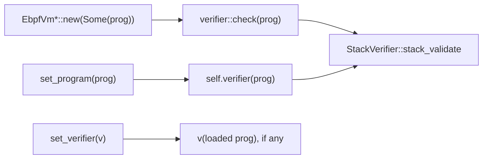

import { Callout } from 'nextra/components'

# Verifier and stack usage

**Relevant source files**

- [src/verifier.rs](https://github.com/volnlabs/rbpf/blob/main/src/verifier.rs)
- [src/stack.rs](https://github.com/volnlabs/rbpf/blob/main/src/stack.rs)
- [src/lib.rs](https://github.com/volnlabs/rbpf/blob/main/src/lib.rs)
- [tests/ubpf_verifier.rs](https://github.com/volnlabs/rbpf/blob/main/tests/ubpf_verifier.rs)
- [tests/misc.rs](https://github.com/volnlabs/rbpf/blob/main/tests/misc.rs)

rbpf's verifier is a short **structural** checker. It is nothing like the Linux kernel verifier: it does not track register types, pointer bounds, or termination. Programs it accepts may still be unsafe. The interpreter makes up for this with runtime memory checks; the x86_64 JIT does not.

<Callout type="warning">
Do not treat `verifier::check` as a safety proof. The AArch64 compiler does its own, stricter structural validation and expects an external semantic verifier on top (see [AArch64 JIT](/rbpf/aarch64-jit)).
</Callout>

## Where it runs



- `new()` always uses the built-in `verifier::check`.
- `set_program()` uses whatever verifier is currently installed.
- `set_verifier(v)` runs `v` on the loaded program straight away and installs it only if that run succeeds.

A custom verifier has the type:

```rust
pub type Verifier = fn(prog: &[u8]) -> Result<(), Error>;
```

```rust
use rbpf::lib::{Error, ErrorKind};
use rbpf::ebpf;

fn verifier(prog: &[u8]) -> Result<(), Error> {
    let last_insn = ebpf::get_insn(prog, (prog.len() / ebpf::INSN_SIZE) - 1);
    if last_insn.opc != ebpf::EXIT {
        return Err(Error::new(ErrorKind::Other, "program does not end with EXIT"));
    }
    Ok(())
}

let mut vm = rbpf::EbpfVmNoData::new(Some(prog)).unwrap();
vm.set_verifier(verifier).unwrap();
```

## Checks performed by `verifier::check`

Every error message is prefixed with `[Verifier] Error:`.

| Check | Rejection message (abridged) |
|---|---|
| Length is a multiple of 8 | "eBPF program length must be a multiple of 8 octets" |
| Length ≤ `PROG_MAX_SIZE` (1,000,000 instructions) | "eBPF program length limited to ..." |
| Program is non-empty | "no program set, call set_program() to load one" |
| Last instruction is in the JMP class | "program does not end with “EXIT” instruction" |
| `LE`/`BE` immediate is 16, 32 or 64 | "unsupported argument for LE/BE" |
| `LD_DW_IMM` is followed by a slot with `opc == 0` | "incomplete LD_DW instruction" |
| Jump `off != -1` | "infinite loop" |
| Jump target inside the program | "jump out of code to #N" |
| Jump target is not the second half of an `LD_DW` | "jump to middle of LD_DW" |
| `CALL src=1` target inside the program | "call out of code to #N" |
| `CALL src` is 0 or 1 | "unsupported call type" |
| `TAIL_CALL` | "TAIL_CALL is not supported" |
| `ST_W_XADD` / `ST_DW_XADD` with `imm == 0` only | "atomic operations other than legacy XADD are not supported" |
| `src ≤ 10`; `dst ≤ 9`, or `dst == 10` only for store-class instructions | "invalid source register" / "cannot write into register r10" / "invalid destination register" |
| Opcode is known | "unknown eBPF opcode 0x.." |

Limitations worth knowing:

- The final-instruction check only tests the **class** (`BPF_JMP`), so a program ending in a jump passes. The interpreter then hits `unreachable!()` if it runs past the end.
- Backward jumps other than `off == -1` are allowed, so loops, including infinite ones, get through.
- Helper IDs are **not** checked. Unknown helpers fail at runtime in the interpreter and at compile time in the JITs.
- `LD_DW_IMM` counts as a "store" for the register check, so its `dst` may be 10. The interpreter will then write to `r10`.

## Stack usage (`StackVerifier`)

Once verification succeeds, the VM computes a `StackUsage` map from function entry PCs to `StackUsageType`. The interpreter uses it to move `r10` on local calls.

```rust
pub type StackUsageCalculator = fn(prog: &[u8], pc: usize, data: &mut dyn Any) -> u16;

pub fn set_stack_usage_calculator(
    &mut self,
    calculator: StackUsageCalculator,
    data: Box<dyn Any>,
) -> Result<(), Error>;
```

- Without a calculator, every function (PC 0 and every `CALL` target) gets `StackUsageType::Default`, which is `LOCAL_FUNCTION_STACK_SIZE` = 256 bytes.
- With a calculator, each function gets `StackUsageType::Custom(calculator(prog, pc, data))`. `data` is user state that is passed back on each call.
- Setting a calculator recomputes usage for the loaded program straight away.

```rust
fn calculator(_prog: &[u8], _pc: usize, _data: &mut dyn core::any::Any) -> u16 {
    16
}
vm.set_stack_usage_calculator(calculator, Box::new(())).unwrap();
```

`stack_validate` computes a target `idx + 1 + imm` for **every** `CALL` opcode, helper calls (`src = 0`) included. A custom calculator can therefore be called with PCs that are not function entries, and even with PCs outside the program. It should handle those values without panicking.
